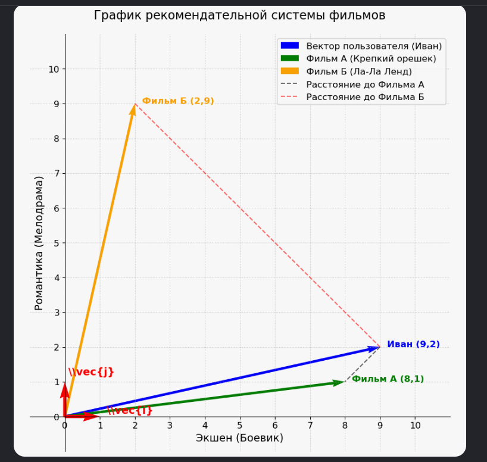
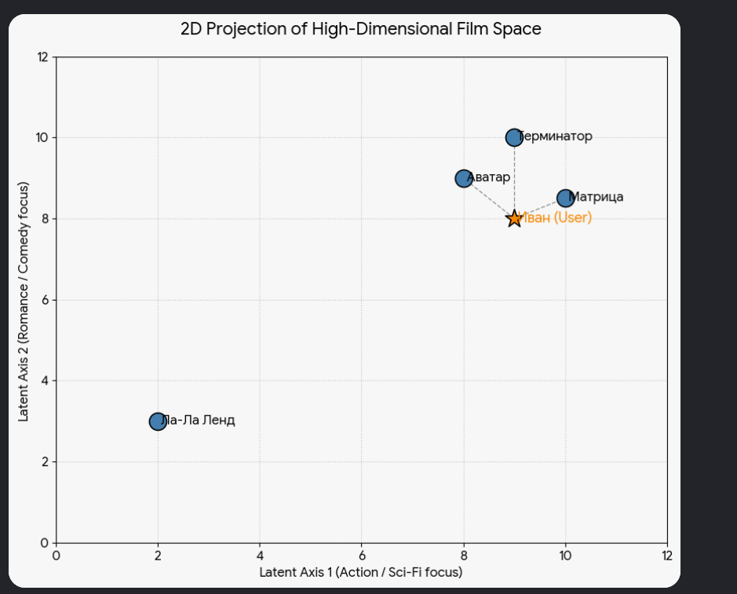
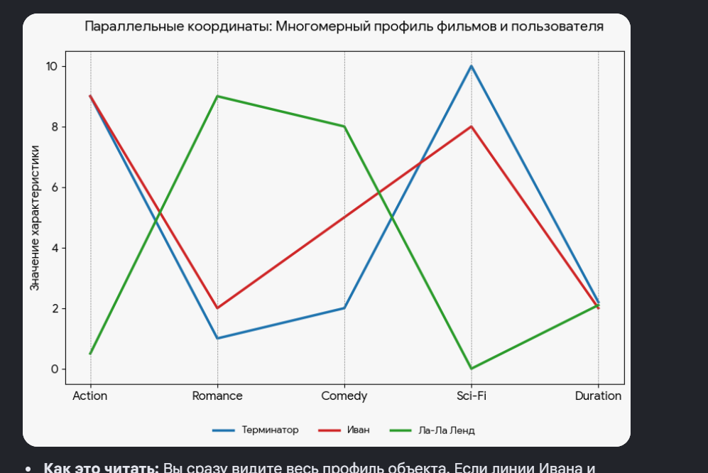

Пример фильмов по рейтингу:

Давайте зафиксируем эту картинку:

1. **Ось X (Экшен) и Ось Y (Романтика)** — это наши ориентиры, наш **базис (сами жанры, или оси координат)**. Они задают правила: «по горизонтали мы измеряем взрывы и драки, а по вертикали — любовь и слезы».
2. **Числа 9 и 1** — это координаты. Они показывают, что для фильма «Терминатор» мы делаем 9 шагов по оси Экшена и всего 1 шаг по оси Романтики.
3. **Сам вектор** — это направленная стрелка, которая тянется из нулевой точки 

   ```javascript
   (0,0)
   ```

    прямо в точку 

   ```javascript
   (9, 1)
   ```

   . Эта стрелка и есть цифровой «паспорт» или цифровой образ фильма в памяти компьютера.

В машинном обучении такой вектор называется **эмбеддингом** (embedding) фильма.

Теперь представьте, что у вас есть второй фильм — например, «Титаник». У него будет совсем другой вектор: 

```javascript
(Экшен = 1, Романтика = 10)
```

. На графике его стрелка уйдет далеко вверх и почти не сдвинется вправо.

Компьютер посмотрит на эти две стрелки («Терминатора» и «Титаника»), увидит, что они смотрят в совершенно разные стороны и длина расстояния между их концами огромная, и сделает вывод: *«Эти фильмы вообще не похожи, не надо рекомендовать фанату боевиков слезливую драму»*.


продолжим на примере рейтинга фильмов

  

### Как работает рекомендательная система в Data Science

Смысл работы рекомендательной системы сводится к одной фразе: **«Найди мне векторы фильмов, которые находятся ближе всего к вектору вкусов пользователя»**.

Давайте пошагово разберём, как алгоритм решает эту задачу с помощью векторов.

---

#### 📌 Шаг 1. Переводим пользователя в вектор (Вектор вкусов)

У нас есть пользователь, назовём его Иван. Иван посмотрел 5 боевиков и ни одной мелодрамы. Система автоматически считает его предпочтения и создаёт **Вектор Пользователя** в том же самом базисе (Экшен / Романтика).

Пусть вектор Ивана будет равен:

$$
U = (9, 2)
$$

> *Это значит: Иван обожает экшен (9) и почти равнодушен к романтике (2).*

---

#### 📌 Шаг 2. Загружаем базу данных (Векторы фильмов)

В нашей базе данных (в матрице фильмов) хранится тысяча кинолент. У каждой есть свой вектор-паспорт. Например:

- **Фильм А («Крепкий орешек»):** вектор $F_1 = (8, 1)$ — много экшена, мало романтики.
- **Фильм Б («Ла-Ла Ленд»):** вектор $F_2 = (2, 9)$ — мало экшена, сплошная романтика.

---

#### 📌 Шаг 3. Магия вычитания и длины (Евклидово расстояние)

Чтобы понять, какой фильм предложить Ивану, компьютер по очереди сравнивает вектор Ивана с векторами всех фильмов в базе. Он **находит расстояние (длину вектора разности)**.

##### 🎬 Проверяем Фильм А («Крепкий орешек»):

1. **Вычитаем векторы:** Из вектора Ивана вычитаем вектор фильма.

   $$
   U - F_{1} = (9 - 8, \,\, 2 - 1) = (1, 1)
   $$
2. **Считаем длину получившегося вектора (по Пифагору):**

   $$
   \text{Расстояние} = \sqrt{1^{2} + 1^{2}} = \sqrt{2} \approx \mathbf{1.4}
   $$

   *Расстояние всего 1.4 — это очень близко! Стрелки Ивана и фильма смотрят почти в одну точку.*

##### 🎬 Проверяем Фильм Б («Ла-Ла Ленд»):

1. **Вычитаем векторы:**

   $$
   U - F_{2} = (9 - 2, \,\, 2 - 9) = (7, -7)
   $$
2. **Считаем длину по Пифагору:**

   $$
   \text{Расстояние} = \sqrt{7^{2} + (-7)^{2}} = \sqrt{49 + 49} = \sqrt{98} \approx \mathbf{9.9}
   $$

   *Расстояние 9.9 — это огромная пропасть. Фильм находится очень далеко от вкусов Ивана.*

---

#### 📌 Шаг 4. Финал — Сортировка и выдача

Алгоритм считает такие расстояния для всех 1000 фильмов в базе, а затем **сортирует их от самого маленького расстояния к самому большому**.

Фильмы с минимальным расстоянием (где разница векторов близка к нулю) попадают на главный экран Ивана в категорию **«Вам понравилось бы»**. «Крепкий орешек» будет на первом месте, а «Ла-Ла Ленд» Иван не увидит никогда.

---

#### 🧠 В чём сложность в реальном Data Science?

В нашем примере базис состоит всего из двух осей (Экшен и Романтика). В реальности жанров и тегов у фильмов тысячи: *«режиссер Нолан», «наличие Тома Круза», «юмор», «драма», «бюджет», «год выпуска»* и так далее.

Базис реальной нейросети включает в себя **от 100 до 500 измерений (осей)**. Но математика под капотом делает ровно то же самое: она просто вычитает эти длинные списки чисел и считает корень из суммы квадратов, определяя, насколько близки стрелки на этой гигантской невидимой карте.


 

  

**Что мы здесь видим**

**📐 Базис (Оси и эталоны)**

- **Горизонтальная ось** теперь подписана как «Экшен (Боевик)».
- **Вертикальная ось** подписана как «Романтика (Мелодрама)».
- **В самом углу (0,0)** лежат два маленьких красных базисных вектора. Они размечают шкалу от 0 до 10 для обеих осей.

**🚀 Векторы объектов**

- **Вектор пользователя (Иван):** указывает на точку 

  ```javascript
  (9, 2)
  ```

  .
- **Вектор Фильма А («Крепкий орешек»):** указывает на точку 

  ```javascript
  (8, 1)
  ```

  .
- **Вектор Фильма Б («Ла-Ла Ленд»):** указывает на точку 

  ```javascript
  (2, 9)
  ```

  .

**📏 Расстояния (Разность векторов)**

- **Пунктирные линии** наглядно показывают, что «Крепкий орешек» находится на карте совсем рядом с Иваном.
- **«Ла-Ла Ленд»** расположен на противоположном конце нашей системы координат.

---

  

 

  

**Как читать такой график в Data Science:**

- **Оси X и Y здесь абстрактны**: это не конкретные жанры, а комбинации всех 5 исходных осей сразу.
- **Близость точек — главное**: Иван находится в кластере фантастики и экшена, поэтому «Терминатор» и «Матрица» на графике визуально близки к нему.
- **Кластеризация**: фильмы со схожими характеристиками автоматически собираются в группы (кучки) на экране.

  

  

На прошлом шаге мы действительно смотрели на простую плоскость «Экшен» и «Романтика». Когда осей становится **больше трех**, показать их все одновременно в виде привычных декартовых осей \(X, Y, Z\) на плоском экране физически невозможно [licensed_media_service:fetch_images: Mathematics & Geometry].

Но дата-сайентисты нашли выход. Чтобы увидеть **все оси сразу** на одной картинке, используют альтернативные типы графиков.

Вот два главных способа, как ИИ-инженеры «рисуют» многомерные векторы (например, наш 5-мерный фильм):

**Способ . Параллельные координаты (Parallel Coordinates Plot)**

Вместо того чтобы ставить оси перпендикулярно друг другу (под углом 90°), мы выстраиваем их **параллельно** друг другу как вертикальные заборы.

Каждый фильм или пользователь на таком графике — это не точка, а **линия**, которая пересекает каждую ось на определенной высоте (значении).

  

 


# Эталон предпочтений в многомерном пространстве

На графике параллельных координат **эталоном того, что нравится пользователю, является его собственная (красная) линия**.

В рекомендательных системах вектор пользователя — это идеальный математический «шаблон» или «слепок» его интересов на текущий момент.

---

### 1. Как ИИ ищет совпадение с эталоном

Чтобы подобрать рекомендацию, компьютер накладывает линии фильмов поверх красной линии «эталона» и оценивает их геометрию:

- **Идеальное совпадение**: Линия фильма должна идти максимально близко к красной линии и повторять все её изгибы (быть параллельной ей).
- **«Терминатор» (синяя линия)**: Очень близок к эталону. На осях *Action*, *Sci-Fi* и *Duration* она практически сливается с красной. Общая форма графика (спад на старте и пик на Sci-Fi) совпадает.
- **«Ла-Ла Ленд» (зелёная линия)**: Полная противоположность эталону. Там, где у Ивана пик (*Action*), у зелёной линии спад. Их траектории пересекаются крест-накрест.

---

### 2. Математический эталон в цифрах

Если оцифровать красную линию графика, то эталонный вектор Ивана выглядит следующим образом:

$$
\vec{U}_{\text{Иван}} = (9, 2, 5, 8, 2.1)
$$

Алгоритм перебирает тысячи таких векторов в базе данных и ищет тот, чей набор чисел даст минимальное расстояние до этого эталона.

---

### 📌 Конспект для базы знаний (Data Science)

- **Вектор пользователя** — математический эталон его предпочтений в многомерном пространстве признаков.
- **Идеальная рекомендация** — фильм, чья линия на графике ближе всего повторяет траекторию линии пользователя (минимальное расстояние по всей длине).
- **Визуальный анализ сходства**:
  - Линии идут в одном направлении и не скрещиваются $\rightarrow$ объекты **похожи**.
  - Линии образуют чёткий крест (как красная и зелёная) $\rightarrow$ объекты **противоположны**.


