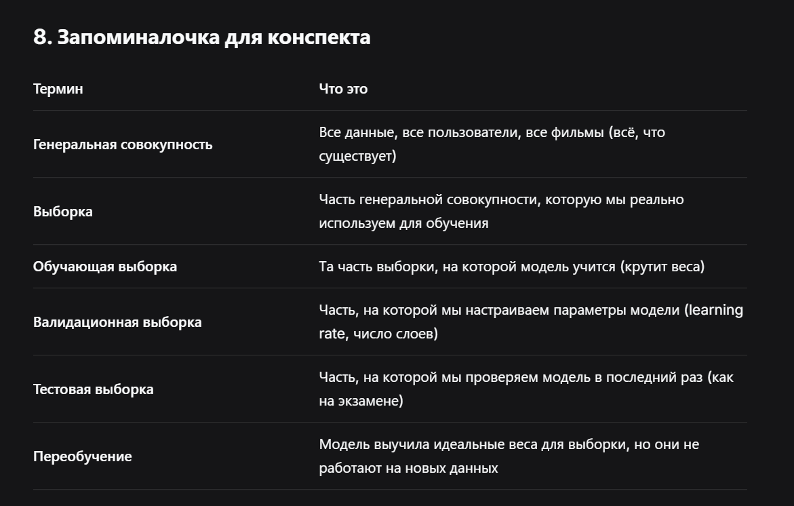

  

## **1. Что такое выборка (на пальцах)**

**Выборка** — это маленькая часть данных, которую ты используешь вместо того, чтобы изучать всё целиком.

В жизни это выглядит так:

- Ты хочешь узнать, нравится ли сотрудникам новая еда в столовой. Ты не опрашиваешь всех 10 000 человек (это дорого и долго). Ты берешь 100 случайных человек и спрашиваешь их. Это и есть **выборка**.
- Врач хочет проверить, эффективно ли новое лекарство. Он не ставит его миллиону человек, он берет 1000 добровольцев — это выборка.

В ML то же самое:

- У тебя есть все 10 000 000 пользователей Кинопоиска. Ты не можешь учить модель на всех сразу (это слишком долго и дорого). Ты берешь 100 000 случайных пользователей — это выборка.
- У тебя есть все 100 000 фильмов. Ты берешь 10 000 — это выборка.

---

## **2. Почему выборка работает (и когда нет)**

**Магия выборки** в том, что если она **правильная**, то её свойства почти не отличаются от свойств всей генеральной совокупности (всех данных).

Пример:

- Если ты случайно выбрал 100 сотрудников из 10 000, то распределение возрастов, средняя зарплата и предпочтения в еде будут **почти такими же**, как у всех 10 000.
- Если ты выбрал 10 000 пользователей из 1 000 000, то их средняя оценка фильма будет почти такой же, как у всех пользователей.

**Но если выборка неправильная** — модель провалится.

---

## **3. Как испортить выборку (ловушки)**

| **Ловушка** | **Что делаешь** | **Что получаешь** |
|----|----|----|
| **Смещение (bias)** | Берешь только молодых пользователей | Модель не умеет предсказывать вкусы пожилых |
| **Сезонность** | Учишь модель на данных за декабрь | Модель не понимает летних предпочтений |
| **Несбалансированность** | Берешь 90% фильмов ужасов и 10% комедий | Модель будет предсказывать ужасы лучше, а комедии — хуже |
| **Случайность не по правилам** | Берешь только первых попавшихся пользователей | Модель не видит разнообразие |

---

## **4. В ML — три вида выборки (это очень важно!)**

Когда ты учишь модель, ты не просто берешь одну выборку. Ты делишь данные на **три части**:

| **Вид выборки** | **Что это** | **Для чего** |
|----|----|----|
| **Обучающая выборка (train)** | Данные, на которых модель учится | Модель смотрит на них и крутит ползунки (веса) |
| **Валидационная выборка (val)** | Данные, на которых мы настраиваем гиперпараметры | Мы проверяем, как модель себя ведет, и решаем, когда остановить обучение |
| **Тестовая выборка (test)** | Данные, которые модель вообще не видела во время обучения | Финальная проверка: хорошо ли модель работает в реальном мире |

**Пример с Аней:**

- Ты берешь 1000 пользователей.
- 700 из них — обучающая выборка (на них ты подбираешь ползунок Ани).
- 150 — валидационная (проверяешь, не переобучилась ли модель).
- 150 — тестовая (финальная проверка: как модель будет предсказывать для новых пользователей?).

---

## **5. Как выглядит выборка в коде**

python

```javascript
from sklearn.model_selection import train_test_split

# X — все данные (признаки), y — ответы (оценки)
X_train, X_temp, y_train, y_temp = train_test_split(X, y, test_size=0.3, random_state=42)
X_val, X_test, y_val, y_test = train_test_split(X_temp, y_temp, test_size=0.5, random_state=42)

# Теперь у тебя есть:
# X_train — 70% данных (обучается)
# X_val — 15% данных (настраиваем гиперпараметры)
# X_test — 15% данных (финальная проверка)
```

---

## **6. Как выбрать правильную выборку (правила)**

| **Правило** | **Что значит** | **Почему** |
|----|----|----|
| **Случайность** | Ты должен выбирать людей/объекты случайно, а не только тех, кто удобно попался | Иначе модель узнает только этих людей |
| **Репрезентативность** | Выборка должна отражать весь разнообразный мир (и бабушек, и студентов, и подростков) | Иначе модель не будет работать на всех |
| **Достаточный размер** | Чем больше выборка, тем точнее модель. Но не бесконечно: обычно хватает нескольких десятков тысяч | Слишком маленькая — модель не обучится. Слишком большая — долго учится |
| **Временная честность** | Нельзя учиться на данных из будущего | Например, если ты учишь модель на фильмах 2020 года, а проверяешь на фильмах 2015 — это неправильно |

---

## **7. Почему выборка важна для обучения (связь с производной)**

Твоя модель крутит ползунки (веса) так, чтобы ошибка на **обучающей выборке** стала минимальной.

Но если обучающая выборка плохая (нерепрезентативная), то:

- Модель выучит идеальные веса для **этих конкретных 100 человек**.
- Но когда она встретит новых людей — веса не подойдут, ошибка вырастет.

Это называется **переобучение (overfitting)**.

**Поэтому:**

- Производная говорит: «Крути ползунок так, чтобы ошибка на **обучающей** выборке упала».
- А статистика говорит: «Убедись, что обучающая выборка похожа на реальный мир, иначе производная выучит ерунду».


 


 

  

## **Главное правило (запомни навсегда)**

> **Если выборка не похожа на реальный мир, производная обучит модель решать неправильную задачу.**

  