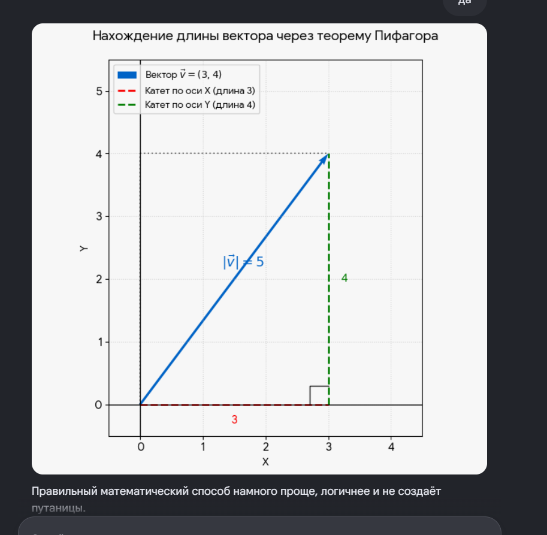

 

  

Когда вам дают координаты вектора, например, \(\vec{v} = (3, 4)\), это уже **готовый результат**. Это значит, что кто-то до вас уже вычел из координат конца координаты начала. Цифры внутри скобок показывают, сколько шагов нужно сделать по осям от начала вектора, чтобы прийти в его конец:

- **\(3\)** — шаг по горизонтали (ось \(X\))
- **\(4\)** — шаг по вертикали (ось \(Y\))

Эти два шага автоматически становятся катетами прямоугольного треугольника, а сам вектор — гипотенузой.

**Универсальная формула длины вектора**

Чтобы найти длину вектора (в геометрии она обозначается модулем: \(\vert{}\vec{v}\vert{}\)), нужно возвести его координаты в квадрат, сложить их и извлечь корень.

\(\mathbf{|}\vec{\mathbf{v}}\mathbf{|=}\sqrt{\mathbf{x}^{\mathbf{2}}\mathbf{+y}^{\mathbf{2}}}\)

**Считаем для нашего вектора \(\vec{v} = (3, 4)\):**

1. **Возводим координаты в квадрат:**
   \(3^2 = 9\)
   \(4^2 = 16\)
2. **Складываем полученные числа:**
   \(9 + 16 = 25\)
3. **Извлекаем квадратный корень:**
   \(\sqrt{25} = 5\)

Длина нашего вектора равна **\(5\)**. Как видите, не нужно придумывать никакие «третьи векторы» — мы работаем только с координатами одного конкретного вектора.

  