ВАЖНО: ФОРМУЛА  v = -1i + 2j потому что координаты старого вектора были [-1, 2] , если бы были 3 и 4 то 
v = 3i + 4j и так далее


 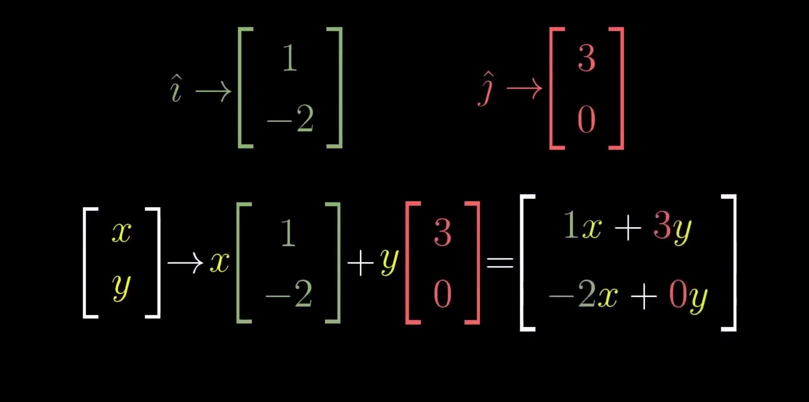

  

 Эта картинка выше показывает абсолютно универсальную формулу **«в общем виде»** для любых исходных координат x . Она объясняет компьютеру, как пересчитать вообще **любую точку пространства** за одно действие.

---

  

---

  

далее идут примеры для  v = -1i + 2j 


 Старое положение

 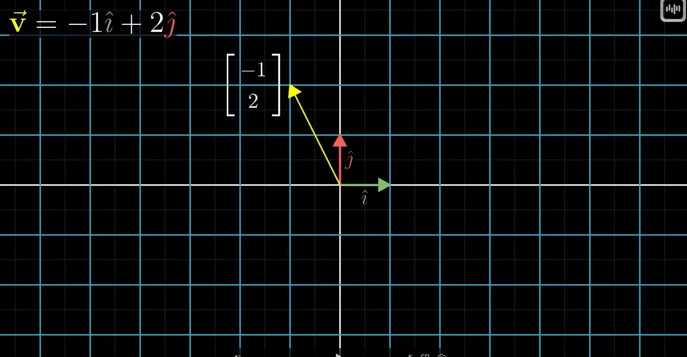

Новое положение

 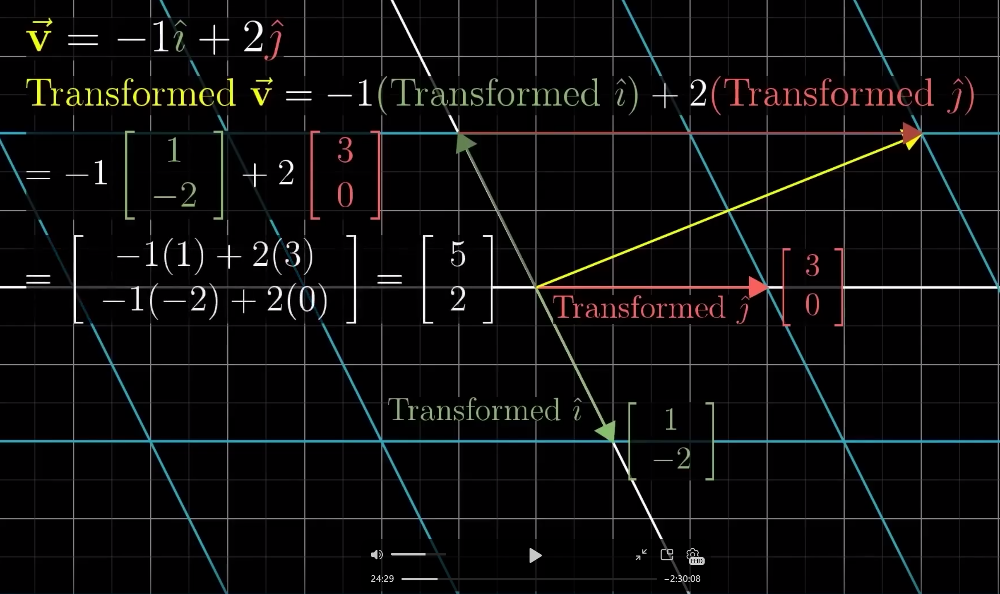

  

**🌀 Линейные преобразования в ML: Сила двух векторов**

Если система координат изменилась (но линии остались прямыми и параллельными), тебе **вообще больше не нужны никакие другие точки пространства**. Достаточно знать только новые адреса базисных векторов î и ĵ.

---

**🎯 Два железных правила линейности**

Чтобы магия пересчета координат работала, пространство должно трансформироваться строго по двум правилам:

**1. Начало координат остается на месте**

> Точка (0, 0) после любых вращений, сжатий или растяжений обязана остаться ровно в точке (0, 0). Она не может сместиться. Если сдвинуть центр — вся пропорциональность шагов сломается.

**2. Линии сетки остаются прямыми и параллельными**

> Все параллельные прямые исходной сетки после трансформации обязаны остаться прямыми и параллельными друг другу.
>
> - **Нельзя** гнуть пространство, закручивать его в спираль или превращать оси в дуги.
> - Расстояние между линиями должно меняться **равномерно** (нельзя в одном месте сжать сетку сильнее, а в другом — слабее).

💡 **Почему это критично для ML?**
Если правила соблюдаются, сетка просто равномерно растягивается или наклоняется. Пропорции сохраняются. Именно поэтому мы можем использовать старые координаты для поиска точки в новом пространстве. Если хотя бы одно правило нарушается, обычное матричное умножение (W ⋅ x) **перестает работать**.

---

**🗺️ Как это работает на практике**

Представь пошаговый процесс трансформации вектора \(\vec{v}\):

```javascript
```

```javascript
[Старый вектор v] ───> [Деформация пространства] ───> [Новый вектор v]
  (-1 шагов по X)        (Линии сетки скосились)        (-1 шагов по новому i)
  ( 2 шагов по Y)                                       ( 2 шагов по новому j)
```

1. **Старая инструкция:** Чтобы найти желтый вектор \(\vec{v}\), нужно было сделать **-1** шаг по оси X и **2** шага по оси Y.
2. **Пространство деформировалось:** Сетка перекосилась, оси «улетели».
3. **Новый расчет:** Но пропорции внутри сетки выжили! Значит, мы берем те же самые числа из старой инструкции (-1 и 2) и применяем их к *новым* базисным векторам:
   - Делаем **-1** шаг вдоль новой перекошенной зеленой линии (Transformed î).
   - Из этой точки делаем **2** шага вдоль новой розовой линии (Transformed ĵ).
   - **Результат:** Мы идеально приземлились в кончик нового желтого вектора.

---

  

 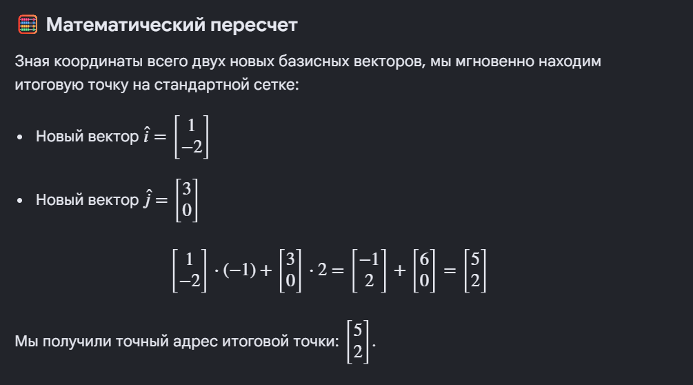


вот еще пример

изначально вектор лежал так 

 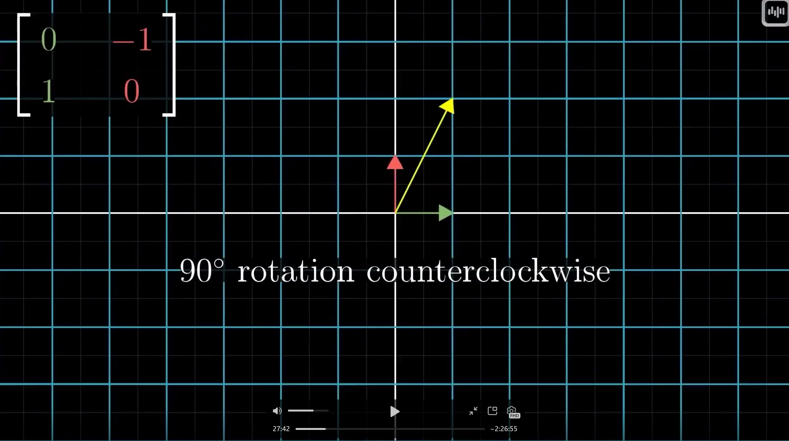

потом систему координат развернули на 90гр влево ( исходный желтый вектор повернулся на 90 градусов против часовой стрелки.)


 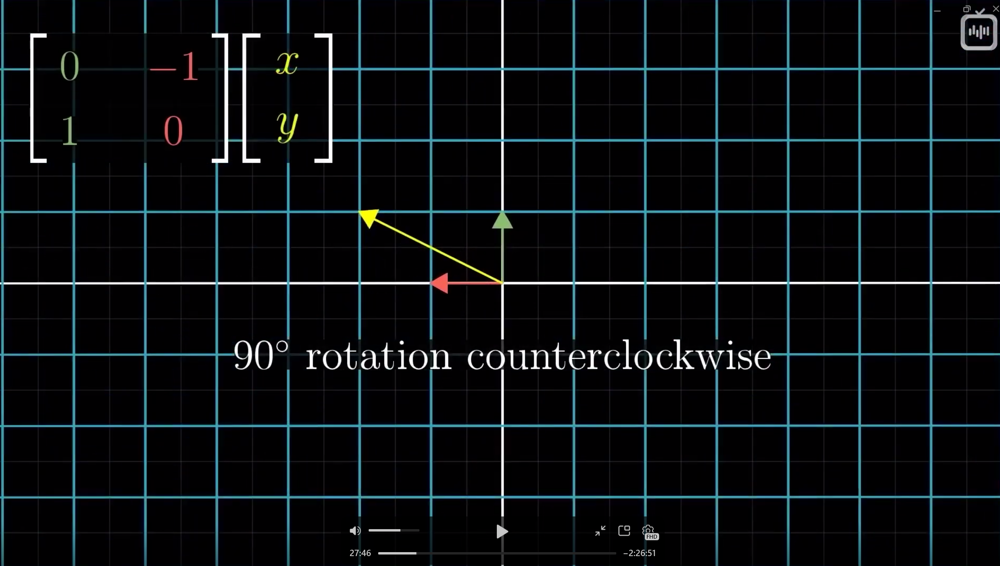


  

 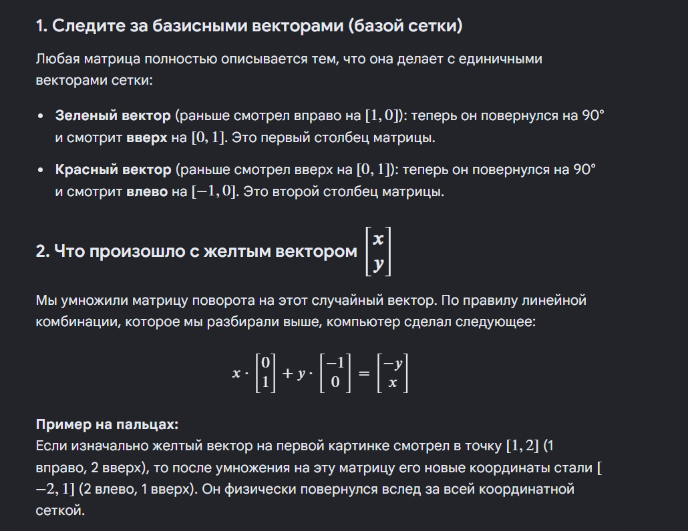

  

еще пример


 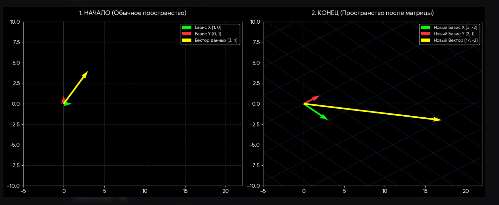

**График 1 (Слева):**
Всё привычно. Базисы (красный и зеленый) равны единице. Наш желтый вектор смотрит в точку **(3, 4)**

**Значит новое положение вектора будет считаться по формуле V = 3i + 4j**

**График 2 (Справа):**  

**Применили матрицу. Сетка деформировалась и превратилась в ромбики. Кооррдинаты новых базисных векторов стали  (3, -2) по х и (2, 1) по у**
**Перемножаем по формуле**

 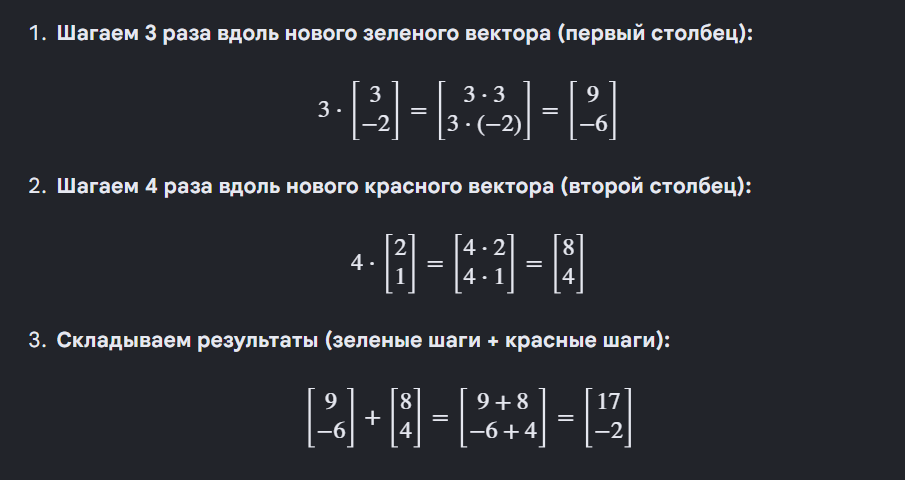


**ТО ЕСТЬ КООРДИНАТА НОВОГО ВЕКТОРА В ИЗМЕНЕННОМ ПРОСТАРНСТВЕ БУДЕ (17, -2)**


ОБЩАЯ ФОРМУЛА


 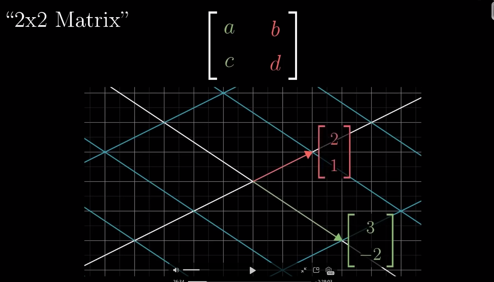


 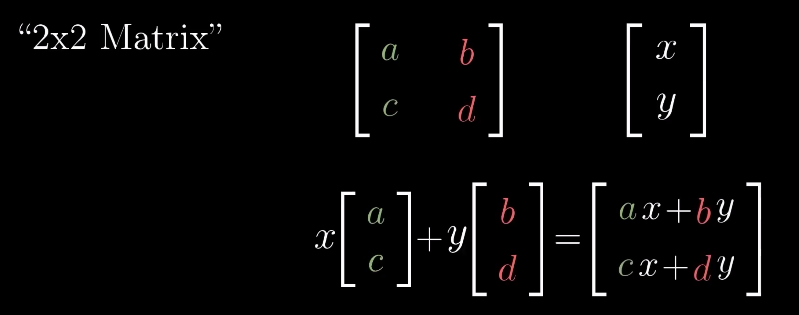

                                                                             ИЛИ


 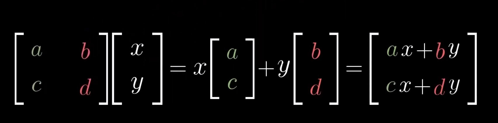


