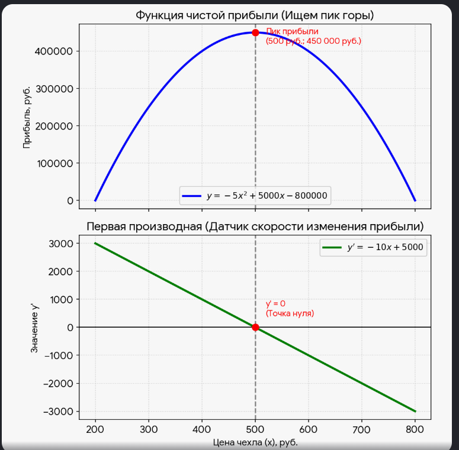

  

Давайте построим реальную математическую модель. Чтобы функция получилась жизненной, нам понадобятся всего два фактора: **спрос** (сколько чехлов купят) и **себестоимость** (затраты на производство).

Предположим, вы закупаете чехлы на заводе по **200 рублей** за штуку. Теперь вам нужно выбрать розничную цену — обозначим её как **\(x\)**.

---

  

## Шаг 1. Составляем функцию спроса (поведение людей)

Маркетологи провели опрос и выяснили:

- Если продавать чехлы по себестоимости (`x = 200`), их купят очень много людей — например, **3000 человек** в месяц.
- Но каждые лишние 100 рублей надбавки отпугивают клиентов. На каждые +100 рублей к цене спрос падает на 500 человек.

Математически эта зависимость (количество покупателей от цены `x`) выглядит как прямая линия:

[Как собралась формула спроса из логики маркетологов](https://ivan-valuchev.yonote.ru/doc/kak-sobralas-formula-sprosa-iz-logiki-marketologov-BSPfrVb1V1)

`3000 - 5 * (x - 200)`

Если раскрыть скобки и упростить, получим простую формулу спроса:

`4000 - 5*x`

## Шаг 2. Составляем функцию чистой прибыли

Наша чистая прибыль — это *прибыль с одного чехла*, умноженная на *количество проданных чехлов*.

- Прибыль с одной штуки: `(x - 200)` рублей.
- Количество штук: `(4000 - 5*x)`.

Перемножаем их, чтобы получить общую функцию прибыли **y**:

`y = (x - 200) * (4000 - 5*x)`

Раскрываем скобки (вспоминаем школьную алгебру):

`y = 4000*x - 5*x^2 - 800000 + 1000*x`

Собираем вместе и получаем **итоговую квадратичную функцию**:

`y = -5*x^2 + 5000*x - 800000`

Это уравнение параболы, ветви которой направлены вниз. На графике это идеальный холм, где вершина — это наш максимальный куш.

## Шаг 3. Используем производную, чтобы найти идеальную цену

Вместо перебора цен (300, 400, 500 руб) возьмём производную по правилу `(x^n)' = n * x^(n-1)`:

`y' = (-5*x^2)' + (5000*x)' - (800000)'`

`y' = -10*x + 5000`

Теперь приравниваем производную к нулю, чтобы найти вершину графика:

`-10*x + 5000 = 0`

`10*x = 5000`

`x = 500`

✅ Это — **абсолютный максимум**, потому что коэффициент перед `x^2` отрицательный.

[Но почему это абсолютный максимум а не минимум?](https://ivan-valuchev.yonote.ru/doc/no-pochemu-eto-absolyutnyj-maksimum-a-ne-minimum-DpKk4yQND0)

---

## Что это значит на практике?

Математика без перебора чисел выдала точный ответ: **идеальная цена чехла — 500 рублей**.

Давайте проверим прибыль для разных цен:

- Если поставим цену **300 руб** (дешево):
  `y = -5*300^2 + 5000*300 - 800000 = -5*90000 + 1500000 - 800000 = -450000 + 700000 = 250000` руб.
- Если поставим цену **700 руб** (дорого):
  `y = -5*700^2 + 5000*700 - 800000 = -5*490000 + 3500000 - 800000 = -2450000 + 2700000 = 250000` руб.
- Если поставим цену **500 руб** (точку экстремума):
  `y = -5*500^2 + 5000*500 - 800000 = -5*250000 + 2500000 - 800000 = -1250000 + 1700000 = 450000` руб.

Цена 500 рублей — на самом пике графика прибыли. Шаг влево или вправо — и вы теряете деньги.

Бизнес-аналитики крупных компаний (вроде Google или Яндекса) ежедневно решают именно такие уравнения — только с сотнями факторов.

### Визуализация моделей  

  

> **Математическое правило:** Наклон касательной — это и есть значение производной. У горизонтальной линии наклон равен **нулю**. 

 

  

 ***Вопрос:***
*Просто меня смущает наклон графика производной — он либо всегда растёт снизу вверх, либо падает сверху вниз?  *

  

Я вас прекрасно понимаю. Это самый главный психологический барьер в начале изучения производной, и спотыкаются об него абсолютно все!

Вас смущает вот что: **«Как же так? Зеленая линия падает вниз, а прибыль на синем графике при этом умудряется расти?»**.

Давайте уберем это противоречие раз и навсегда. Секрет в том, что у зеленой линии есть **два разных свойства**, которые нельзя путать:

1. **Где она находится** (выше нуля или ниже нуля).
2. **Куда она идет** (падает сверху вниз).

---

**Главный секрет: Прибыль растет не потому, что линия падает, а потому, что линия находится В ПЛЮСЕ!**

Запомните золотое правило: Синему графику (прибыли) абсолютно плевать, куда идет зеленая линия (вверх или вниз). Для синего графика важно только одно: **в положительной зоне находится зеленая линия или в отрицательной**.

Пока зеленая линия находится **выше нуля (в плюсе)**, синий график **ОБЯЗАН РАСТЕТ**.

Давайте посмотрим на числа на левой половине зеленого графика:

- При цене 200 руб. производная равна **\(+3000\)**. Знак плюс! Прибыль мощно растет вверх.
- При цене 300 руб. производная равна **\(+2000\)**. Всё еще плюс! Прибыль продолжает расти.
- При цене 400 руб. производная равна **\(+1000\)**. Опять плюс! Прибыль всё еще растет.

Видите? Числа \(3000, 2000, 1000\) становятся меньше (зеленый график падает), но они **все еще остаются положительными (плюсовыми)**! А пока скорость имеет знак плюс, ваш доход продолжает увеличиваться.

---

**А что же тогда означает то, что зеленая линия падает?**

То, что зеленая линия падает сверху вниз, означает лишь одно: **прибыль растет, но всё медленнее и медленнее**.

Давайте переведем это на язык автомобиля:

1. Вы нажали на педаль газа и разогнались до **100 км/ч**. Машина стремительно едет вперед (прибыль быстро растет).
2. Вы начали плавно отпускать газ. Скорость упала до **50 км/ч**, потом до **20 км/ч**.
3. Задумайтесь: ваша скорость падает? Да (зеленый график идет вниз). Но ваша машина продолжает ехать вперед или покатилась назад? Конечно, **вперед**! Ведь скорость все еще плюсовая (\(+50\), \(+20\)). Вы продолжаете удаляться от старта (прибыль растет), просто уже не так быстро, как на старте.

И только когда стрелка спидометра упадет **ровно на НОЛЬ** (цена 500 рублей), машина окончательно остановится на самом пике горы.

---

**Подведем итог:**

- То, что линия производной лежит **выше нуля**, заставляет прибыль **расти**.
- То, что линия производной при этом **падает**, означает, что этот рост **замедляется** при приближении к вершине.

  

Давайте отложим все математические термины и свяжем эти графики через **высоту горы** и **наклон вашего тела при подъеме на неё**.

Представьте, что синий график — это **реальная гора** (ваша прибыль), на которую вы поднимаетесь слева направо. А зеленый график — это **прибор в вашем кармане**, который показывает, насколько тяжело вам идти.

---

**Связь 1. Левый склон (Цена от 200 до 500 руб.)**

- **Смотрим на верхний график (Синий):** Вы начинаете у подножия горы (цена 200) и идете вверх. Каждый шаг приносит вам всё больше денег. Вы **поднимаетесь**.
- **Смотрим на нижний график (Зеленый):** Ваш прибор горит зеленым цветом и показывает **ПЛЮС** (линия лежит выше нуля). Знак плюс буквально кричит вам: *«Вы идете ВВЕРХ! Продолжайте идти в этом направлении, гора еще не кончилась!»*.

---

**Связь 2. Самый пик горы (Цена ровно 500 руб.)**

- **Смотрим на верхний график (Синий):** Вы дошли до самого пика горы. Вы стоите на вершине. Если вы сделаете шаг назад или шаг вперед — вы опуститесь ниже. В этой точке поверхность прямо под вашими ногами стала **абсолютно ровной и горизонтальной**.
- **Смотрим на нижний график (Зеленый):** В эту же самую секунду линия прибора пересекает **РОВНО НОЛЬ** (красный кружок). Ноль означает: *«Подъем закончился, спуск еще не начался. Угол наклона равен нулю. Поздравляю, вы на вершине!»*.

---

**Связь 3. Правый склон (Цена от 500 до 800 руб.)**

- **Смотрим на верхний график (Синий):** Вы прошли вершину и начали катиться вниз. Ваша прибыль стремительно падает, потому что цена слишком высокая и чехлы никто не покупает. Вы **спускаетесь**.
- **Смотрим на нижний график (Зеленый):** Ваш прибор пробивает ноль и уходит вниз, показывая **МИНУС** (линия лежит ниже нуля). Знак минус предупреждает: *«Вы катитесь ВНИЗ! Каждый следующий шаг (каждый лишний рубль цены) только уменьшает вашу высоту!»*.

---

**Подведем итог одной фразой:**

Нижний график (зеленый) — это просто **комментатор** для верхнего (синего).

- Когда синий график **растет**, зеленый показывает **плюс**.
- Когда синий график **замирает на пике**, зеленый показывает **ноль**.
- Когда синий график **падает**, зеленый показывает **минус**.

В **любом** графике производной точка, где линия пересекает ноль (то есть \(y' = 0\)), всегда означает одно и то же: **«Внимание! В этом месте на основном графике произошел переломный момент — он на мгновение замер»**.

Этот ноль всегда делит график на «до» и «после», помогая понять две вещи:

**1. Это точка идеального баланса (Экстремум)**

Ноль производной — это маркер, который находит для вас критически важные точки в жизни и бизнесе:

- Если это был график **прибыли**, ноль производной покажет цену, при которой вы заработаете **максимум** денег (пик горы).
- Если это был график **затрат**, ноль производной покажет количество машин или ресурсов, при котором вы потратите **минимум** денег (дно ямы).
- Если это график движения **ракеты**, ноль производной (скорости) покажет **высшую точку**, до которой она долетела, прежде чем упасть назад.

**2. Ноль показывает смену направления**

Пересекая ноль, производная сообщает вам, как изменилось поведение системы:

- Линия производной пересекла ноль, уходя **снизу вверх** (из минуса в плюс)? Значит, основной график перестал падать и начал расти. Вы нашли **минимум** (дно).
- Линия производной пересекла ноль, уходя **сверху вниз** (из плюса в минус)? Значит, основной график перестал расти и начал падать. Вы нашли **максимум** (вершину).

  

Давайте проверим три разные стратегии цены, чтобы убедиться в силе производной:

| Розничная цена (x) | Спрос (4000 – 5x) | Прибыль с 1 шт (x – 200) | Общая чистая прибыль F(x) | Значение производной F'(x) | Поведение бизнеса |
|----|----|----|----|----|----|
| 300 руб. | 2500 человек | 100 руб. | 250 000 руб. | +2000 (скорость вверх) | Слишком дёшево, теряем маржу. |
| 500 руб. | 1500 человек | 300 руб. | 450 000 руб. | 0 (идеальный баланс) | Максимум! Пик нашего холма. |
| 700 руб. | 500 человек | 500 руб. | 250 000 руб. | –2000 (скорость вниз) | Слишком дорого, растеряли клиентов. |

---

## Вывод

- **300 руб.** → производная положительная (+2000) — прибыль ещё растёт, цену можно повышать.
- **500 руб.** → производная равна нулю — это точка максимума прибыли.
- **700 руб.** → производная отрицательная (–2000) — цена слишком высока, прибыль падает.

**Золотое правило:** оптимальная цена там, где производная равна нулю.