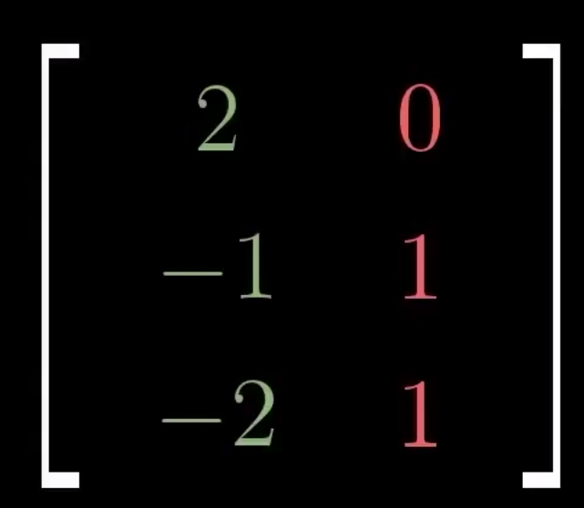
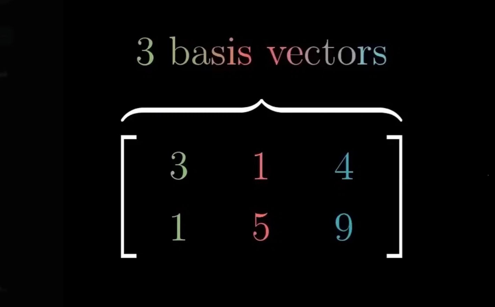
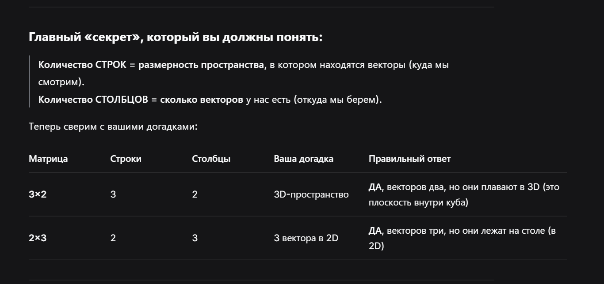

 Пока не понял видоса, разобрать похже

 

  

**Ваш первый случай: 3 строки и 2 столбца (матрица 3×2)**

Вот так она выглядит (как в вашей первой картинке, где цифры 3,1,5 и 4,9,... хотя там у вас похоже на столбцы):

  

- **Столбцов — 2.** Значит, у нас всего **2 базисных вектора**.
- **Строк — 3.** Значит, эти векторы живут **в 3-мерном пространстве** (у каждого вектора по 3 координаты: x, y, z).

**Итог:** Это **плоскость в 3D-мире**. Вы правы! Два вектора всегда задают максимум плоскость (2D), но размещены они внутри трехмерного пространства.

  

  

 

  **Ваш второй случай: 2 строки и 3 столбца (матрица 2×3)**  

  

- **Столбцов — 3.** Значит, у нас **3 базисных вектора**.
- **Строк — 2.** Значит, у каждого вектора всего по **2 координаты** (x и y). Они живут на обычной плоской 2D-картинке.

**Итог:** Это **три вектора в 2-мерном пространстве**. Вы снова абсолютно правы! Так как в 2D-плоскости больше двух независимых векторов быть не может, один из них обязательно будет *лишним* (линейно зависимым).

  

 

  

- *У **3×2** (плоскость в 3D) определителя нет, обратной матрицы нет. Почему? Потому что площадь у плоскости в 3D — это не число, такую матрицу нельзя "схлопнуть" или "развернуть" обратно.*
- *У **2×3** (три вектора на столе) определителя тоже нет. Он считается **только** у квадратных матриц (2×2, 3×3), где число строк равно числу столбцов.*

  

 

