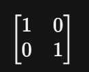

  

Это одна из самых мощных тем курса. Она объясняет, как «открутить» изменения пространства назад и что делать, если пространство всё-таки схлопнулось. Обратная матрица обозначается как **A⁻¹**.

Вот главные концепты, которые нужно уложить в голове:

**1. Обратная матрица — это кнопка «Undo» (Отмена действия)**
Если обычная матрица A поворачивает и растягивает пространство, то обратная матрица A⁻¹ делает ровно противоположное действие, возвращая всё в исходный вид.

*Пример:* Если матрица A поворачивает сетку на 90° по часовой стрелке и растягивает в 2 раза, то обратная матрица A⁻¹ повернёт её на 90° против часовой стрелки и сожмёт в 2 раза.

Если применить их друг за другом (A⁻¹ · A), пространство вернётся в идеальное начальное состояние. Это называется единичной матрицей (**I**), где базисы равны:

 

**2. Главная драма: Когда обратной матрицы НЕ существует?**
Вы уже знаете ответ из прошлого урока! Если определитель равен нулю (**det = 0**), то пространство схлопнулось (например, 2D-плоскость превратилась в 1D-линию).

*Геометрически:* Невозможно вернуть линию обратно в плоскость. Компьютер не знает, откуда именно на эту линию прилетели точки — информация стёрта навсегда.
В математике такие матрицы называют **вырожденными** (или сингулярными).

**3. Пространство столбцов (Column Space)**
Представьте матрицу, которая схлопнула 3D-пространство в 2D-плоскость.
Пространство столбцов — это и есть то место (в данном случае плоскость), куда смогли дотянуться наши новые базисные векторы после трансформации. Это набор всех возможных исходов, которые может выдать матрица.

Количество независимых осей, которые выжили после схлопывания, называют **рангом матрицы (Rank)**. Если матрица 3×3 схлопнула мир в плоскость, её ранг равен 2.

**4. Нуль-пространство (Null Space или Ядро)**
Когда пространство схлопывается (например, плоскость сжимается в линию), целая куча векторов и точек со всего пространства падает ровно в центр — в точку (0, 0).
**Нуль-пространство** — это группа всех «погибших» векторов, которые после умножения на матрицу превратились в ноль.

  