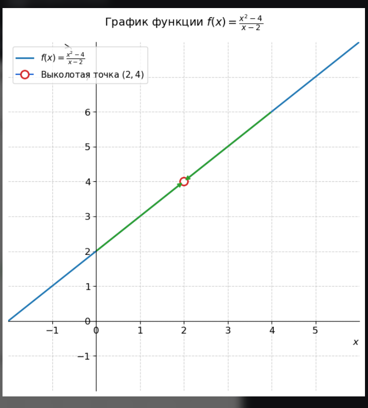

## Пределы: фундамент математического анализа и машинного обучения

Пределы — это фундамент всего математического анализа, на котором строится машинное обучение (ML). Именно через пределы определяются производные, благодаря которым нейросети находят ошибки и обучаются (метод градиентного спуска).

Давайте двигаться по шагам: от бытовой интуиции до строгих формул и их применения в ИИ.

### Шаг 1. Интуиция (Что такое предел?)

Представьте, что вы идёте к стене. Каждый шаг уменьшает расстояние до неё в два раза: 1 метр, 0.5 метра, 0.25 метра, 0.125 метра...

Вы будете бесконечно приближаться к стене, но физически никогда её не коснетесь. В математике говорят: ваш предел — это стена.

**Главная идея:** Предел функции — это значение, к которому функция приближается всё ближе и ближе, когда её аргумент (переменная) приближается к какой-то точке.

Записывается это так:

$$
\lim_{x \to a} f(x) = L
$$

(Читается: «Предел функции $f(x)$ при $x$, стремящемся к $a$, равен $L$»)

### Шаг 2. Простые примеры (Когда всё очевидно)

Иногда, чтобы найти предел, достаточно просто подставить число в функцию.

**Пример 1:**

$$
\lim_{x \to 3} (2x + 1)
$$

Когда $x$ становится очень-очень близким к $3$ (например, $2.999$ или $3.001$), выражение $(2x + 1)$ становится очень близким к $2 \cdot 3 + 1 = 7$.

**Ответ:** Предел равен $7$.

### Шаг 3. Неопределенности (Когда просто подставить нельзя)

Самое интересное начинается, когда при подстановке мы получаем бессмыслицу вроде $\frac{0}{0}$ или $\frac{\infty}{\infty}$. Это называется неопределенностью. Пределы как раз и нужны, чтобы такие ситуации «раскрывать».

**Пример 2 (Тип** $\frac{0}{0}$**):**

$$
\lim_{x \to 2} \frac{x^{2} - 4}{x - 2}
$$

Если мы просто подставим $x = 2$, то получим $\frac{4 - 4}{2 - 2} = \frac{0}{0}$ (делить на ноль нельзя!).

Но предел спрашивает: что происходит рядом с двойкой, а не в самой двойке. Давайте упростим выражение, разложив числитель:

$$
\frac{x^{2} - 4}{x - 2} = \frac{(x - 2)(x + 2)}{x - 2}
$$

Пока x != 2, мы имеем полное право сократить $(x - 2)$:

$$
\lim_{x \to 2} (x + 2) = 2 + 2 = 4
$$

Ниже на графике видно, что в самой точке $x = 2$ у функции дырка (она там не существует), но линии с обеих сторон сходятся к высоте $y = 4$.

 

### В чем главная сложность Шага 3?

В примере была функция: $f(x) = \frac{x^2 - 4}{x - 2}$, и мы искали её предел при $x \to 2$ (икс стремится к 2).

Если мы попытаемся сделать как в Шаге 2 (просто вместо $x$ подставить двойку), то споткнемся:

- В числителе: $2^2 - 4 = 4 - 4 = 0$
- В знаменателе: $2 - 2 = 0$

Получаем дробь: $\frac{0}{0}$.

В математике выражение $\frac{0}{0}$ называется неопределенностью. Ноль поделить на ноль нельзя, компьютер в этом месте выдаст ошибку `ZeroDivisionError`.

#### Как предел решает эту проблему?

Помните главное правило предела? Пределу не важно, что происходит в самой точке $x = 2$. Ему важно, что происходит **РЯДОМ** с ней.

Давайте проведем эксперимент и начнем подставлять в формулу числа, которые очень-очень близки к двойке, но не равны ей.

**Приближаемся слева (числа чуть меньше 2):**

- Подставим $x = 1.9$:

  $$
  \frac{1.9^2 - 4}{1.9 - 2} = \frac{3.61 - 4}{-0.1} = \frac{-0.39}{-0.1} = \mathbf{3.9}
  $$
- Подставим $x = 1.99$:

  $$
  \frac{1.99^2 - 4}{1.99 - 2} = \frac{3.9601 - 4}{-0.01} = \frac{-0.0399}{-0.01} = \mathbf{3.99}
  $$
- Подставим $x = 1.999$:

  Получим $\mathbf{3.999}$

**Приближаемся справа (числа чуть больше 2):**

- Подставим $x = 2.01$:

  $$
  \frac{2.01^2 - 4}{2.01 - 2} = \frac{4.0401 - 4}{0.01} = \frac{0.0401}{0.01} = \mathbf{4.01}
  $$
- Подставим $x = 2.001$:

  Получим $\mathbf{4.001}$

Посмотрите на результаты: $3.9 \to 3.99 \to 3.999$ и $4.01 \to 4.001$.

Видите закономерность? Чем ближе $x$ подбирается к двойке, тем ближе результат всей дроби подбирается к числу $4$.

#### А зачем мы там что-то сокращали?

Каждый раз подставлять такие цифры на калькуляторе — очень долго. Поэтому математики используют хитрость: они упрощают формулу до того, как искать предел.

Из школьной алгебры мы помним формулу «разность квадратов»: $x^2 - 4$ можно разложить как $(x - 2)(x + 2)$.

Запишем нашу дробь заново:

$$
\frac{(x - 2)(x + 2)}{x - 2}
$$

Поскольку мы договорились, что $x$ только стремится к $2$, но не равен $2$, то выражение $(x - 2)$ — это точно не ноль (это может быть $0.001$ или $-0.001$). А раз это не ноль, мы имеем полное право сократить числитель и знаменатель на эту скобку!

После сокращения от всей сложной дроби остается только:

$$
x + 2
$$

И вот теперь найти предел очень легко. Если $x$ стремится к $2$, то выражение $(x + 2)$ стремится к $2 + 2 = \mathbf{4}$.

### Шаг 4. Пределы на бесконечности (Важно для ML!)

Что происходит с функцией, когда $x$ растет до бесконечности ($x \to \infty$)?

**Пример 3:**

$$
\lim_{x \to \infty} \frac{1}{x}
$$

Если мы делим 1 на огромное число (100, 1000, миллион), результат становится крошечным ($0.01$, $0.001$, $0.000001$). Он стремится к нулю.

**Ответ:** Предел равен $0$.

### Шаг 5. Причем тут Машинное Обучение?

В ML пределы редко считают вручную, но на них держится вся теория. Вот два главных примера:

1. **Производная (Градиентный спуск):** Чтобы обучить нейросеть, нужно понять, как изменение веса нейрона ($x$) влияет на ошибку ($f(x)$). Для этого берут бесконечно малый шаг $\Delta x$, стремящийся к нулю. Сама производная — это предел:

   $$
   f'(x) = \lim_{\Delta x \to 0} \frac{f(x + \Delta x) - f(x)}{\Delta x}
   $$
2. **Функции активации (например, Сигмоида):** В нейросетях используется функция $\sigma(x) = \frac{1}{1 + e^{-x}}$.

   Благодаря пределам мы точно знаем её поведение на краях:
   - При $x \to \infty$ предел функции равен $1$.
   - При $x \to -\infty$ предел функции равен $0$.

   Это позволяет сжимать любые числа в диапазон вероятностей от $0$ до $1$.

### Еще примеры

### Пример 1. Сокращение через вынесение за скобки

Найдем предел при $x \to 0$ (икс стремится к нулю):

$$
\lim_{x \to 0} \frac{3x^{2} - 2x}{x}
$$

**Шаг 1. Проверяем «в лоб»:**

Подставим вместо $x$ чистый ноль:

$$
\frac{3 \cdot 0^{2} - 2 \cdot 0}{0} = \frac{0}{0}
$$

Опять получили деление нуля на ноль. Прямая подстановка не работает.

**Шаг 2. Включаем логику предела:**

Знак $\lim_{x \to 0}$ гарантирует нам: $x$ очень близок к нулю, но не равен ему. А значит, мы имеем право сокращать на $x$.

Давайте вынесем $x$ за скобки в числителе:

$$
\frac{3x^{2} - 2x}{x} = \frac{x \cdot (3x - 2)}{x}
$$

Теперь мы со спокойной совестью сокращаем $x$ в числителе и знаменателе. У нас остается простая линейная функция:

$$
3x - 2
$$

**Шаг 3. Считаем предел:**

Если $x$ стремится к $0$, то выражение $3x - 2$ превращается в:

$$
3 \cdot 0 - 2 = -2
$$

**Ответ:** Предел равен $-2$.

---

### Пример 2. Борьба с бесконечностью ($\frac{\infty}{\infty}$)

Этот тип пределов критически важен для оценки скорости работы алгоритмов машинного обучения (сложности Big O).

Посмотрим, что происходит с дробью, когда $x$ растет до бесконечности ($x \to \infty$):

$$
\lim_{x \to \infty} \frac{4x^{2} + 5}{2x^{2} - x}
$$

**Шаг 1. Проверяем «в лоб»:**

Если вместо $x$ подставить гигантское число, то и в числителе, и в знаменателе получатся огромные числа. Мы получаем неопределенность вида:

$$
\frac{\infty}{\infty}
$$

**Шаг 2. Применяем математическую хитрость:**

Чтобы избавиться от бесконечности, нужно поделить и числитель, и знаменатель на $x$ в самой старшей степени. В нашем примере это $x^{2}$.

Поделим каждое слагаемое на $x^{2}$:

- Числитель: $\frac{4x^{2}}{x^{2}} + \frac{5}{x^{2}} = 4 + \frac{5}{x^{2}}$
- Знаменатель: $\frac{2x^{2}}{x^{2}} - \frac{x}{x^{2}} = 2 - \frac{1}{x}$

Запишем наш предел в новом виде:

$$
\lim_{x \to \infty} \frac{4 + \frac{5}{x^{2}}}{2 - \frac{1}{x}}
$$

**Шаг 3. Анализируем «хвосты»:**

Помните Шаг 4 из нашего первого разговора? Что происходит с дробями $\frac{5}{x^{2}}$ и $\frac{1}{x}$, когда $x$ становится бесконечно большим?

Если мы делим 5 или 1 на триллион, эти дроби становятся ничтожно малыми. Они стремятся к нулю. Математики говорят, что они «зануляются».

Вычеркиваем их, и у нас остаются только чистые числа:

$$
\frac{4 + 0}{2 - 0} = \frac{4}{2} = 2
$$

**Ответ:** Предел равен $2$.

В машинном обучении это означает, что при огромных объемах данных ($x \to \infty$) все мелкие прибавки (вроде $+5$ или $-x$) перестают играть роль, а поведение алгоритма определяют только старшие коэффициенты.

## Как предел связан с производной?

Производная — это и есть предел. Это не просто связь, это определение.

Вспомните формулу:

$$
f'(x) = \lim_{\Delta x \to 0} \frac{f(x + \Delta x) - f(x)}{\Delta x}
$$

**Что здесь происходит?**

- У нас есть функция ошибки нейросети $f(x)$, где $x$ — это вес какого-то нейрона.
- Мы хотим понять: если мы чуть-чуть изменим вес $x$ (на маленькую величину $\Delta x$), то как изменится ошибка $f(x)$?
- $\frac{f(x + \Delta x) - f(x)}{\Delta x}$ — это **средняя скорость изменения** ошибки на отрезке длиной $\Delta x$.
- А предел при $\Delta x \to 0$ — это **мгновенная скорость изменения** ошибки в самой точке $x$.

Без предела у нас была бы только «грубая» оценка по двум точкам. А предел даёт **точное направление**, куда нужно двигать вес, чтобы ошибка уменьшалась быстрее всего.

---

## Зачем нам вообще пределы, если в коде мы используем дискретные шаги?

Вы правы: в реальном коде мы не берем $\Delta x \to 0$. Мы берем конкретное маленькое число, например 0.001, и считаем градиент приближенно. Но:

- Теория говорит нам, что если шаг достаточно мал, то наше приближение становится сколь угодно точным. Это гарантирует, что алгоритм сойдётся (найдёт минимум).
- Без предела мы бы не знали, какая формула правильная. Например, откуда мы знаем, что производная от $x^2$ равна $2x$? Это выводится именно через предел.
- Все библиотеки (PyTorch, TensorFlow) вычисляют аналитические производные (через автодифференцирование), а не численные. А аналитические производные получены с помощью правил дифференцирования, которые, в свою очередь, доказаны через пределы.

123

## Пример из ML, где предел виден напрямую

Возьмём сигмоиду:

$$
\sigma(x) = \frac{1}{1 + e^{-x}}
$$

Она используется, чтобы превращать любые числа в вероятности (от 0 до 1).

**Почему мы знаем, что её выход всегда будет между 0 и 1?**

Именно благодаря пределам:

$$
\lim_{x \to +\infty} \sigma(x) = 1, \qquad \lim_{x \to -\infty} \sigma(x) = 0
$$

Если бы этих пределов не было, мы бы не могли доверять сигмоиде как «сжимателю» — неизвестно, куда она выстрелит на больших числах. А пределы дают строгую гарантию.

---

**Итог:**

$$
\boxed{
\sigma(x) = \frac{1}{1 + e^{-x}}, \quad
\lim_{x \to +\infty} \sigma(x) = 1, \quad
\lim_{x \to -\infty} \sigma(x) = 0
}
$$

## Давайте проведём живой численный эксперимент

Я покажу вам ровно 3 проблемы, которые возникают, если мы пытаемся обойтись без предела. А в конце — главный козырь, почему в нейросетях без предела физически невозможно обучить модель.

---

### Эксперимент. Обучаем простую функцию

Пусть наша функция потерь (ошибка) будет самой простой:

$$
f(x) = x^2
$$

Мы хотим найти минимум этой функции. Интуитивно понятно, что минимум в точке $x = 0$ (ноль в квадрате даёт 0). Мы стартуем из точки $x = 5$ и используем градиентный спуск с коэффициентом скорости обучения (lr) $\eta = 0.9$.

Формула обновления веса:

$$
x_{\text{новый}} = x_{\text{старый}} - \eta \cdot f'(x)
$$

---

### Случай 1. Используем настоящую производную (полученную через предел)

Из школьной математики мы знаем, что производная $x^2$ равна $2x$. Но откуда мы это знаем? Из предела:

$$
\lim_{\Delta x \to 0} \frac{(x + \Delta x)^2 - x^2}{\Delta x} = 2x
$$

Идём по шагам:

| Шаг | Текущий $x$ | Производная ($2x$) | Новый $x$ |
|:---:|:---:|:---:|:---|
| 0 | 5 | 10 | $5 - 0.9 \cdot 10 = -4$ |
| 1 | -4 | -8 | $-4 - 0.9 \cdot (-8) = 3.2$ |
| 2 | 3.2 | 6.4 | $3.2 - 0.9 \cdot 6.4 = -2.56$ |
| 3 | -2.56 | -5.12 | $-2.56 - 0.9 \cdot (-5.12) = 2.048$ |
| ... | ... | ... | ... |
| 10 | \~0.107 | ... | Почти 0 |

**Итог:** Алгоритм плавно «затухает» и приходит к идеальному нулю. Всё стабильно.

---

### Случай 2. Используем «плохое» приближение (без предела)

Представьте, что мы ленимся брать предел $\Delta x \to 0$ и просто решили посчитать скорость изменения с шагом $\Delta x = 2$.

Формула приближения:

$$
f'(x) \approx \frac{(x+2)^2 - x^2}{2} = 2x + 2
$$

Мы ошиблись на целую двойку! Запускаем тот же градиентный спуск ($\eta = 0.9$):

| Шаг | Текущий $x$ | Приближ. производная ($2x+2$) | Новый $x$ |
|:---:|:---:|:---:|:---|
| 0 | 5 | $10+2=12$ | $5 - 0.9 \cdot 12 = -5.8$ |
| 1 | -5.8 | $-11.6+2 = -9.6$ | $-5.8 - 0.9 \cdot (-9.6) = 2.84$ |
| 2 | 2.84 | $5.68+2 = 7.68$ | $2.84 - 0.9 \cdot 7.68 = -4.07$ |
| 3 | -4.07 | ... | \~3.3 |

**Итог:** Числа не затухают, а скачут с амплитудой 4–5. Алгоритм никак не может успокоиться и найти ноль. Если бы мы взяли скорость обучения чуть больше (например, $\eta = 1.0$), то с такой ошибочной производной функция бы разлетелась в бесконечность (взбесилась), а с правильной (предельной) — работала бы исправно.

**Почему это важно для понимания предела?**

Обратите внимание на результат: настоящая производная (когда мы берем предел при $\Delta x \to 0$) равна:

$$
\lim_{\Delta x \to 0} \frac{(x + \Delta x)^2 - x^2}{\Delta x} = 2x
$$

А здесь, взяв шаг $\Delta x = 2$, мы получили приближение:

$$
\frac{(x + 2)^2 - x^2}{2} = 2x + 2
$$

Эта двойка в конце — это и есть **погрешность приближения**.

---

**Примеры с разными шагами**

Если бы мы взяли $\Delta x = 1$, то получили бы:

$$
\frac{(x + 1)^2 - x^2}{1} = \frac{x^2 + 2x + 1 - x^2}{1} = 2x + 1
$$

(погрешность = 1)

Если бы мы взяли $\Delta x = 0.5$:

$$
\frac{(x + 0.5)^2 - x^2}{0.5} = \frac{x^2 + 1x + 0.25 - x^2}{0.5} = \frac{x + 0.25}{0.5} = 2x + 0.5
$$

(погрешность = 0.5)

---

**Закономерность**

Видите закономерность? Чем меньше $\Delta x$, тем меньше эта прибавка в конце, и тем ближе наше приближение к настоящей производной $2x$. Когда $\Delta x$ становится бесконечно малым (стремится к нулю), эта прибавка исчезает — это и есть **взятие предела**.

---

---

### Случай 3. Самая страшная проблема — численная точность

«Ну хорошо, — скажете вы, — я возьму $\Delta x$ не 2, а очень маленькое, например, $0.0000001$. Тогда погрешность будет крошечной!»

Давайте проверим. Возьмём ту же функцию $f(x) = x^2$ в точке $x = 5$.

Нам нужно посчитать $\frac{f(5+0.0000001) - f(5)}{0.0000001}$. В компьютере числа хранятся с ограниченной точностью (числа с плавающей запятой).

- $f(5) = 25$ (компьютер запомнит как 25.0000000)
- $f(5.0000001) = 25.00000100000001$

Когда компьютер вычтет $25.00000100000001 - 25.00000000000000$, он получит $0.00000100000001$. А потом поделит это на $0.0000001$ и получит $10.0000001$. Вроде похоже на правду (почти $2x = 10$).

**НО** что будет в точке $x = 0$? Мы знаем, что настоящая производная (предел) там равна $0$. А теперь подставьте $\Delta x = 0.0000001$:

$$
f'(0) \approx \frac{0.0000001^2 - 0^2}{0.0000001} = \frac{0.00000000000001}{0.0000001} = 0.0000001
$$

Вроде бы почти ноль. А теперь представьте нейросеть с миллионами параметров. Эти крошечные ошибки накапливаются, и градиентный спуск начинает «шуметь» и тормозить.

---

## 🔥 Самое главное. Зачем предел в машинном обучении на практике?

До этого мы говорили о математике. Но есть железобетонная практическая причина, почему без предела (и производной, как предела) мы бы не построили ни один современный ИИ.

Представьте, что у нас нет формулы производной. Мы умеем считать только приближения через $\Delta x$.

Чтобы обучить нейросеть с **1 миллионом весов** (параметров), нам нужно для каждого веса сделать:

1. Сдвинуть этот вес на $\Delta x$.
2. Заново прогнать всю нейросеть (миллионы вычислений), чтобы посчитать новую ошибку.
3. Вычислить приближение производной по формуле $\frac{f(x+\Delta x) - f(x)}{\Delta x}$.

Это значит, что для одного шага градиентного спуска нам придётся запустить нейросеть **1 миллион + 1 раз**! Это займёт недели или годы.

**А как мы учим сейчас?**

Мы берём предел (производную), выводим для неё аналитическую формулу (правило цепочки, chain rule) и получаем **обратное распространение ошибки (Backpropagation)**.

Оно позволяет рассчитать все 1 миллион производных за **один-единственный прогон** нейросети вперёд и один прогон назад (forward + backward pass).

**Итог:** Предел дал нам производную. Производная дала нам правило цепочки. Правило цепочки дало нам Backpropagation. А Backpropagation делает обучение возможным за часы, а не за тысячелетия.

---

### Как это запомнить?

Предел — это микроскоп, который позволяет увидеть точное направление склона горы (градиент) в той самой точке, где вы стоите. Если вы уберете микроскоп (предел) и будете мерить склон шагами, вы либо промахнётесь мимо ямы (минимума), либо будете тыкаться туда-сюда, либо потратите всю жизнь на вычисления.

---

### 

## Итоговый ответ на ваш вопрос

**«Знание предела позволяет мне посчитать производную, при помощи которой я могу найти возможность искать дно холма — минимум?»**

Да. Ровно так.

Без предела вы бы никогда не узнали точную формулу $f'(x)$:

- для $x^2$ это $2x$,
- для сигмоиды это $\sigma(x)(1 - \sigma(x))$,
- и так далее для всех функций.

А без точной производной вы бы не знали, **в какую сторону крутить ручку** настройки весов, чтобы ошибка стала меньше.

---

### Простая аналогия

| Инструмент | Роль |
|:---|:---|
| **Предел** | Даёт вам **компас** — точное направление движения. |
| **Производная** | Показывает **крутизну склона** в точке, где вы стоите. |
| **Градиентный спуск** | Это сам **маршрут** к подножию холма. |

---

### Ключевая формула

$$
\boxed{
f'(x) = \lim_{\Delta x \to 0} \frac{f(x + \Delta x) - f(x)}{\Delta x}
\quad \Longrightarrow \quad
\text{точное направление для обновления весов}
}
$$

**Итог:** предел — это фундамент, на котором строится весь градиентный спуск и обучение нейросетей. Без него мы не знали бы, как уменьшать ошибку.

---

## Что нужно знать о пределах ML-инженеру?

Для ML-инженера пределы нужны **на уровне понимания**, а не как ежедневный навык «раскрывать $\frac{0}{0}$» на бумаге.

### Что реально нужно знать

1. **Производная = предел**  
   Понимать формулу

   $$
   f'(x) = \lim_{\Delta x \to 0} \frac{f(x + \Delta x) - f(x)}{\Delta x}
   $$

   и смысл: «мгновенный наклон = компас для градиентного спуска».

2. **Зачем $\Delta x \to 0$**  
   Почему численный градиент с большим шагом врёт ($2x + 2$ вместо $2x$), а аналитический (через правила) — точнее.

3. **Поведение на бесконечности**  
   Например, сигмоида: при $x \to +\infty$ → $1$, при $x \to -\infty$ → $0$. Это про активации и «насыщение».

4. **Сходимость «на пальцах»**  
   Идея «если шаг мал / обучение идёт, величина стремится к минимуму» — без строгих $\varepsilon$-$\delta$.

### Нужно ли уметь вычислять пределы?

**В работе — почти нет.**  
В коде вы не считаете

$$
\lim_{x \to 2} \frac{x^2 - 4}{x - 2}
$$

Считают PyTorch / TensorFlow через autograd.

**Для учёбы — да, чуть-чуть:**  
пару простых пределов ($\frac{0}{0}$, $\frac{\infty}{\infty}$, $\frac{1}{x} \to 0$), чтобы формула производной не была магией. Уровень этого конспекта — нормальный потолок для практики.

### Чего не нужно

- Строгие определения $\varepsilon$-$\delta$
- Олимпиадные трюки с пределами
- Считать пределы вручную каждый день

### Итог для ML

| Вопрос | Ответ |
|:---|:---|
| Зачем предел? | Чтобы понимать, **откуда берётся** производная |
| Считаем ли в коде? | Нет, библиотеки используют готовые правила (autograd) |
| Уметь вычислять? | На уровне 5–10 типовых примеров — да; глубоко — нет |

$$
\boxed{
\text{Понять роль предела} \;\;>\;\; \text{уметь раскрывать сложные пределы вручную}
}
$$
 