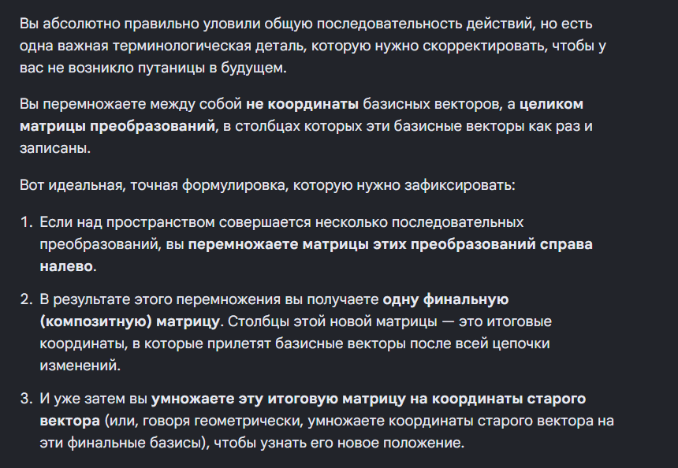

# Конспект: Произведение матриц и композиция трансформаций

## 1. Что такое произведение матриц геометрически?

**Умножение матриц друг на друга — это цепочка последовательных действий с пространством.**

Когда вы видите запись **A · B**, это значит:

> Мы берем пространство и **сначала** применяем трансформацию **B** (правая матрица), а затем поверх нее применяем трансформацию **A** (левая матрица).

**Важно:** Читается всегда **справа налево**.

---

## 2. Что такое «Композиция»?

**Это склеивание нескольких шагов в один.**

Вместо того чтобы гонять вектор через 10 разных матриц-слоев по очереди, мы можем:

- Перемножить все эти матрицы между собой
- Получить **одну-единственную итоговую матрицу**

Она сразу выдаст финальный результат, сэкономив компьютеру кучу времени и вычислений.

---

## 3. Как читать итоговую матрицу?

Когда вы перемножили матрицы и получили финальную таблицу чисел:

> **Столбцы** — это координаты финального положения базисных векторов после всех деформаций.

Алгоритм простой:

1. Берете старый вектор
2. Умножаете на эти новые базисы
3. Получаете ответ

---

## 4. Главный закон: порядок имеет значение!

В обычной математике: **2 · 3 = 3 · 2**

Но с матрицами это **НЕ работает**:

> **A · B ≠ B · A**

### Пример из жизни:

- **Сценарий 1:** Сначала повернуть телефон на 90°, а потом положить его на стол плашмя.
- **Сценарий 2:** Сначала положить плашмя, а потом повернуть.

Результат (положение телефона в пространстве) будет **совершенно разным**.

**"то есть я должен усвоить что если над матрицей было несолько преобразований, то надо перемножить координаты базисных векторов справа налево, а потом результат уже умножать на координаты старого вектора, чтобы узнать новый?"  **

 

