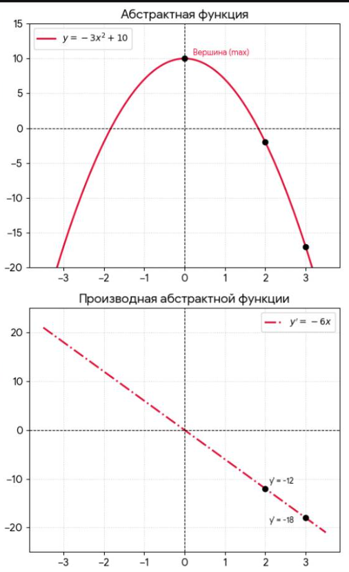
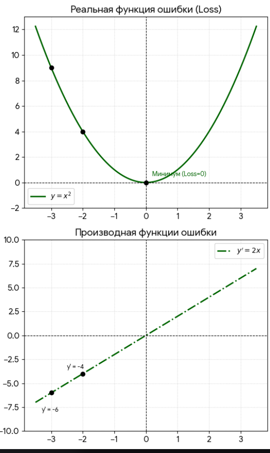
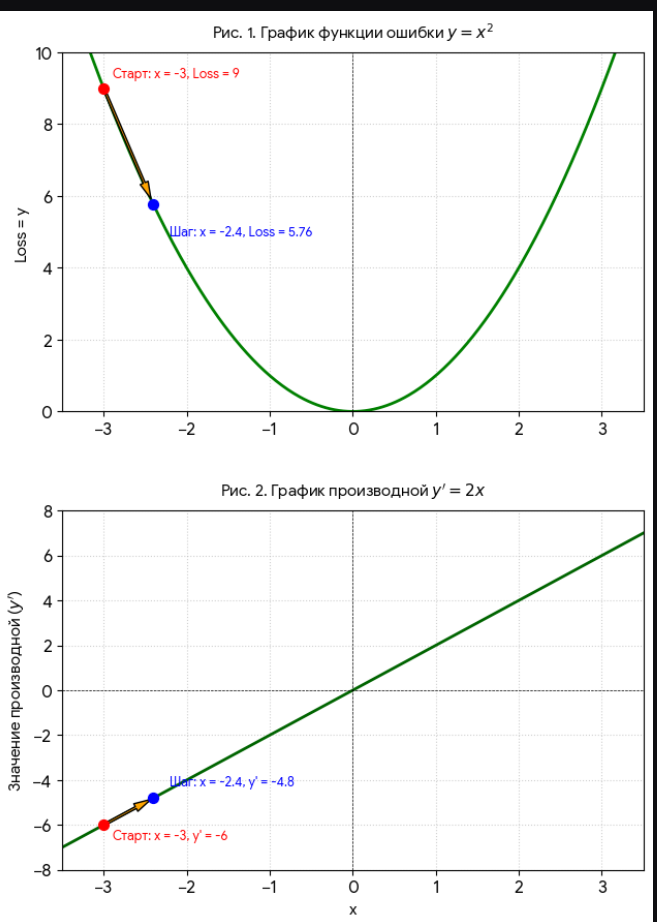

# В тетради решения начиная со стр. 6

Также продублирую сюда

 Если вы давно не трогали математику, пытаться "догнать" производную с середины — это как пытаться читать книгу с 50-й страницы. Вы будете спотыкаться о каждое второе слово.

Не переживайте! Чтобы уверенно чувствовать себя в теме производной (и понимать градиенты в ML), вам нужно вспомнить **всего 4 простые темы** из школьной математики.

Ниже я даю **карту возвращения**. Пройдите эти пункты по порядку — и производная перестанет быть "магией" и станет просто "инструментом".

  

# УРОВЕНЬ 1. Что такое функция? (Без этого производная — это шум)

**Проблема:** Производная — это скорость изменения функции. Если вы не знаете, что такое функция, вы не поймёте, что именно меняется.

## Что надо вспомнить:

- **Функция** — это просто правило: *«Берём число* $x$*, делаем с ним действие, получаем новое число* $y$*»*.
- Пример: $y = x^2$. Взяли $3$ — получили $9$. Взяли $5$ — получили $25$.
- В ML функция — это ошибка модели. На входе — числа (веса), на выходе — ошибка.

## Ваше задание

Посмотрите на формулу $y = 2x + 1$. Подставьте $x = 3$.

**Пошаговое вычисление:**

1. Исходная функция:

   $$
   y = 2x + 1
   $$
2. Подставляем $x = 3$:

   $$
   y = 2 \cdot 3 + 1
   $$
3. Выполняем умножение:

   $$
   y = 6 + 1
   $$
4. Находим сумму:

   $$
   y = 7
   $$

**Ответ:**

$$
\boxed{7}
$$

Если вы это сделали — уровень пройден. 🚀

# УРОВЕНЬ 2. Графики и скорость (Геометрия для понимания)

**Проблема:** Производная — это "крутизна". Чтобы понять крутизну, нужно представлять картинку.

## Что надо вспомнить:

- График — это просто линия на плоскости.
- Скорость изменения — это то, насколько резко линия идёт вверх или вниз.
- Представьте горку: если вы стоите на ровном месте — скорость равна $0$; если поднимаетесь — скорость положительная; если скатываетесь — скорость отрицательная.

## Ваше задание

Нарисуйте на бумаге параболу (чашку) $y = x^2$. Посмотрите на её левую часть (она падает вниз) — там скорость **отрицательная**. Посмотрите на правую часть (она растёт) — там скорость **положительная**. На самом дне (в точке $x = 0$) — скорость равна нулю.

**Это и есть производная!**

## Краткий итог (визуально)

- Левая ветвь ($x < 0$): функция убывает $\Rightarrow$ производная отрицательна.
- Правая ветвь ($x > 0$): функция возрастает $\Rightarrow$ производная положительна.
- Точка $x = 0$: вершина параболы $\Rightarrow$ производная равна нулю.

Запомните этот образ — он поможет понимать производную без формул.

# УРОВЕНЬ 3. Степени и правила (Как считать)

**Проблема:** В формуле производной $x^2$ превращается в $2x$. Если вы боитесь степеней — вы испугаетесь формулы.

## Что надо вспомнить:

- $x^2$ — это $x \cdot x$.
- $x^3$ — это $x \cdot x \cdot x$.
- Главное правило: когда берёте производную от $x^n$, вы умножаете на степень и уменьшаете степень на $1$:

  $$
  (x^n)' = n \cdot x^{n-1}
  $$

### Примеры:

- $x^2 \to 2x^1 = 2x$
- $x^3 \to 3x^2$
- $x^1 \to 1 \cdot x^0 = 1$

## Ваше задание

Найдите производную от $x^4$.

**Пошаговое вычисление:**

1. Записываем правило:

   $$
   (x^n)' = n \cdot x^{n-1}
   $$
2. Подставляем $n = 4$:

   $$
   (x^4)' = 4 \cdot x^{4-1}
   $$
3. Упрощаем:

   $$
   (x^4)' = 4x^3
   $$

**Ответ:**

$$
\boxed{4x^3}
$$

Если вы поняли, как это получилось — вы освоили **80%** всех формул производных в ML!

---

# УРОВЕНЬ 4. Сложение и умножение на число (Сборка сложных функций)

**Проблема:** В ML формулы редко состоят из одного $x^2$. Там есть $5x^2 + 3x$.

## Что надо вспомнить:

- **Константу (число) можно выносить вперёд.**
  Было: $5x^2$. Производная:

  $$
  (5x^2)' = 5 \cdot (x^2)' = 5 \cdot 2x = 10x
  $$
- **Производная от суммы равна сумме производных.**
  Было: $x^2 + x$. Производная:

  $$
  (x^2 + x)' = (x^2)' + (x)' = 2x + 1
  $$

## Ваше задание

Найдите производную от $3x^2 + 4x$.

**Пошаговое вычисление:**

1. Записываем функцию:

   $$
   y = 3x^2 + 4x
   $$
2. Берём производную от каждого слагаемого:

   $$
   y' = (3x^2)' + (4x)'
   $$
3. Выносим константы:

   $$
   y' = 3 \cdot (x^2)' + 4 \cdot (x)'
   $$
4. Применяем правило степени:

   $$
   y' = 3 \cdot 2x + 4 \cdot 1
   $$
5. Упрощаем:

   $$
   y' = 6x + 4
   $$

**Ответ:**

$$
\boxed{6x + 4}
$$

---

# ИТОГОВЫЙ ЧЕК-ЛИСТ (Ваш план действий)

Если вы чувствуете, что "плывёте", откройте старый учебник математики за 7–8 класс и пробегитесь по этим пунктам. На это уйдёт **2–3 часа**, зато производная станет прозрачной.

| Уровень | Что вспомнить | Ваш индикатор, что вы поняли |
|----|----|----|
| **1** | Что такое функция $y = x^2$ | Вы можете подставить число и посчитать результат. |
| **2** | Что такое график и скорость | Вы понимаете, почему у параболы на дне скорость равна $0$. |
| **3** | Правило степени $(x^n \to n \cdot x^{n-1})$ | Вы находите производную от $x^5$ без ошибок. |
| **4** | Вынос константы и сумма | Вы находите производную от $5x^2 + 3x$. |

начнем с простых производных (считать их я уже умею в тетрадке примеры)

**обычная производная функции одной переменной**  

# Производные: от одной переменной до трёх

## 1. Одна переменная, степень (самый простой)

**Функция:**

$$
y = 3x^4
$$

**Правило:**

$$
(x^n)' = n \cdot x^{n-1}
$$

**Пошаговое решение:**

- Степень $4$ опускаем вперёд как множитель:

  $$
  y' = 4 \cdot 3x^{4-1}
  $$
- Получаем:

  $$
  y' = 12x^3
  $$

$$
\boxed{y' = 12x^3}
$$

---

## 2. С несколькими слагаемыми

**Функция:**

$$
y = 5x^3 - 2x^2 + 7x - 1
$$

**Шаг 1:** Производная суммы = сумма производных.

**Шаг 2:** Берём производную каждого слагаемого:

- от $5x^3$:

  $$
  (5x^3)' = 3 \cdot 5x^2 = 15x^2
  $$
- от $-2x^2$:

  $$
  (-2x^2)' = 2 \cdot (-2)x^1 = -4x
  $$
- от $7x$:

  $$
  (7x)' = 7 \quad (\text{так как } (x^1)' = 1 \cdot x^0 = 1)
  $$
- от $-1$ (константа):

  $$
  (-1)' = 0
  $$

**Собираем вместе:**

$$
y' = 15x^2 - 4x + 7
$$

$$
\boxed{y' = 15x^2 - 4x + 7}
$$

---

# ДВЕ ПЕРЕМЕННЫЕ (частные производные)

Теперь функция зависит от $x$ и $y$:

$$
f(x, y) = x^2y + 3y^2 - xy
$$

## Частная производная по $x$ (считаем $y$ константой)

- от $x^2y$: производная как $x^2 \cdot \text{const} \to 2x \cdot y = 2xy$
- от $3y^2$ (нет $x$) $\to 0$
- от $-xy$: $-y$ (производная от $x$ равна $1$, а $y$ — константа)

**Ответ:**

$$
f'_x = 2xy - y
$$

## Частная производная по $y$ (считаем $x$ константой)

- от $x^2y$: $x^2$ (производная от $y$ равна $1$)
- от $3y^2$: $6y$
- от $-xy$: $-x$

**Ответ:**

$$
f'_y = x^2 + 6y - x
$$

---

# Функция с тремя переменными

$$
f(x, y, z) = x^2yz + 3y^2z - xyz + 5z^3
$$

---

## 1. Частная производная по $x$

(считаем $y$ и $z$ константами)

Разбираем каждое слагаемое:

- от $x^2yz$:
  $yz$ — это константа, производная от $x^2 = 2x$
  $\to 2x \cdot yz = 2xyz$
- от $3y^2z$:
  нет $x \to 0$
- от $-xyz$:
  $yz$ — константа, производная от $x = 1$
  $\to -yz$
- от $5z^3$:
  нет $x \to 0$

**Ответ:**

$$
f'_x = 2xyz - yz
$$

---

## 2. Частная производная по $y$

(считаем $x$ и $z$ константами)

- от $x^2yz$:
  $x^2z$ — константа, производная от $y = 1 \to x^2z$
- от $3y^2z$:
  $3z$ — константа, производная от $y^2 = 2y \to 3z \cdot 2y = 6yz$
- от $-xyz$:
  $xz$ — константа, производная от $y = 1 \to -xz$
- от $5z^3$:
  нет $y \to 0$

**Ответ:**

$$
f'_y = x^2z + 6yz - xz
$$

---

## 3. Частная производная по $z$

(считаем $x$ и $y$ константами)

- от $x^2yz$:
  $x^2y$ — константа, производная от $z = 1$
  $\to x^2y$
- от $3y^2z$:
  $3y^2$ — константа, производная от $z = 1$
  $\to 3y^2$
- от $-xyz$:
  $xy$ — константа, производная от $z = 1$
  $\to -xy$
- от $5z^3$:
  производная от $z^3 = 3z^2$, умножаем на $5$
  $\to 15z^2$

**Ответ:**

$$
f'_z = x^2y + 3y^2 - xy + 15z^2
$$

---

# Сводка всех трёх частных производных

$$
\begin{cases} 
f_x' = 2xyz - yz \[6pt]
f_y' = x^2z + 6yz - xz \[6pt]
f_z' = x^2y + 3y^2 - xy + 15z^2 
\end{cases}
$$

  

  

Научились считать производные, закрепили в тетради, теперь снова к примеру, так как непонятно, зачем мы это умеем считать

Пояснение:
**x > 0 это правый склон параболы, х < 0 это левый склон параболы, вершина параболы х = 0**

Разберем две функции, 
***__первая__***:

1)  **y = -3x² + 10**     (это неральный пример,  **минус перед квадратом** (-3x^{2}) всё и портит, парабола перевернута ее ветви уходят бесконечно вниз, в реальных примерах парабола обычно перевернута, и ее ветви направлены вверх)

Производная y' = -6x  

Якорь (1122)

# Связь функции и её производной (на примере параболы)

---

# ЧАСТЬ 1: Верхний график — Абстрактная функция $y = -3x^2 + 10$

Это квадратичная функция. Её графиком является **парабола**.

## Шаг 1. Расчёт точек (таблица координат)

Чтобы линия получилась плавной, берём несколько значений $x$ (от $-3$ до $3$) и подставляем их в формулу:

- **Если** $x = 0$**:**

  $$
  y = -3 \cdot (0)^2 + 10 = 0 + 10 = 10
  $$

  🟢 Получаем точку $(0; 10)$. Это вершина холма (максимум), так как любое другое число в квадрате уменьшит этот результат.
- **Если** $x = 1$**:**

  $$
  y = -3 \cdot (1)^2 + 10 = -3 \cdot 1 + 10 = 7
  $$

  🟢 Точка $(1; 7)$.
- **Если** $x = -1$**:**

  $$
  y = -3 \cdot (-1)^2 + 10 = -3 \cdot 1 + 10 = 7
  $$

  🟢 Точка $(-1; 7)$.
  *(Заметьте: из-за квадрата график идеально симметричен относительно центра).*

---

# ЧАСТЬ 2: Нижний график — Производная функции $y' = -6x$

Это линейная функция. Её графиком всегда является прямая линия. Для построения прямой математически достаточно всего двух точек, но для наглядности посчитаем больше.

## Шаг 1. Расчёт точек

Берём те же самые значения $x$, но подставляем их уже в формулу производной:

- **Если** $x = 0$**:**

  $$
  y' = -6 \cdot 0 = 0
  $$

  Точка $(0; 0)$. Прямая проходит ровно через перекрестие осей.
- **Если** $x = 1$**:**

  $$
  y' = -6 \cdot 1 = -6
  $$

  Точка $(1; -6)$.
- **Если** $x = 2$**:**

  $$
  y' = -6 \cdot 2 = -12
  $$

  Точка $(2; -12)$.
  *(На нижнем графике это первый чёрный кружок. Справа от него подписана высота* $y' = -12$*.)*
- **Если** $x = 3$**:**

  $$
  y' = -6 \cdot 3 = -18
  $$

  Точка $(3; -18)$.
  *(Второй чёрный кружок с подписью* $y' = -18$*.)*
- **Если** $x = -1$**:**

  $$
  y' = -6 \cdot (-1) = +6
  $$

  Точка $(-1; 6)$. Линия уходит вверх в левой части.
- **Если** $x = -3$**:**

  $$
  y' = -6 \cdot (-3) = +18
  $$

  Точка $(-3; 18)$. Самая левая верхняя точка линии.

---

 

 Пояснение к первому нереальному в мл примеру

# Анализ функции ошибки для машинного обучения

---

## Поведение на правом склоне (при $x > 0$)

Мы находимся на правом склоне холма (где $x > 0$).

- **Как ведёт себя график:** Он стремительно падает вниз, в отрицательные числа.
- **Как ведёт себя производная** $y' = -6x$**:** Чем дальше мы уходим вправо (например, от $x = 2$ к $x = 3$), тем **более отрицательной** становится производная (была $-12$, стала $-18$). На нижнем графике линия производной уходит глубоко вниз.
- **Что это значит для оптимизации:** Большая отрицательная производная сообщает алгоритму:
  *«Склон очень крутой, если сделаешь шаг вправо, функция провалится вниз очень сильно»*.
  Но так как у этой функции нет дна, алгоритм будет бесконечно шагать вправо, увеличивая $x$ до бесконечности, а функция будет падать в минус бесконечность. В ML так быть не должно.

---

# Почему первая функция «плохая» для ML?

Первая функция $y = -3x^2 + 10$ плохая не сама по себе, а именно как **функция ошибки** в машинном обучении. У неё есть три критических недостатка:

1. **Значение ошибки уходит в минус.**
   Ошибка в ML показывает качество модели: $0$ — идеальное предсказание, больше положительные числа — плохая работа. Отрицательной ошибки быть не может. Нельзя предсказать картинку «лучше, чем идеально».
2. **У неё нет дна (минимума).**
   Цель обучения — найти точку, где ошибка минимальна, и остановиться. На правом склоне этой функции график бесконечно падает вниз. Алгоритм будет бесконечно увеличивать параметры, пытаясь достичь «минус бесконечности», и модель никогда не обучится.
3. **Алгоритм ускоряется там, где должен замедляться.**
   Чем дальше мы уходим вправо, тем круче склон и тем больше производная по модулю $(-12 \to -18)$. Алгоритм будет делать всё более гигантские шаги, улетая в бесконечность.

---

## Как должно быть в реальном ML

В реальном ML используют функции-«чаши» (например, $y = x^2$).

У них есть чёткое дно (в точке $0$), а по мере приближения к нему склон становится пологим, и производная сама уменьшается до нуля:

$$
y = x^2 \quad \Rightarrow \quad y' = 2x
$$

При $x \to 0$ производная $y' \to 0$, что позволяет алгоритму плавно остановиться в точке минимума.

якорь для поиска (123123)

***__вторая__***:

2) **__y = x²__** 
Производная y' = 2x   

По тем же расчетам выше строим также 2 графика по производной и по функции

# Графики функции ошибки $y = x^2$ и её производной

# ЭТАЖ 1: Верхний график — Функция ошибки $y = x^2$

Поскольку перед $x^2$ стоит невидимый плюс (положительный коэффициент $a = 1$), ветви параболы смотрят вверх. График превращается в **«чашу»**, дно которой — идеальная точка минимума.

## 1. Расчёт ключевых точек (таблица координат)

Компьютер берёт значения $x$ слева направо и просто возводит их в квадрат:

- **Крайняя левая точка (**$x = -3$**):**
  Вычисление: $(-3)^2 = 9$
  🟢 Координата: $(-3; 9)$. Программа ставит здесь первый чёрный кружок.
- **Левый склон (**$x = -2$**):**
  Вычисление: $(-2)^2 = 4$
  🟢 Координата: $(-2; 4)$. Программа ставит здесь второй чёрный кружок.
- **Дно чаши (**$x = 0$**):**
  Вычисление: $0^2 = 0$
  🟢 Координата: $(0; 0)$. Это самая низкая точка. Компьютер отмечает её кружком и подписывает: **«Минимум (**$Loss = 0$**)»**.
- **Правый склон (**$x = 2$**):**
  Вычисление: $2^2 = 4$
  🟢 Координата: $(2; 4)$.
- **Крайняя правая точка (**$x = 3$**):**
  Вычисление: $3^2 = 9$
  🟢 Координата: $(3; 9)$.

---

# ЭТАЖ 2: Нижний график — Производная $y' = 2x$

В формуле $y' = 2x$ нет степеней, поэтому графиком является **прямая линия**. Она возрастает (идёт снизу вверх), так как коэффициент $2$ — положительный.

## 1. Расчёт точек для производной

Компьютер берёт те же значения $x$, но теперь просто умножает их на $2$:

- **Точка при** $x = -3$**:**
  Вычисление: $2 \cdot (-3) = -6$
  🟢 Координата: $(-3; -6)$. Программа ставит чёрный кружок в самом низу и делает текстовую подсказку $y' = -6$.
- **Точка при** $x = -2$**:**
  Вычисление: $2 \cdot (-2) = -4$
  🟢 Координата: $(-2; -4)$. Программа ставит второй чёрный кружок с подсказкой $y' = -4$.
- **Точка в центре (**$x = 0$**):**
  Вычисление: $2 \cdot 0 = 0$
  🟢 Координата: $(0; 0)$. Прямая пересекает ноль ровно под дном параболы.
- **Точка при** $x = 2$**:**
  Вычисление: $2 \cdot 2 = 4$
  🟢 Координата: $(2; 4)$. Линия уходит в положительную верхнюю зону.

---

 

Якорь 1511

## 2. Что тебе нужно понять (это самый важный вывод!)

**Производная — это не ошибка. Это инструкция, как исправить ошибку.**

Смотри внимательно:

| Точка | Где ты | Ошибка $(y)$ | Производная $(y')$ | Что говорит производная |
|----|----|----|----|----|
| $x = -3$ | Слева от минимума | $9$ (большая) | $-6$ (отрицательная) | "Иди ВПРАВО, чтобы уменьшить ошибку" |
| $x = -1$ | Ближе к центру | $1$ (маленькая) | $-2$ (отрицательная) | "Иди ВПРАВО, но осторожно, уже близко" |
| $x = 0$ | Точно в центре! | $0$ (минимум!) | $0$ | "Ты пришел! Останавливайся!" |
| $x = 1$ | Справа от центра | $1$ (маленькая) | $2$ (положительная) | "Иди ВЛЕВО, чтобы уменьшить ошибку" |
| $x = 3$ | Справа от центра | $9$ (большая) | $6$ (положительная) | "Иди ВЛЕВО, ты далеко ушел" |

  

Но в реальном мире мы не прибавляем к х + 1 или -1 чтобы найти новую точку, а используем шаг, который называется **__[шаг в градиентном спуске](https://ivan-valuchev.yonote.ru/doc/shag-v-gradientnom-spuske-tz0JqwEMdj/edit)__**

## __Пояснение в скриншоту выше__ 

# Пример 1: Отрицательная производная (стоим слева)

**Условие:** Мы в точке $x = -3$.

- Ошибка: $y = (-3)^2 = 9$ (очень плохо, высоко)
- Производная: $y' = 2 \cdot (-3) = -6$ (ОТРИЦАТЕЛЬНАЯ)

**Что говорит правило:**

Производная отрицательная → ты **СЛЕВА** от минимума → иди **ВПРАВО**.

**Проверяем:** Минимум у нас в $x = 0$. От $-3$ до $0$ действительно нужно идти вправо.

Делаем шаг по формуле градиентного спуска ($\eta = 0.1$):

$$
x_{\text{новый}} = -3 - 0.1 \cdot (-6) = -3 + 0.6 = -2.4
$$

Мы сдвинулись вправо (стало $-2.4$, а было $-3$). **Всё верно!**

пример на графике для  х_новый = -2.4 и   y'новый = 2*(-2.4) = - 4.8    

 

### Пример 2: Положительная производная (стоим справа)

**Условие:** Мы в точке $x = 3$.

- Ошибка: $y = 3^2 = 9$ (очень плохо, высоко)
- Производная: $y' = 2 \cdot 3 = 6$ (ПОЛОЖИТЕЛЬНАЯ)

**Что говорит правило:**

Производная положительная → ты СПРАВА от минимума → иди ВЛЕВО.

**Проверяем:** Минимум у нас в $x = 0$. От $3$ до $0$ действительно нужно идти влево.

Делаем шаг по формуле градиентного спуска ($\eta = 0.1$):

$$
x_{\text{новый}} = 3 - 0.1 \cdot 6 = 3 - 0.6 = 2.4
$$

Мы сдвинулись влево (стало $2.4$, а было $3$). **Всё верно!**

---

### Пример 3: Большая производная (далеко от цели)

**Условие:** Мы в точке $x = -5$.

- Производная: $y' = 2 \cdot (-5) = -10$ (по модулю это БОЛЬШОЕ число, $10$)

**Что говорит правило:**

Производная БОЛЬШАЯ → ты ДАЛЕКО → делай БОЛЬШОЙ ШАГ.

**Проверяем:** Мы действительно далеко от минимума (аж в $-5$). Склон здесь очень крутой. Считаем шаг:

$$
\text{Шаг} = -\eta \cdot y' = -0.1 \cdot (-10) = +1.0
$$

Мы переместились сразу на целую единицу (с $-5$ до $-4$). Это большой шаг.

---

### Пример 4: Маленькая производная (близко к цели)

**Условие:** Мы уже почти пришли, стоим в точке $x = -0.5$.

- Производная: $y' = 2 \cdot (-0.5) = -1$ (по модулю это **МАЛЕНЬКОЕ** число, всего $1$)

**Что говорит правило:**

Производная **МАЛЕНЬКАЯ** → ты **БЛИЗКО** → делай **МАЛЕНЬКИЙ ШАГ** (чтобы не проскочить).

**Проверяем:** Мы уже рядом с минимумом ($x = -0.5$). Склон стал пологим.

Считаем шаг:

$$
\text{Шаг} = -\eta \cdot y' = -0.1 \cdot (-1) = +0.1
$$

Мы сдвинулись всего на $0.1$ (с $-0.5$ до $-0.4$). Это маленький шаг. Если бы мы здесь сделали шаг, как в прошлый раз (на $1.0$), мы бы перескочили через ноль и улетели вправо!

---

## Сводная таблица для наглядности

| Где мы | $x$ | Производная $y' = 2x$ | Знак | Размер | Что делаем | Новый $x$ |
|----|----|----|----|----|----|----|
| Слева далеко | $-5$ | $-10$ | $-$ (влево) | Большая ($10$) | Шагаем вправо на $1.0$ | $-4.0$ |
| Слева близко | $-0.5$ | $-1$ | $-$ (влево) | Маленькая ($1$) | Шагаем вправо на $0.1$ | $-0.4$ |
| Справа далеко | $5$ | $10$ | $+$ (вправо) | Большая ($10$) | Шагаем влево на $1.0$ | $4.0$ |
| Справа близко | $0.5$ | $1$ | $+$ (вправо) | Маленькая ($1$) | Шагаем влево на $0.1$ | $0.4$ |

---

# Итог

Это правило работает как навигатор:

1. **Знак** ($+$ или $-$) указывает **направление** (куда крутится руль).
2. **Размер** (число) указывает **газ** (насколько сильно крутить руль).

Чем ближе к цели, тем меньше число, и алгоритм автоматически сбрасывает скорость, чтобы не пролететь мимо ямы. Гениально и просто! 😊

/

