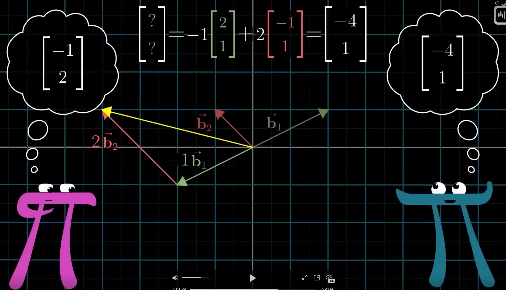
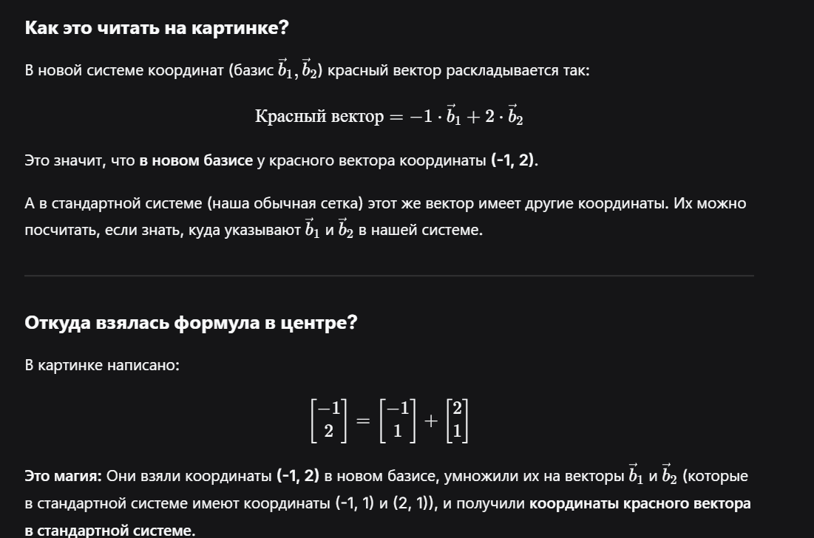
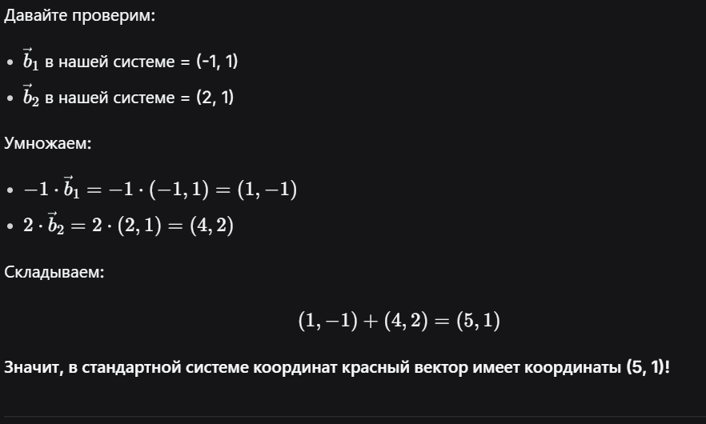

  

*Эта картинка — **смена базиса**?*

*Да, это она. Мы **по-разному смотрим** на систему координат. Для одного человека (в одной системе) вектор имеет одни координаты, а для другого (в повёрнутой системе) — другие.*

*Но мы можем посчитать, где окажется вектор человека в **нашей** системе координат.*

  

 

 

 

 

 

