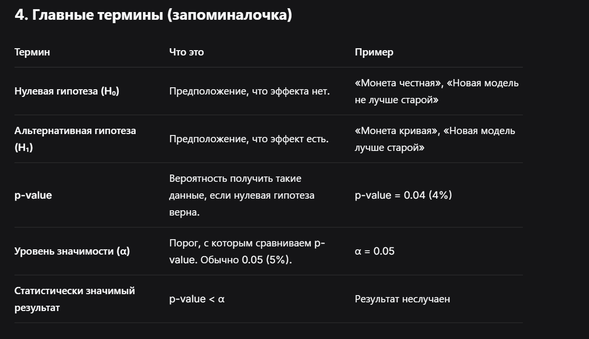

  

## **1. Что такое статистическая значимость (на пальцах)**

**Статистическая значимость** — это ответ на вопрос: *«Это реальный эффект или просто случайность?»*

Представь, что ты подбросил монетку 10 раз, и выпало **8 орлов**.

- Монета честная? Или она кривая?
- Если бы ты подбросил её 100 раз, и выпало 80 орлов — это почти наверняка кривая монета.
- А если 10 раз, и выпало 8 орлов — это может быть просто случайность, такая вероятность есть.

**Статистическая значимость как раз и даёт ответ:** *«Если монета честная, то какова вероятность того, что выпадет 8 орлов из 10?»*

Если эта вероятность **очень маленькая** (обычно меньше 5%), мы говорим: *«Окей, это уже не случайность, монета кривая, результат статистически значим»*.

  

 

  

## **3. Где это в ML (живые примеры)**

  

 

 

 

 

