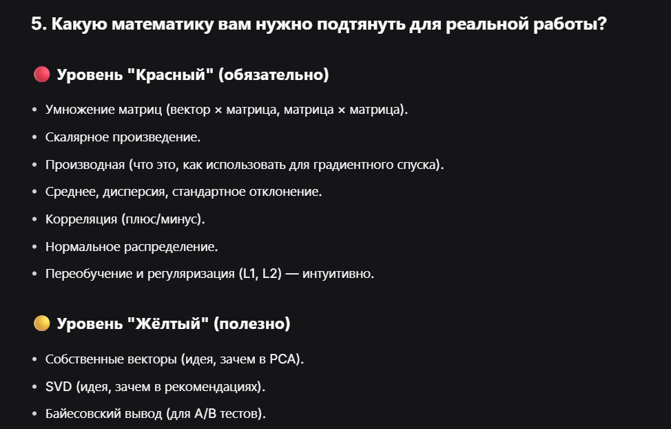

  

## **ЧТО НУЖНО ЗНАТЬ ПО ЛИНЕЙНОЙ АЛГЕБРЕ ML-ИНЖЕНЕРУ**

---

## **ТРИ УРОВНЯ ВАЖНОСТИ: ЧТО УЧИТЬ СЕЙЧАС, А ЧТО ПОТОМ**

Линейная алгебра — фундамент ML, но учить её целиком сразу не нужно. Ниже — разделение по важности **именно для ML**. Полный список тем — в разделах 1–14 ниже.

---

### **Уровень 1. Обязательный минимум (понимать и уметь)**

Это кирпичи, из которых строятся все нейросети.

| Тема | Что знать |
|:---|:---|
| **Вектор и его компоненты** | вектор — просто список чисел (признаки объекта); строка данных в ML — это вектор |
| **Сложение векторов и умножение на скаляр** | база: умножь признаки на веса и сложи — это и есть работа одного нейрона |
| **Линейная комбинация** $c_1\mathbf{v}_1 + \ldots + c_n\mathbf{v}_n$ | основа всей модели: предсказание линейной регрессии — линейная комбинация признаков и весов |
| **Матрицы и умножение матриц** | матрица = датасет (строки — объекты, столбцы — признаки); умножение на вектор применяет преобразование ко всем объектам сразу |
| **Стандартный базис** $\mathbf{i} = (1,0)$, $\mathbf{j} = (0,1)$ | любой вектор собирается из базисных; это понимание размерности пространства признаков |

---

### **Уровень 2. Важно понимать концептуально (считать вручную не обязательно)**

Помогает понять, **почему** модели работают именно так.

| Тема | Зачем |
|:---|:---|
| **Линейная зависимость / независимость** | если признаки зависимы (рост в см и в дюймах) — модель учится плохо; это **мультиколлинеарность**, понимание помогает чистить данные |
| **Линейная оболочка (span)** | два вектора дают плоскость, третий вне неё — объём; это про то, сколько информации вмещают данные |
| **Линейные преобразования** (повороты, растяжения) | матрица — это **действие**: слои нейросети искажают пространство признаков, чтобы разделить классы |
| **Определитель** | это масштабный коэффициент; $\det = 0$ — матрица «схлопывает» пространство, обратной не существует |

---

### **Уровень 3. Можно использовать как «чёрный ящик»**

Вызывается одной строкой в коде, но полезно знать, что внутри.

| Тема | Что знать |
|:---|:---|
| **Единичная и обратная матрица** | $I$ — аналог «1»; $A^{-1}$ — аналог «1/x» |
| **Решение $A\mathbf{x} = \mathbf{b}$** через обратную матрицу | ровно задача про бургеры: составили $A\mathbf{x} = \mathbf{b}$, находим $\mathbf{x}$ |
| **В коде** | вручную обратную матрицу не считают: `np.linalg.solve(A, b)` делает это эффективнее |

---

### **Что пока можно НЕ учить**

- Сложные ручные вычисления определителей (формула Крамера, разложение по минорам).
- Точные формулы поворота на 90°.
- Доказательства линейной независимости через $\alpha_1\mathbf{v}_1 + \alpha_2\mathbf{v}_2 = 0$.

---

### **Главный вывод для ML**

> Не нужно быть **калькулятором** — нужно быть **архитектором**.
>
> - **Данные** = векторы (списки чисел).
> - **Модель** = матрицы (наборы весов).
> - **Обучение** = поиск таких матриц $A$, чтобы $A\mathbf{x}$ было максимально близко к правильному ответу $\mathbf{b}$.

Всё остальное — инструменты для достижения цели, и в 99% случаев они уже запрограммированы за тебя в `numpy`, `pytorch` или `tensorflow`.

---

### **1. ВЕКТОРЫ (ОСНОВА)**

- Что такое вектор (набор чисел / стрелка в пространстве).
- Сложение векторов (покоординатно).
- Умножение вектора на число (скаляр).
- Длина (норма) вектора: ∣v∣=v12+v22+...∣*v*∣=*v*12​+*v*22​+...​.
- Нормализация вектора (делим на длину, чтобы длина стала = 1).

---

### **2. СКАЛЯРНОЕ ПРОИЗВЕДЕНИЕ (DOT PRODUCT) — ГЛАВНАЯ ОПЕРАЦИЯ**

- Как считать: перемножаем координаты попарно и складываем.
- a⋅b=a1b1+a2b2+...*a*⋅*b*=*a*1​*b*1​+*a*2​*b*2​+...
- Геометрический смысл: **похожесть** двух векторов (проекция одного на другой).
- Если скалярное произведение = 0 → векторы перпендикулярны (независимы).
- Где используется: **каждый нейрон** внутри сети делает скалярное произведение весов и входа: output=W⋅X+b*output*=*W*⋅*X*+*b*.

---

### **3. МАТРИЦЫ**

- Что такое матрица (таблица чисел / набор векторов-столбцов).
- **Умножение матрицы на вектор** — главное преобразование в ML (входной слой → скрытый слой).
- **Умножение матрицы на матрицу** — композиция преобразований (несколько слоёв нейросети).
- Правило размерностей: Am×n⋅Bn×k=Cm×k*Am*×*n*​⋅*Bn*×*k*​=*Cm*×*k*​ (внутренние размерности должны совпадать).

---

### **4. ЕДИНИЧНАЯ МАТРИЦА (I)**

- Матрица с 1 на диагонали и 0 везде.
- При умножении на неё ничего не меняется: A⋅I=A*A*⋅*I*=*A*, I⋅A=A*I*⋅*A*=*A*.
- Это аналог числа 1 для матриц.

---

### **5. ОПРЕДЕЛИТЕЛЬ (DET) — ПЛОЩАДЬ / ОБЪЁМ**

- Обозначение: det⁡(A)det(*A*).
- Геометрический смысл: во сколько раз матрица растягивает или сжимает пространство.
- Если det⁡(A)=0det(*A*)=0 → пространство **схлопнулось** (потеряна размерность), обратной матрицы нет.
- Для 2×2: det⁡=a⋅d−b⋅cdet=*a*⋅*d*−*b*⋅*c*.

---

### **6. ОБРАТНАЯ МАТРИЦА (A⁻¹) — КНОПКА UNDO**

- Если A*A* — преобразование, то A−1*A*−1 — обратное преобразование.
- A⋅A−1=I*A*⋅*A*−1=*I*.
- **Существует только для квадратных матриц с det⁡≠0det=0**.
- В ML почти не используется, потому что данные неквадратные.

---

### **7. РАНГ (RANK) — СКОЛЬКО ОСЕЙ ВЫЖИЛО**

- Ранг = количество независимых столбцов (или строк).
- Если ранг меньше размерности → информация потеряна (есть коллинеарность).
- В ML: низкий ранг → признаки дублируются → можно удалить лишние.

---

### **8. СИСТЕМЫ ЛИНЕЙНЫХ УРАВНЕНИЙ**

- Что такое система вида A⋅x=b*A*⋅*x*=*b*.
- В ML это: входные данные × веса = предсказания.
- Как решать: через **псевдообратную матрицу** (np.linalg.pinv) или **градиентный спуск**.

---

### **9. НЕКВАДРАТНЫЕ МАТРИЦЫ (СМЕНА РАЗМЕРНОСТИ)**

- Матрица 3×2: 2 вектора в 3D-пространстве (плоскость в объёме).
- Матрица 2×3: 3 вектора в 2D-пространстве (один лишний).
- Обратной матрицы нет (нельзя отменить потерю / создание измерения).

---

### **10. ПРОСТРАНСТВО СТОЛБЦОВ (COLUMN SPACE) — КУДА ПРИЛЕТАЮТ ВЕКТОРЫ**

- Множество всех возможных результатов умножения матрицы на вектор.
- Если матрица 3×2 → пространство столбцов — это плоскость в 3D.
- Ранг = размерность пространства столбцов.

---

### **11. НУЛЬ-ПРОСТРАНСТВО (NULL SPACE) — ЧТО ПАДАЕТ В НОЛЬ**

- Множество векторов, которые после умножения на матрицу становятся нулевым вектором.
- Появляется, когда пространство схлопывается (det = 0).

---

### **12. СМЕНА БАЗИСА (CHANGE OF BASIS)**

- Один и тот же вектор можно записать по-разному в разных системах координат.
- Матрица перехода переводит координаты из одного базиса в другой.
- Где используется: **PCA**, эмбеддинги, скрытые слои нейросетей.

---

### **13. СОБСТВЕННЫЕ ВЕКТОРЫ И СОБСТВЕННЫЕ ЗНАЧЕНИЯ (EIGEN)**

- Собственный вектор: вектор, который не меняет направление при применении матрицы.
- Собственное значение: число, показывающее, во сколько раз этот вектор растянулся/сжался.
- Где используется: **PCA**, спектральная кластеризация, SVD.
- **Как считать руками — НЕ НУЖНО!** В коде: 

  ```javascript
  np.linalg.eig()
  ```

  .

---

### **14. СИНГУЛЯРНОЕ РАЗЛОЖЕНИЕ (SVD) — ДЛЯ ПРЯМОУГОЛЬНЫХ МАТРИЦ**

- Обобщение собственных векторов для любых матриц (не только квадратных).
- Разложение: A=U⋅Σ⋅VT*A*=*U*⋅Σ⋅*VT*.
- Где используется: **рекомендательные системы**, сжатие данных, LSA (латентно-семантический анализ), шумоподавление.
- **Как считать руками — НЕ НУЖНО!** В коде: 

  ```javascript
  np.linalg.svd()
  ```

  .

  

 


