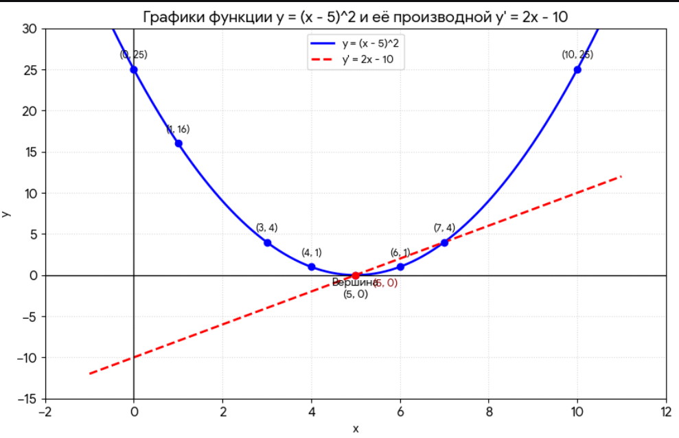

# Полный конспект по функции $y = (x - 5)^2$

## 1. Основные правила

1. **Чтобы узнать ошибку:** подставляем $x$ в функцию $y = (x - 5)^2$ → получаем число (ошибку).
2. **Ошибка не говорит,** куда идти.
3. **Чтобы узнать направление:** считаем производную, подставляя $x$:

$$
y' = 2 \cdot (x - 5)
$$

4. **Производная показывает:** в какую сторону двигаться (знак $+$ или $-$).

---

## 2. Свойства функции $y = (x - 5)^2$

- Это **парабола** (чашка, которая смотрит вверх).
- Её **дно (вершина)** находится в точке $x = 5$.
- В этой точке **ошибка = 0** (потому что $(5 - 5)^2 = 0^2 = 0$).
- Если x
  eq 5, то ошибка **всегда положительная** (потому что квадрат любого числа $\ge 0$).

---

## 3. Почему в реальном ML всё сложнее?

В реальном ML мы можем не знать точку, в которой у нас будет минимум, так как в тренировочной функции для

$$
y = (x - 5)^2
$$

легко понять, что при $x = 5$:

$$
y = 25 - 10x + 25 = 25 - (10 \cdot 5) + 25 = 0
$$

А вот для такой функции:

$$
\text{Loss} = \frac{1}{N} \cdot \sum (w_1 \cdot x_1 + w_2 \cdot x_2 + \dots + w_{1000000} \cdot x_{1000000} - y)^2
$$

Ты не можешь просто посмотреть и сказать: *"Ага, минимум в точке* $w_1 = 0.5$*,* $w_2 = 1.2$*..."*

**Мы начинаем с любого случайного числа, проверяем ошибку, смотрим на производную — и делаем шаг в правильном направлении. И так до тех пор, пока не придем в минимум.**

---

## 4. Итог (самое важное)

- **Простая функция (тренировка)**
  - Мы видим минимум
  - Можем сразу сказать ответ
  - Производная не очень нужна
  - Производная просто подтверждает нашу догадку
- **Сложная функция (реальный ML)**
  - Минимум не виден
  - Не можем сразу сказать ответ
  - Без производной — никак
  - Производная — единственный способ узнать направление

**Пример:** как мы уже считали координаты для производной и для функции — вот [тут](https://ivan-valuchev.yonote.ru/doc/raschet-proizvodnoj-lVkdf0l90h) (Якорь 1122).

Чтобы не тратить время на расчеты, сразу построил график:

 

---

## 5. Пошаговый алгоритм

### Шаг 1: Берём любое число (вслепую)

Допустим, я выбрал: $x = 10$ (справа от дна; в реальном мире мы не знаем, где дно, но для визуализации понятно, так как для тренировки мы знаем, что в $x = 5$ будет дно).

**Проверяем ошибку:**

$$
y = (10 - 5)^2 = 25
$$

Ошибка большая ($25$) → мы далеко от дна.

**Считаем производную:**

$$
y' = 2 \cdot (10 - 5) = 10 \quad (\text{положительная!})
$$

**Что говорит производная?** (правило мы уже записывали [тут](/doc/raschet-proizvodnoj-lVkdf0l90h), якорь 1511)

- Положительная → мы справа от минимума → надо идти **влево** (уменьшать $x$).

---

### Шаг 2: Делаем шаг (например, уменьшаем на $0.5$)

$x = 9.5$ (справа от дна)

**Проверяем ошибку:**

$$
y = (9.5 - 5)^2 = 4.5^2 = 20.25 \quad (\text{уменьшилась! } 25 \to 20.25)
$$

**Считаем производную:**

$$
y' = 2 \cdot (9.5 - 5) = 9 \quad (\text{всё ещё положительная})
$$

**Что говорит производная?**

- Всё ещё положительная → продолжаем идти **влево**.

---

Допустим, что мы решили взять:

$x = 2$ (слева от дна)

- Ошибка:

  $$
  y = (2 - 5)^2 = (-3)^2 = 9
  $$

  (большая ошибка).
- Производная:

  $$
  y' = 2 \cdot (2 - 5) = 2 \cdot (-3) = -6
  $$

  (ОТРИЦАТЕЛЬНАЯ!).
- **Вывод:** $y' < 0$ → нужно **увеличить** $x$ (идти вправо).
- Делаем шаг: например, $x = 3$. Ошибка:

  $$
  (3 - 5)^2 = 4
  $$

  (уменьшилась!).
- **Итог:** мы идём к дну (к $x = 5$).

---

$x = 5$ (дно)

- Ошибка:

  $$
  y = (5 - 5)^2 = 0
  $$

  (идеально!).
- Производная:

  $$
  y' = 2 \cdot (5 - 5) = 0
  $$
- **Вывод:** $y' = 0$ → **останавливаемся**. Дальше двигаться некуда — мы на самом дне.

---

### Если начать с $x = 0$ (слева от минимума)

- Ошибка:

  $$
  (0 - 5)^2 = 25
  $$
- Производная:

  $$
  2 \cdot (0 - 5) = -10 \quad (\text{отрицательная!})
  $$
- Производная говорит: *"Иди **вправо**"*.

---

## 6. Шаг 3: Повторяем много раз

| Шаг | $x$ | Ошибка | Производная | Действие |
|:---:|:---:|:---:|:---:|:---|
| 0 | $10$ | $25$ | $+10$ | Идём влево |
| 1 | $9.5$ | $20.25$ | $+9$ | Идём влево |
| 2 | $9.0$ | $16$ | $+8$ | Идём влево |
| 3 | $8.0$ | $9$ | $+6$ | Идём влево |
| ... | ... | ... | ... | ... |
| N | $5.0$ | $0$ | $0$ | СТОП! |

---

# Почему это работает даже для сложных функций?

В реальном ML:

- Мы тоже **начинаем со случайных чисел** (инициализируем веса случайно).
- Мы тоже **не знаем**, где минимум.
- Мы тоже **смотрим на производную** (градиент).
- И тоже **делаем шаги**, пока ошибка не станет маленькой.

## Разница только в том, что:

- В простой функции мы видим минимум ($x = 5$).
- В сложной — минимум **не видно**, но производная всё равно работает так же!

