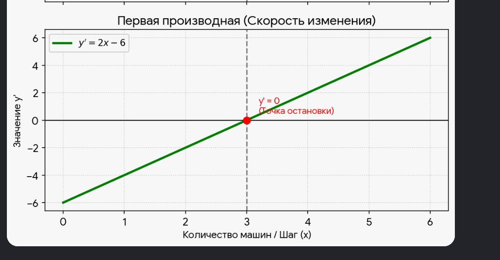

# Расчет идеальной цены на кофе

## Исходные данные

Ты открываешь точку по продаже кофе с собой.

- Себестоимость одного стаканчика кофе (зерна, молоко, стаканчик, сироп) составляет **100 рублей**.
- Розничную цену стаканчика мы снова обозначаем как $x$.

Маркетологи посчитали спрос:

- Если продавать кофе по себестоимости ($x = 100$), то за месяц придет **2000 человек**.
- Но каждые лишние 10 рублей надбавки отпугивают клиентов. На каждые $+10$ рублей к цене спрос падает на 100 человек.

Упрощенная формула спроса (количество покупателей в месяц) получилась такой:

$$
2000 - 10 \cdot (x - 100) = 3000 - 10x
$$

---

## Шаг 1: Функция общей чистой прибыли

Чистая прибыль с одного стаканчика — это розничная цена минус себестоимость:

$$
x - 100
$$

Общее количество покупателей (спрос) при цене $x$:

$$
3000 - 10x
$$

Перемножаем эти две величины, чтобы получить общую чистую прибыль $y$:

$$
y = (x - 100) \cdot (3000 - 10x)
$$

Раскрываем скобки пошагово:

1. Умножаем $x$ на каждое слагаемое во второй скобке:

   $$
   x \cdot 3000 - x \cdot 10x = 3000x - 10x^2
   $$
2. Умножаем $-100$ на каждое слагаемое во второй скобке:

   $$
   -100 \cdot 3000 + (-100) \cdot (-10x) = -300000 + 1000x
   $$
3. Складываем полученные части:

   $$
   y = 3000x - 10x^2 - 300000 + 1000x
   $$
4. Приводим подобные слагаемые ($3000x + 1000x = 4000x$):

   $$
   y = -10x^2 + 4000x - 300000
   $$

Итак, функция общей чистой прибыли:

$$
\boxed{y = -10x^2 + 4000x - 300000}
$$

---

## Шаг 2: Первая производная и оптимальная цена

Находим первую производную $y'$ от функции $y = -10x^2 + 4000x - 300000$:

- Производная от $-10x^2$ равна $-20x$.
- Производная от $4000x$ равна $4000$.
- Производная от константы $-300000$ равна $0$.

Получаем:

$$
y' = -20x + 4000
$$

Чтобы найти точку максимума (идеальную цену), приравниваем производную к нулю:

$$
-20x + 4000 = 0
$$

Решаем уравнение:

1. Переносим $4000$ в правую часть:

   $$
   -20x = -4000
   $$
2. Делим обе части на $-20$:

   $$
   x = \frac{-4000}{-20} = 200
   $$

Итак, идеальная розничная цена стаканчика кофе:

$$
\boxed{x = 200 \text{ рублей}}
$$

---

## Шаг 3: Вторая производная и проверка знака

Находим вторую производную $y''$ от $y' = -20x + 4000$:

- Производная от $-20x$ равна $-20$.
- Производная от константы $4000$ равна $0$.

Получаем:

$$
y'' = -20
$$

**Знак:** $y'' = -20$ — это **отрицательное** число (минус).

**Что это гарантирует:**
Отрицательная вторая производная означает, что функция $y$ является **выпуклой вверх** (вогнутой). В точке, где $y' = 0$ (при $x = 200$), мы имеем не просто экстремум, а именно **максимум** прибыли. То есть цена 200 рублей действительно дает наибольшую общую чистую прибыль среди всех возможных цен.

---

## Итоговый ответ

Функция прибыли:

$$
y = -10x^2 + 4000x - 300000
$$

Оптимальная цена:

$$
x = 200 \text{ рублей}
$$

Вторая производная:

$$
y'' = -20 < 0
$$

Отрицательный знак подтверждает, что найденная цена соответствует **максимуму** прибыли.

$$
\boxed{y = -10x^2 + 4000x - 300000, \quad x_{\text{опт}} = 200, \quad y'' = -20 < 0 \Rightarrow \text{максимум}} 
$$

 

  

