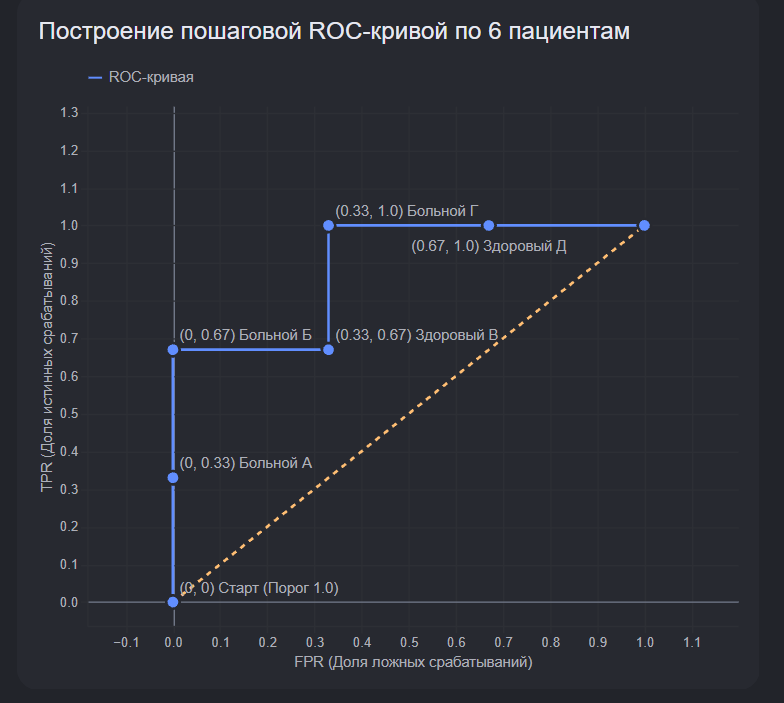

*(По [статье Яндекс.Хендбука 3.2](https://education.yandex.ru/handbook/ml/article/metriki-klassifikacii-i-regressii). Стиль: подробный, с аналогиями, пошаговыми расчётами и интуитивным объяснением)*

---

## 0. План параграфа

Сегодня разберём:

1. Чем **метрика** отличается от **функции потерь (loss)**
2. Метрики **бинарной классификации** — accuracy, confusion matrix, precision, recall, F1
3. Метрики для **вероятностей** — порог, калибровка, ROC, AUC, PR-AUC, Average Precision
4. Метрики **многоклассовой** классификации — micro vs macro
5. Метрики **регрессии** — MSE, RMSE, R², MAE, MAPE и др.
6. Как **оптимизировать** метрики, если их нельзя напрямую минимизировать

---

# ЧАСТЬ 1. ОСНОВЫ

---

## 1. Зачем вообще нужны метрики?

Модель почти всегда **ошибается** — даже идеальная модель упрётся в шум в данных. Разные модели ошибаются **по-разному**: одна пропускает больных, другая — лишний раз пугает здоровых.

**Задача ML-инженера** — выбрать **критерий качества (метрику)**, который отражает то, что реально важно в вашей задаче.

> *«Гораздо легче что-то измерить, чем понять, что именно вы измеряете.»* — Джон Уильям Салливан

---

### Примеры из жизни

| Задача | Что на самом деле важно |
|:---|:---|
| Сколько бананов привезти | Не переполнить склад и не остаться без товара |
| Диагностика болезни | Не пропустить больного (или не напугать здорового) |
| Поисковая выдача | Найти релевантные документы среди миллиардов |
| Удержание клиентов | Правильно **упорядочить** клиентов по риску ухода |

---

### Офлайн vs онлайн метрики

| Тип | Когда считаем | Пример |
|:---|:---|:---|
| **Офлайн** | До запуска, на исторических данных | Accuracy на test, AUC, MAE |
| **Онлайн** | На работающей системе | Длина сессии, доход, CTR |

В этом параграфе — **офлайн-метрики**.

---

## 2. Loss ≠ метрика качества

> **Главная путаница** — не смешивай то, на чём **учим**, и то, по чему **оцениваем**.

**Loss** — функция, по которой модель **учится** (градиент, backprop, SGD).

**Метрика** — число, по которому ты **сравниваешь модели** и говоришь «годится / не годится».

Они часто **разные**, и это нормально.

### Схема train → validation → test: где loss, где метрика, где порог

```text
TRAIN
┌──────────────────────────────┐
│ LOSS = log loss / MSE        │ ← считаем на каждом шаге
│ (на вероятностях / логитах)   │   и минимизируем градиентом
└──────────────────────────────┘
               │
               ▼
VALIDATION (настройка)
┌──────────────────────────────┐
│ МЕТРИКА = F1 / Recall / AUC  │ ← сравниваем модели,
│ ПОДБОР ПОРОГА: перебираем p  │   выбираем гиперпараметры
│ ФИКСИРУЕМ ЛУЧШЕЕ ЗНАЧЕНИЕ    │ ← порог живёт здесь, не в train
└──────────────────────────────┘
               │
               ▼
TEST (финальная проверка)
┌──────────────────────────────┐
│ МЕТРИКА с уже выбранным      │ ← один прогон, честный отчёт
│ порогом (F1 / Recall / AUC)  │
│ Никакой настройки!           │
└──────────────────────────────┘
```

|    | Loss | Метрика |
|:---|:---|:---|
| **Когда** | Каждый шаг **обучения** | **После** обучения, на val / test |
| **Зачем** | Крутить веса (нужна гладкость) | Выбрать модель, отчитаться бизнесу |
| **Зависит от** | Параметров $w$ + предсказаний | Только итоговых предсказаний и меток |
| **Классификация** | Log loss на **вероятностях / логитах** | F1 / Recall / AUC на **метках** 0/1 |
| **Регрессия** | MSE (часто = метрика) | MSE, MAE, R², MAPE… |

---

### Почему они разные

**Loss** должен быть удобным для **обучения**:

- дифференцируемый (можно считать градиент);
- гладкий;
- считается **на каждом объекте** и усредняется.

**Метрика** должна отражать **бизнес**:

- может быть недифференцируемой (accuracy, F1);
- может смотреть на **тип** ошибок (FP vs FN);
- часто зависит от **порога** (0/1 после вероятности).

---

### Пример 1. Классификация (самый частый случай)

**Задача:** найти злокачественную опухоль.

#### Loss при обучении — Log Loss

Модель выдаёт **вероятность** $p = 0.73$ «злокачественная».

Log loss штрафует за **уверенность в неправильном ответе**:

- реально злокачественная, модель сказала $p = 0.9$ → маленький штраф;
- реально злокачественная, модель сказала $p = 0.1$ → огромный штраф.

На вход loss идут **вероятности / логиты**, не метки «да/нет».

Модель учится: «не будь уверенно неправа».

#### Метрика после обучения — F1 или Recall

Для отчёта бизнесу нужно: «сколько больных **нашли**» и «сколько ложных тревог».

Берёшь $p = 0.73$, ставишь порог $0.5$ → метка «да».

Считаешь TP, FP, FN → **Recall**, **Precision**, **F1**.

На вход метрики идут **метки 0/1**, не «0.73».

#### Почему не учить сразу на F1?

F1 — ступенька: чуть сдвинул веса → F1 не меняется → градиент «не видит», куда крутить.

Log loss гладкий → обучение работает.

**Схема:**

```
Обучение:   минимизируем log loss на train
                ↓
Validation: перебираем порог, смотрим F1 / Recall
                ↓
Test:       финальная метрика для отчёта
```

Loss говорит модели **«как учиться»**. Метрика говорит тебе **«какую модель отдать в прод»**.

---

### Пример 2. Одна задача — разные loss и метрика

Два классификатора на **одних и тех же** test-данных:

| Модель | Log loss (↓ лучше) | F1 (↑ лучше) |
|:---|:---:|:---:|
| A | **0.25** | 0.70 |
| B | 0.30 | **0.85** |

- **Модель A** лучше по loss (вероятности «красивее»).
- **Модель B** лучше по F1 (после порога — полезнее для задачи).

Если смотреть **только** на loss при выборе модели — можно взять не ту.

---

### Пример 3. Регрессия — loss и метрика часто совпадают

**Задача:** предсказать цену квартиры.

**Обучение:** loss = **MSE** — средний квадрат ошибки.

Минимизируешь MSE → градиент есть → обучение идёт.

**Оценка:** часто смотришь **тот же MSE** или **RMSE** (= $\sqrt{\text{MSE}}$, в тех же единицах — «млн ₽»).

Loss ≈ метрика → путаницы меньше.

**Но метрика может быть другой** — и это нормально. Обучил на MSE, а бизнес спросил:

- «ошибка в **процентах**» → **MAPE**;
- «устойчивее к выбросам» → **MAE**;
- «лучше ли среднего» → **R²**.

MSE минимизировал при обучении, MAPE показал заказчику — **это нормально**.

---

### Аналогия

- **Loss** — ежедневные домашки: как ты **учишься** (много мелких шагов, гладкая обратная связь).
- **Метрика** — экзамен: **итог**, который важен (может быть другой формат — эссе вместо тестов с галочками).

Можно хорошо делать домашки (низкий loss) и плохо сдать экзамен (плохая метрика на test) — если «экзамен» измеряет другое.

---

### Одна фраза на запоминание

> **Loss — для градиента. Метрика — для решения «катим в прод или нет».**

- В **классификации** почти всегда: учим на **log loss**, оцениваем **F1 / AUC / Recall**.
- В **регрессии** часто: учим на **MSE**, оцениваем **MSE** или **MAE + R²**.

---

### Закрепи §2 (закрой и ответь своими словами)

1. Чем **loss** отличается от **метрики**? Когда какую используем?
2. Почему в классификации почти никогда не учат напрямую на F1 / accuracy?
3. Модель A: log loss = 0.20, F1 = 0.60. Модель B: log loss = 0.35, F1 = 0.90. Какую возьмёшь для диагностики рака и **почему**?
4. В регрессии обучили на MSE. Можно ли показать бизнесу MAPE? Это нормально или ошибка?
5. Нарисуй схему: train → … → validation → … → test. Где loss, где метрика, где порог?

> Если 4–5 из 5 отвечаешь уверенно — §2 усвоен. Слабое место → перечитай примеры 1–3 выше.

---

---

---

# ЧАСТЬ 2. БИНАРНАЯ КЛАССИФИКАЦИЯ

---

## 3. Бинарная классификация: метки классов

### 3.1. Постановка

Выборка $(x_i, y_i)$, где $y_i \in {0, 1}$.

| Обозначение | Смысл |
|:---|:---|
| **Положительный (+)** | То, что **ищем** (болезнь, мошенник, релевантный документ) |
| **Отрицательный (−)** | Всё остальное |

Ищем «иголку в стоге сена» — редкое событие в большом потоке.

---

### 3.2. Accuracy — первая метрика «на пальцах»

> **Шкала:** от **0** до **1** (или 0–100%). **1 = идеально** (все угадали), **0 = всё наоборот**. Чем ближе к 1 — тем лучше. Но высокое число само по себе не гарантия (см. дисбаланс ниже).

**Формула:**

$$
\text{Accuracy} = \frac{TP + TN}{TP + TN + FP + FN}
$$

**Error rate** (доля ошибок):

$$
\text{Error rate} = 1 - \text{Accuracy} = \frac{FP + FN}{\text{всего}}
$$

---

#### Пример: больница (100 пациентов)

> **К чему пример:** показать, что accuracy = 85% звучит красиво, но не говорит, *какие* ошибки внутри.

|    | Реально БОЛЕН | Реально ЗДОРОВ | Всего |
|:---|:---:|:---:|:---:|
| Модель: «БОЛЕН» | **TP = 40** | FP = 10 | 50 |
| Модель: «ЗДОРОВ» | FN = 5 | **TN = 45** | 50 |
| **Всего** | 45 | 55 | **100** |

$$
\text{Accuracy} = \frac{40 + 45}{100} = 85\%
$$

> **85% звучит хорошо**, но среди 15 ошибок:
>
> - 5 **пропущенных больных** (FN)
> - 10 **ложных тревог** (FP)
>
> Для смертельной болезни это может быть катастрофой.

**Эти же цифры дальше:** Precision = 40/50 = 80%, Recall = 40/45 ≈ 89%, F1 ≈ 0.84 — одна таблица на весь §3–6.

---

### 3.3. Почему accuracy обманчива

**Проблема 1: дисбаланс классов**

Больных 1%, здоровых 99% → модель «всем здоров» → **accuracy ≈ 99%**, но **0 больных найдено**.

**Проблема 2: разная цена ошибок**

| Ошибка | Что это | Пример |
|:---|:---|:---|
| **FP** | Сказали «да», а «нет» | Здоровому — диагноз рака |
| **FN** | Сказали «нет», а «да» | Пропустили опухоль |

Accuracy **не различает** FP и FN.

При сильном дисбалансе иногда смотрят **balanced accuracy** (среднее recall по классам) — она не даст 99% модели «всем здоров».

---

## 4. Confusion Matrix (матрица ошибок)

### 4 исхода — запомни раз и навсегда

| Ситуация | Аббревиатура | Смысл |
|:---|:---|:---|
| Предсказали +, угадали | **TP** | True Positive |
| Предсказали +, ошиблись | **FP** | False Positive — ложная тревога |
| Предсказали −, угадали | **TN** | True Negative |
| Предсказали −, ошиблись | **FN** | False Negative — пропустили |

---

### Таблица (как в sklearn)

|    | **Pred +** | **Pred −** |
|:---|:---:|:---:|
| **Real +** | TP | FN |
| **Real −** | FP | TN |

---

> **Мнемоника**
>
> 1. Первая буква — **угадали** (T) или **ошиблись** (F)?
> 2. Вторая буква — **что предсказали** (P или N)?
>
> FN = предсказали **Negative**, но человек **Positive**.

---

### Пример: рак груди (breast_cancer)

> **К чему этот пример:** показать, что «меньше ошибок всего» ≠ «лучшая модель». Сначала решаем, что страшнее — FP или FN, потом выбираем.

**Постановка:** `+` = злокачественная, `−` = доброкачественная. Сравниваем 3 модели на одном test.

---

**1) Dummy (всегда «доброкачественный») — baseline «глупая модель»**

|    | Pred + | Pred − |
|:---|:---:|:---:|
| Real + | TP = 0 | **FN = 53** |
| Real − | FP = 0 | TN = 90 |

- Никому не говорит «рак» → FP = 0, но **все 53** злокачественные пропущены.
- Accuracy ≈ 90/143 ≈ 63% — не ноль, но для врачей модель **бесполезна**.
- **Зачем Dummy:** любая нормальная модель должна быть лучше этой планки.

---

**2) Random Forest**

|    | Pred + | Pred − |
|:---|:---:|:---:|
| Real + | TP = 52 | FN = 1 |
| Real − | FP = 4 | TN = 86 |

- Нашла 52 из 53 больных, пропустила **1**.
- Зря напугала **4** здоровых.
- Всего ошибок: $1 + 4 = 5$.

---

**3) Линейный SVM — метод опорных векторов (с нормализацией признаков!)**

|    | Pred + | Pred − |
|:---|:---:|:---:|
| Real + | TP = 50 | FN = 3 |
| Real − | FP = 1 | TN = 89 |

- Пропустила **3** больных, зря напугала только **1**.
- Всего ошибок: $3 + 1 = 4$ — **меньше**, чем у леса.
- Нормализация нужна, иначе SVM на сырых признаках часто «ломается».

---

**Сравнение Random Forest vs SVM:**

| Модель | Ошибок всего | FP (ложная тревога) | FN (пропуск рака) |
|:---|:---:|:---:|:---:|
| Random Forest | 5 | 4 | **1** |
| SVM | **4** | **1** | 3 |

**Вывод для этой задачи (рак):** важнее не пропустить злокачественную → смотрим на **FN** → **лучше Random Forest** (1 пропуск против 3), хотя ошибок всего у неё больше.

**А если бы задача была другая?** Запуск спутника: FP = «сказали можно лететь, а погода убьёт миссию» — там важнее уменьшить FP → выиграл бы **SVM**.

> **Запомни:** матрицы нельзя сравнить «A > B». Сначала цена ошибок (FP vs FN), потом выбор. Одно число (accuracy) удобно, но **теряет детали**.

---

## 5. Precision и Recall

Когда accuracy не подходит → смотрим **две отдельные метрики**.

---

### ⚠️ «Точность» ≠ accuracy — как не путать с precision

В русском языке слово **«точность»** часто переводят **и** accuracy, **и** precision. Это главный источник путаницы.

|    | Accuracy | Precision |
|:---|:---|:---|
| **По-русски иногда** | «точность», «доля верных» | тоже «точность» |
| **По-английски** | **Accuracy** | **Precision** |
| **Вопрос** | «Сколько **всего** угадали?» | «Если сказали „да“ — **можно верить**?» |
| **Формула** | $\frac{TP+TN}{\text{все}}$ | $\frac{TP}{TP+FP}$ |
| **Смотрит на** | Все объекты | Только те, кому модель сказала «+» |

**Пример путаницы:**

> «Модель имеет точность 90%» — это **accuracy** (9 из 10 ответов верны)
>
> или **precision** (9 из 10 «больных» реально больны)?

Это **разные числа** при одних и тех же данных!

**Как не ошибаться:**

1. В разговоре **уточняй**: «accuracy или precision?»
2. В коде смотри на название: `accuracy_score` vs `precision_score`
3. Запомни связку:
   - **Accuracy** = «общая доля правильных»
   - **Precision** = «надёжность положительного ответа»
   - **Recall** = «полнота» (это другое слово, путаницы меньше)

---

### 5.1. Precision (точность)

> **Шкала:** от **0** до **1**. **1 = идеально** (каждое «да» модели верное), **0 = все «да» ложные**. Чем ближе к 1 — тем лучше.

**Вопрос:** «Если модель сказала **«да»** — можно верить?»

$$
\text{Precision} = \frac{TP}{TP + FP}
$$

**Пример** (та же больница из §3.2: TP=40, FP=10):

$$
\text{Precision} = \frac{40}{50} = 80\%
$$

→ Из 50 диагнозов «болен» только 40 верные: каждый **5-й** — ложный.

**Когда важна:** страшно **обвинить невиновного** (FP) — спам-фильтр, «мошенник», ложный диагноз здоровому.

---

### 5.2. Recall (полнота) = TPR

> **Шкала:** от **0** до **1**. **1 = идеально** (нашли всех реальных «+»), **0 = никого не нашли**. Чем ближе к 1 — тем лучше.

**Вопрос:** «Из всех **реально больных** — скольких **нашли**?»

$$
\text{Recall} = \frac{TP}{TP + FN} = \text{TPR}
$$

**Пример** (та же больница: TP=40, FN=5, больных всего 45):

$$
\text{Recall} = \frac{40}{45} \approx 88.9\%
$$

→ Пропустили **5 из 45** (\~11%).

**Когда важен:** страшно **пропустить опасное** (FN) — рак, фрод, эпидемия.

---

### 5.3. Таблица выбора метрики

| Метрика | Страшнее | Пример |
|:---|:---|:---|
| **Precision** | FP — ложное «да» | Диагноз рака здоровому |
| **Recall** | FN — пропущенное «да» | Пропустить туберкулёз |
| **Accuracy** | Обе одинаково | Сбалансированные классы |

---

> **Золотой вопрос**
>
> «Что хуже: **ложно обвинить** (FP) или **пропустить опасного** (FN)?»

| Ответ | Метрика |
|:---|:---|
| Хуже обвинить | **Precision** |
| Хуже пропустить | **Recall** |
| Одинаково | **Accuracy** |

---

### 5.4. Recall@k и Precision@k

Для **ранжирования** (поиск, топ-k):

> **К чему:** обычные P/R смотрят на **все** ответы модели после порога. Здесь порога часто нет: пользователь видит только **первые k** строк списка по убыванию скора.

- **Precision@k** — какая доля **среди первых k** — релевантные (`+`)
- **Recall@k** — какую долю **всех** релевантных в базе поймали **уже в первых k**

$$
\text{Precision@}k = \frac{\text{число «+» в топ-}k}{k} \qquad
\text{Recall@}k = \frac{\text{число «+» в топ-}k}{\text{всех «+» в базе}}
$$

**Пример (поиск «котики») — тот же, что потом в §8.3:**

в базе **10** фото с котами (`+`). Модель отсортировала по скору:

| Место | Скор | На самом деле |
|:---:|:---:|:---|
| 1 | 0.98 | реклама кроссовок (`−`) |
| 2 | 0.95 | новости про спорт (`−`) |
| 3 | 0.90 | фото кота (`+`) |
| 4 | 0.88 | фото кота (`+`) |
| … | … | … |

Если на экране только **топ‑2** (пользователь почти не листает):

$$
\text{Precision@2} = \frac{0}{2} = 0 \qquad
\text{Recall@2} = \frac{0}{10} = 0
$$

Если смотрим **топ‑4**:

$$
\text{Precision@4} = \frac{2}{4} = 0.5 \qquad
\text{Recall@4} = \frac{2}{10} = 0.2
$$

**Зачем:** важно не «модель вообще умеет отличать котов», а «есть ли коты **в том, что видно на экране**».

> В §8.3 на **этом же** примере: AUC может быть ≈ 0.94 (почти все пары по всему списку правильные), а Precision@k в топе — **0**. AUC ≠ качество верха выдачи.

---

## 6. F1-мера

Одно число из Precision и Recall — **среднее гармоническое**:

$$
F_1 = \frac{2 \cdot P \cdot R}{P + R}
$$

> **Шкала:** от **0** до **1**. **1 = идеально** (и P, и R = 1), **0 = хотя бы одно из P/R = 0**. Чем ближе к 1 — тем лучше. Сравнивай модели **одной** метрикой (все по F1 или все по F₂), не мешай F1 с F₂.

> Гармоническое **жёстче** обычного среднего: P=100%, R=0% → **F1=0%**


**Пример (больница):** P = 0.8, R ≈ 0.889 — это Precision и Recall из таблицы §3.2.

$$
F_1 = \frac{2 \cdot 0.8 \cdot 0.889}{0.8 + 0.889} \approx 0.842
$$

**Зачем:** нужно сравнить 10 моделей одним числом, а Precision и Recall тянут в разные стороны. F1 ≈ 0.84 — «средний» итог по больнице.

### **F-beta**

$$
F_\beta = (1 + \beta^2) \cdot \frac{P \cdot R}{\beta^2 \cdot P + R}
$$

Тоже от **0** до **1**, **1 = идеал**. β только меняет, *за что* сильнее наказывать. **β** — насколько **Recall важнее Precision**:

| $\beta$ | Приоритет | Когда |
|:---|:---|:---|
| $\beta < 1$ | Precision | Страшно ложное «да» (спам-фильтр) |
| $\beta = 1$ | равны → **F1** | Баланс |
| $\beta > 1$ | Recall | Страшно пропустить (эпидемия) |

**Пример с расчётом:** P = 0.8, R = 0.5 (хороший Precision, слабый Recall).

**1) F1** ($\beta = 1$, $\beta^2 = 1$):

$$
F_1 = (1+1)\cdot\frac{0.8\cdot 0.5}{1\cdot 0.8 + 0.5} = 2\cdot\frac{0.4}{1.3} = \frac{0.8}{1.3} \approx 0.615
$$

**2) F2** ($\beta = 2$, $\beta^2 = 4$ — Recall в 2 раза важнее):

$$
F_2 = (1+4)\cdot\frac{0.8\cdot 0.5}{4\cdot 0.8 + 0.5} = 5\cdot\frac{0.4}{3.2 + 0.5} = \frac{2}{3.7} \approx 0.541
$$

**3) F₀.₅** ($\beta = 0.5$, $\beta^2 = 0.25$ — важнее Precision):

$$
F_{0.5} = (1+0.25)\cdot\frac{0.8\cdot 0.5}{0.25\cdot 0.8 + 0.5} = 1.25\cdot\frac{0.4}{0.2 + 0.5} = \frac{0.5}{0.7} \approx 0.714
$$

| Метрика | Значение | Что видно |
|:---|:---:|:---|
| $F_1$ | ≈ 0.62 | Баланс |
| $F_2$ | ≈ 0.54 | Ниже: сильнее **наказывает** низкий Recall |
| $F_{0.5}$ | ≈ 0.71 | Выше: «прощает» низкий Recall, радуется высокому P |

Это **три оценки одной модели** (не три модели). Чем ближе к **1** — тем лучше *в рамках выбранной* метрики. Не сравнивай F₂=0.54 с F₀.₅=0.71 между собой как «кто круче» — разные приоритеты.

На практике чаще всего хватает **F1**. F₂ / F₀.₅ — когда заранее ясно, что FN или FP дороже.

---

## 7. Вероятности и порог

> **К чему раздел:** модель часто выдаёт не «болен/здоров», а число вроде 0.62. Порог τ решает, где резать «да/нет». Одна модель + разные пороги = разные Precision/Recall.

Модель выдаёт **число** → бинаризуем порогом $\tau$:

$$
\hat{y} = \begin{cases} 1, & p(x) \geq \tau \ 0, & p(x) < \tau \end{cases}
$$

### Кто решает: «0.2 — это да или нет?»

Модель **сама не говорит** «да» / «нет». Она говорит только число: $p = 0.2$ = «слабо похож на +».

**«Да/нет» появляется после порога** $\tau$, который выбираешь **ты** (ML-инженер) вместе с бизнесом — на validation. Диапазон не зашит в данные.

| Кто | Что решает |
|:---|:---|
| **Модель** | Выдаёт число (скор / вероятность), обычно от 0 до 1 |
| **Ты / бизнес** | Ставишь порог: «если $\geq \tau$ → да, иначе нет» |
| **Validation** | Перебираешь пороги и смотришь Recall / Precision / F1 |

**Пример:** пациент, модель сказала **0.2**:

| Порог $\tau$ | Решение |
|:---|:---|
| 0.5 | $0.2 < 0.5$ → **нет** (здоров) |
| 0.1 | $0.2 \geq 0.1$ → **да** (болен) |

Одно и то же $0.2$ — при разных правилах разный ответ.

**Откуда «привычный» 0.5:** просто дефолт в коде (`predict` у логрега часто режет по 0.5). Не закон природы. «Не пропустить» → можно 0.2; «ложное да дорого» → 0.7–0.8.

```
данные → обучение модели → скор 0.2
                              ↓
                    ты выбираешь порог τ
                              ↓
                         «да» или «нет»
```

| Порог | Эффект |
|:---|:---|
| Низкий (→ 0) | Recall ↑, FP ↑ (ловим больше больных, больше ложных тревог) |
| Высокий (→ 1) | Precision ↑, FN ↑ (диагнозам больше верим, больше пропусков) |

**Пример:** пациент с $p = 0.62$ — один человек, две политики:

| Порог $\tau$ | Решение | Смысл |
|:---|:---|:---|
| 0.5 | «болен» | Стандарт: $0.62 \geq 0.5$ |
| 0.8 | «здоров» | Строже: $0.62 < 0.8$ → меньше ложных диагнозов, больше пропусков |

Порог **0.5** — не догма. Подбираем на **validation** под нужную метрику (F1, Recall ≥ 0.95 и т.д.).

**Мини-таблица «как выбрать τ»:**

| τ | Recall | Precision | F1 | Когда взять |
|:---:|:---:|:---:|:---:|:---|
| 0.3 | 0.95 | 0.40 | 0.56 | «почти никого не пропустить» |
| 0.5 | 0.80 | 0.70 | **0.75** | баланс / максимум F1 |
| 0.7 | 0.55 | 0.90 | 0.68 | «ложные тревоги очень дороги» |

---

### Когда порог нужно поменять (пример)

**Ситуация:** скрининг редкой болезни. На validation 1000 человек, больных 50.

При **пороге 0.5**:

|    | Значение |
|:---|:---|
| Recall | 0.70 (нашли 35 из 50) |
| Precision | 0.85 |
| F1 | \~0.77 |

Врачи говорят: **«пропуск недопустим — нужен Recall ≥ 0.95»**. Дефолт 0.5 не подходит → перебираем τ на validation:

| τ | Recall | Precision | F1 | Подходит? |
|:---:|:---:|:---:|:---:|:---|
| 0.5 | 0.70 | 0.85 | 0.77 | нет — Recall мало |
| 0.3 | 0.90 | 0.55 | 0.68 | нет — всё ещё < 0.95 |
| **0.2** | **0.96** | 0.40 | 0.56 | **да** — Recall ок |
| 0.1 | 0.99 | 0.25 | 0.40 | тоже ок, но ещё больше ложных тревог |

**Что делаем:** фиксируем **τ = 0.2** (не 0.5), даже если F1 хуже. Цена — больше FP (здоровых отправят на доп. обследование), зато почти никого не пропускаем. Потом **один раз** проверяем на test.

**Обратный пример (спам):** при τ = 0.5 важные письма иногда улетают в спам. Ставим **τ = 0.8** — в спам только «уверенные», Precision ↑, меньше ложных срабатываний.

> **Итог:** порог меняют, когда **0.5 не даёт нужный баланс FP/FN**. Подбор — на validation, проверка — на test.

---

### Если цель — сами вероятности (не метки)

Тогда смотрят на **log loss**:

$$
\text{LogLoss} = -\frac{1}{n}\sum_{i=1}^{n}\Big(y_i\log p_i + (1-y_i)\log(1-p_i)\Big)
$$

> **Шкала (наоборот!):** от **0** вверх, верхнего предела нет. **0 = идеал** (уверенно и правильно). Чем **меньше** — тем лучше. Здесь «ближе к 1» ≠ хорошо.

**Пример:** человек реально болен ($y=1$).

| Модель сказала $p$ | LogLoss на объекте | Смысл |
|:---|:---|:---|
| 0.9 | $-\log 0.9 \approx 0.105$ | Уверенно и правильно — почти не штрафуем |
| 0.5 | $-\log 0.5 \approx 0.693$ | «Не знаю» — средний штраф |
| 0.1 | $-\log 0.1 \approx 2.30$ | Уверенно **неправ** — огромный штраф |

**Зачем:** если продаём вероятность клика/отказа, важна не только метка, но и **калибровка уверенности**.

### Что такое скор (и чем он не является)

**Скор ≠ Accuracy / Precision / F1.**

Метрики считают по **многим** объектам. Скор — ответ модели на **одном** объекте.

#### Цепочка на одном пациенте (логистическая регрессия)

Модель считает сырое число:

$$
z = w_1 x_1 + w_2 x_2 + \ldots + b
$$

Допустим $z = 1.2$ — это **логит** (до сигмоиды).

Потом сигмоида:

$$
p = \frac{1}{1+e^{-1.2}} \approx 0.77
$$

| Шаг | Число | Название |
|:---|:---|:---|
| 1 | $z = 1.2$ | **логит** (частный случай скора) |
| 2 | $p = 0.77$ | вероятность / скор в $[0,1]$ |
| 3 | порог $0.5$ → «болен» | **метка** |
| 4 | так для 100 пациентов → Accuracy, Precision… | **метрики** |

#### Скор vs логит

| Термин | Что это |
|:---|:---|
| **Скор** | Любое число «насколько похож на +» до метки |
| **Логит** | Конкретно сырой выход **до** сигмоиды в логреге / нейросети |

- всякий логит — скор;
- **не** всякий скор — логит.

**Другие модели (скор есть, логита нет):**

| Модель | Пример скора |
|:---|:---|
| Random Forest | 7 из 10 деревьев сказали «+» → скор = 0.7 (доля голосов) |
| SVM | `decision_function` = 2.4 (расстояние до границы) |

#### Трое пациентов — где скор, где метрика

| Пациент | Скор $p$ | Порог 0.5 | Метка | Правда |
|:---|:---:|:---:|:---:|:---:|
| А | 0.77 | ≥ 0.5 | болен | болен ✓ |
| Б | 0.20 | < 0.5 | здоров | здоров ✓ |
| В | 0.60 | ≥ 0.5 | болен | здоров ✗ |

- скоры: `0.77, 0.20, 0.60` — выходы модели;
- Accuracy = 2/3 ≈ 0.67 — уже **метрика по всем**, не скор.

> **Аналогия:** скор = балл ученика (62/100); порог = «сдал, если ≥ 50»; Accuracy = «какой % класса сдал».

---

### Калибровка (скор ≠ вероятность)

> **К чему:** «0.8» от модели не всегда значит «80% шанс». Для ранжирования («кто рискованнее») порядок скоров часто хватает; для фразы «вероятность оттока = 30%» — нужна калибровка.

**Скор** — число «насколько объект похож на +» (выход модели до порога). Это ещё не обязательно честная вероятность: Random Forest, SVM, бустинг часто дают именно скор.

| Вопрос | Скор | Калиброванная вероятность |
|:---|:---|:---|
| «Кто рискованнее?» | Достаточно (порядок) | Не обязательно |
| «Какова вероятность оттока = 0.3?» | Может врать | Нужна калибровка |

---

#### Пример: «кто рискованнее / кому звонить первым»

Сотовый оператор. «+» = клиент **уйдёт** в следующем месяце.

| Клиент | Скор | Смысл |
|:---|:---:|:---|
| А | 0.9 | очень похож на «уйдёт» |
| Б | 0.5 | средний риск |
| В | 0.1 | почти не похож на «уйдёт» |

**Важно:** чем **больше** скор — тем рискованнее (если «+» = плохое событие: отток, фрод, болезнь). Не «меньше число = ненадёжный».

Звоним по **порядку**: сначала А, потом Б, В можно не трогать. Порог «уйдёт/не уйдёт» не обязателен — важен только рейтинг.

Поэтому калибровка тут не критична: даже если «0.9» на деле не 90%, а 60% — А всё равно рискованнее В, порядок тот же.

---

#### Пример: когда нужна калибровка

Бюджет: «у клиента вероятность оттока = 0.3 → заложим 30% риска».

Проверка: берём всех со скором ≈ 0.8 и смотрим, какая доля реально ушла.

| Среди скоров ≈ 0.8 реально ушло | Вывод |
|:---|:---|
| ≈ 80% | калибрована: «0.8» ≈ 80% |
| ≈ 50% | **не калибрована**: говорит 0.8, по сути монетка |

Калибровка (Platt, isotonic…) переводит сырой скор → более честную вероятность.

> Можно хорошо **ранжировать** (А выше В), но врать в **цифрах**. LogLoss / калибровка проверяют числа; качество порядка — отдельно (метрика AUC — в §8 ниже).

**Итог одной фразой:** скор отвечает «кто выше»; калиброванная вероятность — «какой реальный шанс в %».

---

---

# ЧАСТЬ 3. ВЕРОЯТНОСТИ И КРИВЫЕ

---

## 8. TPR, FPR, ROC и AUC

### С чего всё начинается: полная цепочка (от скоров до ROC)

Идеал — всегда говорить больным «болен», здоровым «здоров». На практике модель **не знает правду наверняка**, только угадывает по признакам. Поэтому почти всегда будут и пропуски, и ложные тревоги. Ниже — откуда берётся каждый шаг.

```
1. ПРИЗНАКИ пациента (анализы, возраст…)
           ↓
2. МОДЕЛЬ (логистическая регрессия / лес / SVM…)
           ↓
3. СКОР на каждого человека, например 0.73
   (= «насколько похож на больного»; ещё не «да/нет»)
           ↓
4. СОРТИРОВКА по убыванию скора → рейтинг
   (модель расставила: кто «подозрительнее»)
           ↓
5. ПОРОГ τ (выбираешь ТЫ на validation)
   если скор ≥ τ → метка «болен»
   если скор < τ → метка «здоров»
           ↓
6. CONFUSION MATRIX (TP, FP, TN, FN)
   сравнение меток модели с правдой
           ↓
7. При ОДНОМ пороге:
   TPR, FPR, Precision, Recall, F1, Accuracy
           ↓
8. Перебрали ВСЕ пороги:
   каждая пара (FPR, TPR) = точка → ROC-кривая
           ↓
9. Площадь под ROC = AUC
   (насколько хорошо модель упорядочила больных выше здоровых)
```

#### Кто что делает

| Кто | Что даёт |
|:---|:---|
| **Модель** | только **скоры** (числа) |
| **Сортировка** | рейтинг «кто рискованнее» по скору |
| **Ты (порог τ)** | правило «да/нет» |
| **Confusion Matrix** | типы ошибок при этом пороге |
| **TPR / FPR / …** | числа из матрицы |
| **ROC / AUC** | картина по **всем** порогам сразу |

#### Важно про порядок «сначала больные, потом здоровые»

Это **не** порог их так расставил.

1. Модель выдала скоры → получился **рейтинг**.
2. Порог просто «спускается» по рейтингу сверху вниз: сначала берём людей с самым высоким скором, потом всё более низким.
3. Если модель **хорошая**, сверху рейтинга больные → на ROC сначала шаги **вверх**.
4. Если модель **плохая**, сверху здоровый → сразу шаг **вправо**.

Ошибаться на здоровых (шаг вправо) — **плохо**. «Сначала вверх, потом вправо» значит: ложные тревоги **отложены**, пока не поймали больных — не то, что ошибки полезны.

> Грубо: логрег отдал скоры → ты порогом назвал «болен/здоров» → из ошибок посчитали TPR/FPR → все пороги вместе = ROC.

#### Итог своими словами (проверка понимания)

После настройки модель даёт **скор** (или логит → из него скор/вероятность).

Располагаем всех **от большего скора к меньшему**, выставляем **порог**, считаем метрики, по всем порогам строим **ROC / AUC**.

Бывает и так: у одного больного самый большой скор (он сверху), но у **здорового** скор **больше**, чем у **другого больного** → здоровый в рейтинге **выше** этого больного.

Когда порог дойдёт до этого здорового и мы назовём его «больным» → ложная тревога → на ROC шаг **вправо**.

Когда позже дойдём до «пропущенного» больного → шаг **вверх**.

**Коротко:** выше в списке = больший скор. Сверху здоровый → рано вправо. Сверху больные → сначала вверх.

---

### 8.1. TPR и FPR — два взгляда при одном пороге

После порога $\tau$ уже есть Confusion Matrix: **TP, FP, TN, FN**. Из неё считают TPR и FPR.

**TPR и FPR — не «оценка одного пациента».** У пациента только скор. TPR/FPR — **доли по всей группе** при текущем пороге:

- TPR = сколько больных **уже** поймали / больных всего;
- FPR = скольких здоровых **уже** зря назвали / здоровых всего.

**TPR (true positive rate) = Recall** — из всех **больных** («+») какую долю нашли:

$$
\text{TPR} = \frac{TP}{TP + FN} = \text{Recall}
$$

**FPR (false positive rate)** — из всех **здоровых** («−») какую долю зря напугали:

$$
\text{FPR} = \frac{FP}{FP + TN}
$$

**Пример (больница):** TP=40, FN=5, FP=10, TN=45

$$
\text{TPR} = \frac{40}{45} \approx 0.89 \qquad
\text{FPR} = \frac{10}{55} \approx 0.18
$$

- TPR ≈ 0.89 → поймали **89%** больных (40 из 45).
- FPR ≈ 0.18 → **18%** здоровых получили ложный «болен» (10 из 55).

|    | Смотрит на | Хорошо когда |
|:---|:---|:---|
| **TPR** | реальных «+» | **ближе к 1** |
| **FPR** | реальных «−» | **ближе к 0** |

**Связь с порогом:**

- **снижаешь** $\tau$ → больше людей зовёшь «больными» → TPR ↑ и FPR ↑;
- **повышаешь** $\tau$ → строже «да» → TPR ↓ и FPR ↓.

Компромисс: ловишь больше больных — и больше ложных тревог (или наоборот).

> **Запомни:** TPR и Recall — **одно и то же**. FPR — другое (про здоровых). Precision — ещё третье («можно ли верить „да“?»).

---

### 8.2. ROC-кривая

> **К чему:** TPR ↑ лучше, FPR ↓ лучше. **При снижении** порога оба растут вместе; **при повышении** — оба падают. ROC показывает весь этот компромисс на одном графике.

**Оси:** **X = FPR**, **Y = TPR**. Одна точка = один порог $\tau$. Вся кривая = все пороги.

**Как строится (связь с цепочкой выше):**

1. Модель уже выдала **скоры** всем.
2. Сортируем людей по убыванию скора (рейтинг).
3. Берёшь порог $\tau$ (например 1.0 → 0.9 → … → 0.0) — «отрезаешь» верх рейтинга.
4. При каждом $\tau$ считаешь Confusion Matrix → пару **(FPR, TPR)**.
5. Ставишь точку на графике, соединяешь → **ROC-кривая**.

**Куда «хорошо» на графике:** левый **верхний** угол — FPR ≈ 0 и TPR ≈ 1.

| Вид кривой | Смысл |
|:---|:---|
| Близко к левому верхнему углу | хорошо отделяет «+» от «−» |
| По диагонали | как монетка (AUC = 0.5) |
| Ниже диагонали | хуже случайного (можно инвертировать предсказания) |

| Классификатор | AUC | Смысл |
|:---|:---:|:---|
| Идеальный | **1.0** | Всех больных выше всех здоровых |
| Случайный | **0.5** | Как монетка |
| Плохой | < 0.5 | Хуже случайного (можно инвертировать) |

**Почему нельзя смотреть только на TPR:** при очень низком пороге легко сделать TPR = 1 (всем «болен»), но тогда и FPR = 1. ROC показывает цену: сколько ложных тревог за ещё найденных больных.

---

#### Пример: пошаговая ROC по 6 пациентам

Данные: **3 больных** (А, Б, Г) и **3 здоровых** (В, Д, Е).

Сначала модель дала скоры → сортировка (пример порядка сверху вниз): А, Б, В, Г, Д, Е.

Порог «спускается» по этому списку: больной в списке → шаг **вверх** (+1/3 к TPR); здоровый → шаг **вправо** (+1/3 к FPR).


 

*(файл / скрин: пошаговая ROC — оси TPR–FPR, синяя ломаная, оранжевая диагональ «монетка»)*

| Шаг | Что случилось | Точка (FPR, TPR) | Смысл |
|:---|:---|:---|:---|
| Старт, $\tau=1.0$ | никого не зовём «больным» | (0, 0) | тишина |
| **Больной А** | поймали 1 из 3 больных | (0, **0.33**) | вверх — хорошо |
| **Больной Б** | поймали 2 из 3 | (0, **0.67**) | снова вверх |
| **Здоровый В** | зря напугали 1 из 3 здоровых | (**0.33**, 0.67) | вправо — плохо (но больных уже почти нашли) |
| **Больной Г** | поймали всех 3 больных | (0.33, **1.0**) | вверх — TPR = 1 |
| **Здоровый Д** | ещё ложная тревога | (**0.67**, 1.0) | вправо |
| Финиш, $\tau=0.0$, **Здоровый Е** | всем сказали «болен» | (**1.0**, 1.0) | конец |

**Что видно глазами:** сначала кривая долго идёт **вверх** (А и Б) — модель поставила больных высоко в рейтинге. Потом здоровый В — уходим вправо. Потом больной Г — снова вверх до TPR=1. Дальше только здоровые — ползём вправо до (1,1).

> Хорошая модель: **сначала вверх, потом вправо** (ошибки на здоровых отложены). Плохая: сразу вправо. **AUC** = площадь под синей линией. Без обоих классов (только больные или только здоровые) обычная ROC не строится.

---

---

---

---

### 8.3. AUC

**AUC** = площадь под ROC.

> **Шкала:** обычно от **0.5** до **1** (ниже 0.5 — хуже монетки). **1 = идеально** (все «+» выше всех «−»), **0.5 = случайно**. Чем ближе к 1 — тем лучше.

> **К чему:** Precision/Recall зависят от **одного** порога. AUC смотрит на **все** пороги сразу — «насколько хорошо модель **упорядочивает** + выше −».

> **Интуиция:** доля пар (+, −), которые модель **правильно упорядочила**

$$
\text{AUC} = P\big(\hat{y}(x_+) > \hat{y}(x_-)\big)
$$

**Мини-пример:** 2 больных (скоры 0.9 и 0.4), 2 здоровых (0.7 и 0.2). Всего 4 пары «больной vs здоровый»:

| Пара | Сравнение | Верно? |
|:---|:---|:---|
| 0.9 vs 0.7 | больной выше | да |
| 0.9 vs 0.2 | больной выше | да |
| 0.4 vs 0.7 | больной **ниже** | **нет** |
| 0.4 vs 0.2 | больной выше | да |

$$
\text{AUC} = \frac{3}{4} = 0.75
$$

**Зачем на практике:** сотовый оператор хочет не жёсткое «уйдёт/не уйдёт», а **ранжировать** клиентов по риску и разным людям давать разные акции.

#### Ловушка: высокий AUC, а наверху мусор

Это **продолжение примера «котики» из §5.4** (те же скоры: кроссовки и спорт наверху, коты ниже).

Две разные задачи с **одним** списком скоров:

| Задача | Что делаем | Что важно |
|:---|:---|:---|
| **Классификация** (больница) | скоры → порог τ → метки | TP/FP/FN при выбранном τ |
| **Выдача / топ‑k** (поиск, лента) | скоры → сортировка → первые k | **Precision@k / Recall@k** (§5.4) |

Сортировка **не проверяет**, прав ли скор: больший скор просто выше. Модель **переоценила** мусор → он наверху. В §5.4 уже считали: **Precision@2 = 0**, **Recall@2 = 0**.

**Почему AUC при этом может быть ≈ 0.94:** AUC смотрит не на топ‑2, а на **все** пары (+, −) по всему списку. Дорисуем хвост того же рейтинга:

- 10 релевантных (`+`), 90 мусорных (`−`);
- места **1–5** = мусор (в т.ч. кроссовки и спорт), **6–15** = все 10 котов, дальше остальные `−`;
- пар всего: $10 \times 90 = 900$;
- неправильных (каждый кот ниже пяти верхних `−`): $10 \times 5 = 50$;
- правильных: 850 → $\text{AUC} = 850/900 \approx 0.94$.

Сравним метрики на **одном** списке:

| Метрика | Значение | Что говорит |
|:---|:---:|:---|
| **AUC** | ≈ 0.94 | почти все пары по всему списку верные |
| **Precision@5** | $0/5 = 0$ | в первых 5 на экране — сплошной мусор |
| **Recall@5** | $0/10 = 0$ | ни одного кота в топ‑5 не показали |

По AUC «почти идеально». По топу (то, что видит пользователь) — провал.

> **Запомни:** AUC = «как часто по **всем** парам порядок верный».
>
> «Почти идеальный AUC» ≠ «в первых местах нет мусора».
>
> Для поиска/ленты — **Precision@k / Recall@k** (§5.4), не только AUC.

---

### 8.4. PR-кривая и PR-AUC

> **К чему:** ROC (§8.2) смотрит на **TPR и FPR**. При **редком «+»** FPR легко выглядит «норм» (много TN «размазывают» FP). PR-кривая смотрит на **Precision и Recall** — то, что важно, когда ищем редкое «да».

Та же цепочка, что у ROC: **скоры → сортировка → разные пороги τ**.

На каждом τ считаешь не (FPR, TPR), а **(Recall, Precision)** и ставишь точку.

**Оси:** **X = Recall**, **Y = Precision**.

|    | ROC | PR |
|:---|:---|:---|
| Оси | FPR, TPR | Recall, Precision |
| «Хорошо» | влево-вверх (мало FP среди здоровых, много найденных +) | **вправо-вверх** (и полнота высокая, и среди «да» мало мусора) |
| Площадь | ROC-AUC | **PR-AUC** (AUC-PR) |

**Как читать:** двигаешь порог вниз → обычно **Recall ↑** (больше «+» ловим). **Precision** при этом часто падает (в «да» подмешивается мусор) — кривая и показывает этот компромисс.

---

#### Мини-пример: фрод 2 из 100

В выборке **2 мошенника** (`+`) и **98 честных** (`−`). Модель отсортировала по убыванию скора:

| Шаг (включаем сверху) | Что добавили | TP | FP | Precision | Recall | Точка (R, P) |
|:---|:---|---:|---:|---:|---:|:---|
| после 1-го | мошенник | 1 | 0 | 1/1 = **1.00** | 1/2 = **0.50** | (0.50, 1.00) |
| после 2-го | честный | 1 | 1 | 1/2 = **0.50** | 1/2 = **0.50** | (0.50, 0.50) |
| после 3-го | мошенник | 2 | 1 | 2/3 ≈ **0.67** | 2/2 = **1.00** | (1.00, 0.67) |
| дальше | только честные | 2 | растёт | падает к \~0.02 | 1.00 | ползём вниз при R=1 |

**PR-кривая** = ломаная по этим точкам. **PR-AUC** = площадь под ней (обычно через линейную интерполяцию / трапеции).

Идеал: площадь близка к **1** (высокая Precision при любом Recall).
Случайная / «глупая» модель при доле «+» = 2% даёт PR-AUC около **0.02**, а не 0.5.

---

#### Почему при дисбалансе ROC-AUC может обмануть

PR-AUC опирается на Precision и Recall — в них нет TN, поэтому гора «правильно сказали честным „нет“» метрику не раздувает.  

**FPR** = $\frac{FP}{FP+TN}$. Если честных **огромное** число, даже при заметных FP знаменатель большой → FPR маленький → ROC выглядит прилично.

**Precision** = $\frac{TP}{TP+FP}$. TN **не входит**. Каждый лишний FP сразу бьёт по Precision → PR честно показывает: «среди твоих „мошенник“ много мусора».

**Пример:** мошенников **1%**. Случайная модель:

| Метрика | Значение | Ощущение |
|:---|:---:|:---|
| **ROC-AUC** | ≈ **0.5** | «ну, как монетка, ладно» |
| **PR-AUC** | ≈ **0.01** | «почти ничего полезного не находит» |

> **К чему:** при редком «+» не смотри только на ROC-AUC. Смотри **PR-AUC** (или AP в §8.5).

|    | ROC-AUC | PR-AUC |
|:---|:---|:---|
| Явно про качество «+» (P и R) | слабо (через TPR/FPR) | **да** |
| Зависит от доли «+» | слабо | **сильно** |
| Baseline случайной модели | **0.5** | **≈ доля «+»** в выборке |

**Когда брать PR-AUC:** фрод, клик, редкая болезнь, любой сильный дисбаланс.

**Когда ROC-AUC ок:** классы ближе к балансу, или важна именно картина TPR/FPR (скрининг с понятной ценой ложных тревог на здоровых).


---

#### Baseline — с чем сравнивать число 

**Baseline** = насколько хороша **глупая** модель (монетка / наугад). Если твоя метрика почти как baseline — толку мало.

| Метрика | Baseline «монетки» | Почему так |
|:---|:---|:---|
| **ROC-AUC** | всегда ≈ **0.5** | больные и здоровые в рейтинге перемешаны → верных пар (+ выше −) ≈ половина. **Не зависит** от доли фрода (1% или 50% — всё равно \~0.5) |
| **PR-AUC** | ≈ **доля «+»** в данных | наугад среди «подозрительных» правда «+» встречается с частотой как в выборке. Фрод 1% → baseline ≈ **0.01**; фрод 10% → ≈ **0.10** |

| Метрика | «Нулевая» планка | Модель хороша, если |
|:---|:---|:---|
| ROC-AUC | 0.5 | заметно **выше 0.5** |
| PR-AUC | доля «+» | заметно **выше этой доли** |

**Пример:** фрод 1%.

- ROC-AUC = **0.55** → почти монетка (планка 0.5).
- PR-AUC = **0.20** → уже сильно лучше случайных **0.01**, даже если 0.20 кажется «маленьким числом».

> **Запомни:** смотри не только «близко ли к 1», а **насколько выше baseline**. Для PR baseline = доля редкого класса, не 0.5.

> **Связь с прошлым:** ROC/AUC (§8.2–8.3) = порядок «+ выше −» в среднем. PR = «когда снижаем порог и ловим всё больше +, насколько чистыми остаются предсказания „да“». Precision@k (§5.4) — то же про **вершину** списка; PR-кривая — про **все** пороги сразу.

---


> **Связь с прошлым:** ROC/AUC (§8.2–8.3) = порядок «+ выше −» в среднем. PR = «когда снижаем порог и ловим всё больше +, насколько чистыми остаются предсказания „да“». Precision@k (§5.4) — то же про **вершину** списка; PR-кривая — про **все** пороги сразу.

---

### 8.5. Average Precision (AP) и PR-AUC

> **К чему:** и AP, и PR-AUC — **одно число** площади под кривой Precision–Recall. Разница — **как** считают площадь. На практике часто близки; в sklearn чаще берут **AP** (`average_precision_score`).

**Разница (достаточно помнить так):**

|    | Как площадь | Интуиция |
|:---|:---|:---|
| **PR-AUC** | линейная интерполяция (трапеции между точками) | «классическая» площадь под PR |
| **AP** | ступеньки (кусочно-постоянно) | среднее Precision в моменты, когда поймали очередной `+` |

**Average Precision (удобная формула через @k):**

$$
AP = \frac{1}{|P_+|} \sum_{i=1}^{|P_+|} \text{Precision@}k_i
$$

где $k_i$ — позиция в рейтинге, на которой поймали $i$-й объект класса «+».

**Мини-пример** (тот же дух, что §8.4): 4 объекта по убыванию скора, среди них 2 релевантных (`+`). Precision учитываем **только** когда «поймали» очередной `+`:

| Позиция | Метка | Precision@k | Учитываем? |
|:---:|:---:|:---:|:---|
| 1 | + | 1/1 = 1.0 | да (нашли 1-й +) |
| 2 | − | 1/2 = 0.5 | нет |
| 3 | + | 2/3 ≈ 0.67 | да (нашли 2-й +) |
| 4 | − | 2/4 = 0.5 | нет |

$$
AP = \frac{1.0 + 0.67}{2} \approx 0.83
$$

**Зачем:** одно число «насколько хорошо модель ранжирует **редкий** класс» без выбора одного порога. Чем ближе к **1** — тем лучше; сравнивай с долей «+» как с низом шкалы.

---

> **К чему:** одно число «насколько хорошо ранжирует редкий класс» без выбора порога.

**Разница (достаточно помнить так):**

- **AP** — площадь «ступеньками»
- **PR-AUC** — через линейную интерполяцию (трапеции); на практике часто близки

---

# ЧАСТЬ 4. МНОГОКЛАССОВАЯ + ОПТИМИЗАЦИЯ

---

## 9. Многоклассовая классификация

$K$ классов → $K$ задач «класс $i$ vs остальные».

| Способ | Как | Когда |
|:---|:---|:---|
| **Micro** | Суммируем TP/FP/FN → одна матрица | Большие классы доминируют |
| **Macro** | Метрика на каждый класс → среднее | Все классы **равноправны** |

**Формулы:**

$$
\text{Precision}_{\text{micro}} = \frac{\sum_k TP_k}{\sum_k (TP_k + FP_k)}
$$

$$
\text{Precision}_{\text{macro}} = \frac{1}{K}\sum_{k=1}^{K} \frac{TP_k}{TP_k + FP_k}
$$

Аналогично для Recall и F1.

---

### Пример на пальцах (3 класса)

> **К чему:** одна и та же модель может выглядеть «норм» по micro и «плохо» по macro — зависит, важны ли редкие классы.

| Класс | TP | FP | Precision класса | Комментарий |
|:---|---:|---:|---:|:---|
| Кошки | 90 | 10 | 0.90 | большой класс |
| Собаки | 80 | 20 | 0.80 | большой класс |
| Хомяки (редкий) | 1 | 9 | 0.10 | почти не умеем |

$$
\text{Precision}_{\text{micro}} = \frac{90+80+1}{100+100+10} = \frac{171}{210} \approx 0.81
$$

$$
\text{Precision}_{\text{macro}} = \frac{0.90 + 0.80 + 0.10}{3} = 0.60
$$

- **Micro ≈ 0.81** — «в целом норм»: кошки и собаки тянут вверх.
- **Macro = 0.60** — честно: на хомяках провал.

> Редкие классы важны → **macro**. Общий поток / «главное не ошибаться часто» → **micro**.

---

.

---

## 10. Как оптимизировать метрики классификации

Хочешь хорошие **Precision / Recall / F1 / AUC**. Но в обучение обычно **нельзя** просто написать «минимизируй F1» — метрика неудобна для градиента (не дифференцируема или считается только по всей выборке сразу).

Значит: **учим одним способом, метрику дожимаем другим**.

> **Идеал:** loss = метрика. **Реальность:** часто loss = log loss, а нужную метрику поднимают порогом / мониторят на validation.
>
> Это тот же смысл, что в §2: loss для учёбы, метрика для решения «катим или нет» / настройки порога.

---

### Precision / Recall / F1 — через порог

**Аналогия:** модель = весы «насколько подозрительно». Порог = «с какого деления уже считаем больным». Учишь весы (log loss), а **черту** настраиваешь отдельно.

**Что делают:**

1. Учим модель на **log loss** (или hinge) → она выдаёт **скоры** (0.1, 0.7, 0.95…).
2. На **validation** перебираем порог τ.
3. При каждом τ: скор ≥ τ → «+», иначе «−».
4. Считаем Precision, Recall, F1.
5. Берём τ под задачу (важнее не пропустить → выше Recall; важнее не ложно обвинить → выше Precision).

| Порог | Что происходит | Precision | Recall |
|:---|:---|:---|:---|
| τ ≈ 0 (почти всем «да») | всех «+» нашли, много ложных «да» | ≈ доля «+» в данных | **1** |
| τ ≈ 1 (почти никому «да») | «+» почти не нашли | **не определена** (TP=FP=0) | **0** |

Между крайностями ищешь **середину**, где баланс устраивает. Recall обычно идёт от 1 к 0; Precision часто растёт при более строгом пороге, но **монотонности нет** — смотри график на validation.

> **Это и есть «оптимизация» P/R/F1:** не магия в loss, а **подбор порога**. Модель учится давать скоры; P/R/F1 поднимаешь чертой τ.

---

### AUC — обычно мониторят, не пишут в loss

AUC = «хорошо ли модель **ранжирует**» (больной выше здорового). Напрямую градиентом тоже неудобно.

**Обычный путь (запомни его):**

```
учим на log loss  →  скоры / порядок становятся лучше
на validation смотрим AUC (и PR-AUC)  →  проверка, не loss
```

Log loss сам часто улучшает порядок. AUC — **линейка**, а не то, что суёшь в SGD.

**Второй путь (handbook), если важен именно рейтинг** (поиск, рекомендации):

1. AUC = доля верно упорядоченных пар (+, −).
2. Делают выборку из **пар**: пара упорядочена верно → 1, нет → 0.
3. Это снова классификация; доля верных пар ≈ AUC.
4. Учат удобным loss / pairwise (ranking) losses.

Для больницы с порогом обычно хватает **log loss + смотреть AUC**. Pairwise — когда **порядок важнее**, чем «скоры под одну черту».

---

### §10 в четырёх строках

1. Хочешь метрику ↑, но напрямую учить на неё часто нельзя.
2. Учишь на **log loss** → получаешь скоры.
3. **P / R / F1** → крутишь **порог** на validation.
4. **AUC** → чаще просто **смотришь**; иногда учат через пары.

---

# ЧАСТЬ 5. РЕГРЕССИЯ

---

## 11. Метрики регрессии

### 11.1. Постановка

Ошибка на объекте: $e_i = y_i - \hat{y}_i$

Вектор ошибок на test = **аналог confusion matrix** для регрессии.

---

### 11.2. MSE и RMSE

$$
\text{MSE} = \frac{1}{n} \sum (y_i - \hat{y}_i)^2 \qquad \text{RMSE} = \sqrt{\text{MSE}}
$$

> **Шкала (наоборот!):** от **0** вверх. **0 = идеал**. Чем **меньше** — тем лучше. Верха «как у Accuracy = 1» нет.
>
> RMSE — в единицах таргета (млн ₽, °C…). MSE — в **квадратах** этих единиц.

**Пример:** цены квартир (млн): истина `5, 6, 7`, прогноз `5, 6, 10` → ошибки `0, 0, 3`.

$$
\text{MSE} = \frac{0+0+9}{3} = 3, \quad \text{RMSE} = \sqrt{3} \approx 1.73
$$

|    | Число | Единицы | Зачем |
|:---|:---:|:---|:---|
| **MSE** | 3 | (млн ₽)² | удобен как **loss** при обучении; бизнесу «квадратные миллионы» ничего не говорят |
| **RMSE** | ≈ 1.73 | млн ₽ | для **отчёта**: «ошиблись примерно на 1.7 млн» |

> **К чему:** одна ошибка 3 млн → в MSE это 3² = 9 в среднем по квадратам. Корень возвращает понятные млн ₽. Учим часто на MSE, заказчику показываем RMSE (или MAE).

| Плюс MSE/RMSE | Минус |
|:---|:---|
| Большие ошибки «болят» сильнее | **Выбросы** доминируют |

---

### 11.3. R²

> **К чему:** MSE = 1 само по себе мало говорит (1 чего? плохо или хорошо?). **R²** сравнивает модель с **самым простым** прогнозом — «всегда отвечай средним».

**Вопрос R²:** «Наша модель **лучше**, чем тупо всегда говорить среднее?»

**Baseline «глупая модель»:** на любой объект отвечаем одним числом — **средним** ȳ по данным (считаем по **train**, см. ниже).

$$
R^2 = 1 - \frac{\sum (y_i - \hat{y}_i)^2}{\sum (y_i - \bar{y})^2}
$$

| Часть формулы | Смысл |
|:---|:---|
| Числитель ∑(y − ŷ)² | насколько **ошибается наша** модель |
| Знаменатель ∑(y − ȳ)² | насколько ошибался бы **«всегда среднее»** |
| Дробь | доля «лишней» ошибки модели относительно baseline |
| **1 − дробь** | насколько мы **лучше** baseline |

> **Шкала:** обычно до **1**. **1 = идеально**. **0** = как «всегда среднее». **< 0** = хуже среднего. Чем ближе к 1 — тем лучше (это **не** accuracy — R² может быть отрицательным).

---

#### Пример: y = 2, 4, 6; среднее ȳ = 4; прогноз модели ŷ = 2, 4, 5

**1. Ошибки нашей модели**

| Правда y | Прогноз ŷ | Ошибка | Квадрат |
|:---:|:---:|:---:|:---:|
| 2 | 2 | 0 | 0 |
| 4 | 4 | 0 | 0 |
| 6 | 5 | 1 | 1 |

Сумма квадратов (числитель) = **1**.

**2. Ошибки «всегда среднее = 4»**

| Правда y | «Прогноз» 4 | Ошибка | Квадрат |
|:---:|:---:|:---:|:---:|
| 2 | 4 | −2 | 4 |
| 4 | 4 | 0 | 0 |
| 6 | 4 | +2 | 4 |

Сумма квадратов (знаменатель) = **8**.

$$
R^2 = 1 - \frac{1}{8} = 0.875
$$

**0.875** → модель объясняет **87.5%** разброса лучше, чем «всегда 4».

| R² | Смысл |
|:---|:---|
| **1** | идеал, ошибок нет |
| **0.875** | заметно лучше среднего |
| **0** | = предсказывать среднее |
| **< 0** | хуже, чем всегда среднее |

> **Запомни:** R² — не «точность в % как Accuracy». Это **насколько ты лучше самого простого прогноза «всегда среднее»**.

> **Важно:** ȳ в знаменателе берут по **train**, не по test — иначе baseline «подглядывает» в тест и сравнение нечестное.

---

$$
\text{MAE} = \frac{1}{n} \sum |y_i - \hat{y}_i|
$$

> **Шкала:** как у MSE — **0 = идеал**, чем меньше — тем лучше (в единицах таргета).

**Пример с выбросом:** ошибки `|1|, |1|, |1|, |20|`

$$
\text{MAE} = \frac{23}{4} = 5.75 \qquad
\text{MSE} = \frac{1+1+1+400}{4} = 100.75
$$

MSE «взрывается» из-за одного 20. MAE остаётся спокойнее.

| MSE | MAE |
|:---|:---|
| Квадрат → выбросы **сильно** влияют | Модуль → **линейно** |
| → **среднее** | → **медиана** |

Много выбросов → **MAE**.

---

$$
\text{MAE} = \frac{1}{n} \sum |y_i - \hat{y}_i|
$$

> **Шкала:** как у MSE — **0 = идеал**, чем меньше — тем лучше (в единицах таргета).

**MAE** = средняя **модульная** ошибка: сначала **вычитаем** (y − ŷ), берём модуль, потом среднее.
**MSE** = то же вычитание, но потом **квадрат** → большие промахи «кричат» громче.

---

#### Пример с выбросом: почему MSE «взрывается»

Четыре объекта (например, продажи). На одном — **выброс** (опечатка в данных или редкий скачок):

| Объект | Правда y | Прогноз ŷ | y − ŷ | \|ошибка\| |
|:---:|:---:|:---:|:---:|:---:|
| 1 | 10 | 9 | 1 | 1 |
| 2 | 5 | 4 | 1 | 1 |
| 3 | 8 | 7 | 1 | 1 |
| 4 | 30 | 10 | **20** | **20** |

> Вычитание **есть всегда** — в короткой записи «ошибки |1|, |1|, |1|, |20|» это уже готовые |y − ŷ|.

**MAE** — модуль, без квадрата:

$$
\text{MAE} = \frac{|1| + |1| + |1| + |20|}{4} = \frac{23}{4} = 5.75
$$

**MSE** — сначала вычитаем, **потом квадрат**:

| Объект | (y − ŷ)² |
|:---:|:---:|
| 1–3 | 1² = 1 |
| 4 (выброс) | 20² = **400** |

$$
\text{MSE} = \frac{1 + 1 + 1 + 400}{4} = 100.75
$$

|    | MAE | MSE |
|:---|:---:|:---:|
| Ошибка 20 | штраф **20** | штраф **400** (20²) |
| Итог | **5.75** | **100.75** |

Три маленькие ошибки (по 1) почти не слышны в MSE — их «перекрыл» один выброс.

| MSE | MAE |
|:---|:---|
| Квадрат → выбросы **сильно** влияют | Модуль → **линейно** |
| при обучении тянет к **среднему** | устойчивее, ближе к **медиане** |

> **К чему:** MSE не «ломается» — он **специально** сильно наказывает большие ошибки. Много выбросов → для **оценки** часто берут **MAE**; для **обучения** всё равно часто MSE (гладкий loss).


#### Почему для обучения чаще MSE: MAE «метается» у нуля

Упрощённо: модель предсказывает **одно число** ŷ, правда **y = 5**, learning rate **η = 0.6**.

Обновление: ŷ ← ŷ − η · (наклон loss по ŷ) — «идём против наклона».

**MSE:** loss = (5 − ŷ)² → наклон **растёт** с ошибкой и **→ 0** у нуля.

| Шаг | ŷ | Ошибка 5−ŷ | Наклон (×2(ŷ−5)) | Новый ŷ |
|:---:|:---:|:---:|:---:|:---:|
| старт | 4.0 | 1 | −2 | 4 + 1.2 = **5.2** |
| 1 | 5.2 | −0.2 | +0.4 | 5.2 − 0.24 = **4.96** |
| 2 | 4.96 | 0.04 | −0.08 | **4.992** |
| … | → **5** | → 0 | → 0 | **затухает** |

Близко к 5 — наклон маленький → шаги **сами уменьшаются**, не перелетаем.

**MAE:** loss = |5 − ŷ| → пока ошибка не 0, наклон по сути **±1** (не становится меньше).

| Шаг | ŷ | Ошибка | Наклон | Новый ŷ |
|:---:|:---:|:---:|:---:|:---:|
| старт | 4.0 | +1 | −1 | 4 + 0.6 = **4.6** |
| 1 | 4.6 | +0.4 | −1 | 4.6 + 0.6 = **5.2** |
| 2 | 5.2 | −0.2 | +1 | 5.2 − 0.6 = **4.6** |
| 3 | 4.6 | +0.4 | −1 | **5.2** |
| … | **4.6 ↔ 5.2** |    |    | **осцилляция** |

Не «один гигантский прыжок», а **туда-сюда через правильный ответ** — MAE не тормозит у нуля.

|    | MSE (loss) | MAE (loss) |
|:---|:---|:---|
| Наклон при малой ошибке | **маленький** → шаг затухает | **тот же ±1** → шаг не затухает |
| У нуля | гладко | «угол» (модуль) |
| Для SGD | **удобнее по умолчанию** | можно, но чаще **метание** / нужен меньший η |

> **Не «MSE = маленький шаг всегда»:** при большой ошибке наклон MSE **больше**, чем у MAE. Плюс MSE — **затухание** у минимума, а не постоянный толчок.

---

#### Когда MSE лучше как **метрика** (не только loss)

Один **крупный** промах реально дороже мелких — MSE это отражает:

| Объект | y | ŷ | \|ошибка\| | (y−ŷ)² |
|:---:|:---:|:---:|:---:|:---:|
| A | 100 | 98 | 2 | 4 |
| B | 100 | 50 | **50** | **2500** |

**MAE** = (2 + 50) / 2 = **26** — «в среднем \~26».

**MSE** = (4 + 2500) / 2 = **1252** — объект B **доминирует** → видно, что это катастрофа.

Если для бизнеса ошибка 50 хуже «просто средней» — MSE/RMSE уместны. Если выброс — мусор в данных — смотри **MAE** (или чисти данные).

> **Итог §11.4:** MAE — для **оценки** при выбросах. MSE — для **обучения** (гладкий loss) и когда **большие** ошибки критичны. Часто: **учат на MSE, при грязных данных отчитывают MAE**.

---

---

---

### 11.4. MAE

$$
\text{MAE} = \frac{1}{n} \sum |y_i - \hat{y}_i|
$$

> **Шкала:** как у MSE — **0 = идеал**, чем меньше — тем лучше (в единицах таргета).

**MAE** = средняя **модульная** ошибка: сначала **вычитаем** (y − ŷ), берём модуль, потом среднее.
**MSE** = то же вычитание, но потом **квадрат** → большие промахи «кричат» громче.

---

#### Пример с выбросом: почему MSE «взрывается»

Четыре объекта (например, продажи). На одном — **выброс** (опечатка в данных или редкий скачок):

| Объект | Правда y | Прогноз ŷ | y − ŷ | \|ошибка\| |
|:---:|:---:|:---:|:---:|:---:|
| 1 | 10 | 9 | 1 | 1 |
| 2 | 5 | 4 | 1 | 1 |
| 3 | 8 | 7 | 1 | 1 |
| 4 | 30 | 10 | **20** | **20** |

> Вычитание **есть всегда** — в короткой записи «ошибки |1|, |1|, |1|, |20|» это уже готовые |y − ŷ|.

**MAE** — модуль, без квадрата:

$$
\text{MAE} = \frac{|1| + |1| + |1| + |20|}{4} = \frac{23}{4} = 5.75
$$

**MSE** — сначала вычитаем, **потом квадрат**:

| Объект | (y − ŷ)² |
|:---:|:---:|
| 1–3 | 1² = 1 |
| 4 (выброс) | 20² = **400** |

$$
\text{MSE} = \frac{1 + 1 + 1 + 400}{4} = 100.75
$$

|    | MAE | MSE |
|:---|:---:|:---:|
| Ошибка 20 | штраф **20** | штраф **400** (20²) |
| Итог | **5.75** | **100.75** |

Три маленькие ошибки (по 1) почти не слышны в MSE — их «перекрыл» один выброс.

| MSE | MAE |
|:---|:---|
| Квадрат → выбросы **сильно** влияют | Модуль → **линейно** |
| при обучении тянет к **среднему** | устойчивее, ближе к **медиане** |

> **К чему:** MSE не «ломается» — он **специально** сильно наказывает большие ошибки. Много выбросов → для **оценки** часто берут **MAE**; для **обучения** всё равно часто MSE (гладкий loss).

---

#### Почему для обучения чаще MSE: MAE «метается» у нуля

Упрощённо: модель предсказывает **одно число** ŷ, правда **y = 5**, learning rate **η = 0.6**.

Обновление: ŷ ← ŷ − η · (наклон loss по ŷ) — «идём против наклона».

**MSE:** loss = (5 − ŷ)² → наклон **растёт** с ошибкой и **→ 0** у нуля.

| Шаг | ŷ | Ошибка 5−ŷ | Наклон (×2(ŷ−5)) | Новый ŷ |
|:---:|:---:|:---:|:---:|:---:|
| старт | 4.0 | 1 | −2 | 4 + 1.2 = **5.2** |
| 1 | 5.2 | −0.2 | +0.4 | 5.2 − 0.24 = **4.96** |
| 2 | 4.96 | 0.04 | −0.08 | **4.992** |
| … | → **5** | → 0 | → 0 | **затухает** |

Близко к 5 — наклон маленький → шаги **сами уменьшаются**, не перелетаем.

**MAE:** loss = |5 − ŷ| → пока ошибка не 0, наклон по сути **±1** (не становится меньше).

| Шаг | ŷ | Ошибка | Наклон | Новый ŷ |
|:---:|:---:|:---:|:---:|:---:|
| старт | 4.0 | +1 | −1 | 4 + 0.6 = **4.6** |
| 1 | 4.6 | +0.4 | −1 | 4.6 + 0.6 = **5.2** |
| 2 | 5.2 | −0.2 | +1 | 5.2 − 0.6 = **4.6** |
| 3 | 4.6 | +0.4 | −1 | **5.2** |
| … | **4.6 ↔ 5.2** |    |    | **осцилляция** |

Не «один гигантский прыжок», а **туда-сюда через правильный ответ** — MAE не тормозит у нуля.

|    | MSE (loss) | MAE (loss) |
|:---|:---|:---|
| Наклон при малой ошибке | **маленький** → шаг затухает | **тот же ±1** → шаг не затухает |
| У нуля | гладко | «угол» (модуль) |
| Для SGD | **удобнее по умолчанию** | можно, но чаще **метание** / нужен меньший η |

> **Не «MSE = маленький шаг всегда»:** при большой ошибке наклон MSE **больше**, чем у MAE. Плюс MSE — **затухание** у минимума, а не постоянный толчок.

---

#### Когда MSE лучше как **метрика** (не только loss)

Один **крупный** промах реально дороже мелких — MSE это отражает:

| Объект | y | ŷ | \|ошибка\| | (y−ŷ)² |
|:---:|:---:|:---:|:---:|:---:|
| A | 100 | 98 | 2 | 4 |
| B | 100 | 50 | **50** | **2500** |

**MAE** = (2 + 50) / 2 = **26** — «в среднем \~26».

**MSE** = (4 + 2500) / 2 = **1252** — объект B **доминирует** → видно, что это катастрофа.

Если для бизнеса ошибка 50 хуже «просто средней» — MSE/RMSE уместны. Если выброс — мусор в данных — смотри **MAE** (или чисти данные).

> **Итог §11.4 (запомни так):**
>
> - **Выбросы / грязные данные** → для **оценки** модели чаще **MAE** (один плохой объект не раздувает метрику).
> - **Обучение** → чаще **MSE**: loss гладкий, градиент **затухает** у минимума → SGD обычно **стабильнее** (не «всегда легче найти минимум», а **удобнее оптимизировать**, без метания MAE вокруг нуля).
> - Когда **крупный** промах реально критичен → MSE/RMSE и как метрика ок.
> - На практике часто: **учат на MSE**, при выбросах **проверяют / отчитывают MAE**.

---

### 11.5. Относительные ошибки

#### MAPE

$$
\text{MAPE} = \frac{100\%}{n} \sum \left|\frac{y_i - \hat{y}_i}{y_i}\right|
$$

> **Шкала:** в процентах, **0% = идеал**. Чем меньше — тем лучше.

**Что предсказываем:** продажи в **штуках** (спрос). Модель выдаёт число штук, **не** проценты. Проценты считает уже метрика MAPE.

**Пример с нуля — два товара:**

| Товар | Что это | Правда (факт) | Прогноз модели |
|:---|:---|---:|---:|
| **A** | популярный | **100** шт | **98** шт |
| **B** | редкий | **10** шт | **8** шт |

**Шаг 1. Ошибка в штуках**

| Товар | \|правда − прогноз\| |
|:---|---:|
| A | \|100 − 98\| = **2** шт |
| B | \|10 − 8\| = **2** шт |

**MAE** = (2 + 2) / 2 = **2** → «в среднем ошибка 2 шт, товары как будто одинаковые».

**Шаг 2. Ошибка в процентах (MAPE)** — делим на правду:

| Товар | Считаем | Результат |
|:---|:---|---:|
| A | 2 / 100 | **2%** |
| B | 2 / 10 | **20%** |

$$
\text{MAPE} = \frac{2\% + 20\%}{2} = 11\%
$$

**Что показывает MAPE:**

1. В среднем модель ошибается примерно на **11%** от реальных продаж.
2. **Редкий = B** (10 шт): те же 2 штуки — уже **20%** продаж → в MAPE он «кричит громче» (сильнее тянет среднее).
3. MAE этого не видит: оба раза просто «ошибка 2».

> **К чему бизнесу:** ошибиться на 2 шт у товара с продажами 10 больнее, чем у товара с 100 (склад / пустые полки). MAPE это отражает, MAE — нет.

**Минус:** если правда y = 0, делить нельзя — MAPE **ломается**.

---

$$
\text{SMAPE} = \frac{100\%}{n} \sum \frac{|y_i - \hat{y}_i|}{(|y_i| + |\hat{y}_i|)/2}
$$

**Зачем:** если $y=0$, MAPE ломается. SMAPE остаётся конечной. Симметричнее штрафует «пере-/недопрогноз».

$$
\text{MAPE} = \frac{100\%}{n} \sum \left|\frac{y_i - \hat{y}_i}{y_i}\right|
$$

> **Шкала:** в процентах, **0% = идеал**. Чем меньше — тем лучше.

**Пример:** товар A: 100→98 (ошибка 2%), товар B: 10→8 (ошибка 20%).

> **К чему:** абсолютная ошибка у обоих = 2 штуки, MAE скажет «одинаково». Бизнесу редкий товар важнее — MAPE это показывает.

$$
\text{MAPE} = \frac{2\% + 20\%}{2} = 11\%
$$

Абсолютная ошибка у обоих = 2 штуки, но для редкого товара это **важнее**. MAPE это показывает.

Ломается при $y_i = 0$.

#### SMAPE

$$
\text{SMAPE} = \frac{100\%}{n} \sum \frac{|y_i - \hat{y}_i|}{(|y_i| + |\hat{y}_i|)/2}
$$

**Зачем:** MAPE делит только на правду y. Если y = 0 (день без продаж) — деление на ноль.

SMAPE в знаменателе берёт **(|y| + |ŷ|) / 2** — правду **и** прогноз вместе → один ноль в правде не ломает.

**Пример: день без продаж**

|    | Правда y | Прогноз ŷ |
|:---|---:|---:|
| Вторник | **0** шт | **2** шт |

**MAPE:** |0 − 2| / **0** = ??? → **ломается**.

**SMAPE:**

$$
\frac{|0 - 2|}{(|0| + |2|)/2} = \frac{2}{1} = 2 \quad (\times 100\% \rightarrow 200\% \text{ на этом объекте})
$$

Число конечное — метрику посчитать можно.

> Ломается SMAPE только если **и y = 0, и ŷ = 0** (оба нуля → знаменатель 0). На практике такой объект часто пропускают: оба нуля = идеальное совпадение.

Плюс SMAPE симметричнее штрафует «перепрогноз / недопрогноз».

$$
\text{SMAPE} = \frac{100\%}{n} \sum \frac{|y_i - \hat{y}_i|}{(|y_i| + |\hat{y}_i|)/2}
$$

**Зачем:** если $y=0$, MAPE ломается. SMAPE остаётся конечной. Симметричнее штрафует «пере-/недопрогноз».

#### WAPE

$$
\text{WAPE} = \frac{\sum |y_i - \hat{y}_i|}{\sum |y_i|}
$$

**Пример (продажи по дням):**

> **К чему:** один «дырявый» день с продажами 1 и прогнозом 2 даёт MAPE = 100% и портит среднее. WAPE смотрит на сумму — честнее для склада.

|    | Пн | Вт | Ср |
|:---|---:|---:|---:|
| Прогноз | 55 | 2 | 50 |
| Продажи | 50 | 1 | 50 |
| MAPE дня | 10% | **100%** | 0% |

Средний MAPE = 37% — пугает из-за вторника.

$$
\text{WAPE} = \frac{5+1+0}{50+1+50} = \frac{6}{101} \approx 5.9\%
$$

**Зачем:** честнее для бизнеса при «дырявых» продажах.

#### RMSLE

$$
\text{RMSLE} = \sqrt{\frac{1}{n}\sum\big(\log(1+y_i) - \log(1+\hat{y}_i)\big)^2}
$$

Это почти **RMSE**, но сначала берут **логарифмы** правды и прогноза. Смысл: важнее **во сколько раз** промахнулись, а не на сколько единиц.

`log(1 + y)` — чтобы при y = 0 логарифм не ломался. Только для **y ≥ 0**.

**Пример: просмотры роликов** (числа разного масштаба)

| Видео | Правда | Прогноз | Относительно |
|:---|---:|---:|:---|
| Короткий ролик | 80 | 160 | ×2 |
| Хит | 800 000 | 1 600 000 | ×2 |

Оба раза ошиблись **в 2 раза**.

- **RMSE** смотрит на штуки → промах на хите ≈ 800 000, на коротком ≈ 80. Хит «забивает» метрику, модель кажется ужасной только из‑за него.
- **RMSLE** через лог считает оба промаха **похожими** — оба раза завысили примерно вдвое.

> **К чему:** когда таргеты прыгают по масштабу (просмотры, клики, население) и важнее **порядок величины / кратность**, а не сумма ошибок.

**С деньгами / складом RMSLE обычно не то:**

| Что важнее | Метрика |
|:---|:---|
| Ущерб в **рублях / штуках** (лишние 5000 больнее, чем лишние 50) | **MAE, RMSE** |
| Ошибка в **%** от факта | MAPE, WAPE |
| **Во сколько раз** / разный масштаб чисел | **RMSLE** |

Если бюджет и закупка — твоя интуиция верная: абсолютный промах на большом числе дороже → бери MAE/RMSE, не RMSLE.

| Метрика | Зачем |
|:---|:---|
| **MAPE** | Относительная ошибка по y (%) |
| **SMAPE** | То же, но не ломается при y = 0 |
| **WAPE** | % от суммы; лучше при «дырявых» днях |
| **RMSLE** | Разный масштаб таргетов; не про деньги в рублях |

---

$$
\text{RMSLE} = \sqrt{\frac{1}{n}\sum\big(\log(1+y_i) - \log(1+\hat{y}_i)\big)^2}
$$

**Пример:** предсказать 100 вместо 50 и 10000 вместо 5000 — относительная ошибка похожа (×2). RMSE накажет второе гораздо сильнее; RMSLE — ближе к «порядку величины».

Только для $y \geq 0$.

| Метрика | Зачем |
|:---|:---|
| **MAPE** | Относительная ошибка по $y$ |
| **SMAPE** | Симметричная версия MAPE |
| **WAPE** | Лучше при прерывистых продажах |
| **RMSLE** | Разный масштаб таргетов (цены, просмотры) |

---

### 11.6. Доля ошибок > d

$$
\text{Share}(d) = \frac{1}{n} \sum \mathbb{1}[|y_i - \hat{y}_i| > d]
$$

Бизнес задаёт порог **d**: «ошибка до d — ок, больше — уже промах».

Share(d) = **какая доля** случаев, где |правда − прогноз| **> d**. Чем **меньше** — тем лучше.

#### Пример: прогноз температуры, d = 2°C

10 дней, ошибки (°C) по модулю:

| День | 1 | 2 | 3 | 4 | 5 | 6 | 7 | 8 | 9 | 10 |
|:---|---:|---:|---:|---:|---:|---:|---:|---:|---:|---:|
| \|ошибка\| | 0.5 | 0.5 | 0 | 0.5 | 1 | 1 | 0.5 | **2.2** | **2.5** | **2.5** |
| > 2°C? | нет | нет | нет | нет | нет | нет | нет | **да** | **да** | **да** |

**Share(2°)** = 3 / 10 = **30%**

→ в **70%** дней прогноз уложился в ±2°C («сбылся»).

**Тот же набор — RMSE** (чтобы было видно, откуда «1.4»):

$$
\text{MSE} = \frac{0.5^2 + 0.5^2 + 0^2 + 0.5^2 + 1^2 + 1^2 + 0.5^2 + 2.2^2 + 2.5^2 + 2.5^2}{10}
= \frac{0.25+0.25+0+0.25+1+1+0.25+4.84+6.25+6.25}{10}
= \frac{20.34}{10} = 2.034
$$

$$
\text{RMSE} = \sqrt{2.034} \approx 1.43 \approx 1.4^\circ\text{C}
$$

RMSE ≈ **1.4°C** — «типичная» ошибка в градусах (корень из среднего квадрата тех же ошибок).

Заказчику фраза «сбылось в **70%** дней» понятнее, чем «RMSE = 1.4».

> **Запомни:** Share(d) не заменяет RMSE — это **другой язык** для бизнеса: доля провалов относительно порога d, который выбрали вы.

---

$$
\text{Share}(d) = \frac{1}{n} \sum \mathbb{1}[|y_i - \hat{y}_i| > d]
$$

**Пример:** 10 дней, порог $d=2^\circ$C. Ошибки больше 2°C были в 3 днях → Share = **30%**.

**Зачем бизнесу:** «прогноз сбылся в 70% дней» — понятнее, чем RMSE = 1.4.

---

### 12. Как оптимизировать метрики регрессии

| Метрика | Loss = метрика? |
|:---|:---|
| MSE, RMSE | Да — напрямую |
| MAE | Практически да |
| MAPE | Косвенно: MAE с весами $w_i = 1/\lvert y_i \rvert$ |
| R² | Следствие от MSE |

---

# ЧАСТЬ 6. ИТОГИ

---

## 13. Иерархия метрик в продукте

```
4. Loss (обучение)              ← оптимизируем
        ↑
3. Оценка асессоров             ← офлайн
        ↑
2. Медианная длина сессии       ← онлайн
        ↑
1. Доход сервиса                ← бизнес-цель
```

Loss — **на дне**. Бизнесу нужно другое, но без loss модель не обучится.

---

## 14. Ключевые выводы

 1. **Loss ≠ метрика**
 2. Accuracy **обманчива** при дисбалансе
 3. Confusion matrix — основа (TP, FP, TN, FN)
 4. **Precision** = «можно верить „да“?» | **Recall** = «всех нашли?»
 5. **F1** = баланс P и R; **ближе к 1 — лучше**
 6. **Скор ≠ вероятность** → при нужде в $p$ калибруй + LogLoss (**меньше — лучше**)
 7. **AUC** = порядок (не топ!) | **PR-AUC** = дисбаланс; **1 — идеал**
 8. **Micro vs macro** — большие vs редкие классы
 9. **MSE / MAE** — **0 идеал** (меньше лучше); R² — **1 идеал**
10. **MAPE/WAPE** — относительные ошибки (**0% идеал**)
11. Многие метрики → **подбор порога** на validation
12. Качество — на **test**, не на train

---

## 15. Шпаргалка формул

### Как читать число метрики (запомни)

| Тип | Метрики | Идеал | Правило |
|:---|:---|:---|:---|
| **Чем больше, тем лучше** | Accuracy, Precision, Recall, F1 / Fβ, AUC, PR-AUC, AP, R² | **1** (для AUC ещё ориентир: 0.5 = монетка) | Ближе к **1** — лучше |
| **Чем меньше, тем лучше** | Error rate, FPR, LogLoss, MSE, RMSE, MAE, MAPE, SMAPE, WAPE, RMSLE | **0** | Ближе к **0** — лучше |

> Не путай: у F1 «0.8 хорошо», у MSE «0.8» само по себе ни о чём не говорит (зависит от масштаба цен/продаж).

| Метрика | Формула |
|:---|:---|
| Accuracy | $\frac{TP+TN}{TP+TN+FP+FN}$ |
| Precision | $\frac{TP}{TP+FP}$ |
| Recall / TPR | $\frac{TP}{TP+FN}$ |
| FPR | $\frac{FP}{FP+TN}$ |
| F1 | $\frac{2PR}{P+R}$ |
| $F_\beta$ | $(1+\beta^2)\frac{PR}{\beta^2 P + R}$ |
| LogLoss | $-\frac{1}{n}\sum\big(y\log p + (1-y)\log(1-p)\big)$ |
| MSE | $\frac{1}{n}\sum(y_i - \hat{y}_i)^2$ |
| RMSE | $\sqrt{\text{MSE}}$ |
| MAE | $\frac{1}{n}\sum\lvert y_i - \hat{y}_i \rvert$ |
| R² | $1 - \frac{\sum(y_i - \hat{y}_i)^2}{\sum(y_i - \bar{y}_{\text{train}})^2}$ |
| MAPE | $\frac{100\%}{n}\sum\left\lvert\frac{y_i-\hat{y}_i}{y_i}\right\rvert$ |
| SMAPE | $\frac{100\%}{n}\sum\frac{\lvert y_i-\hat{y}_i \rvert}{(\lvert y_i \rvert+\lvert \hat{y}_i \rvert)/2}$ |
| WAPE | $\frac{\sum\lvert y_i-\hat{y}_i \rvert}{\sum\lvert y_i \rvert}$ |
| RMSLE | $\sqrt{\frac{1}{n}\sum(\log(1+y_i)-\log(1+\hat{y}_i))^2}$ |

---

## 16. Связь с другими конспектами

| Тема | Файл |
|:---|:---|
| Loss vs риск | `Функция потерь (Loss) и Эмпирический риск.md` |
| MSE, SGD | `Линейная регрессия.md`, `Градиент MSE и SGD...` |
| Шпаргалка P/R/A | `Метрики.md` |
| Train/val/test | `Введение в мл.md` |
| Логрег, порог | `Линейная vs логистическая регрессия.md` |
| Калибровка вероятностей | `Конспект: Как оценивать вероятности.md` |

---

## 17. Чеклист: ты усвоил конспект, если можешь ответить

Пройди по списку **своими словами**, без подглядывания в формулы.

### Основы

- [ ] Чем **loss** отличается от **метрики**? Когда какую используем?
- [ ] Почему в классификации loss и метрика **обычно разные**?
- [ ] Чем **офлайн**-метрика отличается от **онлайн**?

### Классификация

- [ ] Что такое **TP, FP, TN, FN**? Как не перепутать FN?
- [ ] Почему **accuracy** может быть 99%, а модель — бесполезной?
- [ ] Чем **accuracy** отличается от **precision**? (и почему «точность» — опасное слово)
- [ ] **Precision** — на какой вопрос отвечает? **Recall** — на какой?
- [ ] Что страшнее в твоей задаче: **FP** или **FN**? Какую метрику выберешь?
- [ ] Зачем нужен **F1**, если уже есть P и R?
- [ ] Зачем **порог** и почему 0.5 — не всегда правильный?
- [ ] Чем **скор** отличается от **вероятности**? Когда нужна калибровка?
- [ ] Что такое **AUC** одной фразой? Почему он не про топ выдачи?
- [ ] Когда **PR-AUC** предпочтительнее **ROC-AUC**?
- [ ] **Micro** vs **macro** — когда что?

### Регрессия

- [ ] Чем **MSE** отличается от **MAE**? Когда MAE лучше?
- [ ] Что означает **R² = 0.8**? А **R² < 0**? Откуда брать $\bar{y}$?
- [ ] Зачем **MAPE / WAPE**, если уже есть MAE?
- [ ] Почему одного **MSE на test** мало для бизнеса?

### Практика

- [ ] Как оптимизировать **F1**, если его нельзя напрямую минимизировать?
- [ ] На какой выборке считаем метрику — **train** или **test**?

---

> **Если на 80%+ пунктов отвечаешь уверенно — конспект усвоен.**
>
> Слабые места — перечитай соответствующий раздел и пример с цифрами.

> **Конец конспекта.** Быстрое повторение: §17 (чеклист), §15 (шпаргалка), §14 (выводы).


