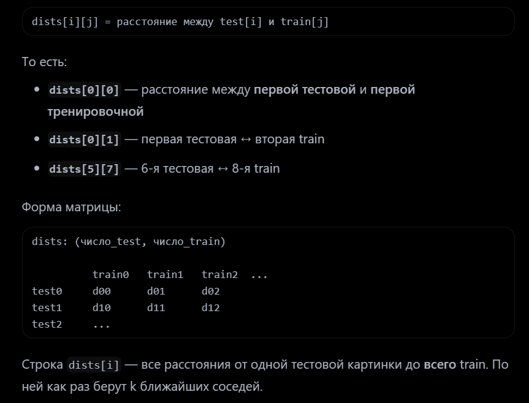

[Без названия](https://ivan-valuchev.yonote.ru/doc/untitled-MTbLTmAgH8)

### Что нужно усвоить (обязательно)

1. **Как думает KNN** «Запомнил все примеры → для нового ищу похожих → голосую».
2. **Что такое расстояние** Картинка = вектор чисел. «Похожесть» = маленькое расстояние (в вашей домашке — L1).
3. **Роль** $k$ Сколько соседей смотрим. Маленький $k$ — нервная граница, большой — сглаженнее. Подбираем кросс-валидацией.
4. **Зачем train / val / test** Учимся на train, крутим $k$ на validation (фолдах), финал проверяем на test.
5. **Метрики** Accuracy, precision/recall/F1 — хотя бы на уровне «что измеряют».
6. **Зачем векторизация** Циклы медленные, numpy быстрее — это про практику работы с массивами.

---

### Что НЕ нужно

- Заучивать каждую строку `dataset.py`
- Считать, что руками писать KNN — навык для работы (на работе будет `sklearn`)
- Делать идеально всё подряд без понимания

---

### Мини-чек: «я усвоил», если можешь объяснить

- Почему KNN почти не «обучается»?
- Как из картинки получается расстояние?
- Почему выбираем $k$ не на test?
- Чем бинарная задача отличается от 10 классов в этой домашке?

> Если на эти 4 вопроса отвечаешь своими словами — домашка сделала своё дело. Код — способ это проверить руками.

Коротко по делу 👇

Пользоваться нейронкой можно, но с умом. Вот принцип от Вадима (по роадмапу и из основного канала):

✅ Можно спрашивать:

- объяснить теорию, математику, детали алгоритма
- задавать наводящие вопросы, если совсем застрял
- помочь разобраться в ошибке / что значит этот traceback
- после того как сам написал — попросить проверить структуру, стиль кода, что можно улучшить

❌ Лучше не делать:

- просить написать код за тебя целиком
- копипастить решение без понимания

Цель домашки — самому научиться писать код. Если нейронка сделает всё за тебя, практика теряет смысл. Как сказал Вадим в основном канале: «цель — самому научиться писать код».

Также в общем чате было такое правило: если совсем тяжело — проси нейронку задавать наводящие вопросы, но не писать код

---

# KNN — итоговый флоу (конспект + домашка)

> Сводка всего пути по KNN: от картинки до test. Читать как шпаргалку перед сдачей или повтором.

---

## 📌 Одна фраза

> KNN **запоминает** train → для новой картинки ищет **k ближайших** по расстоянию L1 → **голосует** за класс → подбираем **k** кросс-валидацией.

---

## 🔷 0. Данные (ноутбук `KNN.ipynb`, не в `knn.py`)

```
картинка SVHN 32×32×3
    ↓ flatten (без /255 и bias — в KNN просто пиксели)
вектор длины 3072
```

| задача | что в данных | метки |
|:---|:---|:---|
| **бинарная** | только цифры **0** и **9** (маска) | True/False или 0/9 |
| **многоклассовая** | все цифры **0–9** | int 0..9 |

| набор | зачем |
|:---|:---|
| **train** | `fit` запоминает картинки + метки |
| **фолды train** (5 шт.) | подбор **k** (CV) |
| **test** | финальная оценка с лучшим k |

> В KNN нет матрицы W. «Обучение» = сохранить `train_X` и `train_y`.

---

## 🔷 1. Полная цепочка KNN


 

```
новая картинка (test)
    ↓
считаем L1-расстояние до КАЖДОЙ train-картинки
    ↓
dists (num_test, num_train) — матрица расстояний
    ↓
argsort → k ближайших соседей
    ↓
голосование: самый частый класс среди k соседей
    ↓
предсказание
```

**Отличие от линейного классификатора:** нет весов, нет градиентов, нет loss при обучении.

---

## 🔷 2. Цепочка в коде (`knn.py`)

| # | функция / метод | что делает |
|:---|:---|:---|
| 1 | `compute_distances_two_loops` | L1, два цикла Python (медленно, для понимания) |
| 2 | `compute_distances_one_loop` | один цикл + векторизация по train |
| 3 | `compute_distances_no_loops` | полностью numpy (broadcasting) — **в predict по умолчанию** |
| 4 | `fit(X, y)` | `self.train_X = X`, `self.train_y = y` — только запомнить |
| 5 | `predict_labels_binary` | k соседей → голосование True/False |
| 6 | `predict_labels_multiclass` | k соседей → голосование 0..9 |

### Формула L1 (в домашке — не L2!)

```
для одной пары (test, train):

d = |x1 - x1'| + |x2 - x2'| + ... + |x3072 - x3072'|
  = sum( abs(test - train) )   по всем пикселям
```

Маленькое d → картинки **похожи**.

### Матрица dists

```
dists[i, j] = расстояние от test[i] до train[j]

        train0  train1  train2  ...
test0     ?       ?       ?
test1     ?       ?       ?
...
```

Форма: `(num_test, num_train)`.

### Три реализации — одна математика

| версия | идея |
|:---|:---|
| two_loops | каждая ячейка dists[i,j] в двойном цикле |
| one_loop | одна строка dists[i] за раз: `sum(abs(train_X - X[i_test]), axis=1)` |
| no_loops | broadcasting: `X[:, None, :] - train_X[None, :, :]` → sum по пикселям |

### predict — голосование

```
1) distances_min_to_max = argsort(dists[i])     # от ближайшего к дальнему
2) neighbour = индексы первых k соседей
3) selected = метки этих k соседей из train_y
4) pred[i] = самый частый класс в selected
```

### Полный код (`knn.py`) — финал

```python
def fit(self, X, y):
    self.train_X = X
    self.train_y = y

def compute_distances_two_loops(self, X):
    num_train = self.train_X.shape[0]
    num_test = X.shape[0]
    dists = np.zeros((num_test, num_train), np.float32)
    for i_test in range(num_test):
        for i_train in range(num_train):
            dists[i_test][i_train] = np.sum(
                np.abs(self.train_X[i_train] - X[i_test])
            )
    return dists

def compute_distances_one_loop(self, X):
    num_train = self.train_X.shape[0]
    num_test = X.shape[0]
    dists = np.zeros((num_test, num_train), np.float32)
    for i_test in range(num_test):
        res = np.abs(self.train_X - X[i_test])
        dists[i_test] = np.sum(res, axis=1)
    return dists

def compute_distances_no_loops(self, X):
    # X: (M, 1, F), train_X: (1, N, F) → (M, N, F), сумма по пикселям (axis=2)
    dists = np.sum(
        np.abs(X[:, np.newaxis, :] - self.train_X[np.newaxis, :, :]),
        axis=2,
    )
    return dists.astype(np.float32)

def predict_labels_binary(self, dists):
    num_test = dists.shape[0]
    pred = np.zeros(num_test, dtype=bool)
    for i in range(num_test):
        distances_min_to_max = np.argsort(dists[i])
        neighbour = distances_min_to_max[0 : self.k]
        selected = [self.train_y[j] for j in neighbour]
        pred[i] = max(selected, key=selected.count)
    return pred

def predict_labels_multiclass(self, dists):
    num_test = dists.shape[0]
    pred = np.zeros(num_test, dtype=int)
    for i in range(num_test):
        distances_min_to_max = np.argsort(dists[i])
        neighbour = distances_min_to_max[0 : self.k]
        selected = [self.train_y[j] for j in neighbour]
        pred[i] = max(selected, key=selected.count)
    return pred

def predict(self, X, num_loops=0):
    if num_loops == 0:
        dists = self.compute_distances_no_loops(X)
    elif num_loops == 1:
        dists = self.compute_distances_one_loop(X)
    else:
        dists = self.compute_distances_two_loops(X)

    if self.train_y.dtype == bool:
        return self.predict_labels_binary(dists)
    else:
        return self.predict_labels_multiclass(dists)
```

> `predict`: `num_loops=0` → no_loops; `num_loops=1` → one_loop; иначе two_loops. Метки `bool` → binary, иначе multiclass.

---

## 🔷 3. fit vs predict

|    | fit | predict |
|:---|:---|:---|
| что делает | сохраняет train_X, train_y | считает dists → k соседей → голосует |
| меняет данные? | только запоминает | нет |
| веса W? | **нет** | **нет** |
| градиенты? | нет | нет |

> KNN почти не «обучается» — **lazy learning**: вся работа при predict.

---

## 🔷 4. Метрики (`metrics.py`)

| задача | функция | что смотрим |
|:---|:---|:---|
| бинарная (0 vs 9) | `binary_classification_metrics` | precision, recall, **F1**, accuracy |
| 10 классов | `multiclass_accuracy` | только **accuracy** |

```
accuracy = (сколько pred == ground_truth) / всего

F1 (бинарная) — баланс precision и recall; для CV выбираем k по F1
```

### Полный код (`metrics.py`) — финал

```python
def binary_classification_metrics(prediction, ground_truth):
    tp = fp = fn = tn = 0
    for pred, truth in zip(prediction, ground_truth):
        if pred and truth:
            tp += 1
        elif pred and not truth:
            fp += 1
        elif not pred and truth:
            fn += 1
        else:
            tn += 1

    accuracy = (tp + tn) / len(prediction) if len(prediction) > 0 else 0
    precision = tp / (tp + fp) if (tp + fp) > 0 else 0
    recall = tp / (tp + fn) if (tp + fn) > 0 else 0
    f1 = (
        2 * precision * recall / (precision + recall)
        if (precision + recall) > 0
        else 0
    )
    return precision, recall, f1, accuracy


def multiclass_accuracy(prediction, ground_truth):
    if len(prediction) == 0:
        return 0
    correct = 0
    for pred, truth in zip(prediction, ground_truth):
        if pred == truth:
            correct += 1
    return correct / len(prediction)
```

```
precision = TP / (TP + FP)
recall    = TP / (TP + FN)
F1        = 2 * precision * recall / (precision + recall)
```

---

## 🔷 5. Подбор k — кросс-валидация (гиперпараметр)

[Подробный разбор](https://ivan-valuchev.yonote.ru/doc/primer-iz-domashki-po-knn-8VFIyckdlN) 

**k** — единственный гиперпараметр KNN. `fit` его **не подбирает** — только принимает `KNN(k=...)`.

```
train делим на 5 фолдов

for k in [1, 2, 3, 5, 8, 10, 15, 20, 25, 50]:
    for каждый фолд:
        val = этот фолд
        train = остальные 4 фолда
        knn = KNN(k=k)              ← новый объект каждый раз ок
        knn.fit(train)
        pred = knn.predict(val)
        метрика на val
    среднее по 5 фолдам → оценка для этого k

best_k = k с лучшей средней метрикой
```

| важно | смысл |
|:---|:---|
| k на test **не** крутим | иначе «подглядывание» |
| CV только на **train** | test — один раз в конце |
| бинарная задача | лучший k по **F1** |
| 10 классов | лучший k по **accuracy** |

---

## 🔷 6. Финал на test

```python
best_knn = KNN(k=best_k)
best_knn.fit(весь_train)          # бинарный или multiclass
prediction = best_knn.predict(test_X)
# бинарная: binary_classification_metrics
# multiclass: multiclass_accuracy
```

---

## 🔷 Результаты домашки (ориентиры)

### Бинарная (0 vs 9)

| k | F1 (CV, среднее) |
|:---|:---|
| 1 | 0.673 |
| **3** | **0.683** ← лучший |
| 5 | 0.601 |

**Test с best_k=3:** accuracy 0.56, F1 **0.70** — осмысленный результат.

### Многоклассовая (0–9)

| k | accuracy (CV) |
|:---|:---|
| 1 | 0.558 |
| **15** | **0.568** ← лучший |
| 50 | 0.400 |

**Test с best_k=15:** accuracy **0.14** (случайное ≈ 0.10). Сырые пиксели + L1 слабо различают 10 цифр.

### Скорость расстояний (примерно)

| реализация | время (мой прогон) |
|:---|:---|
| two_loops | \~12 ms |
| one_loop | \~19 ms |
| no_loops | \~21 ms |

> На маленьком датасете (1000 train) overhead broadcasting у no_loops может быть дороже двух циклов — на больших данных no_loops обычно выигрывает.

---

## 🔷 Схема целиком

```
ДАННЫЕ (SVHN, flatten)
        │
        ▼
┌─────────────────────────────────────┐
│  КОД (knn.py)                       │
│  fit = запомнить train              │
│  compute_distances (L1)             │
│  predict = k соседей + голосование  │
└─────────────────────────────────────┘
        │
        ▼
┌─────────────────────────────────────┐
│  НОУТБУК (KNN.ipynb)                │
│  1) бинарная: метрики, CV по F1     │
│  2) multiclass: accuracy, CV по acc │
│  3) best_k → fit(train) → test      │
└─────────────────────────────────────┘
```

---

## 🔷 Train / фолды / test — кто где

| данные | fit | predict | зачем |
|:---|:---|:---|:---|
| train (целиком) | ✅ запомнить | — | финальный fit перед test |
| фолд i (CV) | ✅ на 4 других | ✅ на фолде i | подбор k |
| test | ❌ | ✅ один раз | честная оценка |

---

## 🔷 KNN vs линейный классификатор

|    | KNN | линейный классификатор |
|:---|:---|:---|
| обучение | запомнить примеры | учить W градиентным спуском |
| гиперпараметр | **k** | **lr**, **reg**, epochs |
| predict | расстояния + голосование | X @ W + argmax |
| веса W | нет | есть (3073, 10) |

---

## 🔷 Одной фразой на каждый этап

| # | этап | одна фраза |
|:---|:---|:---|
| 1 | данные | картинка → вектор 3072, бинарная или 10 классов |
| 2 | L1 расстояние | сумма модулей разностей пикселей |
| 3 | dists | матрица «test × train» расстояний |
| 4 | fit | запомнить train_X, train_y |
| 5 | predict | k ближайших → голосование |
| 6 | метрики | F1 (бинарная) или accuracy (10 классов) |
| 7 | CV | 5 фолдов, средняя метрика → лучший k |
| 8 | test | fit на всём train + predict(test) |

---

## 🔷 Мини-чек: «я усвоил весь флоу KNN»

- Почему KNN почти не обучается?
- Чем L1 в домашке отличается от L2 в конспекте с цветками?
- Что хранит `dists[i, j]`?
- Зачем три версии `compute_distances`?
- Чем бинарный predict отличается от multiclass (в коде — одна логика)?
- Почему k выбираем на CV, а не на test?
- Чем KNN отличается от линейного классификатора по «обучению»?

> Если отвечаешь на все 7 — KNN (домашка) усвоен целиком.

---

**Домашка KNN — готова, когда: расстояния работают, predict + метрики считаются, best_k найден через CV, test проверен.**

---

# Формулы: конспект ↔ код (`linear_classifer.py`)

Справочник для домашки по линейному классификатору (SVHN).
Слева — как в конспекте YoNote, справа — как в коде. Это **одна математика**, просто конспект на простом примере, код — на матрицах.

---

## Обозначения

```
  Конспект                 Код                         SVHN
  ───────────────────────  ──────────────────────────  ─────────────────────────
  x  признаки объекта      X[i]  (строка)               3073 пикселя
  w  один вес              W[:, k]  (столбец)           3073 числа на класс k
  z  логит                 predictions[i, k]            10 логитов на картинку
  p  вероятность           probs[i, k]                  10 вероятностей
  y  метка (+1 / -1)       one_hot  (0 и 1)            [0,0,0,1,0,...]
  правильный класс         target_index[i]              цифра 0–9
```

**Файлы конспекта:**

- `3.Машинное обучение/Линейные модели.md` — softmax, многоклассовая классификация
- `3.Машинное обучение/Упрощенное пояснение линейной классификации с примером.md` — формулы 11–13 (sigmoid, log loss, градиент)
- `3.Машинное обучение/Пояснение.md` — bias в X, градиент MSE через `X^T`
- `3.Машинное обучение/Функция потерь и Эмпирический риск.md` — loss и среднее по батчу
- `3.Машинное обучение/Пример расчетов (1).md` — Ridge / L2

---

## Шаг 0. Линейная модель (логиты)

**Конспект** (`Линейные модели.md`):

```
z = w * x + w0              (один класс, один вес)

b_k(x) = <w_k, x> + w0k     (класс k, много классов)
```

**Код** (`linear_softmax`, \~строка 263):

```python
predictions = np.dot(X, W)    # X @ W
```

```
predictions[i, k] = z_k  для картинки i и класса k
```

```
  Конспект          Код
  ────────────────  ─────────────────────────────────
  z = w*x           predictions = X @ W
  один z            10 чисел на картинку (по классу)
  один w            матрица W (3073 × 10)
```

`w0` уже внутри `W` (столбец единиц в `X` — см. `Пояснение.md`).

---

## Шаг 1. Softmax (логит → вероятность)

**Конспект — бинарно, сигмоида** (`Упрощенное пояснение...`, формула 11):

```
p = 1 / (1 + exp(-z))
```

**Конспект — много классов** (`Линейные модели.md`):

```
P(класс k) = exp(z_k) / (exp(z_0) + exp(z_1) + ... + exp(z_9))
```

**Код** (`softmax`):

```python
probs = exp(z - max(z)) / sum(exp(z - max(z)))
```

```
  Конспект                    Код
  ──────────────────────────  ─────────────────────────────────────
  sigmoid(z) — 2 класса       softmax — 10 классов
  одно p                      probs[i, :] — 10 вероятностей, сумма = 1
  z                           predictions (логиты)
```

Сигмоида = softmax для 2 классов. В домашке — полный softmax.

---

## Шаг 2. Loss (штраф)

**Конспект** (`Упрощенное пояснение...`, формула 12):

```
L = -log(p)     когда y = +1 (правильный класс)
```

Бинарно полная формула:

```
L = -y*log(p) - (1-y)*log(1-p)
```

при `y=1` остаётся `-log(p)`.

**Конспект — батч** (`Функция потерь и Эмпирический риск.md`):

```
R = (1/N) * sum_i L_i     — среднее по объектам
```

**Код** (`cross_entropy_loss`):

```python
loss = -log(probs[правильный_класс])              # 1 картинка
loss = mean(-log(probs[i, target_index[i]]))      # батч
```

```
  Конспект                      Код
  ────────────────────────────  ─────────────────────────────────
  p — вероятность правильного   probs[i, target_index[i]]
  L = -log(p)                   loss = -np.log(...)
  среднее по N                  np.mean(...)
```

---

## Шаг 3. Градиент по логиту (dL/dz)

**Конспект — градиент по весам** (`Упрощенное пояснение...`, формула 13):

```
dL/dw = -x * (y - p)
```

**Градиент по логиту z** (промежуточный шаг, не по `w`):

```
dL/dz = p - y        где y = 0 или 1
```

Проверка:

- при `y=1`: `dL/dz = p - 1`
- при `y=0`: `dL/dz = p`

**Код** (`softmax_with_cross_entropy`):

```python
dprediction = probs.copy()           # p - 0 для всех k
dprediction[правильный_индекс] -= 1  # минус one_hot
# батч: dprediction /= batch_size
```

```
dprediction[i, k] = probs[i,k] - one_hot[k]
                  = p - y   (как в конспекте)
```

```
  Конспект              Код
  ────────────────────  ─────────────────────────────────────────
  y = 1 или 0           one_hot: 1 на правильном, 0 на остальных
  p - y                 probs.copy(); -= 1 у правильного
  dL/dz                 dprediction
  вектор из 2 чисел     строка из 10 чисел
```

**Числовой пример** (как в конспекте: `x=2`, `p=0.269`, `y=1`):

```
конспект:  dL/dw = -2 * (1 - 0.269) = -1.462
           (тут ещё умножение на x — это шаг 4)

код:       dprediction = 0.269 - 1 = -0.731   ← только по z
           потом dW = x * dprediction = 2 * (-0.731) = -1.462  ← как в конспекте
```

---

## Шаг 4. Градиент по весам (dL/dW)

**Общее правило (цепочка):**

```
z = X @ W          ← выход модели (логиты)
loss = f(z)        ← штраф

dL/dW = X^T @ dL/dz
```

`dL/dz` — градиент по **выходу** (логитам). В коде это `dprediction`.

В конспекте для MSE то же самое часто называют «ошибкой» — но умножаем не на абстрактную ошибку, а именно на **dL/dz**.

---

**Конспект — бинарная классификация** (`Упрощенное пояснение...`, формула 13):

```
dL/dw = -x * (y - p)  =  x * (p - y)
```

Здесь `x * (p - y)` — скалярный случай `X^T @ dL/dz` (одна картинка, один вес).

---

**Конспект — MSE, матричная форма** (`Пояснение.md`, раздел «3. Градиенты»):

```
grad_w = -(2/N) * X^T * (y - Xw - b*1)        ← bias отдельно

grad   =  (2/N) * X_aug^T * (X_aug @ w - y)   ← bias внутри X
```

Что в скобках — это **ошибка предсказания**. По смыслу:

```
dL/dz  ~  (z - y)   или   (y - z)   (от знака loss)

grad_w = X^T @ dL/dz
```

Точная ссылка в конспекте: `3.Машинное обучение/Пояснение.md`, строки \~247–268.

---

**Код — softmax** (`linear_softmax`, \~строка 274):

```python
dW = np.dot(X.T, dprediction)
```

```
dL/dz = p - y              ← dprediction (шаг 3)
dL/dW = X.T @ (p - y)      ← dW
```

---

**MSE vs softmax — одна структура, разный dL/dz:**

```
  Задача              Выход z       dL/dz (что в скобке)     Градиент по W
  ──────────────────  ────────────  ───────────────────────  ─────────────────
  MSE (конспект)      X @ w         ~ (z - y) или (y - z)    X^T @ dL/dz
  Softmax (домашка)   X @ W         p - y  (= dprediction)   X.T @ dprediction
```

```
  Конспект (бинарно)  Код (softmax)
  ──────────────────  ─────────────────────────────
  x                   X (все картинки батча)
  p - y               dprediction  (= dL/dz)
  x * (p - y)         X.T @ dprediction
  один w              вся матрица W
```

На одной картинке, один вес на класс:

```
конспект:  dL/dw_k = x * (p_k - y_k)

код:       dW[:, k] = X[i].T @ dprediction[i, k]
           (для батча — сумма по картинкам через X.T)
```

> Формула `dW = X.T @ dprediction` **явно не выписана** в конспекте для softmax. Это обобщение:
>
> - `x * (p - y)` из формулы 13 (бинарный случай)
> - `X^T @ dL/dz` из `Пояснение.md` (MSE), где `dL/dz` для softmax = `p - y`

---

## Шаг 5. L2-регуляризация

**Конспект** (`Пример расчетов (1).md`, Ridge):

```
L_reg = lambda * sum(w_j^2)

grad = 2 * lambda * w
```

**Код** (`l2_regularization`):

```python
loss = reg_strength * np.sum(W ** 2)
grad = 2 * reg_strength * W
```

```
  Конспект      Код
  ────────────  ─────────────────────────────────
  lambda        reg_strength (или reg в fit)
  sum(w^2)      np.sum(W ** 2)
  2*lambda*w    2 * reg_strength * W
```

---

## Шаг 6. Обновление весов (fit)

**Конспект** (`Упрощенное пояснение...`, формула 8):

```
w_новый = w_старый - lr * dL/dw
```

**Код** (`fit`):

```python
loss_ce, dW_ce = linear_softmax(X_batch, self.W, y_batch)
loss_reg, dW_reg = l2_regularization(self.W, reg)
self.W -= learning_rate * (dW_ce + dW_reg)
```

```
  Конспект    Код
  ──────────  ─────────────────────────────
  w           self.W
  lr          learning_rate
  dL/dw       dW_ce + dW_reg
  один шаг    один батч
```

---

## Вся цепочка одной таблицей

```
  Шаг  Конспект                          Код
  ───  ────────────────────────────────  ──────────────────────────────────
   0   z = w*x + w0,  b_k(x)             predictions = X @ W
   1   p = sigmoid(z) / softmax(z)       probs = softmax(predictions)
   2   L = -log(p)                       loss = cross_entropy_loss(...)
   3   dL/dz = p - y                     dprediction = probs - one_hot
   4   dL/dw = x*(p-y)                   dW = X.T @ dprediction
   5   L_reg = lambda*sum(w^2)           l2_regularization(W, reg)
   6   w = w - lr*grad                   W -= lr * (dW_ce + dW_reg)
```

---

## Где что лежит в файле

```
linear_softmax:
  predictions = X @ W              ← шаг 0
  loss, dprediction = softmax_...  ← шаги 1–3
  dW = X.T @ dprediction           ← шаг 4

softmax_with_cross_entropy:
  probs = softmax(predictions)     ← шаг 1
  loss = cross_entropy_loss(...)   ← шаг 2
  dprediction = probs - one_hot    ← шаг 3

l2_regularization:
  loss, grad                       ← шаг 5

fit:
  W -= lr * (dW_ce + dW_reg)      ← шаг 6
```

---

## Размеры тензоров (SVHN)

```
  Имя           Форма            Что это
  ────────────  ───────────────  ─────────────────────────
  X             (batch, 3073)    пиксели картинок
  W             (3073, 10)       веса по классам
  predictions   (batch, 10)      логиты
  probs         (batch, 10)      вероятности
  dprediction   (batch, 10)      dL/dz = p - y (градиент по логитам)
  dW            (3073, 10)       градиент по весам
  target_index  (batch,)         правильные цифры 0–9
  loss          одно число       среднее по батчу
```

---

## Главное (запомнить)

1. Конспект и код — **одна математика**.
2. Конспект: 1 признак, 2 класса, буквы `w`, `x`, `p`, `y`.
3. Код: матрицы `X`, `W`, 10 классов, батч.
4. `dprediction = p - y` — это **dL/dz** (градиент по логитам).
5. `dW = X.T @ dprediction` — общее правило **dL/dW = X^T @ dL/dz** (как в MSE из `Пояснение.md`, только dL/dz другой).
6. В MSE «ошибка» `(y - z)` и в softmax `p - y` — **разные формулы, одна роль**: градиент по выходу модели.
7. `check_gradient` в ноутбуке проверяет, что формулы совпадают с численной производной.

---

## Почему не пишем буквально `-x * (y - p)` в коде

```
  В конспекте         В домашке SVHN
  ──────────────────  ─────────────────────────────────────
  1 признак x         3073 пикселя на картинку
  1 вес w             10 столбцов в W (классы 0–9)
  y = +1 или -1       y = one-hot: [0,0,0,1,0,...]
  1 картинка          батч из 100 картинок
```

Скалярная формула не описывает 10 классов и батч. Матрицы — та же математика, компактная запись.

# Заметки по Линейной классификации (введение)

---

## 📌 Одна фраза

> **Линейный классификатор:** картинка = вектор пикселей → умножаем на матрицу весов → получаем **логиты** (баллы по классам) → softmax даёт **вероятности** → при обучении **loss**, при ответе **argmax**.

---

## 🔷 Чем классификация отличается от регрессии

|    | Регрессия (цена квартиры) | Классификация (цифра на картинке) |
|:---|:---|:---|
| ответ | одно число (цена) | **один класс** из 10 (цифра 0..9) |
| формула | y = w1*x1 + w2*x2 + w0 | то же, но **10 раз** — по классу |
| на выходе модели | сразу число | сначала **логиты**, потом вероятности |
| loss | MSE | cross-entropy (-log p правильного) |

Формула линейная **одна и та же** (`z = скалярное произведение (w, x)`). Меняется **что делаем с z** дальше.

> Большой конспект: `Линейные модели.md` — раздел «Что такое логit», таблица «Логit vs линейная регрессия».

---

## 🔷 Полная цепочка домашки (SVHN)

```
картинка 32×32×3
    ↓ flatten + /255 + столбец единиц (bias)
train_X  (9000, 3073)
    ↓
X @ W  →  логиты (9000, 10)        ← linear_softmax, predict
    ↓
softmax  →  вероятности (9000, 10) ← только при обучении (loss)
    ↓
cross-entropy + train_y  →  loss   ← учим W в fit()
    ↓
argmax по классам  →  цифра 0..9   ← predict на val/test
```

**Обучение:** fit → loss падает, W меняются. **Ответ модели:** predict → без loss, без градиентов, только argmax.

---

## 🔷 Шаг 1 — картинка → признаки

```
картинка = таблица пикселей (RGB)
    ↓ развернуть в одну строку
вектор x длины 3072  (32*32*3)
    ↓ добавить 1 в конец (bias)
x длины 3073
```

| что | размер |
|:---|:---|
| одна картинка | 3073 числа |
| train | (9000, 3073) |
| val / test | (1000, 3073) |

Картинка — это **не** «картинка для глаз», а **вектор чисел** для numpy.

---

## 🔷 Шаг 2 — линейная модель: X @ W → логиты

Для **каждого класса k** (цифра 0..9) — **свои веса**:

```
b_k(x) = <w_k, x> + w_0k     — логit класса k
```

В коде все классы сразу — **матрица W**:

```
W:  (3073, 10)   — 10 столбцов, по одному на цифру

scores = X @ W   →  (batch, 10)
```

**Пример — одна картинка, 3 класса (упрощённо):**

```
x = [1, 0, 2]          3 признака
W = [[ 1, -1],         2 столбца = 2 класса
     [ 0,  2],
     [ 1,  0]]

scores = x @ W = [3, 1]
                  ↑   ↑
               класс0  класс1
```

Модель «думает»: класс 0 сильнее (3 > 1). Это ещё **не** ответ «0» — это **сырые баллы**.

> Конспект: `Линейные модели.md` — «Многоклассовая логистическая регрессия (softmax)», формула b_k(x).

---

## 🔷 Шаг 3 — что даёт логит

**Логит** — сырая линейная оценка **до** softmax. Не вероятность, не финальный класс.

| свойство | логит | вероятность (после softmax) |
|:---|:---|:---|
| диапазон | любые числа (-5, 0, 100…) | от 0 до 1 |
| сумма по классам | какая угодно | **всегда 1** |
| смысл | «балл судей» | «процент уверенности» |

**Что даёт логit:**

1. **Сравнить классы** — больший логit → модель больше «верит» в этот класс.
2. **Передать в softmax** — перевести баллы в проценты.
3. **Посчитать loss** — cross-entropy смотрит на вероятность правильного класса (а вероятность из логitов).

**Пример:**

```
логиты = [1.5,  0,  0,  0,  0,  0,  0,  0,  0,  0]
          ↑0   ↑1  ...                    ↑9

max у класса 0 → модель склоняется к «0»
но это ещё не softmax — числа не проценты
```

**Логit vs ответ:**

```
логиты  →  softmax  →  вероятности  →  argmax  →  цифра 0..9
(баллы)     (%)         (%)            (выбор)
```

На **predict** можно взять argmax **сразу от логitов** — порядок классов не меняется.

> Конспект: `Линейные модели.md` — «Что такое логit (logit)»: z = <w, x>, может быть -5, 0, 100.

---

## 🔷 Шаг 4 — softmax: логиты → вероятности

```
                exp(логit_k)
P(класс k) = ─────────────────────────────────────
             exp(z_0) + exp(z_1) + ... + exp(z_9)
```

| до softmax | после softmax |
|:---|:---|
| [1, 2, 0] | [0.24, 0.66, 0.09] — сумма = 1 |
| любые числа | от 0 до 1, max логit → max P |

**Зачем:** loss (-log p) нужны **вероятности**, не сырые баллы. Softmax говорит «насколько уверена» по каждой цифре.

Дальше — отдельный конспект **«Softmax — этап 2»** ниже.

---

## 🔷 Шаг 5 — predict: argmax (без обучения)

После `fit()` веса в `self.W`. На val/test:

```
scores = X @ self.W       (N, 10)
y_pred = argmax(scores, axis=1)   →  (N,) цифры 0..9
```

Softmax **не обязателен** — класс с max логitom = класс с max вероятностью.

Дальше — конспект **«predict() — этап 8»** в конце файла.

---

## 🔷 Размеры — шпаргалка

```
  Имя          Форма           Когда
  ───────────  ──────────────  ─────────────────────
  train_X      (9000, 3073)    fit
  W            (3073, 10)      fit, predict
  логиты       (batch, 10)     linear_softmax, predict
  probs        (batch, 10)     softmax (обучение)
  y_pred       (batch,)        predict
  train_y      (9000,)         fit (метки)
```

---

## 🔷 Карта функций в коде (все этапы)

| # | Функция | одна фраза |
|:---|:---|:---|
| 1 | prepare data | картинка → вектор 3073 |
| 2 | `softmax` | логиты → вероятности |
| 3 | `cross_entropy_loss` | -log(p правильного) |
| 4 | `softmax_with_cross_entropy` | loss + grad по логitам |
| 5 | `linear_softmax` | X @ W + loss + dW |
| 6 | `l2_regularization` | штраф sum(W²) |
| 7 | `fit` | SGD, обновление W |
| 8 | `predict` | argmax(X @ W) |

---

## 🔷 Мини-чек: «я усвоил введение»

- Чем ответ классификации отличается от регрессии?
- Что такое логit и чем он не является?
- Почему W — матрица (3073, 10), а не один вектор?
- Зачем softmax при обучении и можно ли без него при predict?
- Где W обновляются, а где только читаются?

> Если отвечаешь — можно идти по этапам 2–8 ниже по этому файлу.

---

# Softmax — единый конспект (этап 2 домашки)

Одна фраза: **softmax превращает сырые баллы (логиты) в проценты уверенности (вероятности).**

---

## Что делает — простыми словами

На вход — 10 логитов одной картинки (любые числа: −5, 0, 1000 — неважно).

На выход — 10 вероятностей:

- каждая от 0 до 1
- все вместе в сумме = 1

Правило:

- большой логит → большая вероятность
- маленький логит → маленькая вероятность

Аналогия: судьи ставят баллы → softmax переводит их в проценты уверенности.

Логит — это ещё не ответ. Это сырая оценка класса **до** softmax. Может быть любой: −5, 0, 100.

---

## Где в большом конспекте

Файл: `3.Машинное обучение / Линейные модели.md`

Раздел: **«Многоклассовая логистическая регрессия (softmax)»**

Там идея такая:

- для каждого класса своя линейная модель (свои веса)
- получаем K логитов (у нас K = 10 цифр)
- softmax превращает их в вероятности, которые можно сравнивать

Аналогия из конспекта: это не турнир (OVA / AVA), а **рейтинг**. Даём каждому классу оценку, потом переводим оценки в проценты. Чем выше оценка — тем больше процент.

---

## Формула словами

Для одной картинки:

```
                exp(логит_k)
P(класс k) = ─────────────────────────────────────────────
             exp(логит_0) + exp(логит_1) + ... + exp(логит_9)
```

Словами:

1. Берём exp от каждого логита (большие числа становятся ещё больше).
2. Складываем все exp — это общая сумма.
3. Каждый exp делим на эту сумму.

После этого:

- все P от 0 до 1
- сумма P = 1

Почему exp, а не «просто поделить логиты на сумму»?

Потому что логиты могут быть отрицательными. Сумма отрицательных чисел — плохой знаменатель. Exp всегда > 0, поэтому делить безопасно.

---

## Численная устойчивость (в большом конспекте нет, в ноутбуке есть)

Проблема: `exp(1000)` — это гигантское число, float ломается (inf).

Трюк из ноутбука: **перед exp вычесть максимум**.

```
логиты = логиты − max(логиты)
```

Результат softmax **тот же**. Почему — коротко:

- вычли одно и то же число C из всех логитов
- в числителе: exp(z − C) = exp(z) / exp(C)
- в знаменателе то же самое
- exp(C) сокращается

После вычитания max самый большой логит становится 0, остальные — отрицательные. `exp(0) = 1`, `exp(отрицательное)` — маленькое. Float не взрывается.

В ноутбуке тест специально на это:

```
softmax([1000, 0, 0])  →  [≈1.0, ≈0.0, ≈0.0]
```

Логит 1000 доминирует → почти 100% у класса 0.

Важно для кода: **нельзя** писать `predictions -= np.max(predictions)` вслепую на матрице (batch). Для одной строки max по всем числам ок. Для батча (9000, 10) max нужно брать **по строке** (по классам одной картинки), не по всей матрице сразу.

---

## Зачем в домашке

Цепочка:

```
картинка (пиксели)
    ↓
train_X @ W          →  логиты (9000, 10)
    ↓
softmax              →  вероятности (9000, 10)
    ↓
cross-entropy        →  сравниваем с train_y  →  учим W
```

Без softmax loss не знает, **насколько** модель уверена в правильной цифре.

Форма не меняется: было (9000, 10), стало (9000, 10). Меняется смысл чисел:

| До softmax (логиты) | После softmax (вероятности) |
|----|----|
| любые числа | от 0 до 1 |
| сумма какая угодно | сумма по строке = 1 |
| «баллы» | «проценты» |

9000 — картинки, 10 — цифры 0..9.

---

## Пример на цифрах (3 класса — как в ноутбуке)

Вход — логиты:

```
predictions = [1, 2, 0]
               ↑  ↑  ↑
            класс0 1  2
```

### Шаг 1 — вычитаем max (устойчивость)

```
max = 2
[1−2, 2−2, 0−2] = [−1, 0, −2]
```

### Шаг 2 — exp

```
exp(−1) ≈ 0.37
exp(0)  = 1.00
exp(−2) ≈ 0.14
```

### Шаг 3 — сумма

```
0.37 + 1.00 + 0.14 = 1.51
```

### Шаг 4 — делим

```
P(0) = 0.37 / 1.51 ≈ 0.24   (24%)
P(1) = 1.00 / 1.51 ≈ 0.66   (66%)   ← max логит → max вероятность
P(2) = 0.14 / 1.51 ≈ 0.09   (9%)
```

Проверка:

```
0.24 + 0.66 + 0.09 = 0.99 ≈ 1.0   ок
```

Класс 1 имел самый большой логит (2) — и получил самую большую вероятность (66%). Softmax ничего не «переворачивает», только нормирует.

---

## Что писать в `linear_classifer.py`

Функция: `softmax(predictions)`

Требования из ноутбука / файла:

- вход: 1D форма `(N,)` **или** 2D форма `(batch, N)`
- вычесть max (для 2D: по оси классов, `keepdims=True`)
- `exp` → делить на сумму `exp` (та же ось)
- **без циклов** — только numpy
- вернуть `probs` **той же формы**, что `predictions`

### Полный код (финал)

```python
def softmax(predictions):
    if predictions.ndim == 1:
        axis = 0
    else:
        axis = 1
    stable = predictions - np.max(predictions, axis=axis, keepdims=True)
    exp_stable = np.exp(stable)
    sum_exp = np.sum(exp_stable, axis=axis, keepdims=True)
    probs = exp_stable / sum_exp
    return probs
```

| важно | смысл |
|:---|:---|
| `axis=1` для батча | softmax **внутри строки** (10 цифр одной картинки) |
| `keepdims=True` | форма `(batch, 1)`, иначе не вычесть из `(batch, N)` |
| не `predictions -= ...` | не портить входной массив — работаем через `stable` |

Ось для батча: `axis=1` — это ось классов (10 чисел в строке). Каждая строка — одна картинка, softmax считается **внутри строки**, картинки друг на друга не влияют.

Для одной картинки `(N,)` оси нет — max и sum по всему вектору (`axis=0`).

---

## Проверка в ноутбуке

```
probs = linear_classifer.softmax(np.array([-10, 0, 10]))
probs = linear_classifer.softmax(np.array([1000, 0, 0]))
assert np.isclose(probs[0], 1.0)
```

Что должно получиться по смыслу:

- `[-10, 0, 10]` → почти вся вероятность у последнего класса (логит 10 самый большой)
- `[1000, 0, 0]` → почти 1.0 у класса 0, иначе float сломался и assert не пройдёт

Когда assert пройдёт — этап softmax готов. Дальше: `cross_entropy_loss`.

---

## Коротко запомнить

1. Логиты = сырые баллы. Softmax = перевод в вероятности.
2. Формула: exp каждого / сумма всех exp.
3. Перед exp вычесть max — иначе `exp(1000)` взорвёт float.
4. Сумма вероятностей одной картинки = 1.
5. В домашке softmax стоит между `X @ W` и кросс-энтропией.
6. Форма массива не меняется, меняется смысл чисел.

# Cross-entropy — единый конспект (этап 3 домашки)

Одна фраза: **cross-entropy смотрит только на вероятность правильной цифры и штрафует, если она маленькая.**

Softmax сказал: «насколько уверен по каждой цифре».

Cross-entropy спрашивает: «а правильная какая — и насколько ты в ней уверен?»

В конспекте это тот же **Log Loss**, только для 10 классов, не для двух.

---

## Что делает — простыми словами

На вход:

- `probs` — вероятности после softmax (10 чисел на картинку, сумма = 1)
- `target_index` — правильная цифра из `train_y` (не предсказание модели)

На выход: **одно число** — насколько модели плохо.

Правило:

- вероятность правильной цифры близка к 1 → штраф почти 0
- вероятность правильной цифры маленькая → штраф большой

Аналогия из конспекта: Log Loss — педант. Даже если класс угадал, но не на 100%, всё равно чуть-чуть ругает. Хочет точные вероятности.

Остальные 9 вероятностей в штраф **напрямую не входят**. Они уже учтены внутри softmax (сумма = 1): если правильной отдал мало, остальным отдал много.

---

## Где в большом конспекте

Файлы:

- `Линейные модели.md` — Log Loss (`-log p`), раздел про классификацию; там прямо написано: softmax + cross-entropy в домашке = многоклассовый Log Loss
- `Упрощенное пояснение линейной классификации с примером.md` — ШАГ 6, формула 12: `L = -log(p)`
- `Линейные модели.md` — «Многоклассовая логистическая регрессия (softmax)»: обучение = максимизировать `log P(правильный класс)`, а это то же самое, что минимизировать кросс-энтропию

Бинарный Log Loss в конспекте шёл через сигмоиду (2 класса). Здесь сигмоиду заменяет softmax, идея штрафа та же: `-log` от вероятности правильного ответа.

В ноутбуке есть общая формула (сумма по всем классам). Для цифр она упрощается — см. ниже. Этого упрощения в большом конспекте нет, оно из ноутбука.

---

## Формула словами

Общая (как в ноутбуке):

```
L = − сумма по классам  [ истинная_доля_класса * log(предсказанная_вероятность) ]
```

У нас картинка — это **ровно одна** цифра. Истинная доля:

- у правильного класса = 1
- у всех остальных = 0

Нули всё зачёркивают, остаётся одно слагаемое:

```
L = − log( p_правильной_цифры )
```

Словами: взять из softmax вероятность в клетке правильной цифры, взять `log`, поставить минус.

Почему минус: `p` всегда ≤ 1, `log(p)` ≤ 0. Минус делает штраф ≥ 0. Чем меньше `p`, тем больше `L`.


  

## Что даёт просто log(p)

 p всегда от 0 до 1. Логарифм от числа ≤ 1 отрицательный или ноль:

```javascript
p = 1.0   →  log(1.0) = 0      ← ок
p = 0.9   →  log(0.9) ≈ -0.10  ← «хорошо», но число отрицательное
p = 0.5   →  log(0.5) ≈ -0.69
p = 0.1   →  log(0.1) ≈ -2.30  ← «плохо», но -2.30 МЕНЬШЕ чем -0.10
```

 

Получается перевёрнуто: чем хуже модель, тем loss меньше (более отрицательный). Градиентный спуск бы увеличивал ошибку, а не уменьшал.

 

## Что даёт минус: -log(p)

 

Минус переворачивает знак:

```javascript
p = 1.0   →  -log(1.0) = 0       ← идеал, штрафа нет
p = 0.9   →  -log(0.9) ≈ 0.10    ← почти не ругаем
p = 0.5   →  -log(0.5) ≈ 0.69
p = 0.1   →  -log(0.1) ≈ 2.30    ← сильный штраф
p = 0.01  →  -log(0.01) ≈ 4.61   ← очень плохо
```

 

Теперь порядок правильный: меньше p → больше loss.

  


`np.log` — натуральный логарифм (ln), не log10. В ML почти всегда так.

Идеал: модель дала правильной цифре 100%

```
L = −log(1) = 0
```

---

## Зачем в домашке

Цепочка:

```
train_X @ W          →  логиты (9000, 10)
      ↓ softmax
вероятности          →  (9000, 10)
      ↓ cross-entropy + train_y
одно число L         →  «насколько модель плохо угадывает цифры»
      ↓ градиент по W
учим веса
```

Без этого числа нечего уменьшать: softmax сам по себе только проценты, он не знает правильный ответ.

`train_y` / `target_index` — правильные цифры 0..9. Это метки из данных, не выход модели.

---

## Пример на цифрах (3 класса — как в ноутбуке)

Сначала softmax от логитов `[-5, 0, 5]`:

```
probs ≈ [0.000045,  0.0067,  0.9933]
          класс0     класс1    класс2
```

Модель почти уверена, что это класс 2.

### Если правильный ответ — класс 1 (как в ноутбуке)

```
p_правильной = 0.0067
L = −log(0.0067) ≈ 5.01     большой штраф
```

Модель поставила правильному классу всего 0.67% — плохо.

### Если правильный ответ — класс 2

```
p_правильной = 0.9933
L = −log(0.9933) ≈ 0.007    почти ноль
```

Угадала и уверена — почти не ругаем.

### Шаг 2: softmax уже сделан — считаем loss по готовым вероятностям

**Что значит «без softmax» здесь:** мы **не пересчитываем** softmax в этом примере. Вероятности получены **раньше** — на предыдущем шаге цепочки (`логиты → softmax → вероятности`). В `cross_entropy_loss` на вход приходят **уже вероятности** `probs`; в требованиях к функции это написано прямо: «вход probs — уже вероятности, не логиты».

> **Не путать:** «без softmax» ≠ «вероятности появились без softmax». Из логитов вероятности получаются **только** через softmax (а в бинарном случае — через сигмоиду). Другого пути нет. Просто к моменту подсчёта loss этот шаг **уже пройден**, и мы работаем с готовым числом $p$.

**Почему в домашке так:** функции разделены.

| Функция | Что принимает | Что делает |
|:---|:---|:---|
| `softmax(logits)` | логиты (любые числа) | превращает в вероятности (0..1, сумма 1) |
| `cross_entropy_loss(probs, target_index)` | **готовые** вероятности | считает $-\log p_{\text{правильной}}$ |

Поэтому внутри лосса softmax нет — он живёт в **отдельной** функции и вызывается **до** неё.

Пусть вероятности уже посчитаны: `[0.02, 0.81, 0.17]`, правильный класс = 1:

```
L = −log(0.81) ≈ 0.21
```

Если бы правильному классу досталось 0.05:

```
L = −log(0.05) ≈ 3.0
```

Смысл тот же: **чем меньше вероятность правильного класса, тем больше loss**. Отличие от примера выше только в том, что softmax мы **не показываем** — берём готовый вектор.

### Типичная ошибка: подсунуть логиты вместо вероятностей

Если по ошибке скормить в `−log` **логиты**:

- логит бывает **отрицательным** → `log` от отрицательного числа даёт `nan`;
- логит бывает **больше 1** → штраф получается бессмысленным.

Поэтому в требованиях к функции отдельно подчёркнуто: **на вход идут вероятности, а не логиты**. Дали логиты — сначала `softmax`, потом `cross_entropy_loss`.

---

## Одна картинка и батч

**Одна картинка.** `probs` форма `(10,)`, `target_index` = одно число, например `3`.

Берём `probs[3]`, считаем `-log(...)`. Ответ — одно число.

**Батч.** `probs` форма `(9000, 10)` или `(batch, 10)`. У каждой строки свой правильный индекс.

```
probs:
         цифра0  цифра1  цифра2
фото 0    0.10    0.70    0.20      правильный = 1  →  −log(0.70)
фото 1    0.80    0.10    0.10      правильный = 0  →  −log(0.80)
```

В ноутбуке: финальный loss — **среднее** по картинкам батча, всё равно одно число.

```
L = среднее( −log(p_правильной) по всем фото батча )
```

Не сумма — среднее. Иначе батч из 300 картинок давал бы штраф в 300 раз больше, чем одна.

---

## Что писать в `linear_classifer.py`

Функция: `cross_entropy_loss(probs, target_index)`

Требования:

- вход `probs`: 1D `(N,)` или 2D `(batch, N)` — уже вероятности, не логиты
- вход `target_index`: одно число / `(1,)` или вектор длины batch (иногда форма `(batch, 1)` — тогда сплющить)
- выход: **одно число**, не вектор
- 1D: `-log` от `probs` в клетке правильного класса
- 2D: `-log` от правильной клетки **каждой строки**, потом среднее
- без циклов — только numpy

### Полный код (финал)

```python
def cross_entropy_loss(probs, target_index):
    target_index = np.asarray(target_index).ravel()
    if probs.ndim == 1:
        loss = -np.log(probs[target_index[0]])
        return float(loss)
    batch_rows = np.arange(probs.shape[0])
    loss = -np.log(probs[batch_rows, target_index])
    return float(np.mean(loss))
```

| важно | смысл |
|:---|:---|
| `.ravel()` | если `target_index` пришёл как `(batch, 1)` |
| `probs[batch_rows, target_index]` | из каждой строки — только правильная цифра |
| `np.mean` | loss на батч = среднее, не сумма |

Не путать: `target_index` — это **какую цифру взять**, а не саму вероятность.

---

## Проверка в ноутбуке

```
probs = linear_classifer.softmax(np.array([-5, 0, 5]))
linear_classifer.cross_entropy_loss(probs, 1)
```

Правильный класс — средний (индекс 1), у него маленькая вероятность → loss должен выйти около **5.0**, не около нуля.

Когда ячейка выполняется без ошибки и число похоже на «штраф за неуверенность в классе 1» — этап готов. Дальше: `softmax_with_cross_entropy` (loss + градиент вместе).

---

## Коротко запомнить

1. Softmax → проценты. Cross-entropy → одно число «плохости».
2. Формула: `L = −log(вероятность правильной цифры)`.
3. Это Log Loss из конспекта, для K классов.
4. Остальные классы в сумму не пишем: у них истинная доля 0.
5. Батч → среднее по картинкам, всё равно одно число.
6. `target_index` = `train_y`, правильный ответ из данных.

# Softmax + cross-entropy вместе — единый конспект (этап 4 домашки)

Одна фраза: **одна функция считает loss по логитам и сразу отдаёт градиент — чтобы дальше крутить веса W.**

---

## Что делает — простыми словами

На вход:

- `predictions` — **логиты** (сырые баллы), не вероятности
- `target_index` — правильная цифра из `train_y`

На выход — **два** значения:

- `loss` — одно число (как в `cross_entropy_loss`)
- `dprediction` — градиент loss по **каждому логitу** (не по W, не по probs!)

Внутри по сути:

```
логиты  →  softmax  →  probs  →  cross-entropy  →  loss
                              ↘
                         градиент по логitам  →  dprediction
```

Зачем объединять, а не вызывать `softmax` и `cross_entropy_loss` по отдельности?

Градиент через всю цепочку вручную длинный. Если вывести сразу для пары softmax + cross-entropy, получается короткая формула:

```
grad[k] = probs[k] - one_hot[k]
```

«предсказание минус правда». Это главная идея этапа.

---

## Где в большом конспекте

Файлы:

- `3.Машинное обучение / Линейные модели.md` — цепочка «логit → softmax → вероятности → кросс-энтропия → градиент → обновить W»
- `Линейные модели.md` — **бинарный случай**: `dL/dz = p - y` (сигмоида + Log Loss). Для 10 классов та же идея, только `y` — не 0/1, а **one_hot**

Полного вывода формулы `probs - one_hot` в большом конспекте **нет** — это из ноутбука / домашки. Суть та же, что в бинарном Log Loss: штраф «толкает» логиты к правильному классу.

`check_gradient` в конспекте тоже нет — отдельная утилита в `gradient_check.py`: сравнивает твой аналитический градиент с «численным» (чуть сдвинул координату → посмотрел, как изменился loss).

---

## Формула словами

### Вперёд (loss)

То же, что уже сделал в этапах 2–3:

```
probs   = softmax(predictions)
loss    = cross_entropy_loss(probs, target_index)
```

Ничего нового в формуле loss — только вызываем готовые функции.

### Назад (градиент по логитам)

Для одной картинки с K классами (у нас K = 10):

```
dprediction[k] = probs[k] - one_hot[k]
```

**one_hot** — правильный ответ из `train_y` в виде K чисел:

```
one_hot[k] = 1,  если k == правильная цифра
one_hot[k] = 0,  иначе
```

Пример: правильная цифра 4 → one_hot = `[0, 0, 0, 0, 1, 0, 0, 0, 0, 0]`

В коде это удобно так:

```
dprediction = probs.copy()          # пока probs[k] - 0
dprediction[правильная_цифра] -= 1  # стало probs[k] - one_hot[k]
```

**Не путать:** `dprediction` — это градиент, не новые вероятности. Форма как у `predictions`, смысл другой.

### Бинарная аналогия из конспекта

2 класса, сигмоида, y = 0 или 1:

```
dL/dz = p - y
```

- y = 1 → p - 1 (у правильного класса)
- y = 0 → p (у неправильного)

10 классов — то же, только y заменён на one_hot.

---

## Зачем в домашке

Цепочка обучения:

```
train_X @ W     →  логиты (batch, 10)
      ↓ softmax_with_cross_entropy + train_y
loss (число)    →  «насколько плохо»
dprediction     →  (batch, 10) — куда толкать каждый logit
      ↓ дальше в linear_softmax
градиент по W   →  W = W - lr * grad_W
```

Без `dprediction` градиентный спуск не знает, как менять логиты → нечем обновлять W.

### Почему градиент именно по логitам, а не по W?

Потому что это **промежуточный шаг**. `linear_softmax` возьмёт `dprediction` и через X дойдёт до градиента по W. Сейчас учимся на последнем куске цепочки «логиты → loss».

---

## Пример на цифрах (как в ноутбуке, 10 классов)

Логиты одной картинки:

```
predictions = [1.5,  0,  0,  0,  0,  0,  0,  0,  0,  0]
                 ↑0                              ↑4
```

Правильная цифра: **4** (`target_index = 4`).

Модель верит в 0 (logit 1.5 самый большой), а на картинке 4 — ошибка.

### Шаг 1 — softmax

```
probs[0] ≈ 0.33    (модель думает «это 0»)
probs[4] ≈ 0.07    (правильной отдала мало)
```

### Шаг 2 — loss

```
loss = -log(0.07) ≈ 2.60     большой штраф
```

### Шаг 3 — градиент

```
grad[0] = 0.33 - 0 = +0.33     logit 0 завышен → надо опустить
grad[4] = 0.07 - 1 = -0.93     logit 4 занижен → надо поднять
остальные ≈ probs[k] - 0       маленькие положительные
```

**Интуиция** при обновлении `logit = logit - lr * grad`:

- у цифры 4: grad отрицательный → вычитаем отрицательное → logit растёт
- у цифры 0: grad положительный → logit падает

Модель учится: меньше верить в 0, больше — в 4.

---

## Одна картинка и батч

**Одна картинка.** `predictions` форма `(10,)`, `target_index` — одно число.

- `loss` — одно число
- `dprediction` — `(10,)`, **без** деления на batch_size

**Батч.** `predictions` форма `(batch, 10)`, `target_index` — вектор длины batch.

```
фото 0:  grad[0, k] = probs[0, k] - one_hot_0[k]
фото 1:  grad[1, k] = probs[1, k] - one_hot_1[k]
...
```

Потом весь `dprediction` **делим на batch_size**.

Почему: loss = **среднее** по картинкам (как в `cross_entropy_loss`). Если loss — среднее, градиент тоже «на одну картинку в среднем» → делим каждую строку на размер батча.

```
dprediction /= batch_size
```

Форма `dprediction` всегда как у `predictions`: `(10,)` или `(batch, 10)`.

---

## Что писать в `linear_classifer.py`

Функция: `softmax_with_cross_entropy(predictions, target_index)`

Требования:

- вход `predictions`: логиты, 1D `(N,)` или 2D `(batch, N)`
- вход `target_index`: одно число или вектор (иногда `(batch, 1)` — сплющить через `.ravel()`)
- выход: кортеж `(loss, dprediction)`
- `loss` — одно число (float)
- `dprediction` — массив **той же формы**, что `predictions`
- **вперёд:** вызвать уже написанные `softmax` и `cross_entropy_loss`
- **назад:** `probs.copy()`, у правильного индекса `-= 1`; для батча ещё `/= batch_size`
- не менять входной `predictions` (работать с копией probs, не `predictions -= ...`)
- **без циклов** — только numpy

### Полный код (финал)

```python
def softmax_with_cross_entropy(predictions, target_index):
    probs = softmax(predictions)
    loss = cross_entropy_loss(probs, target_index)

    target_index = np.asarray(target_index).ravel()
    dprediction = probs.copy()  # grad[k] = probs[k] - 0
    if probs.ndim == 1:
        dprediction[target_index[0]] -= 1
    else:
        batch_rows = np.arange(probs.shape[0])
        dprediction[batch_rows, target_index] -= 1
        dprediction /= probs.shape[0]  # loss усреднён → grad тоже

    return loss, dprediction
```

| важно | смысл |
|:---|:---|
| `dprediction = probs - one_hot` | у правильной цифры `-= 1` |
| `/= batch_size` только для 2D | потому что `loss = mean` по батчу |
| не трогать `predictions` | копируем `probs`, не входные логиты |

---

## Проверка в ноутбуке

```
loss, grad = linear_classifer.softmax_with_cross_entropy(logits, target_index)
check_gradient(
    lambda x: linear_classifer.softmax_with_cross_entropy(x, target_index),
    logits,
)
```

Что должно произойти:

- `loss` — число, для «модель ошиблась» — заметно больше нуля
- `grad` — той же формы, что logits
- у правильного класса grad **отрицательный** (если модель недооценила правильную цифру)
- **Gradient check passed!** — твоя формула совпала с численной производной

Тесты на батч: `predictions` форма `(batch_size, num_classes)`, `target_index` форма `(batch_size, 1)` — тоже должны пройти `check_gradient`.

Когда assert / gradient check проходят — этап готов. Дальше: `linear_softmax` (логиты = `X @ W`, градиент уже дойдёт до W).

---

## Связь с предыдущими этапами

| Этап | Функция | Вход | Выход |
|----|----|----|----|
| 2 | `softmax` | логиты | probs, сумма = 1 |
| 3 | `cross_entropy_loss` | probs + train_y | одно число loss |
| 4 | `softmax_with_cross_entropy` | логиты + train_y | loss + dL/dz |
| 5 (дальше) | `linear_softmax` | X, W, train_y | loss + dL/dW |

Этап 4 = этапы 2 + 3 + короткий градиент `probs - one_hot`.

---

## Коротко запомнить

1. Вход — **логиты**, выход — **loss + градиент по логitам**.
2. Вперёд = `softmax` + `cross_entropy_loss` (переиспользуем).
3. Градиент: `probs - one_hot` («предсказание минус правда»).
4. Бинарный `p - y` из конспекта — частный случай.
5. Батч: та же формула по строкам, потом **делим на batch_size**.
6. `dprediction` — не вероятности, а «куда толкать» каждый logit при спуске.
7. `check_gradient` — страховка, что формула не ошиблась.

# linear_softmax — единый конспект (этап 5 домашки)

---

## 📌 Одна фраза

> **Собирает всё вместе:** картинки × веса → логиты → loss + градиент по логитам → **градиент по W**, чтобы в `fit()` обновить веса.

---

## 🔷 Что делает — простыми словами

Функция `linear_softmax(X, W, target_index)` — **один шаг обучения на батче**.

На вход:

| аргумент | форма (SVHN) | смысл |
|:---|:---|:---|
| `X` | `(batch, 3073)` | пиксели + bias картинок в батче |
| `W` | `(3073, 10)` | все веса модели |
| `target_index` | `(batch,)` | правильные цифры из `train_y` |

На выход:

|    | смысл |
|:---|:---|
| `loss` | одно число — насколько плохо на этом батче |
| `dW` | матрица `(3073, 10)` — куда толкать **каждый вес** |

> L2 **не здесь** — его добавляют в `fit()` отдельно.

---

## 🔷 Три шага в коде

```
Шаг 1.  predictions = X @ W           →  логиты (batch, 10)
Шаг 2.  loss, dprediction = softmax_with_cross_entropy(...)
Шаг 3.  dW = X.T @ dprediction        →  градиент по W (3073, 10)
```

### Шаг 1 — логиты

```python
predictions = np.dot(X, W)
```

Для одной картинки и класса k (конспект: `b_k(x) = ⟨w_k, x⟩ + w_0k`):

```
z_k = w0*x0 + w1*x1 + ... + w3072*x3072
```

- столбец k в W — веса для цифры k
- последний признак x = 1 (bias) → w0

| умножение | форма |
|:---|:---|
| `(batch, 3073) @ (3073, 10)` | → `(batch, 10)` |

### Шаг 2 — loss и dL/dz(градиент лосс по логитам)

```python
loss, dprediction = softmax_with_cross_entropy(predictions, target_index)
```

Переиспользуем этап 4:

- `loss` — cross-entropy на батче
- `dprediction` — `probs - one_hot`, форма `(batch, 10)`

### Шаг 3 — градиент по W

```python
dW = np.dot(X.T, dprediction)
```

|    | форма |
|:---|:---|
| `X.T` | `(3073, batch)` |
| `dprediction` | `(batch, 10)` |
| `dW` | `(3073, 10)` — **как W** |

---

## 🔷 Где в большом конспекте

- `Линейные модели.md` — многоклассовая лог. регрессия: K линейных моделей, softmax, обучение
- `Упрощенное пояснение линейной классификации...` — градиент Log Loss: `dL/dw = -x * (y - p)`
- `Пояснение.md` — столбец единиц / bias в X

Соответствие:

```
конспект (1 класс, 1 вес)     linear_softmax (матрица)
dL/dw = x * (p - y)       →   dW = X.T @ dprediction
```

`dprediction` — это «p - y» для 10 классов сразу.

---

## 🔷 Зачем в домашке

Цепочка до `fit()`:

```
этап 2–4:  softmax, cross-entropy, softmax_with_cross_entropy  ✓
этап 5:    linear_softmax  ←  ты здесь
этап 6:    l2_regularization  ✓
этап 7:    fit — батчи + linear_softmax + L2 + W = W - lr * grad
```

`linear_softmax` — **мост от картинок к весам**:

```
X, W  →  логиты  →  loss
              ↘
         dprediction  →  X.T @ ...  →  dW  →  обновить W
```

Без шага 3 градиентный спуск не знает, **как менять W**.

---

## 🔷 Пример на цифрах (упрощённо: 1 картинка, 2 класса)

```
X = [[1, 2, 1]]          shape (1, 3)   ← 2 признака + bias=1
W = [[0.5, -0.5],
     [0.1,  0.2],
     [0.0,  0.1]]        shape (3, 2)
target_index = [0]       правильный класс 0
```

### Шаг 1 — логиты

```
predictions = X @ W = [[0.7, 0.0]]     shape (1, 2)
  класс0: 0.5*1 + 0.1*2 + 0.0*1 = 0.7
  класс1: -0.5*1 + 0.2*2 + 0.1*1 = 0.0
```

### Шаг 2 — softmax + loss + dprediction

```
probs ≈ [0.67, 0.33]
loss = -log(0.67) ≈ 0.40
dprediction ≈ [0.67 - 1, 0.33 - 0] = [-0.33, 0.33]
  (для 1 картинки без деления на batch)
```

### Шаг 3 — dW

```
dW = X.T @ dprediction

X.T = [[1], [2], [1]]   shape (3, 1)
dprediction = [[-0.33, 0.33]]   shape (1, 2)

dW[i,k] = X[0,i] * dprediction[0,k]

dW ≈ [[-0.33,  0.33],    ← признак 1
      [-0.67,  0.67],    ← признак 2 (×2)
      [-0.33,  0.33]]    ← bias
```

> Каждый вес W[i,k] получает вклад: **признак i × ошибка по классу k**.

---

## 🔷 Что писать в `linear_classifer.py`

Требования:

- **3 строки** — без циклов
- `dW` форма **как W**
- L2 **не** вызывать внутри — только в `fit()`
- `np.dot` = `@` — матричное умножение

### Полный код (финал)

```python
def linear_softmax(X, W, target_index):
    predictions = np.dot(X, W)
    loss, dprediction = softmax_with_cross_entropy(predictions, target_index)
    dW = np.dot(X.T, dprediction)
    return loss, dW
```

> ⚠️ Порядок в `X.T @ dprediction`: транспонировать **X**, не W.

---

## 🔷 Проверка в ноутбуке

```python
loss, dW = linear_classifer.linear_softmax(X, W, target_index)
check_gradient(lambda w: linear_classifer.linear_softmax(X, w, target_index), W)
```

| что проверяем | ожидание |
|:---|:---|
| `loss` | одно число ≥ 0 |
| `dW.shape` | == `W.shape` |
| `check_gradient` | **Gradient check passed!** |

В тесте X и W маленькие (не SVHN) — `randint` для заглушек. `check_gradient` слегка двигает **W** и сравнивает твой `dW` с численной производной.

---

## 🔷 Связь с предыдущими этапами

| Этап | Функция | выход |
|:---|:---|:---|
| 2 | `softmax` | probs |
| 3 | `cross_entropy_loss` | loss |
| 4 | `softmax_with_cross_entropy` | loss + dL/dz |
| **5** | `linear_softmax` | **loss + dL/dW** |
| 6 | `l2_regularization` | L2 + grad по W |
| 7 | `fit` | цикл SGD |

---

## 🔷 Мини-чек: «я усвоил», если можешь объяснить

- Зачем три шага, а не один?
- Почему `dW = X.T @ dprediction`, а не `X @ dprediction`?
- Какая форма у `predictions` после `X @ W`?
- Почему L2 не внутри `linear_softmax`?
- Чем `dprediction` отличается от `dW`?

> Если на эти 5 вопросов отвечаешь своими словами — этап 5 усвоен. `check_gradient` — проверка формулы руками.

---

## ✅ Коротко запомнить

| # | Правило |
|:---|:---|
| 1 | `linear_softmax` = логиты + loss + **градиент по W** |
| 2 | Шаг 1: `predictions = X @ W` → `(batch, 10)` |
| 3 | Шаг 2: `softmax_with_cross_entropy` → loss + dprediction |
| 4 | Шаг 3: `dW = X.T @ dprediction` → `(3073, 10)` |
| 5 | Бинарная аналогия: `dL/dw = x * (p-y)` → матричный вид |
| 6 | L2 добавляют в `fit()`, не здесь |
| 7 | `check_gradient` по **W** — финальная проверка этапа |

# L2-регуляризация — единый конспект (домашка)

Одна фраза: **L2 штрафует большие веса — «не раздувай W, иначе доплатишь к loss».**

---

## Что делает — простыми словами

Модель может подогнать train слишком жадно: поставить огромные веса на пиксели. Тогда на train loss маленький, на test — хуже (переобучение).

L2 добавляет к общему loss **штраф за размер весов**:

```
L_общий = L_классификации + L_reg
```

`l2_regularization` считает только **вторую часть** — штраф и его градиент.

На вход — **вся матрица весов W**, не картинки и не один признак.

На выход — два значения:

- `loss` — одно число (штраф за большие веса)
- `gradient` — матрица той же формы, что W (куда толкать каждый вес)

L2 **не смотрит на картинки**. Она говорит: «не делай веса слишком большими».

Аналогия из конспекта: алгоритм «бьёт по рукам» за большие цифры в W (`Проблема и решение мультиколлинеарности.md`).

---

## Где в большом конспекте

Файлы:

- `Пример расчетов (1).md` — **L2 / Ridge**: штраф `lambda * sum(w_j^2)`, градиент `2 * lambda * w`
- `Проблема и решение мультиколлинеарности.md` — зачем: большие компенсирующие веса → штраф
- `Линейные модели.md` — общая идея регуляризации в линейных моделях

Соответствие обозначений:

```
конспект          домашка
lambda       →    reg_strength  (или reg в fit)
sum(w_j^2)   →    np.sum(W * W)  — сумма квадратов всех элементов W
2*lambda*w   →    2 * reg_strength * W
```

В конспекте часто один вектор весов `w`. В домашке — **матрица** `(3073, 10)`: у каждого признака свой вес на каждый класс. Формула та же, только суммируем **все** `w_ij^2`.

---

## Формула словами

### Loss (штраф)

```
L_reg = reg_strength * sum( w_ij^2 )
```

Словами:

1. Каждый элемент W возводим в квадрат: `W * W`
2. Складываем всё: `np.sum(...)`
3. Умножаем на `reg_strength` (насколько сильно боимся больших весов)

Штрафуются **все** элементы матрицы:

- веса на пиксели
- вес bias (столбец единиц в X тоже имеет веса в W)
- все 10 классов (цифры 0..9)

В этой домашке **не** исключают bias из штрафа — штрафуется вся W.

### Градиент

```
grad[i, k] = 2 * reg_strength * W[i, k]
```

В коде:

```
grad = 2 * reg_strength * W
```

Производная `w^2` по `w` даёт `2w`. Умножаем на `reg_strength`.

Интуиция: положительный вес → grad > 0 → при спуске `W = W - lr * grad` вес **уменьшается**. Отрицательный → grad < 0 → вес **приближается к нулю**. L2 «тянет» веса к нулю.

---

## Что на входе в `l2_regularization`

```
l2_regularization(W, reg_strength)
```

```
W: (3073, 10)   — все веса модели
                 3073 признака × 10 классов
```

В тесте из ноутбука будет меньше, например `(3, 2)` — но это всё равно **матрица всех весов**, не «один признак».

`reg_strength` — одно число (float). В `fit()` это параметр `reg`. Чем больше — тем сильнее штраф за большие веса.

---

## Зачем в домашке

`linear_softmax` считает loss и градиент **только по картинкам** (cross-entropy). L2 добавляют **отдельно** в `fit()`:

```
для каждого батча:
   loss_data, dW_data = linear_softmax(X_batch, W, y_batch)
   loss_reg,  dW_reg  = l2_regularization(W, reg)

   loss = loss_data + loss_reg
   W = W - learning_rate * (dW_data + dW_reg)
```

Без L2 веса могут раздуться → хуже на test. С L2 модель проще, стабильнее (как Ridge в регрессии).

Подбор `reg` — гиперпараметр (в ноутбуке перебирают `1e-1`, `1e0`, `1e1`, `1e2`).

---

## Сравнение с `linear_softmax`

| Функция | Что на входе | Признаки X? |
|----|----|----|
| `linear_softmax` | X, W, метки | Да — нужны картинки |
| `l2_regularization` | только W | Нет — только веса |

|    | `linear_softmax` | `l2_regularization` |
|----|----|----|
| loss от чего | угадывание цифр | размер весов |
| смотрит на train_y | да | нет |
| форма градиента | как W | как W |

---

## Пример на цифрах (как в конспекте, но матрица)

```
W = [[ 2, -1],
     [ 0,  3]]
```

### Loss

```
W * W = [[ 4,  1],
         [ 0,  9]]

sum(W^2) = 4 + 1 + 0 + 9 = 14

reg_strength = 0.01

loss = 0.01 * 14 = 0.14
```

### Градиент

```
grad = 2 * 0.01 * W = [[ 0.04, -0.02],
                        [ 0.00,  0.06]]
```

У каждого веса свой градиент — как в конспекте `2 * lambda * w_j`, только для всех `w_ij` сразу.

---

## Пример для SVHN (масштаб)

```
W форма (3073, 10)  →  30730 элементов

loss = reg * (w_0_0^2 + w_0_1^2 + ... + w_3072_9^2)

grad — та же форма (3073, 10), в каждой клетке 2 * reg * W[i,k]
```

Ты не штрафуешь один признак — ты штрафуешь **всю матрицу W** одним числом loss.

---

## Что писать в `linear_classifer.py`

Функция: `l2_regularization(W, reg_strength)`

Требования:

- вход: `W` — любая форма (в тесте `(3, 2)`, в SVHN `(3073, 10)`)
- вход: `reg_strength` — float
- выход: кортеж `(loss, gradient)`
- `loss` — одно число (float)
- `gradient` — массив **той же формы**, что W
- **без циклов** — только numpy

### Полный код (финал)

```python
def l2_regularization(W, reg_strength):
    loss = reg_strength * np.sum(W * W)
    grad = 2 * reg_strength * W
    return loss, grad
```

`W * W` и `np.sum` — это `sum(w_j^2)` из конспекта, только для всех элементов матрицы сразу.

Не путать:

- `W * W` — поэлементное умножение (квадрат каждой клетки), не матричное умножение
- `np.sum(W * W)` — одно число, не матрица

---

## Проверка в ноутбуке

```
W = np.random.randn(3, 2).astype(np.float64)
linear_classifer.l2_regularization(W, 0.01)
check_gradient(lambda w: linear_classifer.l2_regularization(w, 0.01), W)
```

Что должно произойти:

- `loss` — положительное число (если W не нулевая)
- `grad` — форма как у W
- **Gradient check passed!** — формула `2 * reg * W` совпала с численной производной

Если `check_gradient` прошёл — L2 готов, можно идти к `fit()` (сборка батчей + `linear_softmax` + `l2_regularization` + обновление W).

---

## Связь с предыдущими этапами

```
этап 2–4:  логиты → softmax → cross-entropy → dL/dz
этап 5:    linear_softmax — dL/dW от картинок
этап 6:    l2_regularization — штраф и dL/dW от размера весов
этап 7:    fit — складываем оба градиента и обновляем W
```

---

## Коротко запомнить

1. L2 штрафует **большие веса**, картинки не нужны — только W.
2. Loss: `reg_strength * sum(W^2)` — одно число на всю матрицу.
3. Grad: `2 * reg_strength * W` — та же форма, что W.
4. В конспекте это **Ridge**, `lambda` = `reg_strength`.
5. В `fit()` loss и grad **складывают** с `linear_softmax`.
6. Большой `reg` → веса меньше, модель проще; маленький → слабее штраф.
7. `check_gradient` на W — страховка, что формула верна.

# fit() — единый конспект (этап 7 домашки)

---

## 📌 Одна фраза

> **SGD-цикл:** перемешать картинки → нарезать батчи → на каждом батче loss + градиент → **W = W - α * grad** → повторить эпохи.

---

## 🔷 Что делает — простыми словами

`LinearSoftmaxClassifier.fit(X, y, ...)` — **обучает модель**: многократно подгоняет веса `W`, чтобы loss падал.

На вход:

| аргумент | форма (SVHN) | смысл |
|:---|:---|:---|
| `X` | `(9000, 3073)` | все train-картинки + bias |
| `y` | `(9000,)` | правильные цифры 0..9 |

Параметры обучения:

| параметр | в конспекте | смысл |
|:---|:---|:---|
| `batch_size` | B | сколько картинок за один шаг SGD |
| `learning_rate` | α (alpha) | размер шага градиентного спуска |
| `reg` | lambda | сила L2-штрафа |
| `epochs` | — | сколько раз пройти **всю** выборку |

На выход:

|    | смысл |
|:---|:---|
| `loss_history` | список loss **после каждого батча** (для графика) |
| `self.W` | обученные веса — остаются в объекте classifier |

---

## 🔷 Схема цикла

```
fit()
 │
 ├─ инициализация W (если ещё нет)
 │
 └─ for epoch in range(epochs):
      │
      ├─ shuffle индексов
      ├─ array_split → список батчей
      │
      └─ for каждый батч:
           ├─ X_batch, y_batch
           ├─ linear_softmax  → loss_ce, dW_ce
           ├─ l2_regularization → loss_reg, dW_reg
           ├─ loss = loss_ce + loss_reg
           ├─ W = W - lr * (dW_ce + dW_reg)
           └─ loss_history.append(loss)
      │
      └─ print("Epoch ..., loss: ...")
```

> Одна **эпоха** = один полный проход по всем батчам train. Один **шаг SGD** = один батч → одно обновление W.

---

## 🔷 Шаги в коде — по порядку

### 0. Размерности

```python
num_train = X.shape[0]        # 9000
num_features = X.shape[1]     # 3073
num_classes = np.max(y) + 1   # 10 (цифры 0..9)
```

### 1. Инициализация W

```python
if self.W is None:
    self.W = 0.001 * np.random.randn(num_features, num_classes)
```

|    |    |
|:---|:---|
| форма | `(3073, 10)` |
| `randn` | случайные числа \~ N(0, 1) |
| `0.001 *` | маленький старт — не «взрывать» логиты с первого шага |

> Подробнее про `randn` — конспект `randn().md`.

### 2. Эпоха: перемешать и нарезать

```python
shuffled_indices = np.arange(num_train)
np.random.shuffle(shuffled_indices)

sections = np.arange(batch_size, num_train, batch_size)
batches_indices = np.array_split(shuffled_indices, sections)
```

| шаг | зачем |
|:---|:---|
| `shuffle` | батчи случайные — иначе SGD «залипает» в порядке данных |
| `array_split(..., sections)` | **режим 2** — точки разреза; последний батч может быть меньше |

> Подробнее — конспект `array_split().md`.

Пример: 9000 картинок, `batch_size=300`:

```
sections = [300, 600, 900, ..., 8700]
→ 29 батчей по 300 + последний на 300 (если делится)
→ 30 шагов SGD за эпоху
```

### 3. Один батч: loss + обновление W

```python
X_batch = X[batch_indices]
y_batch = y[batch_indices]

loss_ce, dW_ce = linear_softmax(X_batch, self.W, y_batch)
loss_reg, dW_reg = l2_regularization(self.W, reg)

loss = loss_ce + loss_reg
self.W = self.W - learning_rate * (dW_ce + dW_reg)
loss_history.append(loss)
```

Формула обновления (конспект — градиентный спуск):

```
dL/dW = dL/dW_от_картинок + dL/dW_от_L2 = dW_ce + dW_reg

W_новый = W_старый - alpha * (dL/dW)

```

| часть | откуда | что штрафует |
|:---|:---|:---|
| `loss_ce`, `dW_ce` | `linear_softmax` | ошибки на батче картинок |
| `loss_reg`, `dW_reg` | `l2_regularization` | большие веса W |

### 4. Конец эпохи

```python
print("Epoch %i, loss: %f" % (epoch, loss))
```

`loss` здесь — loss **последнего батча** эпохи (для мониторинга).

---

## 🔷 Где в большом конспекте

| файл | что |
|:---|:---|
| `Линейные модели.md` | SGD: градиент на батче, батчи должны быть случайными |
| `Упрощенное описание главы.md` | пункт 6 — SGD «смотрим на кучку примеров, идём по ним» |
| `array_split().md` | нарезка батчей в fit |
| `linear_softmax (этап 5)` | dW от картинок |
| L2-конспект (этап 6) | dW от размера весов |

Аналогия из конспекта (квартиры / один вес w):

```
конспект (регрессия)              fit() (классификация SVHN)
w = w - alpha * grad         →    W = W - lr * (dW_ce + dW_reg)
grad по всей выборке         →    grad по батчу (SGD)
```

---

## 🔷 Зачем в домашке

`fit()` — **финальная сборка** всех функций:

```
softmax + cross-entropy + linear_softmax + L2  →  fit()  →  обученный classifier
```

Без fit():

- W остаётся случайным
- `predict()` бессмысленен
- accuracy на validation ≈ 10% (угадывание)

С fit() loss падает, W учится распознавать цифры.

---

## 🔷 Пример на цифрах (микро-масштаб)

```
num_train = 100, batch_size = 32, epochs = 2
```

**Эпоха 0:**

```
shuffle → [47, 3, 88, ...]
sections = [32, 64, 96]
батчи: ~32 + ~32 + ~32 + ~4  (последний меньше)

батч 0: loss_ce=2.5, loss_reg=0.01 → loss=2.51 → W чуть сдвигается
батч 1: ...
...
30 записей в loss_history за эпоху (для SVHN с batch=300)
```

**Эпоха 1:** снова shuffle — другой порядок батчей.

В ноутбуке при `epochs=10, lr=1e-3, batch=300, reg=1e1`:

```
Epoch 0, loss: ~2.31
Epoch 9, loss: ~2.30   ← медленно, но падает
```

---

## 🔷 Что писать в `linear_classifer.py`

Метод `LinearSoftmaxClassifier.fit`.

Требования:

- **без циклов по элементам W** — только циклы по эпохам и батчам
- L2 вызывать **отдельно**, складывать с CE
- `self.W` — веса хранятся в объекте
- вернуть `loss_history`

### Полный код (финал)

```python
def fit(self, X, y, batch_size=100, learning_rate=1e-7, reg=1e-5, epochs=1):
    num_train = X.shape[0]
    num_features = X.shape[1]
    num_classes = np.max(y) + 1
    if self.W is None:
        self.W = 0.001 * np.random.randn(num_features, num_classes)

    loss_history = []

    for epoch in range(epochs):
        shuffled_indices = np.arange(num_train)
        np.random.shuffle(shuffled_indices)
        sections = np.arange(batch_size, num_train, batch_size)
        batches_indices = np.array_split(shuffled_indices, sections)

        for batch_indices in batches_indices:
            X_batch = X[batch_indices]
            y_batch = y[batch_indices]
            loss_ce, dW_ce = linear_softmax(X_batch, self.W, y_batch)
            loss_reg, dW_reg = l2_regularization(self.W, reg)
            loss = loss_ce + loss_reg
            self.W = self.W - learning_rate * (dW_ce + dW_reg)
            loss_history.append(loss)

        print("Epoch %i, loss: %f" % (epoch, loss))

    return loss_history
```

> ⚠️ Старые TODO-комментарии внутри цикла можно удалить — код уже реализован.

---

## 🔷 Проверка в ноутбуке

```python
classifier = linear_classifer.LinearSoftmaxClassifier()
loss_history = classifier.fit(
    train_X, train_y,
    epochs=10, learning_rate=1e-3, batch_size=300, reg=1e1
)
plt.plot(loss_history)
```

| что смотреть | ожидание |
|:---|:---|
| print эпох | loss уменьшается (хотя бы чуть) |
| `len(loss_history)` | ≈ (num_train / batch_size) * epochs |
| график | общий тренд вниз (шум между батчами — норма) |
| `classifier.W.shape` | `(3073, 10)` |

Дальше — `predict()` и accuracy на validation (этап 8).

---

## 🔷 Связь с предыдущими этапами

| Этап | Функция | роль в fit |
|:---|:---|:---|
| 2–4 | softmax, CE, softmax_with_cross_entropy | внутри linear_softmax |
| 5 | `linear_softmax` | loss_ce + dW_ce на батче |
| 6 | `l2_regularization` | loss_reg + dW_reg |
| **7** | `fit` | **цикл SGD, склейка, обновление W** |
| 8 | `predict` | argmax(X @ W) — после обучения |

---

## 🔷 Мини-чек: «я усвоил», если можешь объяснить

- Чем **эпоха** отличается от **шага SGD**?
- Зачем `shuffle` перед батчами?
- Почему L2 считают на **всю W**, а CE — только на батч?
- Что лежит в `loss_history` — loss за эпоху или за батч?
- Почему `learning_rate` в SVHN очень маленький (1e-7 по умолчанию)?

> Если отвечаешь — fit() понятен. График loss_history — визуальная проверка.

---

## ✅ Коротко запомнить

| # | Правило |
|:---|:---|
| 1 | fit = SGD: shuffle → батчи → loss → обновить W |
| 2 | На батче: `linear_softmax` + `l2_regularization` |
| 3 | `W = W - lr * (dW_ce + dW_reg)` |
| 4 | `learning_rate` = α, `reg` = lambda |
| 5 | `array_split(..., sections)` — режим 2, см. array_split().md |
| 6 | `loss_history` — по одному loss **на батч** |
| 7 | W в `self.W` — потом нужен для `predict()` |

---

# predict() — единый конспект (этап 8 домашки)

---

## 📌 Одна фраза

> **После fit:** картинки × **уже обученные** W → логиты → **argmax** → предсказанная цифра 0..9. Без loss, без градиентов, без обновления W.

---

## 🔷 Что делает — простыми словами

`LinearSoftmaxClassifier.predict(X)` — **использует** веса, которые научились в `fit()`, и для каждой картинки говорит: «какая это цифра».

|    | fit | predict |
|:---|:---|:---|
| меняет W? | **да** | **нет** |
| нужны метки y? | да (train_y) | **нет** |
| loss / grad? | да | **нет** |
| softmax? | да (внутри CE) | **не обязателен** |
| на выходе | обученный classifier | вектор предсказаний |

На вход:

| аргумент | форма (SVHN) | смысл |
|:---|:---|:---|
| `X` | `(N, 3073)` | картинки, для которых нужен ответ |

На выход:

|    | форма | смысл |
|:---|:---|:---|
| `y_pred` | `(N,)` | по одной цифре 0..9 на картинку |

**W берётся из** `self.W` — тот же объект `classifier`, на котором вызывали `fit()`.

---

## 🔷 Где в общей цепочке

```
этап 1–6:  softmax, CE, linear_softmax, L2
этап 7:    fit  →  self.W обучены, loss на train упал
этап 8:    predict  →  y_pred на val / test
           accuracy  →  насколько хорошо угадываем
этап 9:    подбор lr, reg, epochs по val
```

> Конспект `Линейные модели.md`: «На тесте softmax снова, но loss не нужен — берёшь класс с max вероятностью и сравниваешь с правильным ответом (accuracy)».

---

## 🔷 Схема predict

```
predict(X)
 │
 ├─ scores = X @ self.W        →  (N, 10) логиты
 │
 └─ y_pred = argmax(scores, axis=1)  →  (N,) цифры 0..9
```

Две строки. Циклов по картинкам **не нужно**.

---

## 🔷 Шаг 1 — логиты (как в linear_softmax, но без loss)

```python
scores = np.dot(X, self.W)
```

|    |    |
|:---|:---|
| `X` | `(N, 3073)` — val, test или train |
| `self.W` | `(3073, 10)` — **уже обученные** веса |
| `scores` | `(N, 10)` — сырые баллы по классам |

Это тот же шаг, что `predictions = X @ W` в `linear_softmax`, только **без** softmax и **без** меток.

**Пример — одна картинка:**

```
scores = [0.2, -1.5, 3.1, 0.0, ..., -0.3]   ← 10 чисел
         ↑0    ↑1    ↑2   ↑3         ↑9
```

---

## 🔷 Шаг 2 — argmax: выбрать класс с максимальным баллом

```python
y_pred = np.argmax(scores, axis=1)
```

**Смысл:** для каждой **строки** scores (одна картинка) найти **индекс столбца** с наибольшим числом.

```
scores[i] = [0.2, -1.5, 3.1, 0.0, ...]
                      ↑ max
y_pred[i] = 2
```

| параметр | зачем |
|:---|:---|
| `axis=1` | max **вправо по строке** — по 10 классам одной картинки |
| без axis=1 на `(N, 10)` | argmax схлопнет всё в одно число — **ошибка** |

> Подробнее про axis — конспект `axis.md`. Для predict: **axis=1**, как softmax по строкам.

**Формы:**

```
scores:   (1000, 10)   ← 1000 картинок val
y_pred:   (1000,)      ← 1000 предсказанных цифр
```

---

## 🔷 Почему softmax НЕ нужен

Softmax **монотонно** увеличивает большие логиты и уменьшает маленькие, но **порядок не меняет**:

```
логиты:        [0.2,  3.1, -1.5]  →  argmax = 1 (класс с индексом 1)
после softmax: [0.05, 0.90, 0.05] →  argmax = 1  ← тот же класс
```

Класс с **max логитом** = класс с **max вероятностью**.

|    | fit / linear_softmax | predict |
|:---|:---|:---|
| softmax | нужен (для loss) | **можно пропустить** |
| argmax | нет | **да** |

Экономим вычисления на val/test.

---

## 🔷 Что писать в `linear_classifer.py`

Метод `LinearSoftmaxClassifier.predict`.

Требования домашки:

- **без циклов** по картинкам / весам
- использовать `self.W`, не локальную W
- вернуть `np.int64` (argmax и так даёт int)
- **не** вызывать `fit`, `linear_softmax`, L2 внутри predict

### Полный код (финал)

```python
def predict(self, X):
    scores = np.dot(X, self.W)
    y_pred = np.argmax(scores, axis=1)
    return y_pred
```

> Строка `y_pred = np.zeros(...)` из заготовки **не нужна** — argmax сразу даёт готовый вектор. Можно убрать.

> Убрать `raise Exception("Not implemented!")` перед return.

---

## 🔷 Числовой пример (2 класса, 2 картинки)

```
X = [[1, 0],      W = [[ 1, -1],
     [0, 1]]           [ 0,  2]]

scores = X @ W = [[ 1, -1],
                  [ 0,  2]]

argmax по axis=1:
  картинка 0: max в [1, -1]  → индекс 0
  картинка 1: max в [0,  2]  → индекс 1

y_pred = [0, 1]
```

---

## 🔷 Проверка в ноутбуке — accuracy

После `fit()`:

```python
pred = classifier.predict(val_X)
accuracy = multiclass_accuracy(pred, val_y)
print("Accuracy: ", accuracy)
```

| переменная | форма | смысл |
|:---|:---|:---|
| `val_X` | `(1000, 3073)` | validation-картинки |
| `val_y` | `(1000,)` | правильные цифры |
| `pred` | `(1000,)` | что предсказала модель |
| `accuracy` | одно число 0..1 | доля совпадений |

**Формула accuracy** (`metrics.py`):

```
accuracy = (число совпадений pred == val_y) / (всего картинок)
```

Пример: 620 из 1000 угадали → accuracy = 0.62 (62%).

---

## 🔷 Train / val / test — кто где

| данные | fit? | predict? | зачем |
|:---|:---|:---|:---|
| `train_X`, `train_y` | **да** | можно, но не для финальной оценки | обучение W |
| `val_X`, `val_y` | **нет** | **да** | подбор lr, reg, epochs |
| `test_X`, `test_y` | **нет** | **да** | финальная проверка |

> **Val** — модель **не учится** на нём, только проверяем predict + accuracy.
>
> **Test** — то же, в самом конце, один раз.

---

## 🔷 Чего ждать по accuracy

| состояние | accuracy на val (ориентир) |
|:---|:---|
| W случайные, без fit | \~10% (10 классов, угадывание) |
| после fit (10–100 эпох) | растёт, в домашке нужно **> 20%** |
| хороший подбор гиперпараметров | может быть 50–65% (линейная модель, не идеал) |

Loss на train падал (2.39 → 2.30) — значит W учатся. Accuracy на val — **главная метрика** «насколько хорошо распознаём цифры».

---

## 🔷 Связь с предыдущими этапами

| Этап | Функция | роль |
|:---|:---|:---|
| 5 | `linear_softmax` | `X @ W` + loss + grad — **только при обучении** |
| 7 | `fit` | обновляет `self.W` |
| **8** | `predict` | `X @ W` + argmax — только inference |
| 9 | цикл по гиперпараметрам | fit → predict(val) → сравнить accuracy |

```
fit:      X_train @ W  →  loss  →  grad  →  W меняется
predict:  X_val   @ W  →  scores  →  argmax  →  цифра
```

---

## 🔷 Частые ошибки

| ошибка | почему плохо | как правильно |
|:---|:---|:---|
| `argmax(scores)` без axis | одно число на весь батч | `axis=1` |
| `W` вместо `self.W` | веса не те / NameError | `self.W` |
| softmax + argmax | лишнее, но не ломает | можно без softmax |
| predict **до** fit | W случайные → \~10% accuracy | сначала fit |
| учить на val | «подглядывание» в ответы | fit только train |
| цикл `for i in range(N)` | домашка просит без циклов | `@` и argmax |

---

## 🔷 Этап 9 — что дальше (подбор гиперпараметров)

```python
for lr in learning_rates:
    for reg in regularization_strengths:
        classifier = LinearSoftmaxClassifier()
        classifier.fit(train_X, train_y, learning_rate=lr, reg=reg, ...)
        acc = multiclass_accuracy(classifier.predict(val_X), val_y)
        # запомнить лучший acc, lr, reg
```

---

## 🔷 fit не подбирает lr и reg — только принимает их

`fit(lr=..., reg=...)` **не ищет** лучшие числа. Он просто учит W с **теми**, что ты передал.

| кто | что делает |
|:---|:---|
| **fit** | учит W на train с заданными lr, reg, epochs |
| **predict** | ответ на val/test, W не меняет |
| **цикл в ноутбуке** | перебирает пары (lr, reg), сравнивает accuracy на val |

Подбор гиперпараметров — **снаружи** `fit`, в ячейке с двойным `for`.

---

## 🔷 Новые lr/reg — новое обучение, W не переиспользуем

Каждая итерация цикла:

```
classifier = LinearSoftmaxClassifier()   ← новый объект
classifier.fit(..., lr=другое, reg=другое)
```

| что происходит | детали |
|:---|:---|
| `self.W` | снова **случайные** маленькие числа (как в первый раз) |
| старые W | **не** переносятся из прошлого эксперимента |
| fit | полный прогон с нуля на train |

**Не путать** с обновлением внутри одного fit:

```
внутри ОДНОГО fit (батч за батчем):
   W_новый = W_старый - lr * grad     ← W зависят от предыдущих W

между РАЗНЫМИ парами (lr, reg) в цикле:
   эксперимент 1:  W₀ → ... → W_A
   эксперимент 2:  W₀' → ... → W_B    ← другой старт, не «докрутка» W_A
```

> Сравниваем: «если бы **с нуля** учили с этими lr и reg — насколько хорошо на val?»
>
> Поэтому каждый раз **новый** `classifier`, а не тот же с другим шагом.

### Схема одной итерации подбора

```
lr, reg  →  fit(train)     →  W обучились с нуля
                ↓
         predict(val_X)    →  pred
                ↓
    accuracy(pred, val_y)   →  хорошо или нет?
                ↓
    если лучший → best_classifier = classifier
```

**Train** — только в `fit`. **Val** — только `predict` + accuracy (выбор lr/reg). **Test** — в самом конце, один раз.

---

Лучший classifier → `predict(test_X)` → финальный test accuracy.

Параметры из ноутбука:

```
epochs = 200
batch_size = 300
learning_rates = [1e-3, 1e-4, 1e-5, 1e-6, 1e-7]
regularization_strengths = [1e-1, 1e0, 1e1, 1e2]
```

Цель домашки: **accuracy > 20%** на validation (лучше — выше).

---

## 🔷 Мини-чек: этап 9 (подбор гиперпараметров)

- Подбирает ли `fit` lr и reg сам, или только принимает их?
- Почему в цикле каждый раз `LinearSoftmaxClassifier()`, а не тот же объект?
- Чем обновление W **внутри** fit отличается от смены lr/reg **между** экспериментами?
- На каких данных `fit`, на каких `predict` + accuracy при подборе?
- Зачем test не трогаем, пока крутим lr/reg?

> Если отвечаешь — подбор гиперпараметров понятен. Дальше: `best_classifier.predict(test_X)`.

---

## ✅ Коротко запомнить (этап 9)

| # | Правило |
|:---|:---|
| 1 | lr, reg, epochs — **гиперпараметры**, fit их **не ищет** |
| 2 | Подбор = цикл `for lr ... for reg ...` в ноутбуке |
| 3 | Каждая пара (lr, reg) → **новый** classifier → **новые** случайные W |
| 4 | Старые W **не** продолжаем — учим с нуля |
| 5 | Внутри одного fit: `W = W - lr * grad` (цепочка шагов) |
| 6 | fit → train; accuracy на val → выбрать лучшие lr/reg |
| 7 | test — один раз в конце с `best_classifier` |

---

## 🔷 Мини-чек: «я усвоил», если можешь объяснить

- Почему в predict **не обновляем** W?
- Зачем `axis=1` в argmax?
- Почему softmax можно не считать?
- Чем `scores` отличается от `probs`?
- Почему accuracy считаем на **val**, а fit — на **train**?
- Что будет, если вызвать predict до fit?

> Если отвечаешь — predict понятен. Следующий шаг — val accuracy и подбор lr/reg.

---

## ✅ Коротко запомнить

| # | Правило |
|:---|:---|
| 1 | predict = inference: только `X @ self.W` + argmax |
| 2 | W уже обучены в fit — здесь **не учимся** |
| 3 | `scores` форма `(N, 10)`, `y_pred` форма `(N,)` |
| 4 | `argmax(scores, axis=1)` — max по классам **каждой** строки |
| 5 | softmax не обязателен — порядок классов тот же |
| 6 | accuracy = доля `pred == ground_truth` |
| 7 | fit → train, predict + accuracy → val/test |

---

## 🔷 Полная карта домашки (все этапы)

| # | Функция | одна фраза |
|:---|:---|:---|
| 1 | load + prepare | картинки → вектор 3073 + bias |
| 2 | `softmax` | логиты → вероятности |
| 3 | `cross_entropy_loss` | штраф -log(p правильного) |
| 4 | `softmax_with_cross_entropy` | loss + dL/dz |
| 5 | `linear_softmax` | X @ W + CE + dW |
| 6 | `l2_regularization` | штраф sum(W²) + grad |
| 7 | `fit` | SGD, обновление self.W |
| **8** | `predict` | **argmax(X @ W) — ответ модели** |
| 9 | tuning + test | лучший lr/reg, accuracy на test |

**Домашка linear classifier — готова, когда predict работает и accuracy на val > 20%.**

# Линейный классификатор — итоговый флоу (конспект + домашка)

> Сводка всего пути: от данных до test accuracy. Читать после этапов 1–9 или как шпаргалку перед сдачей.

**Статус: домашка сдана ✅**

| метрика | результат |
|:---|:---|
| val accuracy (лучший) | **22.3%** (0.223) |
| test accuracy (финал) | **18.7%** (0.187) |
| лучшие гиперпараметры | `lr=1e-3`, `reg=1e-1`, `epochs=200`, `batch_size=300` |

---

## 📌 Одна фраза

> Картинка → вектор → X @ W → логиты → (обучение: softmax + CE + grad) → fit учит W → predict: argmax → accuracy на val/test.

---

## 🔷 0. Данные (этап 1 — ноутбук, не `linear_classifer.py`)

```
картинка 32×32×3
    ↓ flatten, /255, +1 (bias)
вектор x длины 3073
```

| набор | форма X | форма y | зачем |
|:---|:---|:---|:---|
| train | (9000, 3073) | (9000,) | учим W в fit |
| val | (1000, 3073) | (1000,) | подбор lr, reg |
| test | (1000, 3073) | (1000,) | финальная оценка |

**W** — матрица `(3073, 10)`:

| в W | смысл |
|:---|:---|
| **столбец k** | веса для цифры k |
| **строка i** | как признак i влияет на все 10 классов |

---

## 🔷 1. Цепочка в коде (этапы 2–7)

```
X @ W  →  логиты
    ↓
softmax  →  вероятности     (только при обучении)
    ↓
cross-entropy  →  loss       (одно число «насколько плохо»)
    ↓
градиент  →  обновить W
```

| # | функция | вход | выход |
|:---|:---|:---|:---|
| 2 | `softmax` | логиты | probs, сумма = 1 |
| 3 | `cross_entropy_loss` | probs + метка | loss |
| 4 | `softmax_with_cross_entropy` | логиты + метка | loss + dprediction (p − y) |
| 5 | `linear_softmax` | X, W, y | loss + dW = X.T @ dprediction |
| 6 | `l2_regularization` | W, reg | loss_reg + grad = 2 * reg * W |
| 7 | `fit` | train_X, train_y | self.W, loss_history |

### Формулы (текстом)

```
softmax:     P(k) = exp(логit_k) / сумма exp(логитов)
CE:          loss = -log(p_правильной_цифры)
градиент:    dprediction = probs - one_hot
             dW = X.T @ dprediction
L2:          loss_reg = reg * sum(W^2)
             grad_reg = 2 * reg * W
обновление:  W = W - lr * (dW_ce + dW_reg)
```

### Внутри одного fit

```
1) W = случайные маленькие числа (если self.W is None)
2) for epoch:
     shuffle train → батчи (например по 300)
     for батч:
        linear_softmax + l2
        W = W - lr * grad
        loss_history.append(loss)
```

> **Внутри fit:** W_новый = W_старый - lr * grad (каждый батч опирается на предыдущий W).

---

## 🔷 2. Ответ модели — predict (этап 8)

```python
scores = X @ self.W           # (N, 3073) @ (3073, 10) → (N, 10)
y_pred = np.argmax(scores, axis=1)   # (N,) — цифра 0..9
```

|    | predict |
|:---|:---|
| softmax | не нужен (max логita = max вероятности) |
| W | не меняются |
| метки y | не нужны |

---

## 🔷 3. Метрика

```python
pred = classifier.predict(val_X)
accuracy = multiclass_accuracy(pred, val_y)
```

```
accuracy = (сколько pred == val_y) / всего картинок
```

Ориентиры:

| состояние | accuracy на val |
|:---|:---|
| W случайные | \~10% (угадывание) |
| первый fit (lr=1e-3, reg=1e1, 10–100 эпох) | **\~12%**, loss \~2.30 |
| цель домашки | **> 20%** |
| **мой лучший (подбор)** | **22.3%** при lr=1e-3, reg=1e-1 |
| test с best_classifier | **18.7%** |
| теоретический потолок (линейная модель) | 50–65% возможно |

> loss ≈ 2.30 ≈ -log(0.1) — модель даёт всем классам \~10%, почти не учится. После подбора lr/reg loss падает сильнее, accuracy растёт.

---

## 🔷 4. Подбор гиперпараметров (этап 9)

`fit` **не подбирает** lr и reg — только **принимает** их.

```python
for lr in learning_rates:
    for reg in reg_strengths:
        classifier = linear_classifer.LinearSoftmaxClassifier()  # новый объект
        classifier.fit(train_X, train_y, learning_rate=lr, reg=reg, epochs=..., ...)
        acc = multiclass_accuracy(classifier.predict(val_X), val_y)
        if acc > best_val_accuracy:
            best_val_accuracy = acc
            best_classifier = classifier
```

| важно | смысл |
|:---|:---|
| каждая пара (lr, reg) | **новый** classifier, **новые** случайные W |
| старые W | **не** переносим между экспериментами |
| fit | только **train** |
| predict + accuracy | только **val** — выбираем lr, reg |
| test | **один раз** в конце с `best_classifier` |

### Сетка подбора (мой прогон)

```
epochs = 200
batch_size = 300
learning_rates = [1e-3, 1e-4, 1e-5, 1e-6, 1e-7]
reg_strengths  = [1e-1, 1e0, 1e1, 1e2]
→ 5 × 4 = 20 экспериментов
```

### Лучший результат

```
lr=1e-3, reg=1e-1  →  val accuracy = 0.223  ← best_classifier
```

Другие примеры из сетки (для сравнения):

| lr | reg | val accuracy |
|:---|:---|:---|
| **1e-3** | **1e-1** | **0.223** ← лучший |
| 1e-3 | 1e0 | 0.173 |
| 1e-3 | 1e1 | 0.127 |
| 1e-4 | 1e-1 | 0.174 |
| 1e-7 | 1e2 | 0.083 ← плохо (loss разъезжается) |

> Слишком большой reg (1e2) или слишком маленький lr (1e-7) — accuracy падает к \~8–10%.

---

## 🔷 5. Финал — test

```python
test_pred = best_classifier.predict(test_X)
test_accuracy = multiclass_accuracy(test_pred, test_y)
print("Linear softmax classifier test set accuracy: %f" % test_accuracy)
```

**Мой результат:**

```
test accuracy = 0.187  (18.7%)
```

|    | val | test |
|:---|:---|:---|
| accuracy | 22.3% | 18.7% |
| зачем | выбрали lr/reg | честная финальная оценка |

> test чуть ниже val — нормально: val использовали для подбора, test видели один раз.

---

## 🔷 Схема целиком

```
ДАННЫЕ: train / val / test
        │
        ▼
┌─────────────────────────────────────┐
│  КОД (linear_classifer.py)          │
│  softmax → CE → softmax+CE          │
│  → linear_softmax → L2              │
│  → fit (SGD) → predict (argmax)     │
└─────────────────────────────────────┘
        │
        ▼
┌─────────────────────────────────────┐
│  НОУТБУК                            │
│  1) fit(train) + predict(val)       │
│  2) цикл lr/reg → best_classifier   │
│  3) predict(test) → test accuracy   │
└─────────────────────────────────────┘
```

---

## 🔷 Train / val / test — кто где

| данные | fit | predict | зачем |
|:---|:---|:---|:---|
| train (9000) | ✅ | можно, не для оценки | учим W |
| val (1000) | ❌ | ✅ + accuracy | выбираем lr, reg |
| test (1000) | ❌ | ✅ в конце | честная финальная оценка |

---

## 🔷 Одной фразой на каждый этап

| # | этап | одна фраза |
|:---|:---|:---|
| 1 | данные | картинка → вектор 3073 |
| 2 | softmax | логиты → проценты |
| 3 | CE | штраф за неуверенность в правильной цифре |
| 4 | softmax+CE | loss + градиент p−y по логитам |
| 5 | linear_softmax | X @ W + довести градиент до W |
| 6 | L2 | не раздувать веса |
| 7 | fit | крутить W на train батчами |
| 8 | predict | argmax логитов, без обучения |
| 9 | подбор | много fit с разными lr/reg, лучший по val |
| 10 | test | один финальный экзамен |

---

## 🔷 Мини-чек: «я усвоил весь флоу»

- Чем столбец W отличается от строки W?

  столбец - веса одного класса (например цифры 1), для n-го пикслея каждой картинки

  строка - веса одного пикселя для всех классов
- Что такое dprediction и чем отличается от dW?

  dprediction  - градиент loss по логитам  

  dW -   градиент loss по весам W   
- Почему в predict не нужен softmax?

  Нужен только класс с максимальной оценкой:

  Softmax не меняет порядок чисел (только переводит в вероятности).
   Кто был max среди логитов — тот же max среди вероятностей. Softmax нужен для loss при обучении, не для ответа. 
- Чем fit отличается от цикла подбора lr/reg?

  fit-  один раз учит W при фиксированных lr, reg, epochs  

  цикл подбора -   много раз вызывает fit с разными lr/reg и сравнивает accuracy на val   
- Почему при новой паре (lr, reg) создаём новый classifier?

  Чтобы стартовать с чистых случайных W, а не продолжать обучение старой модели с другими lr/reg.

  Иначе сравнение нечестное: один вариант «доедает» чужие веса.
- На каких данных fit, на каких accuracy для выбора гиперпараметров?

  fit - train

  accuracy - val

  Train — учим. Val — выбираем лучшие гиперпараметры. 
- Когда используем test?

  Один раз в конце, после выбора лучших lr/reg

  На test не крутим гиперпараметры — иначе «подглядывание».

   

> Если отвечаешь на все 7 — линейный классификатор (домашка) усвоен целиком.

---

**Домашка linear classifier — сдана ✅**

- val: **22.3%** (> 20%)
- test: **18.7%**
- best: `lr=1e-3`, `reg=1e-1`, `epochs=200`, `batch_size=300`


---

# 📘 МИНИ-КОНСПЕКТ: весь флоу — от данных до test

*(Короткая версия всего сразу: fit → predict → метрики на val → подбор гиперпараметров → test. Для повторения «от и до».)*

## 0. Схема целиком

```text
0. Разделили данные:   train / val / test
        │
1. ЗАДАЛИ гиперпараметры: lr, reg, epochs, batch_size   ← ДО fit; fit их не ищет
        │
2. ЦИКЛ по сетке (например 5 lr × 4 reg = 20 итераций)
        │
        ├─ новый classifier        → новые случайные W
        ├─ fit(train, lr, reg)     → учим W с нуля, ТОЛЬКО на train
        ├─ predict(val)            → ответы, веса НЕ меняются
        ├─ accuracy(pred, val_y)   → сравниваем конфигурации между собой
        └─ если лучше → best_classifier = этот объект
        │
3. Выбрали лучшую пару (у меня: lr=1e-3, reg=1e-1 → val 22.3%)
        │
4. best_classifier.predict(test) → финальная accuracy (18.7%), ОДИН РАЗ
```

**Одна фраза:** гиперпараметры задаём **до** обучения, подбор — это **многократное обучение**, сравниваем по **val**, финальный замер — **один раз на test**.

## 1. Параметры vs гиперпараметры

|    | Параметры $W$ | Гиперпараметры |
|:---|:---|:---|
| Что это | веса модели | ручки эксперимента |
| Примеры | матрица $W$ формы $(3073, 10)$ | `learning_rate`, `reg`, `epochs`, `batch_size` |
| Кто задаёт | оптимизатор (SGD) | **мы, вручную** |
| Сколько их | $3073 \times 10 = 30\,730$ чисел | 4 числа на один запуск |
| Меняются при `fit` | да, на каждом батче | нет, фиксированы на весь `fit` |
| Меняются между итерациями подбора | — | **да, задаём новую пару** |

## 2. Шаг за шагом

### 2.1. Данные: три роли

| Набор | Размер (у меня) | Когда используем | Зачем |
|:---|:---|:---|:---|
| train | 9000 | в каждом `fit` | учим $W$ |
| val | 1000 | после каждого `fit` | выбираем `lr`, `reg` |
| test | 1000 | один раз в самом конце | честная финальная оценка |

Аналогия: train — учебник, val — пробный экзамен, test — настоящий экзамен.

### 2.2. Гиперпараметры задаём ДО fit

`fit` **не ищет** лучшие числа — он учит $W$ с теми, что ему передали. В коде домашки у него есть значения по умолчанию, но это всё равно заранее заданные числа:

```python
def fit(self, X, y, batch_size=100, learning_rate=1e-7, reg=1e-5, epochs=1):
```

Поэтому в ноутбуке их передают явно:

```python
loss_history = classifier.fit(
    train_X, train_y,
    epochs=10, learning_rate=1e-3, batch_size=300, reg=1e1
)
```

> Тонкость: `fit(X, y)` без аргументов тоже запустится — на дефолтах. Но тогда модель обучается с `lr=1e-7` и `epochs=1` — гиперпараметры всё равно уже выбраны, просто не тобой и не глядя, и результат будет почти случайным (\~10%, как у необученных весов), потому что один шаг с таким крошечным `lr` почти ничего не меняет.

### 2.3. fit — обучение весов

```text
для каждой эпохи: перемешать → нарезать батчи → на каждом батче:
    loss_ce,  dW_ce  = linear_softmax(X_batch, W, y_batch)
    loss_reg, dW_reg = l2_regularization(W, reg)
    W = W - lr * (dW_ce + dW_reg)     ← внутри ОДНОГО fit W переиспользуются: это цепочка шагов
```

Одна **эпоха** = один проход по всем батчам train. Один **шаг SGD** = один батч = одно обновление $W$.

### 2.4. predict + метрики на val

predict не обучает и не выбирает веса — он читает self.W, который оставил fit. Веса переходят из fit в predict через атрибут объекта.

```python
pred = classifier.predict(val_X)             # predict веса НЕ меняет: X @ W и argmax
accuracy = multiclass_accuracy(pred, val_y)  # по этому числу сравниваем конфигурации
```

### 2.5. Почему нельзя выбирать гиперпараметры по train

*(Короткий ответ на собеседовании + разворот, если попросят подробнее. Это ядро параграфа 3.3 «Подбор гиперпараметров».)*

***Ответ за 30 секунд***

> «Train-метрика по построению завышена: модель оптимизировала именно эти примеры. Если выбирать гиперпараметры по train, я систематически буду выбирать самую переобученную конфигурацию — ту, которая лучше всех запомнила train, а не лучше всех обобщила. Гиперпараметры как раз управляют обобщением (например сила L2), поэтому выбирать их надо на данных, которые веса не оптимизировали, — на validation».

***Если просят подробнее — три шага***

**Шаг 1. Что измеряет train-метрика.**

Train-loss/accuracy показывает, насколько модель **подогналась под train**: модель видела эти примеры и обновляла по ним веса. Значит, метрика измеряет **запоминание**, а не **обобщение**.

Формально:

$$
R_{train}(f) \le R(f)
$$

где $R$ — риск обобщения (ошибка на всём распределении). Разрыв $R - R_{train}$ и есть переобучение, и он растёт с ростом сложности модели.

**Шаг 2. Что будет, если выбирать по train.**

Возьмём L2-регуляризацию — гиперпараметр, который штрафует большие веса. Перебираем $\lambda$ (числа иллюстративные):

| $\lambda$ | Train accuracy | Val accuracy |
|:---|:---|:---|
| 0.001 | **0.99** ← лучший train | 0.82 |
| 0.01 | 0.98 | **0.87** ← лучший val |
| 0.1 | 0.95 | 0.86 |
| 1 | 0.90 | 0.84 |
| 10 | 0.82 | 0.80 |

- По train побеждает $\lambda = 0.001$ — **самое слабое ограничение** (самая «зазубренная» модель). Она запомнила train лучше всех, но обобщает хуже победителя по val: 0.82 против 0.87.
- По val побеждает $\lambda = 0.01$ — золотая середина.

**Ключевая мысль:** на train всегда побеждает самая сложная / наименее регуляризованная модель. Это **систематическая** ошибка, а не случайная: критерий по train указывает на **край диапазона**, а не на внутренний оптимум.

**Шаг 3. Почему именно val.**

Val — данные, по которым веса **не обновлялись**. Модель их не оптимизировала → метрика на них честнее отражает обобщение. А гиперпараметры — ровно то, что этим обобщением управляет: сила регуляризации, сложность модели, глубина дерева, $k$ в KNN.

> Для итеративных методов сюда же относят learning rate, но важно понимать: $lr$ влияет скорее на то, **успела ли** модель обучиться. Слишком маленький $lr$ даёт недообучение, а не переобучение (в домашке: $lr = 10^{-7}$ → accuracy 8.3%, то есть модель почти не сдвинулась).

> **Принцип:** на чём оптимизируешь — на том и нельзя оценивать. Гиперпараметры выбирают на данных, которые не участвовали в оптимизации весов.

***Тот же эффект на других гиперпараметрах (монотонность)***

| Модель | Ручка сложности | Что покажет train |
|:---|:---|:---|
| KNN | $k$ | при $k=1$ ошибка на train **ровно 0** |
| Полиномиальная регрессия | степень $d$ | при $d = 300$ ошибка на train $\approx 0$ |
| Линейная модель + L2 | $\lambda$ | чем ближе $\lambda$ к 0, тем лучше train-метрика |

Причина одна и та же: чем больше у модели свободы, тем лучше она подгоняется под train. Поэтому «критерий по train» всегда тянет в сторону максимальной сложности.

***Почему не на test***

Test не подходит **не потому, что завышен**, а потому что он — **единственный неизрасходованный резерв честной оценки**:

- **val тратится многократно** — на нём мы перебираем конфигурации, и он постепенно «изнашивается» (см. §2.3 «скрытый второй параметр» и раздел про смещение отбора);
- **test смотрят один раз** в самом конце. Если по нему крутить гиперпараметры, он превращается во **второй val**, и честного финального замера не остаётся вовсе.

Короткая формулировка: подбор **любой** настройки по test = неявное обучение на test.

***Чего не говорить***

| Спросят | НЕ говорить (зубрёжка) | Говорить (понимание) |
|:---|:---|:---|
| «Почему не на train?» | «Так принято, чтобы не переобучиться» | «Train-метрика измеряет запоминание: у самой сложной модели она минимальна по построению, поэтому критерий по train указывает на край диапазона, а не на внутренний оптимум» |
| «Почему не на test?» | «Test — это экзамен, его трогать нельзя» | «Test — единственный неизрасходованный резерв: val мы тратим на перебор конфигураций, test должен остаться для одной финальной оценки» |
| «А val разве не переобучается?» | «Нет, он же не обучающий» | «Изнашивается: при переборе мы оптимизируем выбор под val, поэтому лучшая val-оценка оптимистична, а честная цифра берётся на test (либо через nested CV)» |
| «А если данных мало?» | «Тогда можно и на train» | «Тогда используют кросс-валидацию: k-Fold даёт более стабильную оценку, но принцип тот же — оцениваем на том, что не оптимизировали» |

***Одной фразой***

> Гиперпараметры выбирают на том, что модель не оптимизировала: train завышен по построению и толкает к самой сложной модели, а test берегут на один финальный замер — значит, остаётся validation.


### 2.6. Подбор: цикл по сетке

```python
num_epochs = 200
batch_size = 300
learning_rates = [1e-3, 1e-4, 1e-5, 1e-6, 1e-7]
reg_strengths  = [1e-1, 1e0, 1e1, 1e2]          # 5 × 4 = 20 экспериментов

best_classifier = None
best_val_accuracy = 0.0

for lr in learning_rates:
    for reg in reg_strengths:
        classifier = linear_classifer.LinearSoftmaxClassifier()   # ← новый объект
        classifier.fit(train_X, train_y, epochs=num_epochs,
                       learning_rate=lr, batch_size=batch_size, reg=reg)
        acc = multiclass_accuracy(classifier.predict(val_X), val_y)   # ← метрика на val
        print("lr=%e, reg=%e, accuracy=%f" % (lr, reg, acc))
        if acc > best_val_accuracy:
            best_val_accuracy = acc
            best_classifier = classifier
```

| Строка | Зачем именно так |
|:---|:---|
| `LinearSoftmaxClassifier()` внутри цикла | `self.W is None` → новые случайные веса, честный старт с нуля |
| `fit(train_X, train_y, ...)` | учим **только** на train |
| `predict(val_X)` + accuracy | сравнение конфигураций — **на val** |
| `best_classifier = classifier` | это **ссылка** на объект, не копия; здесь безопасно, потому что объект больше не меняется (на следующей итерации создаётся новый) |

**Почему нельзя переиспользовать** $W$ **между экспериментами:**

```text
Если стартовать из прошлых весов, результат станет «наследством» прошлого запуска,
а не заслугой новой пары. Пример:
  1) обучили с lr=1e-3 → W хорошие, accuracy 22%
  2) запускаем lr=1e-7 на ТЕХ ЖЕ весах → модель ничего не учит, но accuracy держится 22%
  → подбор ошибочно объявит lr=1e-7 хорошим гиперпараметром
```

Проще говоря: новый `lr`/`reg` меняет **условия эксперимента** (а `reg` вообще меняет саму функцию потерь: $L = L_{CE} + \text{reg}\sum W^2$), поэтому каждая конфигурация должна быть честной попыткой с нуля.

### 2.7. test — один раз

```python
test_pred = best_classifier.predict(test_X)
test_accuracy = multiclass_accuracy(test_pred, test_y)
```

test не трогаем, пока крутим `lr`/`reg`: подбор по test — это «подглядывание в ответы». Числа попадают в test только после того, как `best_classifier` выбран.

## 3. Три блока кода в тетрадке: что диагностика, а что подбор

```text
Блок 1   fit(epochs=10,  lr=1e-3, reg=1e1)   → проверка, что код работает + кривая loss
Блок 2   fit(epochs=100, lr=1e-3, reg=1e1)   → «станет ли лучше, если учить дольше»
Блок 3   цикл 5 × 4 = 20 fit                 → НАСТОЯЩИЙ ПОДБОР
```

|    | Блок 1 | Блок 2 | Блок 3 |
|:---|:---|:---|:---|
| Роль | диагностика | диагностика | **подбор** |
| Объект | новый | **тот же** | новый на каждой итерации |
| $W$ на старте | случайные | продолжение прошлых | случайные |
| Эпох реально | 10 | 10 + 100 = **110** | 200 на каждую пару |
| Влияет на `best_classifier` | нет | нет | **да, это и есть результат** |

Оговорки:

1. В блоке 2 `fit` вызван на **том же** объекте, а в коде стоит `if self.W is None:` → веса **не пересоздаются**: 100 эпох идут поверх 10. Принт говорит «after 100 epochs», фактически 110. Для честных 100 нужен новый объект. Плюс на графике в блоке 1 видно только первые 10 эпох: `loss_history` от второго прогона не сохранён.
2. Воспроизводимость: внутри `load_data_mat` и `random_split_train_val` стоит `np.random.seed(seed=42)`, поэтому полный прогон ячеек **в одном и том же порядке** даёт одни и те же числа. Но `np.random.randn` и `np.random.shuffle` тратят общий генератор: если пропустить или добавить блоки 1–2, случайные веса и порядок батчей в блоке 3 сдвинутся и проценты изменятся (в пределах шума, метод от этого не страдает).
3. Критерий: если удаление ячейки не меняет **метод** (то есть какую конфигурацию мы выбрали бы по существу) — это диагностика, а не часть подбора. Точные проценты при этом могут сдвинуться из-за генератора (см. пункт 2).

## 4. Три частые формулировки: неточно → точно

| Неточная формулировка | Точная версия |
|:---|:---|
| «Сначала делаем fit, а потом подбираем гиперпараметры» | Сначала **задаём** `lr`/`reg`, потом `fit`; подбор — это **многократный** `fit` |
| «На train метрики смотреть некорректно» | Смотреть **можно** (разрыв с val = переобучение); **выбирать** по ним нельзя |
| «Модель выберет самый сложный путь и переобучится» | Критерий по train **всегда указывает** на самую сложную модель ($k=1$, степень 300, `reg` → 0) — у него нет внутреннего минимума |

## 5. Числа моего прогона

| lr | reg | val accuracy |
|:---|:---|:---|
| **1e-3** | **1e-1** | **0.223** ← лучший |
| 1e-3 | 1e0 | 0.173 |
| 1e-3 | 1e1 | 0.127 |
| 1e-4 | 1e-1 | 0.174 |
| 1e-7 | 1e2 | 0.083 |

Финал: val **22.3%** → test **18.7%**. Test чуть ниже — это нормально: val расходовали на подбор, test видели один раз.

## 6. Мини-чек

- Что задаём **до** `fit`, а что рождается внутри `fit`?
- Меняет ли `predict` веса $W$?
- Почему сравнение конфигураций идёт по val, а не по train?
- Почему при новой паре `(lr, reg)` создаём новый `classifier`?
- Сколько раз смотрим на test?
- Почему в блоке 2 тетрадки фактически 110 эпох, а не 100?
- Чем обновление $W$ **внутри** `fit` отличается от смены пары `(lr, reg)` **между** экспериментами?

## 7. Одной фразой

> Данные делим на train/val/test. Задаём сетку `lr` и `reg`, для каждой пары создаём новую модель и учим её с нуля **на train**, считаем accuracy **на val** и сравниваем конфигурации между собой — потому что train-ошибка монотонно улучшается с ростом сложности и всегда указывает на самую сложную модель. Лучшую пару берём и **один раз** считаем accuracy на test.


