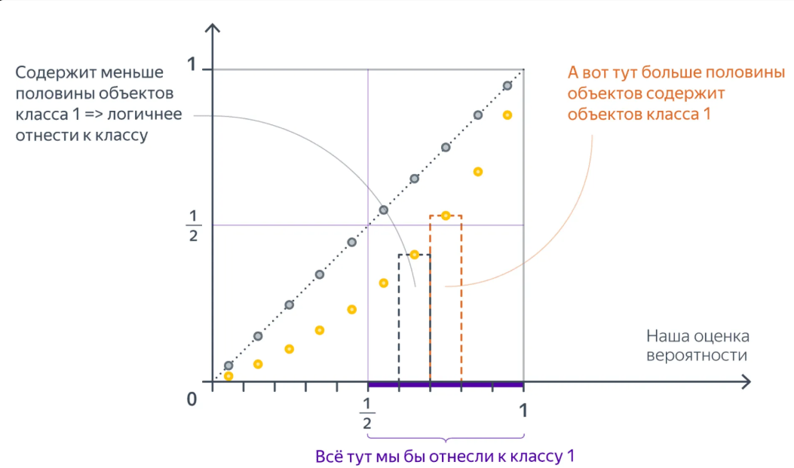

*(По [статье Яндекс.Хендбука 4.4](https://education.yandex.ru/handbook/ml/article/kak-ocenivat-veroyatnosti). Стиль: подробный, с аналогиями, формулами и интуитивным объяснением)*

*Прежде чем переходить к конспекту, необходимо усвоить:*

в обычной жизни мы говорим «у Ивана 50% шанс купить». И это нормально. Но в машинном обучении (и в конспекте) под вероятностью понимается **немного другая вещь**.

Давай разберём разницу между **«шансом для одного»** и **«частотой в группе»**.

**1. В жизни: «шанс для одного» (субъективная вероятность)**

Когда ты говоришь «У Ивана 50% шанс купить», ты имеешь в виду: *«Я не знаю, купит он или нет. Ситуация неопределённая. Я оцениваю его шансы как 50/50»*.

Это **наше знание** об Иване. Иван либо купит (1), либо нет (0). Но мы не знаем, что именно. Поэтому говорим «50%».

**2. В ML (и в конспекте): «частота в группе» (частотная вероятность)**

Когда модель говорит «$p = 0.5$» для Ивана, она имеет в виду **строго математическую вещь**:

> *«Если я возьму 100 клонов Ивана (с абсолютно такими же признаками), то ровно 50 из них купят, а 50 — нет».*

Это **не про Ивана лично**. Это про **группу Иванов**.

**3. Почему мы не можем проверить «шанс для одного»?**

Вот тут кроется главная проблема. Представь, что Иван **купил**.

- Значит ли это, что его «шанс 50%» был правильным? Нет. Он мог купить с вероятностью 100%, а мы просто недооценили.
- А если Иван **не купил**? Значит, «шанс 50%» был неправильным? Нет. Может, у него было 10% шансов, и он просто попал в эти 10%.

**Мы не можем проверить вероятность на одном Иване.** Потому что Иван даёт нам только один бит информации: 0 или 1. Мы не видим «внутреннюю монетку», которая крутится у него в голове.

**4. Как это проверяется? (мысленный эксперимент с клонами)**

Только представь, что мы создали 100 **идентичных клонов Ивана**. У них у всех одинаковый возраст, зарплата, стаж.

Модель смотрит на них и говорит: «Все они с вероятностью 0.5 купят».

- Если **50 клонов купили**, а 50 — нет, модель **честна** (калибрована). Её «50%» сработали идеально.
- Если **80 клонов купили**, модель **занижает**. Она говорила 50%, а реальность дала 80%.
- Если **20 клонов купили**, модель **завышает**. Она говорила 50%, а реальность дала 20%.

Именно поэтому в §1.1 конспекта используется аналогия с «близнецами» и формула $\mathbb{E}\big[y \mid p(x)\big] = p(x)$. Мы проверяем вероятность не на одном Иване, а на **группе похожих объектов**.

**5. Аналогия с монеткой**

Представь, что мы подбрасываем монетку. Вероятность орла — 50%.

- Мы подбросили один раз. Выпал орёл. Значит ли это, что вероятность была 100%? Нет.
- Мы подбросили 100 раз. Орёл выпал 50 раз. Значит, вероятность 50% была честной.
- Мы не можем проверить «честность монетки» по одному броску. Только по серии.

---

## 0. План параграфа

**Зачем это вообще нужно.** Классификатор умеет отвечать «да/нет», но очень часто нам нужна **не только метка, а честная уверенность**: «этот клиент уйдёт с вероятностью 0.7». От такой уверенности зависят решения, где есть **деньги и риск** — одобрить ли кредит, отправить ли письмо клиенту, назначить ли лечение, где поставить порог. Если модель говорит «0.9», а по факту сбывается в 60% случаев, — все эти решения принимаются **неправильно**, хотя формально «модель угадала класс».

Этот параграф — про то, как понять, **честные ли у модели вероятности** («калиброванные» ли они), и как сделать их честными, если нет.

Сегодня разберём:

1. Что значит «вероятность класса», если объект **либо** в классе, **либо** нет
2. **Калибровка** — как проверить, что $p$ честные
3. Почему «логистическая регрессия = вероятности» — **миф с оговорками**
4. Методы калибровки: гистограммная, изотоническая, **Платт**
5. Метрики: ECE / MCE, **Brier score**, log-loss

---

# ЧАСТЬ 1. ЧТО ТАКОЕ ВЕРОЯТНОСТЬ КЛАССА

---

## 1. Интуиция для двух классов

Бинарная классификация: классы $0$ и $1$.

Модель выдаёт число $p(x)$ — «вероятность класса 1».

**Правило здравого смысла:**

если модель говорит «$p = 2/3$», то среди объектов с такой (похожей) оценкой примерно **две трети** должны реально иметь класс 1.

Проще всего думать так: **вероятность — это обещание частоты**. Модель как бы говорит: «среди таких, как этот объект, единичек будет примерно 2 из 3». Калибровка как раз проверяет, **не врёт ли модель в этом обещании**.

На языке математики:

$$
\mathbb{E}\big[y \mid p(x)\big] = p(x)
$$

Словами: **если усреднить реальные метки** $y$ **по всем объектам с одинаковым предсказанием** $p$, среднее должно равняться самому $p$ (обещание модели — 0.7 — должно совпасть с реальной долей единиц в группе похожих объектов, например, 70 из 100).

Функция $p(x)$ — это не что-то абстрактное, а предсказание **доли** единиц. (Подробный разбор этой формулы в числах — в §1.1.)

- Модель говорит **0.7**.
- Мы собираем **100 похожих объектов** (тех, кому модель тоже сказала примерно 0.7 — например, от 0.65 до 0.75).
- Если модель **калибрована**, то примерно **70 из них будут класса 1**, а 30 — класса 0.

> **Аналогия (синоптик).** Синоптик говорит: «дождь с вероятностью 70%». Если прогноз **калиброван**, то из 100 дней с таким прогнозом дождь был примерно в **70**. Если реально дождь случился лишь в **30** из 100 — синоптик **завышает**; если в **90** — **занижает**.

> **Аналогия (врач).** Врач говорит пациенту: «у 8 из 10 людей с такими же анализами диагноз подтверждается». Честный врач = калиброванная модель.

**Численный пример.** Пусть модель поставила вероятность $p = 0.8$ ста объектам. Проверяем факт:

| Сколько из 100 реально класса 1 | Что это значит |
|:---|:---|
| $\approx 80$ | модель **честна** (калибрована) |
| $95$ | модель **занижала** — была слишком осторожной |
| $60$ | модель **завышала** — была слишком самоуверенной |

**Зачем это нужно.** Допустим, решение «позвонить клиенту» принимается при $p \ge 0.5$. Если вероятности завышены, мы звоним людям, которые на самом деле не уйдут → жжём бюджет. Если занижены — теряем клиентов, которых могли удержать. Честные $p$ = правильный выбор порога = деньги.

 

 

**Как читать схему.** Всё, что правее точки $\tfrac12$, модель относит к классу 1 (фиолетовая скобка «Всё тут мы бы отнесли к классу 1»). Слева от $\tfrac12$ единиц меньше половины — логичнее отнести объект к классу 0; справа — больше половины, значит класс 1. Поэтому **честность** $p$ именно в окрестности порога $\tfrac12$ напрямую определяет, **кого** мы назовём «классом 1».

---

### 1.1. Формула в числах (разбираем по шагам)

Формула $\mathbb{E}\big[y \mid p(x)\big] = p(x)$ выглядит абстрактно, но это обычная **арифметика по группам**. Разберём её на примере синоптика — шаг за шагом.

**Что значат символы на практике:**

- $p(x)$ — предсказание модели (у синоптика — «дождь с вероятностью 70%», то есть $p = 0.7$). Относится не к одному дню, а к **целой группе** дней с таким прогнозом.
- $y$ — реальность: метка $1$ (дождь был) или $0$ (дождя не было).
- $\mathbb{E}\big[y \mid \ldots\big]$ — математическое ожидание $y$ при условии, что прогноз равнялся $p$. Простыми словами — **среднее арифметическое реальных меток в этой группе**.

**Шаг 1. Идеальная калибровка.** Возьмём **100 дней**, и пусть на каждый прогноз был $p = 0.7$. Дождь реально прошёл в **70** дней (там $y = 1$), а в **30** — нет (там $y = 0$).

**Левая часть** — среднее реальных меток:

$$
\mathbb{E}\big[y \mid p = 0.7\big] = \frac{70 \cdot 1 + 30 \cdot 0}{100} = \frac{70}{100} = 0.7
$$

**Правая часть** — сама вероятность: $p(x) = 0.7$.

**Итог:** $0.7 = 0.7$ — формула сработала, модель **калибрована**.

**Шаг 2. А если модель врёт?**

**Пример А — синоптик завышает (overconfident).** Говорит $p = 0.9$ на 100 дней, а дождь шёл лишь в 60:

$$
\mathbb{E}\big[y \mid p = 0.9\big] = \frac{60 \cdot 1 + 40 \cdot 0}{100} = 0.6 \ne 0.9
$$

Формула **не работает** — модель слишком самоуверенна.

**Пример Б — синоптик занижает (underconfident).** Говорит $p = 0.3$ на 100 дней, а дождь шёл 50 раз:

$$
\mathbb{E}\big[y \mid p = 0.3\big] = \frac{50 \cdot 1 + 50 \cdot 0}{100} = 0.5 \ne 0.3
$$

Формула **не работает** — модель слишком осторожна.

**Общий вид.** Если в группе $N$ объектов с одинаковым предсказанием $p$, формула превращается в «среднее по корзине»:

$$
\frac{1}{N}\sum_{i=1}^{N} y_i = p
$$

То есть **среднее реальных меток в корзине должно равняться предсказанной вероятности этой корзины**. Именно это и проверяет диаграмма калибровки (§1.2): берём бин, считаем среднее $y$ (жёлтые точки) и среднее $p$ (розовые точки) — и смотрим, совпали ли они.

> **Зачем это нужно.** Такую арифметику полезно уметь прикидывать в голове — она мгновенно показывает, **врёт ли модель и в какую сторону**, ещё до всяких графиков.

---

### 1.2. Диаграмма калибровки (reliability diagram)

**Проблема:** проверить $\mathbb{E}[y\mid p] = p$ напрямую нельзя — все объекты имеют **разные** $p(x)$, и у каждого своя «группа». Решение: собрать похожие предсказания в **корзины** (бины) и сравнивать **средние** внутри корзины.

На практике все $p(x)$ разные → биним отрезок $[0, 1]$:

1. Делим предсказания на бины (равной ширины или равной мощности).
2. В каждом бине считаем:
   - **среднюю предсказанную** $p$ (розовые точки на картинках статьи);
   - **долю реальных единиц** $y$ (жёлтые точки).

**Аналогия:** это как разложить 1000 прогнозов погоды по полочкам «60–70%», «70–80%» и посмотреть, сколько раз реально шёл дождь на каждой полочке. Если на полочке «≈70%» дождь был в 70% случаев — полочка честная.

| Ситуация | Что видно на графике |
|:---|:---|
| **Идеальная калибровка** | жёлтые ≈ розовые (лежат на диагонали $y=p$) |
| Модель **завышает** $p$ | розовые выше жёлтых → порог отсечения надо сдвигать |
| Модель **занижает** $p$ | наоборот |

Как читать: по оси X — что модель **обещала**, по оси Y — что **случилось на самом деле**. Идеал — совпадение, то есть **диагональ** $y = p$.

 

 

**Что на картинке.** Розовые точки — средняя **предсказанная** вероятность $p$ в бине; жёлтые — средняя **истинная** метка $y$ (доля класса 1). Пунктирные рамки — это бины: например, в бин «от $\tfrac14$ до $\tfrac13$» попадают объекты, которым модель предсказала вероятность в этом интервале. Чем ближе жёлтые точки к розовым (к диагонали $y = p$), тем честнее модель.

Модель, у которой предсказанные вероятности совпадают с частотами, называют **калиброванной** (*well-calibrated*).

**Зачем строить эту диаграмму.** Это самый быстрый «рентген» модели: глядя на точки относительно диагонали, сразу видно, врёт ли модель и **в какую сторону** — и стоит ли вообще что-то чинить.

---

## 2. Типичные патологии

### 2.1. Overconfident (слишком уверенный)

Предсказания кучкуются у $0$ и $1$, а по факту ошибок больше, чем «обещает» $p$. Модель кричит «99%!», а ошибается гораздо чаще, чем в 1 случае из 100.

**Аналогия:** студент, который на каждый вопрос отвечает «на 100% уверен», а на деле путает факты. Формально ответы иногда верные, но **уверенность не соответствует знаниям**.

**Кто часто грешит:** сильные модели (нейросети), учившиеся на **жёсткие метки** 0/1, а не на вероятности — loss толкает к крайним ответам. Модель «выучивает» отвечать 0 или 1, потому что так уменьшается ошибка на train.

 

 

**На картинке:** слева модель «уверенно» предсказывает маленькую вероятность, хотя стоило бы усомниться; справа — предсказывает класс 1 **увереннее, чем следовало**. Точки уходят от диагонали $y=p$ к краям — типичная картина для нейросетей, обученных на метки классов, а не на вероятности.

**Чем опасно:** если завышенные $p$ используются для решений (например, «операция при $p>0.9$»), мы будем действовать там, где уверенности на самом деле нет.

### 2.2. Underconfident (неуверенный)

Предсказания тяготеют к **середине** (\~0.5), даже когда класс почти ясен. Модель как будто «боится» сказать 0.99 и жмётся к 0.6.

under

 

 

**На картинке:** неуверенный (underconfident) классификатор — жёлтые точки уходят **под** диагональ $y=p$: модель ставит вероятность класса 1 (и класса 0) менее уверенно, чем могла бы.

**Аналогия:** скромный эксперт, который знает ответ, но из вежливости говорит «ну, наверное, 55%».

**Кто часто грешит:**

- модели, сильно фокусирующиеся на трудной **границе** (идея как у SVM);
- **бэггинг / случайный лес**: среднее многих моделей близко к 1 только если **все** близки к 1 — из-за дисперсии это реже. Усреднение «размывает» уверенность к середине.

**Зачем это знать.** «Overconfident» и «underconfident» — две противоположные болезни. Лечатся они по-разному (главным образом **калибровкой** — Часть 3), поэтому важно понимать, **какая именно** болезнь у модели.

---

# ЧАСТЬ 2. ЛОГИСТИЧЕСКАЯ РЕГРЕССИЯ И «ВЕРОЯТНОСТИ»

---

## 3. Миф: «логистическая регрессия всегда даёт правильные вероятности»

**Откуда миф.** Логистическая регрессия на выходе ставит сигмоиду $\sigma(w^\top x)$, а сигмоида **всегда** даёт число от 0 до 1. Отсюда интуиция «ну раз это число в (0,1), значит это настоящая вероятность». Это **упрощение**.

**Что на самом деле.** В sklearn на простом датасете:

- **без** богатых признаков — модель **неуверенная**, калибровка плохая;
- **с** полиномиальными фичами — смесь: неуверенность в середине + **уверенные ошибки** по краям.

Калибровочные кривые и гистограммы $p$ показывают: «вероятности» из $\sigma(w^\top x)$ **не обязаны** быть честными.

**Аналогия:** сигмоида — это как **шкала 0–100%** на приборе. То, что прибор показывает стрелку в этом диапазоне, **не значит**, что он правильно откалиброван. Стрелка может систематически врать, показывая 90, когда реально 60.

> Сигмоида даёт число в $(0,1)$, но это ещё **не** гарантия калибровки.

**Вывод-мостик:** чтобы понять, когда «вероятности» LR всё-таки хороши, придётся разобраться, **что именно** она минимизирует — об этом §4.

---

## 4. Когда у LR вероятности всё же «хорошие»

**План.** Поймём, почему LR всё-таки часто даёт неплохие вероятности. Ключ — в **функции потерь**, которую она минимизирует.

Логистическая регрессия минимизирует **log-loss / кросс-энтропию**:

$$
L(w) = -\sum_{i=1}^{N}\Big(
y_i\log p_i + (1-y_i)\log(1-p_i)
\Big),
\quad
p_i = \sigma(w^\top x_i)
$$

**Что это за loss простыми словами.** Кросс-энтропия — мера «насколько сильно модель удивилась факту». Если модель сказала $p=0.9$, а класс оказался 1 — удивления мало. Если сказала $p=0.9$, а класс оказался 0 — удивление огромное. Loss — это суммарное «недоумение» модели по всем объектам.

Каждое слагаемое — кросс-энтропия между предсказанием $(p, 1-p)$ и «тривиальным» распределением метки $y$.

**Мысленный эксперимент:** много объектов с **одинаковым** $x$, среди них частота класса 1 равна $\hat\pi$.

**Аналогия.** Представим 100 «близнецов» — объектов с абсолютно одинаковыми признаками. Пусть 70 из них — класса 1, 30 — класса 0, то есть $\hat\pi = 0.7$. Какую $p$ обязана выдать идеальная модель для этой группы?

Кусок loss — кросс-энтропия между $\hat\pi$ и $p(x)$. Она **минимальна**, когда:

$$
p(x) = \hat\pi
$$

**Почему именно так.** Кросс-энтропия — выпуклая функция, и её минимум достигается ровно тогда, когда предсказанная вероятность **совпадает** с эмпирической частотой. Отклонение в любую сторону (сказать 0.5 или 0.9 вместо 0.7) увеличивает штраф.

То есть идеальная LR на «одинаковых» точках выдаёт **эмпирическую долю** единиц — хорошую оценку вероятности.

**Численный пример.** Группа с $\hat\pi = 0.7$:

| Модель говорит $p$ | Хорошо ли? |
|:---|:---|
| $0.7$ | идеально — совпало с частотой, штраф минимален |
| $0.9$ | завышает — лишние «уверенные» промахи на объектах класса 0 |
| $0.5$ | занижает / неуверенна — штраф больше, чем при 0.7 |

Приблизительно то же верно для **близких** точек, если:

1. признаки **хорошие** (классы не перемешаны хаотично);
2. модель **не переобучена** (вероятности не скачут резко от точки к точке).

**Вывод:** LR «калибрована» не магией сигмоиды, а потому что **log-loss** при гладкой модели и разделимых данных подталкивает $p$ к локальным частотам. При бедном $x$ или переобучении — ломается.

> **Зачем это нужно.** Этот механизм объясняет, почему у простых линейных моделей калибровка «бесплатная», а у сложных — ломается. Поняв причину, понимаем и как её чинить (§5–§8).

---

# ЧАСТЬ 3. МЕТОДЫ КАЛИБРОВКИ

---

## 5. Постановка

**Идея в одну фразу:** взять «сырое» число модели и **перевести** его в честную вероятность с помощью простого дополнительного преобразования.

Есть модель, для объекта $x$ выдающая число $s(x)$ (скор или «сырую» вероятность).

Нужно превратить $s$ в **калиброванную** вероятность $p$.

**Аналогия.** Скор $s$ — это показания «сырого» прибора (как термометр, который врёт на пару градусов). Мы не переделываем прибор, а приклеиваем к нему **табличку пересчёта**: «показывает 80 → на самом деле 60». Калибратор — и есть такая табличка.

Калибровку обычно учат на **отложенной** выборке (не на том же train, где учили основную модель).

**Почему на отложенной выборке.** Если учить калибратор на тех же данных, где училась модель, он «подгонится» под уже переобученную модель и переоценит её уверенность. Нужны **свежие** данные (validation set), которых модель не видела.

**Общая схема:**

| Шаг | Что делаем |
|:---|:---|
| 1 | Обучаем основную модель на train |
| 2 | На отложенной выборке считаем её скоры $s(x)$ |
| 3 | Учим калибратор $s \to p$ |
| 4 | В продакшене: модель → $s$ → калибратор → честная $p$ |

### А что значит «учить калибратор» (шаг 3)?

Давай разберёмся, **зачем вообще что-то «учить»**, если у нас уже есть модель, которая выдаёт числа.

Представь, что твоя модель — это **переводчик**, который переводит с русского на английский, но плохо знает английский. Он говорит «I go to cinema yesterday», а надо «I went to the cinema yesterday».

Модель выдаёт скор $s = 0.8$. Но мы уже знаем (из диаграммы калибровки), что это **враньё**: реально 0.8 соответствует 0.6. Модель **систематически завышает**.

Мы не можем переобучить саму модель (это дорого, долго, и она уже обучена). Но мы можем **научить маленькую «заплатку»** — калибратор, который будет **исправлять** её ошибки.

> «Учить калибратор» — значит **найти формулу пересчёта**, которая превращает врущий скор $s$ в честную вероятность $p$.

---

### 5.1. Гистограммная калибровка

**Идея:** разбить диапазон скоров на «полочки» (бины) и на каждой полочке **заменить** скор одной честной частотой, измеренной на отложенных данных.

1. Делим $[0,1]$ (или диапазон $s$) на бины $B_k$.
2. В каждом бине предсказываем **одну** константу $\theta_k$:

$$
p(x) = \theta_k,\quad \text{если } s(x)\in B_k
$$

3. $\theta_k$ подбирают так, чтобы приблизить среднюю метку в бине (по модулю или квадрату ошибки). Проще всего: $\theta_k$ = **доля класса 1** среди объектов бина.

**Аналогия.** Это как таблица пересчёта «показание весов → реальный вес»: для диапазона «70–80%» ставим одно число — реальную долю, которая там наблюдалась.

| Плюсы | Минусы |
|:---|:---|
| Просто и понятно | Нужно выбрать число бинов |
|    | Только **дискретное** множество вероятностей |

**Компромисс.** Много бинов → точнее, но мало объектов в каждом → шумно. Мало бинов → гладко, но грубо. Это тот же выбор, что при построении обычной гистограммы.

**Пример.** Представим, что мы работаем в компании, которая борется с оттоком клиентов. У нас есть модель, которая предсказывает вероятность ухода клиента (класс 1 — уйдёт, класс 0 — останется). Модель уже обучена, и мы хотим её откалибровать.

**Шаг 1. Берём отложенную выборку.** У нас есть **1000 клиентов**, которых модель не видела при обучении. Для каждого из них мы знаем:

- **скор модели** $s(x)$ — то, что она предсказала (например, 0.85, 0.32, 0.67...);
- **реальную метку** $y$ — ушёл клиент (1) или остался (0).

**Шаг 2. Делим на бины (корзины).** Делим весь диапазон скоров $[0,\ 1]$ на 5 равных интервалов (бинов) по 20%:

| Бин | Диапазон скоров | Сколько клиентов попало |
|:---|:---|:---|
| $B_1$ | $[0.0,\ 0.2)$ | 200 |
| $B_2$ | $[0.2,\ 0.4)$ | 200 |
| $B_3$ | $[0.4,\ 0.6)$ | 200 |
| $B_4$ | $[0.6,\ 0.8)$ | 200 |
| $B_5$ | $[0.8,\ 1.0]$ | 200 |

**Шаг 3. Считаем реальную частоту в каждом бине.** Теперь смотрим на реальные метки этих клиентов. Допустим, получилась такая картина:

| Бин | Диапазон | Ср. скор в бине (обещание) | Реально ушло (класс 1) | Реальная доля $\theta_k$ |
|:---|:---|:---|:---|:---|
| $B_1$ | $[0.0,\ 0.2)$ | 0.10 | 10 из 200 | **0.05** |
| $B_2$ | $[0.2,\ 0.4)$ | 0.30 | 40 из 200 | **0.20** |
| $B_3$ | $[0.4,\ 0.6)$ | 0.50 | 80 из 200 | **0.40** |
| $B_4$ | $[0.6,\ 0.8)$ | 0.70 | 120 из 200 | **0.60** |
| $B_5$ | $[0.8,\ 1.0]$ | 0.90 | 140 из 200 | **0.70** |

**Что мы видим?** Модель **завышает** вероятности. Она говорит 0.9, а реально уходит только 70%. Говорит 0.5, а реально уходит 40%.

**Шаг 4. Строим таблицу пересчёта (калибратор).** Теперь мы просто **заменяем** скор модели на реальную долю, которую посчитали:

| Если модель сказала (скор $s$) | Мы выдаём честную вероятность $p$ |
|:---|:---|
| $s \in [0.0,\ 0.2)$ | **0.05** |
| $s \in [0.2,\ 0.4)$ | **0.20** |
| $s \in [0.4,\ 0.6)$ | **0.40** |
| $s \in [0.6,\ 0.8)$ | **0.60** |
| $s \in [0.8,\ 1.0]$ | **0.70** |

**Шаг 5. Применяем в продакшене.** Приходит новый клиент. Модель говорит: «вероятность ухода 0.85».

- Смотрим в таблицу: 0.85 попадает в бин $[0.8,\ 1.0]$.
- Калибратор говорит: «Ага, в этом бине реальная доля уходов — 0.70».
- Мы **выдаём честную вероятность 0.70**, а не 0.85.

**В чём суть?** Мы не пытаемся исправить каждый отдельный объект. Мы **группируем** объекты с похожими скорами в бины и говорим: «для всей этой группы честная вероятность — вот такая».

**Аналогия с весами.** У тебя есть врущие весы. Ты взвешиваешь 100 предметов.

- Те, что весили от 70 до 80 кг, в реальности весили около 65 кг.
- Те, что весили от 80 до 90 кг, в реальности весили около 70 кг.

Ты составляешь табличку: «если весы показывают 70–80, реальный вес — 65». Это и есть гистограммная калибровка.

**Минусы:**

1. **Нужно выбрать число бинов.** Если сделать 100 бинов, в каждом будет по 2 человека — будет шум. Если сделать 2 бина — будет слишком грубо.
2. **Ступенчатость.** Мы выдаём только дискретные значения (0.05, 0.20, 0.40...). Если модель сказала 0.79, мы всё равно выдадим 0.60, потому что она попала в бин $[0.6,\ 0.8)$.

---

### 5.2. Изотоническая регрессия

**Идея.** Не фиксировать границы заранее, а подобрать их самим. Но при этом наложить **монотонность**:

> *Если скор модели больше, то и честная вероятность должна быть не меньше.*

**Почему это обязательно?** Представь, что модель сказала для Ивана 0.8, а для Петра 0.6. Если после калибровки Иван получит 0.5, а Пётр 0.7 — это **сломает всю логику ранжирования**. Мы больше не сможем сказать, кто из них более вероятный кандидат на уход.

**Аналогия (лестница):**

- Гистограмма — это ступеньки **фиксированной** ширины (как в обычной лестнице).
- Изотоника — это **подгоняемая** лестница: ступеньки сами находят удобные границы, но обязаны **не спускаться вниз**. Если мы идём вправо (скор растёт), мы либо поднимаемся, либо стоим на месте. Но никогда не падаем.

**Как это работает на примере (алгоритм PAVA).** Представь, что у нас есть 5 групп объектов с разными скорами. Мы отсортировали их по возрастанию скора и посчитали реальную долю класса 1 в каждой группе:

| Группа | Скор $s$ | Реальная доля $y$ | Монотонно? |
|:---|:---|:---|:---|
| 1 | 0.1 | 0.1 | Да |
| 2 | 0.3 | 0.3 | Да |
| 3 | 0.5 | **0.2** | **Нет! Нарушение!** |
| 4 | 0.7 | 0.6 | Да |
| 5 | 0.9 | 0.8 | Да |

Смотри: в группе 2 реальная доля 0.3, а в группе 3 — 0.2. Скор вырос (0.3 → 0.5), а вероятность **упала** (0.3 → 0.2). Это **нарушение монотонности**.

**Что делает изотоническая регрессия (алгоритм PAVA)?** Она берёт «нарушителей» (группы 2 и 3) и **объединяет их в одну группу**, усредняя их реальные доли:

- Было: группа 2 = 0.3, группа 3 = 0.2.
- Стало: объединённая группа 2+3 = (0.3 + 0.2) / 2 = **0.25**.

Теперь таблица выглядит так:

| Группа | Скор $s$ | Реальная доля $y$ (после PAVA) | Монотонно? |
|:---|:---|:---|:---|
| 1 | 0.1 | 0.1 | Да |
| 2+3 | 0.3–0.5 | 0.25 | Да |
| 4 | 0.7 | 0.6 | Да |
| 5 | 0.9 | 0.8 | Да |

Теперь всё монотонно: чем выше скор, тем выше (или равна) вероятность.

**Аналогия:** это как если бы у нас была кривая, которая где-то провисла. Мы берём и «натягиваем» её, чтобы она не шла вниз. Там, где она шла вниз, мы просто срезаем этот бугорок и выравниваем.

| Плюсы | Минусы |
|:---|:---|
| Гибче, чем гистограмма (границы подстраиваются под данные) | Склонна к переобучению (если данных мало, может выучить шум) |
| Гарантирует монотонность (не ломает ранжирование) | Выдаёт **кусочно-постоянную** функцию (ступеньки), а не плавную кривую |
| Не нужно выбирать число бинов вручную | Требует достаточно данных для надёжной оценки |

**Сравнение с гистограммой:**

- **Гистограмма:** мы сами говорим — «будем считать среднее в интервалах $[0,\ 0.2]$, $[0.2,\ 0.4]$, ...». Это как нарезать хлеб ножом по линейке.
- **Изотоника:** мы говорим — «найди сама такие интервалы, чтобы внутри них вероятность была одинаковой и чтобы она не убывала». Это как если бы хлеб сам нарезался на куски там, где это удобно.

**Итог.** Изотоническая регрессия — это **более гибкий** метод калибровки, чем гистограмма. Она подстраивает границы бинов под данные, но **обязательно** следит за тем, чтобы больший скор давал большую (или равную) вероятность. Это позволяет сохранить правильное ранжирование объектов, что критично для бизнеса (например, чтобы звонить в первую очередь тем, у кого выше риск ухода).

---

### 5.3. Калибровка Платта (Platt scaling)

**Идея:** подобрать всего **два числа** $A$ и $B$, которые растягивают/сдвигают скор так, чтобы получилась честная вероятность.

Поверх скора / «вероятности» $s$ ставят **сигмоиду**:

$$
p(x) = \sigma\big(As(x) + B\big) = \frac{1}{1 + e^{-(As(x)+B)}}
$$

**Чтение формулы простыми словами:**

- $A$ — **наклон**: во сколько раз «сжать/растянуть» скор. Большой $A$ → резкий переход (уверенная модель), маленький $A$ → плавный;
- $B$ — **сдвиг**: перемещает точку «50/50» влево-вправо, исправляя систематический перекос;
- сигмоида $\sigma$ превращает любое число $As+B$ в значение от 0 до 1.

| Когда хорошо | Когда слабо |
|:---|:---|
| Часто помогает **SVM** (скоры → вероятности) | На сложных классификаторах может не хватить |
| Хорошо, если внутри каждого класса $s$ ≈ нормаль с **одинаковой** дисперсией | Иначе лучше изотоника / другие методы |

**Компромисс метода:** мало параметров (2) → мало переобучается, но и **негибкий** (форму связи задаём заранее — сигмоиду). Изотоника гибче, но «жаднее» к данным.

Обобщение: **бета-калибровка** (в статье — ссылка на обзор).

**Пример.** Представь, что SVM — это **судья на соревнованиях**, который ставит оценки от 0 до 10, но не говорит, что они значат в процентах.

**Шаг 1. Проблема: у нас есть только «относительность».** Судья (SVM) посмотрел на три письма и поставил оценки:

- Письмо А: **5.0**
- Письмо Б: **2.0**
- Письмо В: **−1.0**

Что мы знаем? Только то, что А — «самый спамный», Б — «средний», В — «скорее нормальный». Это **относительная мера** (ранжирование).

Мы **не знаем**, что значит 5.0. Это 99% спама? Или 60%? Судья просто сравнил их между собой. А нам для бизнеса нужны **абсолютные вероятности**, чтобы решить, сколько денег потратить на фильтрацию.

**Шаг 2. Решение: нанимаем «переводчика» (калибратор Платта).** Мы не переучиваем судью. Мы нанимаем переводчика, который знает статистику этого конкретного судьи. Переводчика описывает формула:

$$
p = \sigma(As+B) = \frac{1}{1 + e^{-(As+B)}}
$$

где:

- $s$ — оценка судьи (скор SVM);
- $A$ — «коэффициент растяжения» (насколько сильно сжать или растянуть оценки);
- $B$ — «сдвиг» (где находится точка 50/50);
- $\sigma$ — функция, которая превращает любое число в вероятность от 0 до 1.

**Шаг 3. Обучение переводчика (поиск** $A$ **и** $B$**).** Мы берём **отложенную выборку** (письма, которые судья не видел) и смотрим на реальность:

- когда судья ставил оценки около **2.0**, реально спамом оказывалось **60%** писем;
- когда около **5.0**, реально спамом оказывалось **90%** писем;
- когда около **−1.0**, реально спамом оказывалось **5%** писем.

Алгоритм подбирает такие $A$ и $B$, чтобы формула Платта выдавала именно эти проценты (минимизируя log-loss).

**Допустим, алгоритм нашёл:** $A = 0.8$, $B = -1.0$.

**Шаг 4. Применяем в продакшене (абсолютные вероятности).** Приходит новое письмо. Судья (SVM) говорит: «оценка **5.0**». Переводчик (Платт) считает:

1. Внутренняя часть: $0.8 \cdot 5.0 - 1.0 = 4.0 - 1.0 = 3.0$.
2. Сигмоида: $p = \dfrac{1}{1 + e^{-3.0}} = \dfrac{1}{1 + 0.05} \approx 0.95$.

**Итог:** судья сказал «5.0» (просто число). Переводчик сказал: «это **95%** вероятности спама». Теперь мы можем принимать бизнес-решения.

**Шаг 5. Проверяем на других письмах:**

- Письмо Б (оценка **2.0**): $0.8 \cdot 2.0 - 1.0 = 1.6 - 1.0 = 0.6$. Сигмоида: $p \approx 0.64$ (64%).
- Письмо В (оценка **−1.0**): $0.8 \cdot (-1.0) - 1.0 = -0.8 - 1.0 = -1.8$. Сигмоида: $p \approx 0.14$ (14%).

**Что мы получили?**

- **Ранжирование сохранилось:** А (0.95) > Б (0.64) > В (0.14). Порядок не сломался.
- **Появилась абсолютная мера:** теперь мы знаем, что А — это 95%, а не просто «больше, чем Б».
- $A$ **и** $B$ **сделали всю работу:** $A$ «сжал» или «растянул» шкалу, чтобы она соответствовала реальности, а $B$ сдвинул её так, чтобы точка 50% была там, где нужно.

**Итог.** Метод Платта — это **мост** между относительным миром модели (скоры SVM) и абсолютным миром бизнеса (вероятности). Мы не пытаемся понять, что значит «5.0» само по себе. Мы просто подбираем два числа ($A$ и $B$), которые **знают статистику** и переводят любую оценку судьи в честную вероятность.

---

# ЧАСТЬ 4. КАК ИЗМЕРИТЬ КАЛИБРОВКУ

---

## 6. ECE и MCE

### 6.1. ECE

**Зачем числа.** Диаграмма калибровки хороша на глаз, но нужно **одно число**, чтобы сравнивать модели и следить за метрикой. Отсюда ECE и MCE.

Снова биннинг по предсказанным $p$. В бине $B_k$:

- $\bar p_k$ — среднее предсказание;
- $\bar y_k$ — средняя метка (доля единиц в бине).

**Expected Calibration Error (ожидаемая ошибка калибровки):**

$$
\mathrm{ECE} = \sum_{k} \frac{|B_k|}{N}\,\big|\bar y_k - \bar p_k\big|
$$

**Простыми словами:** в каждом бине берём, **насколько разошлись** «что обещали» ($\bar p_k$) и «что случилось» ($\bar y_k$), и усредняем эту разницу по бинам **с весом** (чем больше объектов в бине, тем важнее его ошибка).

**__Пример расчёта ECE до и после калибровки__**

Представь, что у нас есть **обученная модель** (например, нейросеть), которая выдаёт «сырые» скоры.   Мы взяли **отложенную (валидационную) выборку** из 1000 клиентов  . У нас есть:

- **скоры модели** $s$ (то, что она предсказала, например, 0.85, 0.32, 0.67...);
- **реальные метки** $y$ (ушёл клиент — 1, остался — 0).

Наша задача — понять, насколько эти скоры честные. Считаем ECE.

**Шаг 1. Разбиваем на бины (корзины).** Мы берём весь диапазон скоров от 0 до 1 и делим его на **10 равных интервалов** (бинов) по 0.1.

| Бин | Диапазон скоров |
|:---|:---|
| 1 | $[0.0,\ 0.1)$ |
| 2 | $[0.1,\ 0.2)$ |
| 3 | $[0.2,\ 0.3)$ |
| ... | ... |
| 10 | $[0.9,\ 1.0]$ |

**Шаг 2. Раскладываем объекты по бинам.** Мы берём каждый из 1000 объектов и смотрим на его скор $s$. Если скор равен 0.85, он попадает в **бин 9** $[0.8,\ 0.9)$. Если скор 0.32 — в **бин 4** $[0.3,\ 0.4)$.

Допустим, получилось такое распределение (для простоты возьмём 5 бинов):

| Бин | Диапазон | Сколько объектов попало |
|:---|:---|:---|
| 1 | $[0.0,\ 0.2)$ | 200 |
| 2 | $[0.2,\ 0.4)$ | 200 |
| 3 | $[0.4,\ 0.6)$ | 200 |
| 4 | $[0.6,\ 0.8)$ | 200 |
| 5 | $[0.8,\ 1.0]$ | 200 |
| **Итого** |    | **1000** |

**Шаг 3. Считаем метрики внутри каждого бина.** Теперь самое важное. Для **каждого бина** мы считаем три числа:

1. **средний скор** $\bar p_k$ — то, что модель «обещала» в среднем;
2. **реальная доля класса 1** $\bar y_k$ — то, что «случилось на самом деле»;
3. **вес бина** $|B_k| / N$ — доля объектов от общего числа.

Посчитаем для каждого бина:

Средний скор -  это сумма всех скоров в бине деленное на количество

- **Бин 1** $[0.0,\ 0.2)$**:** 200 объектов; средний скор $\bar p_1 = 0.10$; реально ушло 10 человек, значит $\bar y_1 = 10/200 = 0.05$; ошибка $|\bar y_1 - \bar p_1| = |0.05 - 0.10| = 0.05$; вес $200/1000 = 0.2$.
- **Бин 2** $[0.2,\ 0.4)$**:** 200 объектов; $\bar p_2 = 0.30$; реально ушло 40, значит $\bar y_2 = 40/200 = 0.20$; ошибка $|0.20 - 0.30| = 0.10$; вес $0.2$.
- **Бин 3** $[0.4,\ 0.6)$**:** 200 объектов; $\bar p_3 = 0.50$; реально ушло 80, значит $\bar y_3 = 80/200 = 0.40$; ошибка $|0.40 - 0.50| = 0.10$; вес $0.2$.
- **Бин 4** $[0.6,\ 0.8)$**:** 200 объектов; $\bar p_4 = 0.70$; реально ушло 120, значит $\bar y_4 = 120/200 = 0.60$; ошибка $|0.60 - 0.70| = 0.10$; вес $0.2$.
- **Бин 5** $[0.8,\ 1.0]$**:** 200 объектов; $\bar p_5 = 0.90$; реально ушло 140, значит $\bar y_5 = 140/200 = 0.70$; ошибка $|0.70 - 0.90| = 0.20$; вес $0.2$.

**Шаг 4. Считаем ECE.** Теперь мы просто суммируем **произведения веса на ошибку** для каждого бина:

$$
\mathrm{ECE} = \sum_k \text{Вес}_k \cdot \text{Ошибка}_k
$$

- Бин 1: $0.2 \cdot 0.05 = 0.01$
- Бин 2: $0.2 \cdot 0.10 = 0.02$
- Бин 3: $0.2 \cdot 0.10 = 0.02$
- Бин 4: $0.2 \cdot 0.10 = 0.02$
- Бин 5: $0.2 \cdot 0.20 = 0.04$

**Суммируем:** $0.01 + 0.02 + 0.02 + 0.02 + 0.04 = 0.11$.

**Итог: ECE = 0.11 (или 11%).**

**Что это значит?** Мы получили **baseline** (точку отсчёта). Модель в среднем врёт на **11%**. Причём мы видим, что хуже всего дела обстоят в бине 5 (там ошибка 0.20 — модель сильно завышает, когда говорит «0.9»).

Теперь мы обучаем калибратор на этой же отложенной выборке. А затем берём **отдельную тестовую выборку** (которую не использовали ни для обучения модели, ни для обучения калибратора) и на ней считаем финальный ECE, прогоняем через «модель → калибратор» и получаем **новые вероятности** $p$. Снова строим бины (объекты могут перераспределиться!) и снова считаем ECE.

**Сравниваем:**

- до калибровки: ECE = 0.11;
- после калибровки: ECE = 0.03;
- **вывод:** калибровка сработала! Ошибка уменьшилась почти в 4 раза.

### 6.2. MCE

**Maximum Calibration Error (максимальная ошибка):**

MCE=max⁡k ∣yˉk−pˉk∣MCE=*k*max​​*y*ˉ​*k*​−*p*ˉ​*k*​​

Это **худший бин** — самый большой промах. Отвечает на вопрос «где модель врёт сильнее всего».

**Численный пример.** Два бина:

| **Бин** | **pˉk*p*ˉ​*k*​ (обещали)** | **yˉk*y*ˉ​*k*​ (случилось)** | **∣yˉk−pˉk∣∣*y*ˉ​*k*​−*p*ˉ​*k*​∣** | **Доля объектов** |
|----|----|----|----|----|
| 1 | 0.70 | 0.60 | 0.10 | 0.5 |
| 2 | 0.90 | 0.95 | 0.05 | 0.5 |

Тогда ECE=0.5⋅0.10+0.5⋅0.05=0.075ECE=0.5⋅0.10+0.5⋅0.05=0.075, а MCE=max⁡(0.10, 0.05)=0.10MCE=max(0.10, 0.05)=0.10.

**Минус:** внутри бина можно предсказывать как угодно (хоть константой), метрика смотрит только на средние — тонкие ошибки внутри бина не видит. **Аналогия:** средняя температура по больнице может быть нормальной, хотя в одной палате все с жаром. ECE — как раз такой «средний по палатам».

**Пример**

MCE показывает **худший бин** — тот, где модель соврала сильнее всего. Это критично для бизнеса, потому что иногда одна плохая зона может стоить очень дорого.

Давай снова возьмём нашу **валидационную выборку из 1000 клиентов** и те же **5 бинов**. У нас уже есть посчитанные ошибки для каждого бина из прошлого примера.

**Шаг 1. Вспоминаем таблицу с ошибками (до калибровки).** Вот эта таблица:

| **Бин** | **Диапазон** | **Обещали (pˉk*p*ˉ​*k*​)** | **Случилось (yˉk*y*ˉ​*k*​)** | **Ошибка (∣yˉk−pˉk∣∣*y*ˉ​*k*​−*p*ˉ​*k*​∣)** |
|----|----|----|----|----|
| 1 | [0.0, 0.2)[0.0, 0.2) | 0.10 | 0.05 | **0.05** |
| 2 | [0.2, 0.4)[0.2, 0.4) | 0.30 | 0.20 | **0.10** |
| 3 | [0.4, 0.6)[0.4, 0.6) | 0.50 | 0.40 | **0.10** |
| 4 | [0.6, 0.8)[0.6, 0.8) | 0.70 | 0.60 | **0.10** |
| 5 | [0.8, 1.0][0.8, 1.0] | 0.90 | 0.70 | **0.20** |

**Шаг 2. Применяем формулу MCE.** Формула очень простая — **найди самую большую ошибку среди всех бинов и возьми именно её**.

**Обрати внимание:** здесь **НЕ НУЖЕН ВЕС!** Мы не умножаем на долю объектов, а просто ищем **максимальное значение** в колонке «ошибка».

- Бин 1: 0.05
- Бин 2: 0.10
- Бин 3: 0.10
- Бин 4: 0.10
- Бин 5: **0.20** ← это самое большое число.

**Итог: MCE = 0.20 (или 20%).**

**Шаг 3. Что это значит на практике?** MCE = 0.20 говорит нам: **«есть зона, где модель врёт на 20%»**.

В нашем случае это **бин 5** (диапазон [0.8, 1.0][0.8, 1.0]). Модель говорит клиентам: «вы уйдёте с вероятностью 90%!», а реально уходит только 70%. Это очень опасная зона, потому что именно здесь мы принимаем самые важные решения (например, тратим большие деньги на удержание).

**Почему MCE важен?** Представь, что в бине 5 было бы не 200 объектов, а всего 2.

- **ECE** бы сильно упал (вес этого бина стал бы крошечным: 2/1000=0.0022/1000=0.002). ECE сказал бы: «в среднем всё хорошо».
- **MCE** бы остался **0.20**. Он бы сказал: «да, в среднем хорошо, но в этой конкретной зоне мы врём на 20%, и это опасно!».

Именно поэтому MCE используют как «страховку». Он не даёт забыть про плохие зоны, даже если они маленькие.

**Шаг 4. Считаем MCE после калибровки.**

Теперь мы:

1. **Обучаем калибратор** (например, Платт) на **валидационной** выборке — той же, где считали baseline MCE.
2. Берём **отдельную тестовую выборку** (которую не использовали ни для обучения модели, ни для обучения калибратора).
3. Прогоняем тестовую выборку через связку **«модель → калибратор»** и получаем **новые вероятности** p*p*.
4. Снова строим бины (объекты могут перераспределиться!) и считаем MCE.

Допустим, после калибровки таблица стала такой:

| **Бин** | **Диапазон** | **Обещали (pˉk*p*ˉ​*k*​)** | **Случилось (yˉk*y*ˉ​*k*​)** | **Ошибка (∣yˉk−pˉk∣∣*y*ˉ​*k*​−*p*ˉ​*k*​∣)** |
|----|----|----|----|----|
| 1 | [0.0, 0.2)[0.0, 0.2) | 0.05 | 0.05 | **0.00** |
| 2 | [0.2, 0.4)[0.2, 0.4) | 0.20 | 0.20 | **0.00** |
| 3 | [0.4, 0.6)[0.4, 0.6) | 0.40 | 0.40 | **0.00** |
| 4 | [0.6, 0.8)[0.6, 0.8) | 0.60 | 0.60 | **0.00** |
| 5 | [0.8, 1.0][0.8, 1.0] | 0.70 | 0.70 | **0.00** |

**Считаем MCE:** max⁡(0.00,0.00,0.00,0.00,0.00)=0.00max(0.00,0.00,0.00,0.00,0.00)=0.00.

**Сравниваем:**

- до калибровки (**на валидации**): MCE = 0.20;
- после калибровки (**на тесте**): MCE = 0.00;
- **вывод:** калибровка устранила самую опасную зону. Теперь модель не врёт даже там, где раньше ошибалась на 20%.

---

> **Важно (о разделении выборок).** Baseline MCE считается на **валидационной** выборке, а финальный MCE после калибровки — на **отдельной тестовой** выборке. Это нужно, чтобы избежать утечки данных: калибратор не должен «видеть» те объекты, на которых мы его проверяем. В примере выше для наглядности использованы обе выборки, но в реальном пайплайне их должно быть две.

---

## 7. Brier score 

**Идея.** Штрафовать модель за **промах в вероятности**, а не за неверный класс. Метрика складывает квадраты разниц между предсказанием и фактом.

$$
\mathrm{BS} = \frac{1}{N}\sum_{i=1}^{N}\big(p(x_i) - y_i\big)^2
$$

Это MSE между вероятностью и меткой: обычная среднеквадратичная ошибка, только в роли «предсказания» — вероятность $p$, а в роли «истины» — метка $y \in {0, 1}$.

**Аналогия.** Это как оценивать прогноз погоды по квадрату расстояния между «обещанным процентом дождя» и фактом (0 — дождя не было, 1 — был). Сказал $0.8$, а дождя не было → штраф $(0.8-0)^2 = 0.64$. Сказал $0.5$ → штраф меньше.

**Зачем он про калибровку:** если таргеты полностью случайны, $P(y=1)=\frac12$, калиброванная модель должна всегда говорить $p=\frac12$, и тогда

$$
\mathrm{BS} = \tfrac14
$$

**Почему так.** Если сигнала нет, честный ответ — «монетка», $p=\frac12$. Тогда с вероятностью $1/2$ метка $1$ → промах $(1-\frac12)^2 = \frac14$, а с вероятностью $1/2$ метка $0$ → промах $(0-\frac12)^2 = \frac14$. В среднем выходит $\frac14$ — «эталон беззнания».

Если где-то выдать p
e \frac12 (соврать не ровно $1/2$), локально квадратичный штраф в среднем **хуже**, чем у константы $\frac12$: любое самоуверенное отклонение от монетки при отсутствии сигнала только увеличивает ошибку.

**Пример**

Представь, что у нас есть модель, которая для каждого клиента выдаёт вероятность ухода $p$, и **отложенная выборка** из нескольких клиентов (чем больше объектов, тем точнее, но для разбора хватит четырёх). У нас есть предсказанные вероятности $p$ и реальные метки $y$.

**Шаг 1. Берём данные.** Пусть для четырёх клиентов получилось так:

| Клиент | Предсказание $p$ | Реальная метка $y$ |
|:---|:---|:---|
| А | 0.9 | 1 (ушёл) |
| Б | 0.6 | 0 (остался) |
| В | 0.2 | 0 (остался) |
| Г | 0.8 | 1 (ушёл) |

**Шаг 2. Считаем квадрат промаха для каждого объекта** — то же самое, что MSE для одного предсказания, $(p - y)^2$:

- А: $(0.9 - 1)^2 = (-0.1)^2 = 0.01$
- Б: $(0.6 - 0)^2 = 0.6^2 = 0.36$
- В: $(0.2 - 0)^2 = 0.2^2 = 0.04$
- Г: $(0.8 - 1)^2 = (-0.2)^2 = 0.04$

**Шаг 3. Усредняем по всем объектам** (это и есть весь Brier score):

$$
\mathrm{BS} = \frac{0.01 + 0.36 + 0.04 + 0.04}{4} = \frac{0.45}{4} = 0.1125
$$

**Итог: BS ≈ 0.1125.**

**Что это значит?** Brier score — это «среднеквадратичный штраф за вероятностный прогноз». Он **всегда ≥ 0**, и чем **меньше**, тем лучше. Ноль был бы у идеальной модели (всегда говорит $p=1$ на единицах и $p=0$ на нулях).

Обрати внимание на два ориентира:

- если модель всегда отвечает $p = 0.5$, то $\mathrm{BS} = 0.25$ (это «эталон беззнания» для $P(y=1)=\frac12$ из формулы выше);
- наша модель дала 0.1125 — **меньше 0.25**, значит она **лучше монетки** и хоть немного, но улавливает сигнал.

**Наглядно по объектам.** Самый большой вклад дал клиент Б (0.36): модель сказала «60% уйдёт», а он остался. Чем увереннее модель ошибается, тем дороже ей обходится промах — это квадратичный штраф, и он растёт очень быстро.

Можно вместо квадрата взять **log-loss**:

$$
\mathrm{LL} = -\frac{1}{N}\sum_{i}\Big(
y_i\log p_i + (1-y_i)\log(1-p_i)
\Big)
$$

**Ограничение (как у LR):** для гладких модели и данных Brier / log-loss адекватны; при резком переобучении или плохих признаках «хороший» score ≠ идеальная калибровка на всех регионах.

---

## 8. Многоклассовый случай (вопрос статьи)

**Проблема.** Всё выше было про 2 класса. А если классов $K > 2$ (например, 10 цифр или 5 категорий товара)? Как тогда понять, что модель калибрована?

Статья оставляет на размышление:

- что значит калибровка при $K>2$?
- как измерить численно?
- как калибровать произвольный классификатор?

**Интуиция.** Теперь модель выдаёт **вектор** вероятностей $(p_1, \ldots, p_K)$, и они суммируются в 1. Честная модель — это когда «обещанные» доли по каждому классу совпадают с реальными частотами. **Аналогия:** раньше мы проверяли одну «полочку» (да/нет), теперь — сразу несколько ящиков, и в сумме по ящикам должно быть ровно целое.

Кратко для ориентира (сверх статьи, одной фразой): часто требуют, чтобы для каждого класса условная частота совпадала с предсказанной вероятностью (или калибровали вектор вероятностей); метрики обобщают ECE/Brier. Детали — в туториалах по calibration.

---

# ЧАСТЬ 5. ИТОГИ

---

## 9. Ключевые выводы

**Весь конспект одной историей.** Модель выдаёт «уверенность» — число от 0 до 1. Вопрос один: **честное ли это число?** Честное — если обещание совпадает с реальной частотой (это показывают диаграмма калибровки, ECE/MCE, Brier). Сигмоида сама по себе честности не гарантирует, хотя log-loss часто к ней подталкивает. Если модель врёт (**overconfident** — загибает к краям, **underconfident** — жмётся к середине), лечим это **калибровкой** (гистограмма → изотоника → Platt), обучая её на **отложенной** выборке.

 1. «Вероятность $p$» честна, если среди объектов с такой $p$ доля класса ≈ $p$
 2. Смотри **диаграмму калибровки** (бины: среднее $p$ vs доля $y$)
 3. **Overconfident** — края; **underconfident** — серединка
 4. Сигмоида / LR ≠ автоматическая калибровка
 5. LR калибруется лучше, когда log-loss + хорошие признаки + нет дикого переобучения
 6. Калибровка: гистограмма → изотоника → Platt
 7. Учи калибратор на **отложенной** выборке
 8. Метрики: ECE/MCE, Brier, log-loss
 9. ECE смотрит только средние по бинам — не всевидящая
10. Для принятия решений (порог, риски) калибровка часто важнее «просто accuracy»

---

## 10. Шпаргалка формул

| Что | Формула |
|:---|:---|
| Идеальная калибровка | $\mathbb{E}[y\mid p(x)] = p(x)$ |
| Log-loss (LR) | $-\sum\big(y\log p+(1-y)\log(1-p)\big)$ |
| Platt | $p=\sigma(As+B)$ |
| ECE | $\sum_k \frac{\lvert B_k\rvert}{N}\lvert\bar y_k-\bar p_k\rvert$ |
| MCE | $\max_k\lvert\bar y_k-\bar p_k\rvert$ |
| Brier | $\frac{1}{N}\sum(p_i-y_i)^2$ |

---

## 11. Связь с другими конспектами

| Тема | Файл |
|:---|:---|
| Log-loss, сигмоида, LR | `Линейные модели.md` |
| Порог, precision/recall, AUC | `Конспект: Метрики классификации и регрессии.md` |
| Случайный лес → underconfident | `Конспект: Ансамбли...` |
| Val/test для калибровки | `Конспект: Кросс-валидация.md` |

---

## 12. Весь пайплайн

Теперь давай чётко разберём **порядок действий (пайплайн)**, как это выглядит на практике. Это ровно то, что описано в **§5 (Постановка)** твоего конспекта.

Представь, что ты работаешь в компании. У тебя уже есть обученная модель (например, логистическая регрессия или нейросеть), но ты подозреваешь, что она врёт с вероятностями. Вот твой пошаговый план:

### Шаг 1. Подготовка данных (разделение выборки)

Ты не можешь калибровать модель на тех же данных, где она училась. Поэтому ты делишь данные на три части:

- **Train** (обучающая) — на ней училась модель. Мы её больше не трогаем.
- **Validation / Calibration** (отложенная) — **свежие данные**, которые модель не видела. Они нужны нам, чтобы обучить калибратор.
- **Test** (тестовая) — ещё одни свежие данные, чтобы в конце проверить, что калибратор сработал.

*(В реальности часто используют кросс-валидацию, но для понимания сути хватит трёх частей).*

### Шаг 2. Получение «сырых» скоров

Ты берёшь свою обученную модель и прогоняешь её на **validation (отложенной) выборке**.

- Модель выдаёт для каждого объекта свой **скор** $s$ (например, 0.85, 0.32, 0.67...). Это «сырое» число, которому пока нельзя доверять.
- У тебя также есть **реальные метки** $y$ (0 или 1) для этих объектов.

  

### **Шаг 2.5 (ПРОПУЩЕННЫЙ). Диагностика (Проверка калибровки).**

- Берем Validation-выборку.
- Строим **диаграмму калибровки** (§1.2) и считаем **ECE** (§6).
- **Принимаем решение:**
  - *Если ECE маленький (например, 0.01)* → Модель уже откалибрована. **Калибровка не нужна.** Переходим сразу к Шагу 6 (Внедрение).
  - *Если ECE большой (например, 0.15)* → Модель врет. **Нужно лечить.** Переходим к Шагу 3.

  

### Шаг 3. Выбор метода калибровки

Ты решаешь, какую «заплатку» использовать. В конспекте их три:

- **Гистограммная (§5.1):** просто и быстро. Делим скоры на корзины и считаем среднюю реальность в каждой.
- **Изотоническая (§5.2):** гибкая. Сама подбирает границы корзин, но требует монотонности.
- **Платт (§5.3):** всего два параметра $A$ и $B$. Хороша для SVM, но негибкая.

### Шаг 4. Обучение калибратора

Вот тут происходит магия. Ты **не переобучаешь модель**. Ты обучаешь **калибратор**.

- Ты подаёшь ему на вход скоры $s$ (из шага 2) и реальные метки $y$.
- Калибратор (например, метод Платта) подбирает такие параметры $A$ и $B$, чтобы новая вероятность $p$ совпадала с реальностью.
- *Аналогия:* ты составляешь табличку пересчёта для врущего термометра. «Показывает 80 → реально 60».

### Шаг 5. Проверка (диагностика)

Теперь ты берёшь **test (тестовую) выборку** и проверяешь, помогло ли лечение.

- Строишь **диаграмму калибровки** (§1.2). Точки должны придвинуться к диагонали.
- Считаешь **ECE** (§6) или **Brier score** (§7). Они должны уменьшиться.
- Если стало лучше — калибратор работает. Если нет — возможно, выбрана неправильная модель калибровки или данных мало.

### Шаг 6. Внедрение в продакшн (пайплайн)

Теперь в реальной жизни, когда приходит новый клиент:

1. Его данные идут в **основную модель**.
2. Модель выдаёт **сырой скор** $s$ (например, 0.85).
3. Скор $s$ идёт в **калибратор**.
4. Калибратор выдаёт **честную вероятность** $p$ (например, 0.70).
5. Ты принимаешь бизнес-решение на основе этой честной вероятности (звонить клиенту или нет).

### Итог: весь порядок действий одной строкой

**Обучили модель → взяли отложенную выборку → получили скоры → обучили калибратор → проверили на тесте → внедрили (модель → скор → калибратор → честная вероятность).**

---

## 13. Чеклист: ты усвоил конспект, если можешь ответить

Пройди по списку **своими словами**, без подглядывания.

### Смысл

- [ ] Что значит «модель предсказала вероятность 0.7» на языке частот?
- [ ] Как построить **диаграмму калибровки**?
- [ ] Чем **overconfident** отличается от **underconfident**? Кто так бывает?

### Логрег

- [ ] Почему «LR всегда калибрована» — упрощение?
- [ ] При каком мысленном эксперименте LR выдаёт долю класса в точке $x$?

### Калибровка и метрики

- [ ] Идея гистограммной калибровки? Изотоники? Platt?
- [ ] Зачем калибровать на **отложенной** выборке?
- [ ] Что такое ECE и в чём её слабость?
- [ ] Что такое Brier score? Почему при случайном $y$ оптимум — $p=1/2$?

---

> **Если на 80%+ пунктов отвечаешь уверенно — конспект усвоен.**
>
> Слабые места — перечитай раздел и картинку «диагональ калибровки» в голове.

> **Конец конспекта.** Быстрое повторение: §13 (чеклист), §10 (шпаргалка), §9 (выводы).

