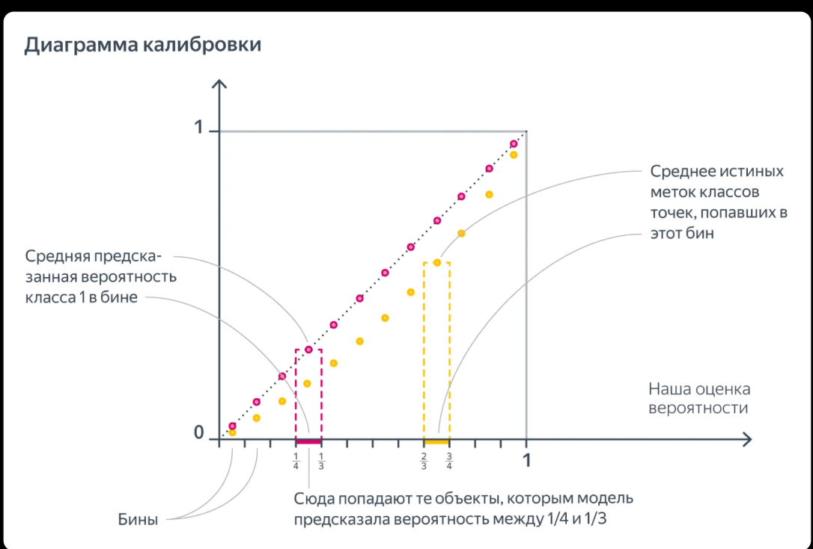
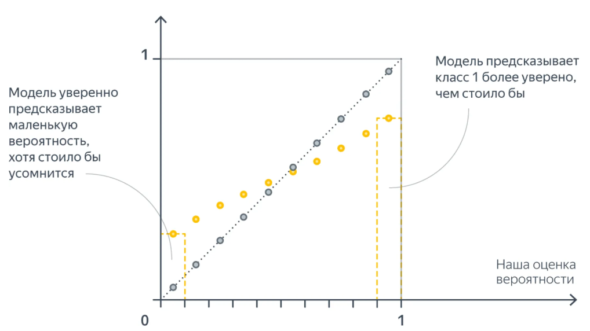
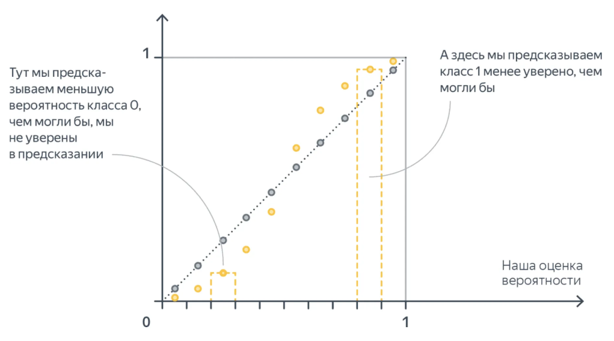

*(По [статье Яндекс.Хендбука 4.4](https://education.yandex.ru/handbook/ml/article/kak-ocenivat-veroyatnosti). Стиль: подробный, с аналогиями, формулами и интуитивным объяснением)*

---

## 0. План параграфа

**Зачем это вообще нужно.** Классификатор умеет отвечать «да/нет», но очень часто нам нужна **не только метка, а честная уверенность**: «этот клиент уйдёт с вероятностью 0.7». От такой уверенности зависят решения, где есть **деньги и риск** — одобрить ли кредит, отправить ли письмо клиенту, назначить ли лечение, где поставить порог. Если модель говорит «0.9», а по факту сбывается в 60% случаев, — все эти решения принимаются **неправильно**, хотя формально «модель угадала класс».

Этот параграф — про то, как понять, **честные ли у модели вероятности** («калиброванные» ли они), и как сделать их честными, если нет.

Сегодня разберём:

1. Что значит «вероятность класса», если объект **либо** в классе, **либо** нет
2. **Калибровка** — как проверить, что $p$ честные
3. Почему «логистическая регрессия = вероятности» — **миф с оговорками**
4. Методы калибровки: гистограммная, изотоническая, **Платт**
5. Метрики: ECE / MCE, **Brier score**, log-loss4

---

# ЧАСТЬ 1. ЧТО ТАКОЕ ВЕРОЯТНОСТЬ КЛАССА

---

## 1. Интуиция для двух классов

Бинарная классификация: классы $0$ и $1$.

Модель выдаёт число $p(x)$ — «вероятность класса 1».

**Правило здравого смысла:**

если модель говорит «$p = 2/3$», то среди объектов с такой (похожей) оценкой примерно **две трети** должны реально иметь класс 1.

Проще всего думать так: **вероятность — это обещание частоты**. Модель как бы говорит: «среди таких, как этот объект, единичек будет примерно 2 из 3». Калибровка как раз проверяет, **не врёт ли модель в этом обещании**.

На языке математики:

$$
\mathbb{E}\big[y \mid p(x)\big] = p(x)
$$

Словами: **если усреднить реальные метки** $y$ **по всем объектам с одинаковым предсказанием** $p$**, среднее должно равняться самому** $p$. Функция $p(x)$ — это не что-то абстрактное, а предсказание **доли** единиц. (Подробный разбор этой формулы в числах — в §1.1.)

> **Аналогия (синоптик).** Синоптик говорит: «дождь с вероятностью 70%». Если прогноз **калиброван**, то из 100 дней с таким прогнозом дождь был примерно в **70**. Если реально дождь случился лишь в **30** из 100 — синоптик **завышает**; если в **90** — **занижает**.

> **Аналогия (врач).** Врач говорит пациенту: «у 8 из 10 людей с такими же анализами диагноз подтверждается». Честный врач = калиброванная модель.

**Численный пример.** Пусть модель поставила вероятность $p = 0.8$ ста объектам. Проверяем факт:

| Сколько из 100 реально класса 1 | Что это значит |
|:---|:---|
| $\approx 80$ | модель **честна** (калибрована) |
| $95$ | модель **занижала** — была слишком осторожной |
| $60$ | модель **завышала** — была слишком самоуверенной |

**Зачем это нужно.** Допустим, решение «позвонить клиенту» принимается при $p \ge 0.5$. Если вероятности завышены, мы звоним людям, которые на самом деле не уйдут → жжём бюджет. Если занижены — теряем клиентов, которых могли удержать. Честные $p$ = правильный выбор порога = деньги.

 

**Как читать схему.** Всё, что правее точки $\tfrac12$, модель относит к классу 1 (фиолетовая скобка «Всё тут мы бы отнесли к классу 1»). Слева от $\tfrac12$ единиц меньше половины — логичнее отнести объект к классу 0; справа — больше половины, значит класс 1. Поэтому **честность** $p$ именно в окрестности порога $\tfrac12$ напрямую определяет, **кого** мы назовём «классом 1».

---

### 1.1. Формула в числах (разбираем по шагам)

Формула $\mathbb{E}\big[y \mid p(x)\big] = p(x)$ выглядит абстрактно, но это обычная **арифметика по группам**. Разберём её на примере синоптика — шаг за шагом.

**Что значат символы на практике:**

- $p(x)$ — предсказание модели (у синоптика — «дождь с вероятностью 70%», то есть $p = 0.7$). Относится не к одному дню, а к **целой группе** дней с таким прогнозом.
- $y$ — реальность: метка $1$ (дождь был) или $0$ (дождя не было).
- $\mathbb{E}\big[y \mid \ldots\big]$ — математическое ожидание $y$ при условии, что прогноз равнялся $p$. Простыми словами — **среднее арифметическое реальных меток в этой группе**.

**Шаг 1. Идеальная калибровка.** Возьмём **100 дней**, и пусть на каждый прогноз был $p = 0.7$. Дождь реально прошёл в **70** дней (там $y = 1$), а в **30** — нет (там $y = 0$).

**Левая часть** — среднее реальных меток:

$$
\mathbb{E}\big[y \mid p = 0.7\big] = \frac{70 \cdot 1 + 30 \cdot 0}{100} = \frac{70}{100} = 0.7
$$

**Правая часть** — сама вероятность: $p(x) = 0.7$.

**Итог:** $0.7 = 0.7$ — формула сработала, модель **калибрована**.

**Шаг 2. А если модель врёт?**

**Пример А — синоптик завышает (overconfident).** Говорит $p = 0.9$ на 100 дней, а дождь шёл лишь в 60:

$$
\mathbb{E}\big[y \mid p = 0.9\big] = \frac{60 \cdot 1 + 40 \cdot 0}{100} = 0.6 \ne 0.9
$$

Формула **не работает** — модель слишком самоуверенна.

**Пример Б — синоптик занижает (underconfident).** Говорит $p = 0.3$ на 100 дней, а дождь шёл 50 раз:

$$
\mathbb{E}\big[y \mid p = 0.3\big] = \frac{50 \cdot 1 + 50 \cdot 0}{100} = 0.5 \ne 0.3
$$

Формула **не работает** — модель слишком осторожна.

**Общий вид.** Если в группе $N$ объектов с одинаковым предсказанием $p$, формула превращается в «среднее по корзине»:

$$
\frac{1}{N}\sum_{i=1}^{N} y_i = p
$$

То есть **среднее реальных меток в корзине должно равняться предсказанной вероятности этой корзины**. Именно это и проверяет диаграмма калибровки (§1.2): берём бин, считаем среднее $y$ (жёлтые точки) и среднее $p$ (розовые точки) — и смотрим, совпали ли они.

> **Зачем это нужно.** Такую арифметику полезно уметь прикидывать в голове — она мгновенно показывает, **врёт ли модель и в какую сторону**, ещё до всяких графиков.

---

### 1.2. Диаграмма калибровки (reliability diagram)

**Проблема:** проверить $\mathbb{E}[y\mid p] = p$ напрямую нельзя — все объекты имеют **разные** $p(x)$, и у каждого своя «группа». Решение: собрать похожие предсказания в **корзины** (бины) и сравнивать **средние** внутри корзины.

На практике все $p(x)$ разные → биним отрезок $[0, 1]$:

1. Делим предсказания на бины (равной ширины или равной мощности).
2. В каждом бине считаем:
   - **среднюю предсказанную** $p$ (розовые точки на картинках статьи);
   - **долю реальных единиц** $y$ (жёлтые точки).

**Аналогия:** это как разложить 1000 прогнозов погоды по полочкам «60–70%», «70–80%» и посмотреть, сколько раз реально шёл дождь на каждой полочке. Если на полочке «≈70%» дождь был в 70% случаев — полочка честная.

| Ситуация | Что видно на графике |
|:---|:---|
| **Идеальная калибровка** | жёлтые ≈ розовые (лежат на диагонали $y=p$) |
| Модель **завышает** $p$ | розовые выше жёлтых → порог отсечения надо сдвигать |
| Модель **занижает** $p$ | наоборот |

Как читать: по оси X — что модель **обещала**, по оси Y — что **случилось на самом деле**. Идеал — совпадение, то есть **диагональ** $y = p$.

 

**Что на картинке.** Розовые точки — средняя **предсказанная** вероятность $p$ в бине; жёлтые — средняя **истинная** метка $y$ (доля класса 1). Пунктирные рамки — это бины: например, в бин «от $\tfrac14$ до $\tfrac13$» попадают объекты, которым модель предсказала вероятность в этом интервале. Чем ближе жёлтые точки к розовым (к диагонали $y = p$), тем честнее модель.

Модель, у которой предсказанные вероятности совпадают с частотами, называют **калиброванной** (*well-calibrated*).

**Зачем строить эту диаграмму.** Это самый быстрый «рентген» модели: глядя на точки относительно диагонали, сразу видно, врёт ли модель и **в какую сторону** — и стоит ли вообще что-то чинить.

---

## 2. Типичные патологии

### 2.1. Overconfident (слишком уверенный)

Предсказания кучкуются у $0$ и $1$, а по факту ошибок больше, чем «обещает» $p$. Модель кричит «99%!», а ошибается гораздо чаще, чем в 1 случае из 100.

**Аналогия:** студент, который на каждый вопрос отвечает «на 100% уверен», а на деле путает факты. Формально ответы иногда верные, но **уверенность не соответствует знаниям**.

**Кто часто грешит:** сильные модели (нейросети), учившиеся на **жёсткие метки** 0/1, а не на вероятности — loss толкает к крайним ответам. Модель «выучивает» отвечать 0 или 1, потому что так уменьшается ошибка на train.

 

**На картинке:** слева модель «уверенно» предсказывает маленькую вероятность, хотя стоило бы усомниться; справа — предсказывает класс 1 **увереннее, чем следовало**. Точки уходят от диагонали $y=p$ к краям — типичная картина для нейросетей, обученных на метки классов, а не на вероятности.

**Чем опасно:** если завышенные $p$ используются для решений (например, «операция при $p>0.9$»), мы будем действовать там, где уверенности на самом деле нет.

### 2.2. Underconfident (неуверенный)

Предсказания тяготеют к **середине** (\~0.5), даже когда класс почти ясен. Модель как будто «боится» сказать 0.99 и жмётся к 0.6.

 

**На картинке:** неуверенный (underconfident) классификатор — жёлтые точки уходят **под** диагональ $y=p$: модель ставит вероятность класса 1 (и класса 0) менее уверенно, чем могла бы.

**Аналогия:** скромный эксперт, который знает ответ, но из вежливости говорит «ну, наверное, 55%».

**Кто часто грешит:**

- модели, сильно фокусирующиеся на трудной **границе** (идея как у SVM);
- **бэггинг / случайный лес**: среднее многих моделей близко к 1 только если **все** близки к 1 — из-за дисперсии это реже. Усреднение «размывает» уверенность к середине.

**Зачем это знать.** «Overconfident» и «underconfident» — две противоположные болезни. Лечатся они по-разному (главным образом **калибровкой** — Часть 3), поэтому важно понимать, **какая именно** болезнь у модели.

---

# ЧАСТЬ 2. ЛОГИСТИЧЕСКАЯ РЕГРЕССИЯ И «ВЕРОЯТНОСТИ»

---

## 3. Миф: «логистическая регрессия всегда даёт правильные вероятности»

**Откуда миф.** Логистическая регрессия на выходе ставит сигмоиду $\sigma(w^\top x)$, а сигмоида **всегда** даёт число от 0 до 1. Отсюда интуиция «ну раз это число в (0,1), значит это настоящая вероятность». Это **упрощение**.

**Что на самом деле.** В sklearn на простом датасете:

- **без** богатых признаков — модель **неуверенная**, калибровка плохая;
- **с** полиномиальными фичами — смесь: неуверенность в середине + **уверенные ошибки** по краям.

Калибровочные кривые и гистограммы $p$ показывают: «вероятности» из $\sigma(w^\top x)$ **не обязаны** быть честными.

**Аналогия:** сигмоида — это как **шкала 0–100%** на приборе. То, что прибор показывает стрелку в этом диапазоне, **не значит**, что он правильно откалиброван. Стрелка может систематически врать, показывая 90, когда реально 60.

> Сигмоида даёт число в $(0,1)$, но это ещё **не** гарантия калибровки.

**Вывод-мостик:** чтобы понять, когда «вероятности» LR всё-таки хороши, придётся разобраться, **что именно** она минимизирует — об этом §4.

---

## 4. Когда у LR вероятности всё же «хорошие»

**План.** Поймём, почему LR всё-таки часто даёт неплохие вероятности. Ключ — в **функции потерь**, которую она минимизирует.

Логистическая регрессия минимизирует **log-loss / кросс-энтропию**:

$$
L(w) = -\sum_{i=1}^{N}\Big(
y_i\log p_i + (1-y_i)\log(1-p_i)
\Big),
\quad
p_i = \sigma(w^\top x_i)
$$

**Что это за loss простыми словами.** Кросс-энтропия — мера «насколько сильно модель удивилась факту». Если модель сказала $p=0.9$, а класс оказался 1 — удивления мало. Если сказала $p=0.9$, а класс оказался 0 — удивление огромное. Loss — это суммарное «недоумение» модели по всем объектам.

Каждое слагаемое — кросс-энтропия между предсказанием $(p, 1-p)$ и «тривиальным» распределением метки $y$.

**Мысленный эксперимент:**

много объектов с **одинаковым** $x$, среди них частота класса 1 равна $\hat\pi$.

**Аналогия.** Представим 100 «близнецов» — объектов с абсолютно одинаковыми признаками. Пусть 70 из них — класса 1, 30 — класса 0, то есть $\hat\pi = 0.7$. Какую $p$ обязана выдать идеальная модель для этой группы?

Кусок loss — кросс-энтропия между $\hat\pi$ и $p(x)$. Она **минимальна**, когда:

$$
p(x) = \hat\pi
$$

**Почему именно так.** Кросс-энтропия — выпуклая функция, и её минимум достигается ровно тогда, когда предсказанная вероятность **совпадает** с эмпирической частотой. Отклонение в любую сторону (сказать 0.5 или 0.9 вместо 0.7) увеличивает штраф.

То есть идеальная LR на «одинаковых» точках выдаёт **эмпирическую долю** единиц — хорошую оценку вероятности.

**Численный пример.** Группа с $\hat\pi = 0.7$:

| Модель говорит $p$ | Хорошо ли? |
|:---|:---|
| $0.7$ | идеально — совпало с частотой, штраф минимален |
| $0.9$ | завышает — лишние «уверенные» промахи на объектах класса 0 |
| $0.5$ | занижает / неуверенна — штраф больше, чем при 0.7 |

Приблизительно то же верно для **близких** точек, если:

1. признаки **хорошие** (классы не перемешаны хаотично);
2. модель **не переобучена** (вероятности не скачут резко от точки к точке).

**Вывод:** LR «калибрована» не магией сигмоиды, а потому что **log-loss** при гладкой модели и разделимых данных подталкивает $p$ к локальным частотам. При бедном $x$ или переобучении — ломается.

> **Зачем это нужно.** Этот механизм объясняет, почему у простых линейных моделей калибровка «бесплатная», а у сложных — ломается. Поняв причину, понимаем и как её чинить (§5–§8).

---

# ЧАСТЬ 3. МЕТОДЫ КАЛИБРОВКИ

---

## 5. Постановка

**Идея в одну фразу:** взять «сырое» число модели и **перевести** его в честную вероятность с помощью простого дополнительного преобразования.

Есть модель, для объекта $x$ выдающая число $s(x)$ (скор или «сырую» вероятность).

Нужно превратить $s$ в **калиброванную** вероятность $p$.

**Аналогия.** Скор $s$ — это показания «сырого» прибора (как термометр, который врёт на пару градусов). Мы не переделываем прибор, а приклеиваем к нему **табличку пересчёта**: «показывает 80 → на самом деле 60». Калибратор — и есть такая табличка.

Калибровку обычно учат на **отложенной** выборке (не на том же train, где учили основную модель).

**Почему на отложенной выборке.** Если учить калибратор на тех же данных, где училась модель, он «подгонится» под уже переобученную модель и переоценит её уверенность. Нужны **свежие** данные, которых модель не видела.

**Общая схема:**

| Шаг | Что делаем |
|:---|:---|
| 1 | Обучаем основную модель на train |
| 2 | На отложенной выборке считаем её скоры $s(x)$ |
| 3 | Учим калибратор $s \to p$ |
| 4 | В продакшене: модель → $s$ → калибратор → честная $p$ |

---

### 5.1. Гистограммная калибровка

**Идея:** разбить диапазон скоров на «полочки» (бины) и на каждой полочке **заменить** скор одной честной частотой, измеренной на отложенных данных.

1. Делим $[0,1]$ (или диапазон $s$) на бины $B_k$.
2. В каждом бине предсказываем **одну** константу $\theta_k$:

$$
p(x) = \theta_k,\quad \text{если } s(x)\in B_k
$$

3. $\theta_k$ подбирают так, чтобы приблизить среднюю метку в бине (по модулю или квадрату ошибки). Проще всего: $\theta_k$ = **доля класса 1** среди объектов бина.

**Аналогия.** Это как таблица пересчёта «показание весов → реальный вес»: для диапазона «70–80%» ставим одно число — реальную долю, которая там наблюдалась.

| Плюсы | Минусы |
|:---|:---|
| Просто и понятно | Нужно выбрать число бинов |
|    | Только **дискретное** множество вероятностей |

**Компромисс.** Много бинов → точнее, но мало объектов в каждом → шумно. Мало бинов → гладко, но грубо. Это тот же выбор, что при построении обычной гистограммы.

---

### 5.2. Изотоническая регрессия

**Идея:** не фиксировать полочки заранее, а **подобрать** их границы сами, потребовав при этом **монотонность**.

Похожа на гистограммную, но:

- границы бинов **тоже** настраиваются;
- накладывают монотонность: $\theta_1 \le \theta_2 \le \ldots$ (больше скор → не меньше вероятность).

Ищут кусочно-постоянную неубывающую $f$ такую, что $p(x) = f(s(x))$ хорошо приближает $y$.

**Аналогия (лестница).** Гистограмма — это ступеньки **фиксированной** ширины. Изотоника — **подгоняемая** лестница: ступеньки сами находят удобные границы, но обязаны **не спускаться вниз** (иначе вышло бы «больше скор — меньше вероятность», что противоречит здравому смыслу).

**Почему монотонность обязательна.** Если модель выдала больший скор, она не должна «намекать» на меньшую вероятность — иначе сломались бы вся логика ранжирования и выбор порога.

Оптимизация — классический алгоритм **PAVA** (*pool adjacent violators*); детали в статье не обязательны, идея — монотонная «лестница».

---

### 5.3. Калибровка Платта (Platt scaling)

**Идея:** подобрать всего **два числа** $A$ и $B$, которые растягивают/сдвигают скор так, чтобы получилась честная вероятность.

Поверх скора / «вероятности» $s$ ставят **сигмоиду**:

$$
p(x) = \sigma\big(As(x) + B\big) = \frac{1}{1 + e^{-(As(x)+B)}}
$$

**Чтение формулы простыми словами:**

- $A$ — **наклон**: во сколько раз «сжать/растянуть» скор. Большой $A$ → резкий переход (уверенная модель), маленький $A$ → плавный;
- $B$ — **сдвиг**: перемещает точку «50/50» влево-вправо, исправляя систематический перекос;
- сигмоида $\sigma$ превращает любое число $As+B$ в значение от 0 до 1.

**Аналогия.** Есть «сырой» счёт 0–100, а нужен честный процент. Platt — это подбор **масштаба и смещения** на линейке, чтобы деления стали правильными.

Параметры $A, B$ учат **максимумом правдоподобия** на отложенной выборке (по сути снова log-loss по $y$ и $p$).

Чтобы меньше переобучаться, Платт предлагал смягчать метки $0$ и $1$ до регуляризованных вероятностей (не ровно 0/1).

| Когда хорошо | Когда слабо |
|:---|:---|
| Часто помогает **SVM** (скоры → вероятности) | На сложных классификаторах может не хватить |
| Хорошо, если внутри каждого класса $s$ ≈ нормаль с **одинаковой** дисперсией | Иначе лучше изотоника / другие методы |

**Компромисс метода:** мало параметров (2) → мало переобучается, но и **негибкий** (форму связи задаём заранее — сигмоиду). Изотоника гибче, но «жаднее» к данным.

Обобщение: **бета-калибровка** (в статье — ссылка на обзор).

---

# ЧАСТЬ 4. КАК ИЗМЕРИТЬ КАЛИБРОВКУ

---

## 6. ECE и MCE

**Зачем числа.** Диаграмма калибровки хороша на глаз, но нужно **одно число**, чтобы сравнивать модели и следить за метрикой. Отсюда ECE и MCE.

Снова биннинг по предсказанным $p$. В бине $B_k$:

- $\bar p_k$ — среднее предсказание;
- $\bar y_k$ — средняя метка (accuracy в бине для бинарного случая с порогом по сути = доля единиц).

**Expected Calibration Error (ожидаемая ошибка калибровки):**

$$
\mathrm{ECE} = \sum_{k} \frac{|B_k|}{N}\,\big|\bar y_k - \bar p_k\big|
$$

**Простыми словами:** в каждом бине берём, **насколько разошлись** «что обещали» ($\bar p_k$) и «что случилось» ($\bar y_k$), и усредняем эту разницу по бинам **с весом** (чем больше объектов в бине, тем важнее его ошибка).

**Maximum Calibration Error (максимальная ошибка):**

$$
\mathrm{MCE} = \max_{k}\,\big|\bar y_k - \bar p_k\big|
$$

Это **худший бин** — самый большой промах. Отвечает на вопрос «где модель врёт сильнее всего».

**Численный пример.** Два бина:

| Бин | $\bar p_k$ (обещали) | $\bar y_k$ (случилось) | $\lvert\bar y_k-\bar p_k\rvert$ | Доля объектов |
|:---|:---|:---|:---|:---|
| 1 | 0.70 | 0.60 | 0.10 | 0.5 |
| 2 | 0.90 | 0.95 | 0.05 | 0.5 |

Тогда $\mathrm{ECE} = 0.5\cdot 0.10 + 0.5\cdot 0.05 = 0.075$, а $\mathrm{MCE} = \max(0.10,\ 0.05) = 0.10$.

**Минус:** внутри бина можно предсказывать как угодно (хоть константой), метрика смотрит только на средние — тонкие ошибки внутри бина не видит. **Аналогия:** средняя температура по больнице может быть нормальной, хотя в одной палате все с жаром. ECE — как раз такой «средний по палатам».

---

## 7. Brier score

**Идея.** Штрафовать модель за **промах в вероятности**, а не за неверный класс. Метрика складывает квадраты разниц между предсказанием и фактом.

$$
\mathrm{BS} = \frac{1}{N}\sum_{i=1}^{N}\big(p(x_i) - y_i\big)^2
$$

Это MSE между вероятностью и меткой: обычная среднеквадратичная ошибка, только в роли «предсказания» — вероятность $p$, а в роли «истины» — метка $y \in {0, 1}$.

**Аналогия.** Это как оценивать прогноз погоды по квадрату расстояния между «обещанным процентом дождя» и фактом (0 — дождя не было, 1 — был). Сказал $0.8$, а дождя не было → штраф $(0.8-0)^2 = 0.64$. Сказал $0.5$ → штраф меньше.

**Зачем он про калибровку:**

если таргеты полностью случайны, $P(y=1)=\frac12$, калиброванная модель должна всегда говорить $p=\frac12$, и тогда

$$
\mathrm{BS} = \tfrac14
$$

**Почему так.** Если сигнала нет, честный ответ — «монетка», $p=\frac12$. Тогда с вероятностью $1/2$ метка $1$ → промах $(1-\frac12)^2 = \frac14$, а с вероятностью $1/2$ метка $0$ → промах $(0-\frac12)^2 = \frac14$. В среднем выходит $\frac14$ — «эталон беззнания».

Если где-то выдать p
e \frac12 (соврать не ровно $1/2$), локально квадратичный штраф в среднем **хуже**, чем у константы $\frac12$: любое самоуверенное отклонение от монетки при отсутствии сигнала только увеличивает ошибку.

Можно вместо квадрата взять **log-loss**:

$$
\mathrm{LL} = -\frac{1}{N}\sum_{i}\Big(
y_i\log p_i + (1-y_i)\log(1-p_i)
\Big)
$$

**Ограничение (как у LR):** для гладких модели и данных Brier / log-loss адекватны; при резком переобучении или плохих признаках «хороший» score ≠ идеальная калибровка на всех регионах.

---

## 8. Многоклассовый случай (вопрос статьи)

**Проблема.** Всё выше было про 2 класса. А если классов $K > 2$ (например, 10 цифр или 5 категорий товара)? Как тогда понять, что модель калибрована?

Статья оставляет на размышление:

- что значит калибровка при $K>2$?
- как измерить численно?
- как калибровать произвольный классификатор?

**Интуиция.** Теперь модель выдаёт **вектор** вероятностей $(p_1, \ldots, p_K)$, и они суммируются в 1. Честная модель — это когда «обещанные» доли по каждому классу совпадают с реальными частотами. **Аналогия:** раньше мы проверяли одну «полочку» (да/нет), теперь — сразу несколько ящиков, и в сумме по ящикам должно быть ровно целое.

Кратко для ориентира (сверх статьи, одной фразой): часто требуют, чтобы для каждого класса условная частота совпадала с предсказанной вероятностью (или калибровали вектор вероятностей); метрики обобщают ECE/Brier. Детали — в туториалах по calibration.

---

# ЧАСТЬ 5. ИТОГИ

---

## 9. Ключевые выводы

**Весь конспект одной историей.** Модель выдаёт «уверенность» — число от 0 до 1. Вопрос один: **честное ли это число?** Честное — если обещание совпадает с реальной частотой (это показывают диаграмма калибровки, ECE/MCE, Brier). Сигмоида сама по себе честности не гарантирует, хотя log-loss часто к ней подталкивает. Если модель врёт (**overconfident** — загибает к краям, **underconfident** — жмётся к середине), лечим это **калибровкой** (гистограмма → изотоника → Platt), обучая её на **отложенной** выборке.

 1. «Вероятность $p$» честна, если среди объектов с такой $p$ доля класса ≈ $p$
 2. Смотри **диаграмму калибровки** (бины: среднее $p$ vs доля $y$)
 3. **Overconfident** — края; **underconfident** — серединка
 4. Сигмоида / LR ≠ автоматическая калибровка
 5. LR калибруется лучше, когда log-loss + хорошие признаки + нет дикого переобучения
 6. Калибровка: гистограмма → изотоника → Platt
 7. Учи калибратор на **отложенной** выборке
 8. Метрики: ECE/MCE, Brier, log-loss
 9. ECE смотрит только средние по бинам — не всевидящая
10. Для принятия решений (порог, риски) калибровка часто важнее «просто accuracy»

---

## 10. Шпаргалка формул

| Что | Формула |
|:---|:---|
| Идеальная калибровка | $\mathbb{E}[y\mid p(x)] = p(x)$ |
| Log-loss (LR) | $-\sum\big(y\log p+(1-y)\log(1-p)\big)$ |
| Platt | $p=\sigma(As+B)$ |
| ECE | $\sum_k \frac{\lvert B_k\rvert}{N}\lvert\bar y_k-\bar p_k\rvert$ |
| MCE | $\max_k\lvert\bar y_k-\bar p_k\rvert$ |
| Brier | $\frac{1}{N}\sum(p_i-y_i)^2$ |

---

## 11. Связь с другими конспектами

| Тема | Файл |
|:---|:---|
| Log-loss, сигмоида, LR | `Линейные модели.md` |
| Порог, precision/recall, AUC | `Конспект: Метрики классификации и регрессии.md` |
| Случайный лес → underconfident | `Конспект: Ансамбли...` |
| Val/test для калибровки | `Конспект: Кросс-валидация.md` |

---

## 12. Чеклист: ты усвоил конспект, если можешь ответить

Пройди по списку **своими словами**, без подглядывания.

### Смысл

- [ ] Что значит «модель предсказала вероятность 0.7» на языке частот?
- [ ] Как построить **диаграмму калибровки**?
- [ ] Чем **overconfident** отличается от **underconfident**? Кто так бывает?

### Логрег

- [ ] Почему «LR всегда калибрована» — упрощение?
- [ ] При каком мысленном эксперименте LR выдаёт долю класса в точке $x$?

### Калибровка и метрики

- [ ] Идея гистограммной калибровки? Изотоники? Platt?
- [ ] Зачем калибровать на **отложенной** выборке?
- [ ] Что такое ECE и в чём её слабость?
- [ ] Что такое Brier score? Почему при случайном $y$ оптимум — $p=1/2$?

---

> **Если на 80%+ пунктов отвечаешь уверенно — конспект усвоен.**
>
> Слабые места — перечитай раздел и картинку «диагональ калибровки» в голове.

> **Конец конспекта.** Быстрое повторение: §12 (чеклист), §10 (шпаргалка), §9 (выводы).

