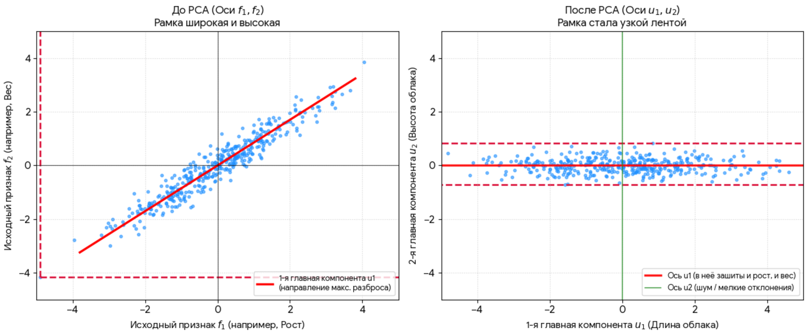

*(Видео №25 «Метод главных компонент (Principal Component Analysis) | Машинное обучение». Стиль: подробный, с аналогиями, формулами, ручным примером и кодом — как в остальных конспектах.)*

---

## -1. График 


 


**Метод «Схлопывания» (Как это увидеть глазами за 1 секунду)**

Чтобы мгновенно определять размер дисперсии на любом графике, используйте этот простой мысленный трюк:

- **Как понять дисперсию по горизонтали:** Представьте, что вы взяли тяжелый пресс и сжали весь правый график **сверху вниз**, превратив его в одну плоскую линию на полу. Точки раскатятся длинной колбасой от \(-4\) до \(4\). *Длина большая \(\rightarrow \) дисперсия большая.*
- **Как понять дисперсию по вертикали:** Теперь представьте, что вы сжали график **с боков (слева и справа)**, превратив его в вертикальную линию на стене. Все точки спрессуются в узкую плотную кучку прямо около нуля (от \(-0.7\) до \(0.7\)). *Кучка узкая \(\rightarrow \) дисперсия маленькая.*

Попробуйте применить этот трюк к первому (**левому**) графику: если мы мысленно сожмем его с боков к вертикальной оси \(f_{2}\), от какого до какого числа растянутся точки на этой оси? 


  

На первом (левом) графике размах по обеим осям примерно одинаковый.

Давайте проверим это по координатам:

- **По горизонтали (\(f_{1}\)):** Самая левая точка лежит в районе **\(-3.5\)**, а самая правая — около **\(+4\)**.
- **По вертикали (\(f_{2}\)):** Самая нижняя точка опустилась примерно до **\(-3\)**, а самая верхняя поднялась почти до **\(+4\)**.

Точки разлетаются вширь и ввысь почти на одинаковые расстояния. Это значит, что в исходных признаках **дисперсия по \(f_{1}\) и дисперсия по \(f_{2}\) примерно равны**.


  

**Шаг 1. Проблема исходных данных (До PCA)**

У нас есть два признака, которые сильно связаны (коррелируют) друг со другом — например, **Рост** (\(f_{1}\)) и **Вес** (\(f_{2}\)).

- На графике они образуют облако точек, наклоненное по диагонали.
- Если измерять разброс точек (дисперсию) по обычным осям, то облако получается и **широким**, и **высоким** (размах по обеим осям примерно одинаковый — от \(-3.5\) до \(+4\)).
- Чтобы вместить эти данные, нужен **большой розовый прямоугольник**. Ни один из признаков нельзя выкинуть, иначе мы потеряем огромный кусок информации.

  

**Шаг 2. Магия PCA (Поворот осей)**

Алгоритм PCA понимает, что прямоугольник большой только потому, что мы смотрим на данные «не под тем углом». Он делает гениальную вещь — **поворачивает систему координат**:

- Он находит направление самого длинного размаха данных (красную линию) и кладет туда новую ось **\(u_{1}\)** (Первую главную компоненту).
- Вторую ось **\(u_{2}\)** (Вторую главную компоненту) он ставит строго перпендикулярно первой — поперек облака.

  

  

**Шаг 3. Новая реальность (После PCA)**

После поворота осей наш розовый прямоугольник превращается в **очень длинную, но супер-узкую ленту**:

- **По оси \(u_{1}\) (Длина):** Размах точек максимальный (от \(-4\) до \(+4\)). Дисперсия тут огромная. Эта ось объединила в себе и рост, и вес, превратившись в новый гибридный признак — *«Общий размер тела»*.
- **По оси \(u_{2}\) (Высота):** Все точки спрессовались и прижались к нулю (весь размах всего от \(-0.7\) до \(+0.7\)). Дисперсия здесь ничтожно мала. Это мелкие индивидуальные отклонения, которые в масштабе задачи можно считать просто *«случайным шумом»*.

**Шаг 4. Финал — Сжатие данных (Выбрасывание)**

В нашем датасете старые столбцы «Рост» и «Вес» исчезают. Вместо них компьютер создает новые столбцы: Компонента_1 и Компонента_2

.

- Так как в столбце Компонента_2 все значения микроскопические (около нуля), мы **просто удаляем этот столбец** из таблицы.
- Мы **не потеряли информацию о весе**, она аккуратно «переехала» и зашилась внутрь Компоненты_1 вместе с ростом.
- Данные сжались: таблица стала в два раза меньше, а суть осталась прежней!

  

  

  

  


Вот финальный итог того, как работает **Метод главных компонент (PCA)** на пальцах:

**1. Как было «До» (Исходные признаки \(f_1, f_2\))**

- У вас есть облако точек, которое наклонено по диагонали.
- Чтобы упаковать его в коробку, выровненную по обычным осям, вам нужен **большой розовый прямоугольник** — он получается и **широким** (большой разброс по \(f_{1}\)), и **высоким** (большой разброс по \(f_{2}\)).
- Из-за этого вы не можете выбросить ни \(f_{1}\), ни \(f_{2}\). Они оба одинаково важны, чтобы понимать, где находится точка. Данные жестко двумерные (2D).

**2. Что делает PCA**

- Метод главных компонент находит самый длинный размах этого облака (красную линию) и **поворачивает всю систему координат** вместе с вашей розовой коробкой.
- Новая ось **\(u_{1}\)** ложится ровно вдоль длины облака, а ось **\(u_{2}\)** встает строго поперек (по его высоте).

**3. Как стало «После» (Новые компоненты \(u_1, u_2\))**

- Ваша розовая коробка после поворота превращается в **супер-длинную, но очень узкую ленту**.
- **По оси \(u_{1}\) (длина):** Разброс стал максимально огромным. Здесь живет вся полезная информация о данных.
- **По оси \(u_{2}\) (высота):** Разброс сжался почти в ноль. Все точки прижаты близко к центру, их высота ничтожна. Это просто случайный шум.

**Главный вывод: почему второй график лучше?**

Второй график лучше, потому что он позволяет **сжать данные без потери смысла**. Раз высота по оси \(u_{2}\) стала микроскопической, мы можем **просто выбросить ось \(u_{2}\)** и «сплющить» рамку. Вместо двух сложных координат мы оставляем для каждой точки всего одну цифру — её положение на длинной линии \(u_{1}\). Задача стала проще, а данные — компактнее!

  

а как получается мы выбрасываем? мы просто убираем один признка? вдет неапример вес и ростт оба важны, как прищзнаки, хоть они и коррелирубт

Вот это самый крутой и логичный вопрос, который возникает у всех, кто глубоко разбирается в PCA! Вы абсолютно правы: **рост и вес оба важны, и мы не можем просто взять и вычеркнуть «вес» из анкеты.**

Секрет PCA в том, что мы выбрасываем **не исходный признак (не вес и не рост), а новую координату (\(u_{2}\)), которая является их смесью.**

Давайте разберем это как раз на вашем примере с ростом и весом:

**Как это работает на практике:**

Представьте, что \(f_{1}\) — это рост (в см), а \(f_{2}\) — вес (в кг). Они сильно коррелируют: высокие люди обычно весят больше.

Когда PCA поворачивает оси и создает новые компоненты \(u_{1}\) и \(u_{2}\), он создает **новые гибридные признаки**:

1. **Ось \(u_{1}\) (Длина) становится признаком «Размер человека»**.
   Математически это сумма: \(\text{Рост} + \text{Вес}\). Если у человека большие значения и роста, и веса, он улетает далеко вправо по оси \(u_{1}\). Эта ось вобрала в себя главную информацию и от роста, и от веса сразу!
2. **Ось \(u_{2}\) (Высота/Ширина ленты) становится признаком «Особенности телосложения»**.
   Математически это разность: \(\text{Рост} - \text{Вес}\). Она показывает отклонения от нормы: например, очень высокий, но экстремально худой человек, или наоборот.

**Что именно мы выбрасываем?**

Поскольку большинство людей на графике распределены «стандартно» (облако вытянуто вдоль \(u_{1}\)), то координата по оси \(u_{2}\) у 95% людей будет очень близка к нулю.

Когда мы «выбрасываем \(u_{2}\)», мы:

- **НЕ удаляем вес.** Вес уже «зашит» внутри главной компоненты \(u_{1}\).
- **Мы просто отказываемся от мелких нюансов (\(u_{2}\)).** Мы говорим: *«Давайте для простоты считать, что все люди сложены примерно пропорционально, и будем оценивать их одной цифрой — общим "Размером" (\(u_{1}\)). А то точное микро-отклонение (\(u_{2}\)), на сколько грамм они отличаются от идеальной линии, мы округлим до нуля и проигнорируем как шум»*.

**В итоге:**

Мы заменили два признака (Рост, Вес) на один новый признак (Размер). Информация о весе **не пропала**, она просто объединилась с ростом ради экономии места.


паолучается у нас в датасете появисят новый паризнак столбец?

**Да, абсолютно верно!** Именно так это и происходит технически.

В вашем датасете вместо старых столбцов **появятся совершенно новые столбцы**, которые заменят собой исходные.

Давайте посмотрим наглядно, как трансформируется таблица с данными (датасет) на примере тех самых роста и веса.

**Как меняется датасет:**

**Было (Исходный датасет):**
У вас есть ID человека и два сильно связанных признака — Рост и Вес.

| **ID** | **Рост (\(f_{1}\), см)** | **Вес (\(f_{2}\), кг)** |
|----|----|----|
| Человек 1 | 185 | 88 |
| Человек 2 | 160 | 55 |
| Человек 3 | 175 | 74 |

---

**Процесс PCA:**
Алгоритм берет эти данные, центрирует их, находит повернутые оси и рассчитывает новые значения по формулам (смешивая рост и вес).

---

**Стало (Новый датасет после PCA):**
Старые столбцы «Рост» и «Вес» полностью **удаляются**. Вместо них создаются новые столбцы — Главные компоненты:

| **ID** | **Главная компонента 1 (\(u_{1}\))** 
***(«Размер тела»)*** | **Главная компонента 2 (\(u_{2}\))** 
***(«Нюансы/Шум»)*** |
|----|----|----|
| Человек 1 | **+25.4** | +0.2 |
| Человек 2 | **-18.1** | -0.1 |
| Человек 3 | **+6.3** | +0.4 |

**И вот тут мы делаем то самое «выбрасывание»:**

Посмотрите на столбец **Главная компонента 2 (\(u_{2}\))**. Из-за того, что разброс (высота коробки) вдоль этой оси минимален, все значения в этом столбце получились крошечными — около нуля (всего 0.2, -0.1, 0.4). Они практически ни на что не влияют.

Мы со спокойной душой **просто удаляем весь этот столбец** \(u_{2}\) из нашей финальной таблицы!

**Итоговый датасет, который пойдет в модель машинного обучения:**

| **ID** | **Главная компонента 1 (\(u_{1}\))** |
|----|----|
| Человек 1 | **+25.4** |
| Человек 2 | **-18.1** |
| Человек 3 | **+6.3** |

В результате наш датасет сжался: вместо двух столбцов остался **всего один**, но этот единственный столбец по-прежнему хранит в себе информацию и о росте, и о весе каждого человека.

  

  


## 0. План параграфа

Сегодня разберём:

 1. **Зачем вообще нужен PCA** — что не так с большим числом признаков
 2. **Идею:** найти направление, вдоль которого данные «растянуты» сильнее всего
 3. **Математику:** ковариационная матрица и её собственные векторы/значения
 4. **Алгоритм** по шагам
 5. **Сколько компонент оставлять** (объяснённая дисперсия)
 6. **Полный числовой пример** 2D, посчитанный руками
 7. **Код:** `sklearn.decomposition.PCA` + `Pipeline`
 8. **Подводный камень:** PCA запоминает статистики → утечка данных
 9. **Плюсы, минусы, когда использовать**
10. **Шпаргалку**

---

## 1. Зачем нужен PCA

### 1.1. Проблема: много признаков

Данные в ML — это матрица «объекты × признаки»:

$$
X \in \mathbb{R}^{n \times m}
$$

где $n$ — число объектов, $m$ — число признаков.

С ростом $m$ начинаются проблемы:

| Проблема | Что происходит |
|:---|:---|
| **Проклятие размерности** | объекты становятся «далёкими» друг от друга, соседи перестают быть похожими |
| **Долго считать** | больше признаков → дольше обучение и предсказание |
| **Мультиколлинеарность** | признаки почти дублируют друг друга (площадь и сотки) → неустойчивые веса |
| **Шум** | часть признаков почти не несёт информации, но мешает |
| **Нельзя нарисовать** | больше 3 признаков не изобразишь на графике |

> **Идея PCA:** из $m$ признаков собрать $k$ **новых** признаков, где $k \ll m$, но почти вся информация сохранится.

### 1.2. Что мы хотим

Мы хотим **сжать размерность** так, чтобы:

- объектов и их «структура» остались узнаваемыми;
- потеря информации была минимальной;
- новые признаки были **некоррелированы** между собой (не дублировались).

PCA — самый известный способ это сделать. По-русски: **метод главных компонент**.

---

## 2. Идея: направление максимальной дисперсии

### 2.1. На пальцах — облако точек

Есть 1000 человек, у каждого два признака: **рост** и **вес**. Нарисуем точки на плоскости. Получится **облако, вытянутое по диагонали** (высокие обычно тяжелее).

- Вдоль диагонали точки **разбросаны сильно** — там много информации (дисперсия большая).
- Поперёк диагонали разброс **маленький** — там почти нет информации (высокий и худой / низкий и полный — редкость).

**Что делает PCA:**

1. Находит направление, вдоль которого облако растянуто **сильнее всего** — это **первая главная компонента**.
2. Второе направление берёт **перпендикулярно** первому — **вторая компонента**.
3. Если данных «вытянуты», можно оставить только первую ось и потерять мало информации.

> **Главное правило PCA:** **направление = информация**. Чем больше разброс (дисперсия) вдоль оси — тем важнее компонента.

### 2.2. Аналогия: тень предмета

Представь, что ты светишь лампой на предмет и смотришь на его **тень** на стене.

- Если повернуть предмет удачно, тень получится **широкой** — видно много деталей.
- Если неудачно — тень сжимается в тонкую полоску, детали теряются.

PCA ищет **такой угол**, при котором «тень» данных максимально широкая — то есть сохраняется максимум информации при проекции на одну ось.

---

## 3. Математика: ковариация и собственные векторы

### 3.1. Шаг 0 — центрируем данные

Сначала из каждого признака вычитаем его **среднее** (центрируем облако в начале координат):

$$
x'_i = x_i - \mu
$$

Иначе PCA будет искать «разброс относительно нуля», а не относительно центра данных, и первая компонента уедет в сторону среднего.

> Среднее и стандартное отклонение — из `Теория вероятностей — конспект.md` (дисперсия, $\sigma$). Масштабирование признаков перед PCA — см. `Feature Scale и нормализация.md`.

### 3.2. Ковариационная матрица

**Ковариация** показывает, как два признака меняются вместе:

$$
\operatorname{Cov}(x, y) = \frac{1}{n}\sum_{i=1}^{n}(x_i - \bar{x})(y_i - \bar{y})
$$

- $\operatorname{Cov} > 0$ → признаки растут вместе;
- $\operatorname{Cov} < 0$ → один растёт, другой убывает;
- $\operatorname{Cov} \approx 0$ → связи нет.

Матрица ковариаций $C$ для всех пар признаков:

$$
C = \frac{1}{n} X'^{T} X'
$$

где $X'$ — центрированные данные.

Свойства (см. `5.матрицы.md`):

- квадратная, размера $m \times m$;
- **симметричная**: $C_{ij} = C_{ji}$;
- **на диагонали** — дисперсии признаков (их разброс);
- вне диагонали — ковариации между признаками.

### 3.3. Собственные векторы решают задачу

Ключевой факт (подробный разбор — в `5.Собственные векторы и собственные значения — конспект.md`, §7):

> **Главные компоненты — это собственные векторы ковариационной матрицы** $C$**. А соответствующие собственные значения — это дисперсии данных вдоль этих направлений.**

То есть решаем:

$$
C\mathbf{v} = \lambda \mathbf{v}
$$

| Часть | Смысл в PCA |
|:---|:---|
| $C$ | ковариационная матрица признаков |
| $\mathbf{v}$ | **главная компонента** (направление, ось) |
| $\lambda$ | **дисперсия** данных вдоль этой оси (сколько информации) |

**Читаем результат:**

- большое $\lambda$ → направление важное, много информации;
- маленькое $\lambda$ → направление почти «шум», его можно выбросить.

Собственные векторы $C$ **перпендикулярны** друг другу (потому что $C$ симметрична) — то есть главные компоненты дают **новые некоррелированные оси**.

---

## 4. Алгоритм PCA по шагам

1. **Центрировать** данные: вычесть среднее по каждому признаку.
2. (По желанию) **отмасштабировать**: привести признаки к одному масштабу (`StandardScaler`), если они в разных единицах.
3. Построить **ковариационную матрицу** $C = \frac{1}{n}X'^{T}X'$.
4. Найти её **собственные значения и векторы**.
5. Отсортировать собственные векторы по убыванию $\lambda$.
6. Оставить **первые** $k$ векторов — это матрица проекции $W$ (размер $m \times k$).
7. **Спроецировать** данные в новое пространство:

$$
Z = X' \, W
$$

Получили новые признаки (главные компоненты) — их $k$, а не $m$.

| Шаг | Что получили |
|:---|:---|
| до PCA | $X$: $n \times m$ |
| после PCA | $Z$: $n \times k$, $k \ll m$ |

---

## 5. Сколько компонент оставлять?

### 5.1. Объяснённая дисперсия

Доля дисперсии, которую объясняет $j$-я компонента:

$$
\text{EVR}_j = \frac{\lambda_j}{\lambda_1 + \lambda_2 + \dots + \lambda_m}
$$

Сумма всех $\text{EVR}_j$ равна $1$ (100%). Обычно берут первые $k$, чтобы суммарно объяснялось, например, **95%** дисперсии.

### 5.2. Правила выбора $k$

| Способ | Как |
|:---|:---|
| **Порог дисперсии** | взять минимальное $k$, при котором сумма $\text{EVR}$ ≥ 0.95 (или 0.90) |
| **«Локоть» (scree plot)** | нарисовать $\lambda_j$ по $j$ и найти, где график «ломается» |
| **Правило Кайзера** | оставить компоненты с $\lambda > 1$ (только для стандартизованных данных) |
| **По задаче** | столько, сколько нужно для визуализации (2–3) или для скорости |

> **Компромисс:** больше компонент → точнее, но меньше сжатие. Меньше компонент → быстрее и проще, но больше потеря информации.

---

## 6. Полный пример (2D, руками)

Возьмём 5 объектов с двумя признаками:

| Объект | $x$ | $y$ |
|:---|:---|:---|
| 1 | 1 | 2 |
| 2 | 2 | 3 |
| 3 | 3 | 5 |
| 4 | 4 | 4 |
| 5 | 5 | 6 |

**Шаг 1. Средние:**

$$
\bar{x} = \frac{1+2+3+4+5}{5} = 3, \qquad \bar{y} = \frac{2+3+5+4+6}{5} = 4
$$

**Шаг 2. Центрируем** (вычитаем средние) — получаем $X'$:

| Объект | $x'$ | $y'$ |
|:---|:---|:---|
| 1 | $-2$ | $-2$ |
| 2 | $-1$ | $-1$ |
| 3 | $0$ | $1$ |
| 4 | $1$ | $0$ |
| 5 | $2$ | $2$ |

**Шаг 3. Ковариационная матрица.** Считаем суммы:

$$
\sum x'^2 = 4+1+0+1+4 = 10, \qquad \sum y'^2 = 4+1+1+0+4 = 10
$$

$$
\sum x'y' = 4+1+0+0+4 = 9
$$

Делим на $n=5$:

$$
C = \frac{1}{5}
\begin{pmatrix} 10 & 9 \ 9 & 10 \end{pmatrix}
= \begin{pmatrix} 2 & 1{,}8 \ 1{,}8 & 2 \end{pmatrix}
$$

**Шаг 4. Собственные значения.** Характеристическое уравнение:

$$
\det(C - \lambda I) = (2-\lambda)^2 - 1{,}8^2 = 0
$$

$$
(2-\lambda) = \pm 1{,}8 \;\Rightarrow\; \lambda_1 = 3{,}8, \quad \lambda_2 = 0{,}2
$$

**Шаг 5. Собственные векторы.**

Для $\lambda_1 = 3{,}8$: $(2-3{,}8)v_1 + 1{,}8\,v_2 = 0 \Rightarrow -1{,}8v_1 + 1{,}8v_2 = 0 \Rightarrow v_1 = v_2$:

$$
\mathbf{v}_1 = \frac{1}{\sqrt{2}}(1,\ 1) \approx (0{,}707,\ 0{,}707)
$$

Для $\lambda_2 = 0{,}2$ (перпендикулярно):

$$
\mathbf{v}_2 = \frac{1}{\sqrt{2}}(1,\ -1) \approx (0{,}707,\ -0{,}707)
$$

**Шаг 6. Объяснённая дисперсия:**

$$
\text{EVR}_1 = \frac{3{,}8}{4} = 0{,}95, \qquad \text{EVR}_2 = \frac{0{,}2}{4} = 0{,}05
$$

**Вывод:** первая компонента объясняет **95%** информации. Одну из двух осей можно выбросить почти без потерь → сжали $2$ признака в $1$.

**Шаг 7. Спроецируем** на первую компоненту, $z_i = 0{,}707(x'_i + y'_i)$:

| Объект | $z_1$ (компонента 1) |
|:---|:---|
| 1 | $0{,}707(-2-2) = -2{,}828$ |
| 2 | $0{,}707(-1-1) = -1{,}414$ |
| 3 | $0{,}707(0+1) = 0{,}707$ |
| 4 | $0{,}707(1+0) = 0{,}707$ |
| 5 | $0{,}707(2+2) = 2{,}828$ |

Дисперсия этих чисел как раз равна $\lambda_1 = 3{,}8$ — всё сходится.

> **Проверка в коде** (`np.linalg.eigh` на этой матрице) даёт ровно те же числа: собственные значения $0{,}2$ и $3{,}8$, векторы $\pm(0{,}707,\ 0{,}707)$ и $(0{,}707,\ -0{,}707)$. Руками и библиотекой — одно и то же.

---

## 7. Код: `sklearn.decomposition.PCA`

### 7.1. Базовый пример

```python
import numpy as np
from sklearn.decomposition import PCA

X = np.array([
    [1, 2],
    [2, 3],
    [3, 5],
    [4, 4],
    [5, 6],
], dtype=float)

pca = PCA(n_components=1)      # оставить 1 главную компоненту
Z = pca.fit_transform(X)       # центрирует сам и проецирует

print("Компоненты:\n", pca.components_)              # сами оси (как v1, v2)
print("Собственные значения:", pca.explained_variance_)     # [3.8, ... ]
print("Доли дисперсии:", pca.explained_variance_ratio_)     # [0.95] → 95%
```

Что вернул `PCA`:

| Атрибут | Что это |
|:---|:---|
| `pca.components_` | главные оси (собственные векторы $C$) |
| `pca.explained_variance_` | собственные значения ($\lambda$) |
| `pca.explained_variance_ratio_` | доля объяснённой дисперсии ($\text{EVR}$) |
| `pca.transform(X)` | спроецировать в новое пространство |
| `pca.inverse_transform(Z)` | вернуться обратно (с потерей) |

> `PCA` **центрирует данные сам** внутри `fit`, поэтому отдельно вычитать среднее не нужно. А вот `StandardScaler` (если признаки в разных единицах) применяют **перед** PCA — этого он не делает.

### 7.2. Сколько компонент, если не знаешь $k$

Задай `n_components` как долю дисперсии — PCA сам подберёт число осей:

```python
pca = PCA(n_components=0.95)   # столько компонент, чтобы объяснить 95% дисперсии
Z = pca.fit_transform(X)
print("Итоговое число компонент:", pca.n_components_)
```

Или посмотри все доли и реши сам:

```python
pca = PCA()                    # все компоненты
pca.fit(X)
print("По накоплению:", np.cumsum(pca.explained_variance_ratio_))
```

### 7.3. PCA + масштабирование через `Pipeline`

Когда признаки в разных единицах (метры и килограммы), порядок такой: **сначала масштабируем, потом PCA**.

```python
from sklearn.pipeline import Pipeline
from sklearn.preprocessing import StandardScaler
from sklearn.decomposition import PCA
from sklearn.linear_model import LogisticRegression

pipe = Pipeline([
    ("scaler", StandardScaler()),   # шаг 1: одинаковый масштаб
    ("pca",    PCA(n_components=0.95)),  # шаг 2: сжатие размерности
    ("clf",    LogisticRegression()),    # шаг 3: модель
])

pipe.fit(X_train, y_train)
y_pred = pipe.predict(X_test)
```

> `Pipeline` гарантирует правильный порядок и **не даёт утечке** случиться (см. `2.Кросс-валидация.md`, §7.5).

---

## 8. Подводный камень: PCA запоминает статистики → утечка

`PCA` — это **stateful**-преобразователь: в `fit` он запоминает **среднее** и **оси** (собственные векторы) из данных. Значит, работает то же правило, что и для `StandardScaler` (`2.Кросс-валидация.md`, §7.3 и §7.5):

> **Всё, что запоминает статистики (**`fit`), должно видеть только train.

**Неправильно (утечка):**

```
1. PCA().fit(X_всё)      ← оси посчитаны ПО ВСЕМ данным, включая test
2. split train / test
```

Test «подсмотрел» в train через оси PCA — метрика завышена.

**Правильно:**

```
1. split train / test
2. PCA fit ТОЛЬКО на train
3. transform train и test отдельно  (тем же объектом PCA!)
```

В кросс-валидации это надо делать **заново на каждом фолде** — именно поэтому `PCA` кладут в `Pipeline`, а не считают один раз руками.

Напоминание из чеклиста «подозрительно хорошо» (`2.Кросс-валидация.md`, §7.1): «препроцессинг делали один раз на всём датасете, а не заново внутри каждой итерации CV» — с PCA это ровно тот случай.

---

## 9. Плюсы, минусы и когда использовать

### 9.1. Плюсы

- **Сжатие размерности** — меньше признаков, быстрее обучение и предсказание.
- **Борьба с мультиколлинеарностью** — новые компоненты некоррелированы.
- **Удаление шума** — отбрасываем оси с маленькой дисперсией.
- **Визуализация** — оставив 2–3 компоненты, можно нарисовать многомерные данные.
- **Без учителя** — работает без меток (unsupervised), годится для разведочного анализа.
- **Экономия памяти** — храним сжатое представление вместо исходного.

### 9.2. Минусы

- **Теряется интерпретируемость** — новые компоненты это смесь признаков, их трудно назвать («это 0.4 площади + 0.3 комнат − 0.2 этажа»).
- **Теряется информация** — при сжатии что-то уходит безвозвратно.
- **Чувствительность к масштабу** — без `StandardScaler` признак с большим разбросом «задавит» остальные.
- **Линейный метод** — ищет только линейные комбинации; нелинейные структуры не видит (там нужны t-SNE, UMAP, автокодировщики).
- **Не смотрит на целевую переменную** — максимизирует дисперсию, а не разделимость классов (для этого есть LDA).
- **Может навредить модели** — иногда отброшенная «мелочь» была важна именно для предсказания $y$.

### 9.3. Когда использовать

| Ситуация | Стоит ли PCA |
|:---|:---|
| Признаков очень много, есть корреляции | ✅ да |
| Нужна визуализация 2D/3D | ✅ да |
| Хотим убрать шум перед моделью | ✅ да |
| Нужна интерпретация каждого признака | ❌ нет |
| Связь с $y$ нелинейная | ❌ нет (нужны нелинейные методы) |
| Признаки уже независимы и их мало | ⚠️ смысла мало |

---

## 10. Типичные ошибки

| Ошибка | Последствие | Как правильно |
|:---|:---|:---|
| Забыть про масштаб | один признак доминирует | `StandardScaler` перед `PCA` |
| `fit` PCA на всех данных | **утечка**, завышенная метрика | `fit` только на train / в `Pipeline` |
| Путать компоненты со «старыми» признаками | неверная интерпретация | компоненты — это **новые** оси |
| Брать много компонент «на всякий случай» | сжатия нет | выбрать $k$ по EVR / «локтю» |
| Считать, что PCA улучшит любую модель | иногда метрика падает | проверять на кросс-валидации |
| Забыть про `inverse_transform` | «потеряли» данные | понимать, что сжатие необратимо |

---

## 11. Шпаргалка

- **PCA** = метод главных компонент — сжатие размерности без учителя.
- **Цель:** из $m$ признаков сделать $k$ ($k \ll m$), сохранив максимум информации.
- **Идея:** ось, вдоль которой данные растянуты **сильнее всего** (макс. дисперсия) — самая важная.
- **Ключ:** главные компоненты = **собственные векторы ковариационной матрицы**; собственные значения = **дисперсии** вдоль них.
- **Пайплайн:** центрирование → (масштабирование) → $C = \frac{1}{n}X'^{T}X'$ → собственные векторы → сортировка → оставить $k$ → $Z = X'W$.
- **Число компонент:** порог $\text{EVR}$ (напр. 95%), scree plot («локоть»), правило Кайзера.
- **Обязательно:** масштабировать признаки и считать статистики **только на train** (иначе утечка).
- **Плюсы:** скорость, борьба с мультиколлинеарностью, визуализация, шумодавление.
- **Минусы:** теряется интерпретируемость, метод линейный, не смотрит на $y$.
- **В коде:** `PCA(n_components=0.95)` внутри `Pipeline` после `StandardScaler`.

---

## 12. Связи с другими конспектами

- `5.Собственные векторы и собственные значения — конспект.md` — математический фундамент: почему главные компоненты это собственные векторы (§7 — краткий обзор PCA там же).
- `5.матрицы.md` — ковариационная матрица, транспонирование, `@`.
- `Feature Scale и нормализация.md` — почему масштаб важен перед PCA.
- `2.Кросс-валидация.md` — утечка данных, `Pipeline`, stateful-преобразователи (§7.3, §7.5).
- `Теория вероятностей — конспект.md` — дисперсия, ковариация, среднее.
- `Упрощенное описание главы.md` — SVD, с которым PCA тесно связан (PCA = SVD центрированных данных).

> **Одна фраза:** PCA находит направления максимального разброса данных (собственные векторы ковариационной матрицы) и оставляет только самые «информативные» из них — так многомерное облако сжимается почти без потерь.


