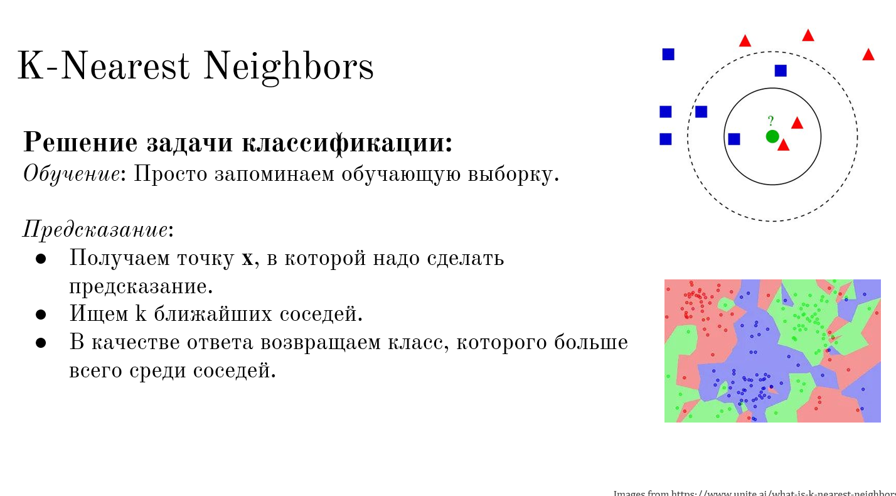

 


[Зачем нужен и когда использовать?](https://ivan-valuchev.yonote.ru/doc/zachem-nuzhen-i-kogda-ispolzovat-088YLrKAyA)

## Разбор формул KNN на практических примерах

Это те самые формулы, по которым работает KNN. Давай я разберу их по косточкам, чтобы ты видел, как каждая буква превращается в действие.

### Формула 1. Расстояние до одного объекта

$$
d_i = \sqrt{\sum_{j=1}^{4} (x_{\text{new},j} - X_{i,j})^2}
$$

**Переводим на русский (по частям):**

| Символ | Что означает | Пример |
|:---|:---|:---|
| $d_i$ | Расстояние от нового цветка до $i$-го цветка в таблице. | $d_5$ — расстояние до 5-го цветка. |
| $x_{\text{new},j}$ | $j$-й признак нового цветка. | $x_{\text{new},1}$ = длина чашелистника нового цветка. |
| $X_{i,j}$ | $j$-й признак $i$-го цветка из таблицы. | $X_{5,1}$ = длина чашелистника 5-го цветка в базе. |
| $\sum_{j=1}^{4}$ | «Просуммируй по $j$ от 1 до 4» (то есть сложи всё для 4 признаков). | Сложи разницы для длины и ширины чашелистника и лепестка. |
| $\sqrt{\ldots}$ | Корень из суммы (чтобы вернуться к обычным единицам). | Извлекаем корень из суммы квадратов. |

#### Пошаговый разбор на примере

Пусть у нас есть:

**Новый цветок** (мы не знаем его сорт):

- Длина чашелистника = 5.1
- Ширина чашелистника = 3.5
- Длина лепестка = 1.4
- Ширина лепестка = 0.2

**Первый цветок из таблицы** (мы знаем, что это Setosa):

- Длина чашелистника = 4.9
- Ширина чашелистника = 3.0
- Длина лепестка = 1.4
- Ширина лепестка = 0.1

Считаем расстояние $d_1$:

| Шаг | Действие | Результат |
|:---|:---|:---|
| 1 | Разница по длине чашелистника: $5.1 - 4.9$ | $0.2$ |
| 2 | Квадрат разницы: $0.2^2$ | $0.04$ |
| 3 | Разница по ширине чашелистника: $3.5 - 3.0$ | $0.5$ |
| 4 | Квадрат разницы: $0.5^2$ | $0.25$ |
| 5 | Разница по длине лепестка: $1.4 - 1.4$ | $0$ |
| 6 | Квадрат разницы: $0^2$ | $0$ |
| 7 | Разница по ширине лепестка: $0.2 - 0.1$ | $0.1$ |
| 8 | Квадрат разницы: $0.1^2$ | $0.01$ |
| 9 | Сумма квадратов: $0.04 + 0.25 + 0 + 0.01$ | $0.30$ |
| 10 | Корень из суммы: $\sqrt{0.30}$ | $\approx 0.548$ |

**Итог:** Расстояние от нового цветка до первого цветка в таблице $\approx 0.548$.

### Формула 2. Выбор класса (голосование)

$$
\hat{y} = \arg\max_{c \in {0, 1, 2}} \sum_{i \in N_k} [Y_i = c]
$$

**Переводим на русский:**

| Символ | Что означает |
|:---|:---|
| $\hat{y}$ | Предсказанный класс для нового объекта. |
| $\arg\max_{c}$ | «Найди такое $c$ (класс), при котором выражение максимально». |
| $c \in {0, 1, 2}$ | Классы: 0 = Setosa, 1 = Versicolor, 2 = Virginica. |
| $N_k$ | Множество $K$ ближайших соседей. |
| $\sum_{i \in N_k}$ | «Просуммируй по всем соседям в этом множестве». |
| $[Y_i = c]$ | «1, если у соседа $i$ класс равен $c$, иначе 0». |

**На пальцах:**

1. Мы выбрали 5 ближайших соседей.
2. У них классы: $[0, 1, 1, 0, 1]$ (где 0 = Setosa, 1 = Versicolor).
3. Считаем голоса:
   - За класс 0 (Setosa): 2 голоса.
   - За класс 1 (Versicolor): 3 голоса.
   - За класс 2 (Virginica): 0 голосов.
4. Выбираем класс с максимумом — это 1 (Versicolor).

### Полный цикл работы KNN (сводка)

| Шаг | Формула | Что происходит |
|:---|:---|:---|
| 1 | $d_i = \sqrt{\sum_{j=1}^{4} (x_{\text{new},j} - X_{i,j})^2}$ | Считаем расстояние от нового объекта до каждого объекта в таблице. |
| 2 | Сортируем $d_i$ по возрастанию. | Находим $K$ объектов с наименьшими расстояниями. |
| 3 | $\hat{y} = \arg\max_{c} \sum_{i \in N_k} [Y_i = c]$ | Среди этих $K$ соседей смотрим на их классы ($Y$). Выбираем самый частый. |

**Главный вывод (чтобы запомнить):**

- Первая формула — считает, насколько объекты похожи (численно).
- Вторая формула — голосует, какой класс победил среди похожих.

И да, это именно те формулы, которые ты видишь в файле! Ты правильно их прочитал. Теперь ты знаешь, как KNN работает изнутри. 🔥

---

## Практический расчёт каждой формулы

Отличный вопрос! Формулы действительно выглядят страшно, пока не увидишь их вживую на простых числах. Сейчас я покажу тебе пошаговую математику для каждой формулы, как будто мы считаем вручную на листочке.

### Формула 1. Расстояние (Евклидова метрика)

$$
d_i = \sqrt{\sum_{j=1}^{4} (x_{\text{new},j} - X_{i,j})^2}
$$

**Дано (реальные числа из твоего файла):**

Новый цветок ($x_{\text{new}}$):

| Признак | Значение |
|:---|:---|
| Длина чашелистника | 6.7 |
| Ширина чашелистника | 3.1 |
| Длина лепестка | 5.6 |
| Ширина лепестка | 2.4 |

Первый цветок из таблицы ($X_1$):

| Признак | Значение |
|:---|:---|
| Длина чашелистника | 5.1 |
| Ширина чашелистника | 3.5 |
| Длина лепестка | 1.4 |
| Ширина лепестка | 0.2 |

**Шаг 1. Считаем разницы (вычитаем)**

| Признак | Новый | Старый | Разница |
|:---|:---|:---|:---|
| Длина чашелистника | 6.7 | 5.1 | 1.6 |
| Ширина чашелистника | 3.1 | 3.5 | -0.4 |
| Длина лепестка | 5.6 | 1.4 | 4.2 |
| Ширина лепестка | 2.4 | 0.2 | 2.2 |

**Шаг 2. Возводим каждую разницу в квадрат**

| Разница | Квадрат |
|:---|:---|
| $1.6$ | $1.6 \times 1.6 = 2.56$ |
| $-0.4$ | $-0.4 \times -0.4 = 0.16$ |
| $4.2$ | $4.2 \times 4.2 = 17.64$ |
| $2.2$ | $2.2 \times 2.2 = 4.84$ |

**Шаг 3. Складываем все квадраты**

$$
2.56 + 0.16 + 17.64 + 4.84 = 25.20
$$

**Шаг 4. Извлекаем квадратный корень**

$$
\sqrt{25.20} \approx 5.02
$$

**Итог:** Расстояние от нового цветка до первого в таблице $\approx 5.02$ (это просто число, не метры).

### Формула 2. Голосование (выбор класса)

$$
\hat{y} = \arg\max_{c \in {0, 1, 2}} \sum_{i \in N_k} [Y_i = c]
$$

Теперь мы посчитали расстояния до всех 150 цветков, отсортировали их и взяли 5 самых близких (пусть это будут цветки под номерами 1, 3, 7, 12, 34).

**Шаг 1. Смотрим на их классы (**$Y$**)**

| Сосед № | Класс ($Y$) | Что это значит |
|:---|:---|:---|
| 1 | 0 | Setosa |
| 3 | 1 | Versicolor |
| 7 | 0 | Setosa |
| 12 | 2 | Virginica |
| 34 | 0 | Setosa |

**Шаг 2. Считаем голоса**

| Класс | Сколько раз встретился |
|:---|:---|
| 0 (Setosa) | 3 раза (соседи №1, №7, №34) |
| 1 (Versicolor) | 1 раз (сосед №3) |
| 2 (Virginica) | 1 раз (сосед №12) |

**Шаг 3. Выбираем класс с максимумом**

Максимум — 3 голоса у класса 0 (Setosa).

**Итог:** Модель предсказывает, что новый цветок — Setosa.

---

## А теперь самая важная часть: КАК ЭТО ВСЁ ВЫГЛЯДИТ В КОДЕ?

На практике ты НИКОГДА не считаешь это вручную. Это делает компьютер за доли секунды. Вот как это выглядит на Python (псевдокод):

```python
import numpy as np
from sklearn.neighbors import KNeighborsClassifier

# Обучающая выборка
X_train = np.array([[5.1, 3.5, 1.4, 0.2],
                    [4.9, 3.0, 1.4, 0.2],
                    ...])  # 150 строк, 4 столбца

y_train = np.array([0, 0, 1, 2, ...])  # 150 ответов

# Новый цветок
x_new = np.array([[6.7, 3.1, 5.6, 2.4]])

# Создаем модель (K=5)
model = KNeighborsClassifier(n_neighbors=5)

# "Обучение" — просто запоминаем данные
model.fit(X_train, y_train)

# Предсказание
prediction = model.predict(x_new)
print(prediction)  # Выведет, например: [0] — Setosa
```

## KNN: Правила, проблемы и важные нюансы

### Правило №1 (Как работает KNN)

KNN считает расстояние до всех соседей, берет $K$ самых близких, и смотрит, какой класс у них чаще всего встречается.

**Всё! Именно это и есть KNN.**

### Правило №2 (Главная проблема KNN)

KNN отлично работает, когда признаков мало (2–5), и становится бесполезным, когда признаков много (десятки и сотни).

Из-за "проклятия размерности".

---

## Добавлю еще 3 важных момента (чтобы у тебя была полная картина)

### 1. KNN — это "ленивое" обучение

KNN ничего не "учит" в классическом смысле. В отличие от линейной регрессии (которая ищет формулу), KNN просто запоминает всю таблицу. Поэтому его называют "ленивым алгоритмом" (lazy learner). Обучение происходит мгновенно, а всё время тратится на предсказание (когда нужно считать расстояния до всех объектов).

### 2. Нужно правильно выбирать $K$

| $K$ | Что происходит | Риск |
|:---|:---|:---|
| $K = 1$ | Смотрим на одного ближайшего соседа. | Очень чувствителен к шуму (выбросам). Если сосед случайно оказался другим классом — ошибка. |
| $K = 5$ или $7$ | Оптимальный вариант (обычно нечетное). | Сглаживает шум, устойчивее. |
| $K = 100$ (слишком большое) | Смотрим на почти всех соседей. | Модель становится "слепой" и предсказывает самый частый класс в данных, игнорируя локальные особенности. |

**Как выбирают** $K$**?** Просто перебирают разные $K$ (3, 5, 7, 9...) и смотрят, при каком $K$ модель лучше всего работает на тестовых данных.

### 3. Нужно нормализовать признаки

Мы уже говорили об этом, но повторю как правило:

Перед использованием KNN все признаки нужно привести к одному масштабу (например, от $0$ до $1$).

Если этого не сделать, то признаки с большими числами (например, расстояние до метро = $5000$ м) "задавят" признаки с маленькими числами (например, площадь = $80$ м²), и расстояние будет считаться неправильно.

---

## Итоговая таблица (что нужно знать про KNN)

| Пункт | Что это значит |
|:---|:---|
| Как работает? | Смотрит на $K$ ближайших соседей и голосует. |
| Формула расстояния | Евклидово расстояние (корень из суммы квадратов разниц). |
| $K$ | Гиперпараметр (выбираем сами). Обычно 3–10. |
| Обучение | "Ленивое" — просто запоминаем данные. |
| Когда работает хорошо? | Когда признаков мало (2–5). |
| Когда работает плохо? | Когда признаков много (десятки и сотни) — проклятие размерности. |
| Что обязательно делать? | Нормализовать признаки (привести к одному масштабу). |

[Проклятие размерности](https://ivan-valuchev.yonote.ru/doc/proklyatie-razmernosti-C3PwIWqrUX)

[Feature Scale и нормализация](https://ivan-valuchev.yonote.ru/doc/feature-scale-i-normalizaciya-8SWydTlcKI)

[Переобучение KNN](https://ivan-valuchev.yonote.ru/doc/pereobuchenie-knn-Wop75Z6MO3)


