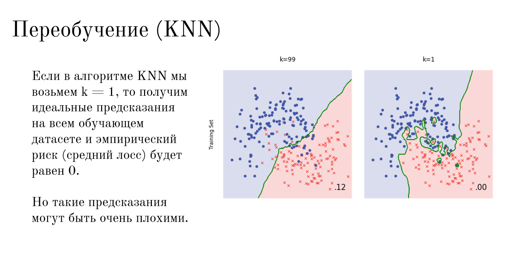

 

Этот слайд показывает, что переобучение бывает не только в регрессии, но и в других алгоритмах — например, в классификации с помощью **KNN (Метод ближайших соседей)**.

Суть KNN очень простая: чтобы определить, к какому классу относится новая точка (к синим кружкам или красным крестикам), алгоритм смотрит на $k$ её самых близких соседей и выбирает тот класс, которого среди соседей больше.

Давайте разберем два графика со слайда, используя нашу шкалу сложности:

### 1. Левый график ($k = 99$) — Простая, стабильная модель

**Что происходит:** Чтобы принять решение, алгоритм опрашивает сразу 99 ближайших соседей. Мнение одиночных случайных точек (шума) здесь ни на что не влияет — побеждает «мнение большинства».

**Разделяющая граница (зеленая линия):** Она получается ровной, плавной и спокойной.

**Ошибка (лосс = 0.12):** Модель ошибается на 12% данных на обучающей выборке. Обратите внимание: несколько синих точек залезли на красную территорию, а пара красных — на синюю. Модель их проигнорировала ради красивой общей картины. Это хорошая, обобщающая модель.

### 2. Правый график ($k = 1$) — Экстремальное переобучение (Аналог полинома 300-й степени)

**Что происходит:** Алгоритм смотрит всего на одного единственного ближайшего соседа.

**Разделяющая граница:** Она превращается в безумную, извилистую линию. Посмотрите, как она делает странные петли и «выкусывает» островки, чтобы аккуратно обойти каждую случайную точку, которая улетела глубоко в чужую зону.

**Ошибка (лосс = 0.00):** На обучающем датасете ошибка равна абсолютному нулю! Модель идеально подстроилась под каждую точку.

**В чем проблема:** Модель сошла с ума. Она запомнила случайный шум. Если завтра на поле прилетит новая синяя точка и упадет в одну из этих искусственных красных петель, модель выдаст абсолютно неверный прогноз.

### Как это связывается с прошлым уроком:

| Параметр | Линейная/Полиномиальная регрессия | Алгоритм KNN | Состояние модели |
|----|----|----|----|
| Слишком просто | Прямая линия (Линейная) | Большое $k$ (например, $k=99$) | Склонность к недообучению |
| В самый раз | Плавная кривая (Полином 2-й степени) | Оптимальное $k$ (например, $k=15$) | Идеальный баланс |
| Слишком сложно | Дикие зигзаги (Полином 300-й степени) | Маленькое $k=1$ | Переобучение (Overfitting) |

**Обратите внимание на важный парадокс в KNN:** чем меньше соседей ($k$), тем сложнее и извилистее линия предсказания (модель становится более капризной и сильнее переобучается).