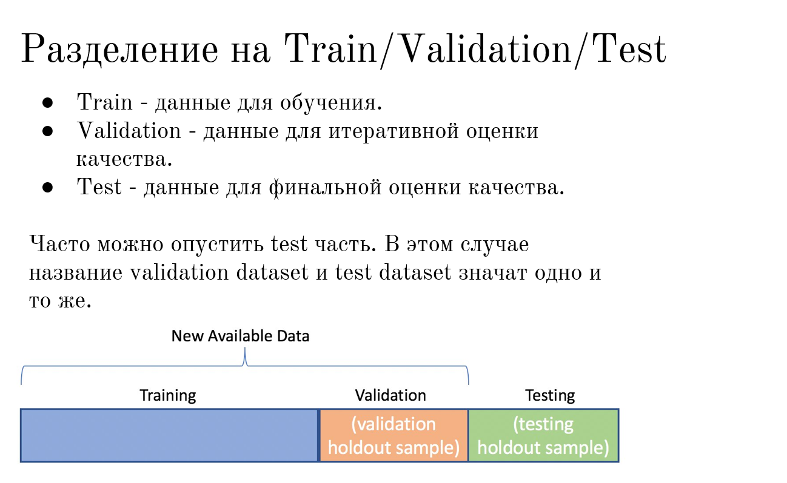
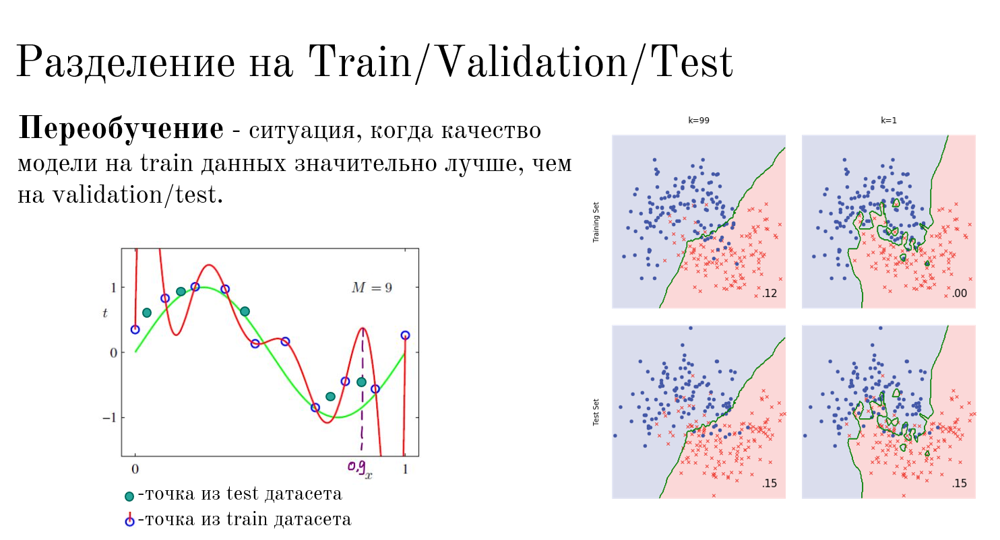
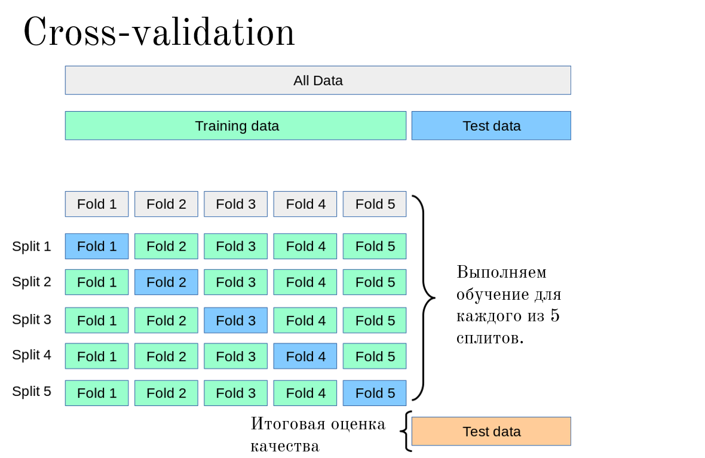

## 🔍 КАК ОБНАРУЖИТЬ ПЕРЕОБУЧЕНИЕ И БОРОТЬСЯ С НИМ

### 1. Суть одной фразой

Переобучение — это когда модель отлично помнит обучающие данные, но не умеет обобщать на новые. Чтобы это увидеть, мы разделяем данные на части: на одной учим, на другой проверяем. Если на проверке модель резко хуже — это переобучение.

### 2. ПРОБЛЕМА: как понять, что модель переобучилась?

Представь: ты учишь студента к экзамену.

| Сценарий | Что делает студент | Результат |
|----|----|----|
| Хорошо | Учит теорию и решает задачи | Сдаёт экзамен |
| Переобучился | Зазубрил ответы на те же вопросы, что были в билетах | На экзамене с другими вопросами — провал |

**Как узнать, зазубрил ли студент?**

Надо дать ему новые вопросы, которых он не видел. Если он на них отвечает плохо — значит, он не понял тему, а просто запомнил ответы.

**В ML то же самое:**

- Мы учим модель на одних данных (Train).
- Потом проверяем на новых, которых она не видела (Validation / Test).
- Если на Train модель идеальна, а на Validation — ужасна → переобучение.

### 3. РАЗДЕЛЕНИЕ ДАННЫХ: Train / Validation / Test

Это базовый инструмент для обнаружения переобучения.

| Часть | Что это | Зачем нужна |
|----|----|----|
| Train (обучающая) | Данные, на которых модель учится. | Модель видит эти данные и подбирает коэффициенты ($\theta$). |
| Validation (валидационная) | Данные, которые модель не видит, но мы используем их для настройки гиперпараметров. | Проверяем качество в процессе обучения. Если ошибка на Validation начинает расти — STOP! |
| Test (тестовая) | Данные, которые модель никогда не видела до самого конца. | Финальная проверка модели. Используется только один раз — в самом конце. |

 

### 4. КАК ОПРЕДЕЛИТЬ ПЕРЕОБУЧЕНИЕ ПО ГРАФИКУ

#### 4.1. Твой слайд с графиком ($k=1$ и $k=99$)

 

На слайде показаны две модели:

| Модель | Что видим | Диагноз |
|----|----|----|
| $k=99$ (синяя) | Ошибка на Train и Test примерно одинаковая (0.15 и 0.15) | ✅ Нормально — модель обобщает |
| $k=1$ (красная) | Ошибка на Train ≈ 0, на Test ≈ 0.12 | 🔴 Переобучение — на тренировке идеально, на тесте плохо |

**Главный признак переобучения:**

Если ошибка на Train значительно меньше, чем на Validation/Test → **ПЕРЕОБУЧЕНИЕ**.

#### 4.2. Как это выглядит в цифрах (пример)

| Модель | Ошибка на Train | Ошибка на Validation | Диагноз |
|----|----|----|----|
| Линейная регрессия | 0.30 | 0.32 | ✅ Нормально |
| Полином (степень 5) | 0.02 | 0.45 | 🔴 Переобучение |
| Полином (степень 2) | 0.12 | 0.14 | ✅ Хорошо |

### 5. КРОСС-ВАЛИДАЦИЯ (Cross-Validation)

[Пример из домашки по КНН](https://ivan-valuchev.yonote.ru/doc/primer-iz-domashki-po-knn-8VFIyckdlN)

Это продвинутый способ обнаружения переобучения, когда у нас мало данных.

#### 5.1. Проблема обычного подхода

Когда мы делим данные на Train/Validation один раз, мы зависим от того, какие точки попали в Validation. Если случайно туда попали «лёгкие» примеры — оценка будет завышенной. Если «сложные» — заниженной.

#### 5.2. Решение: K-Fold Cross-Validation

Идея: делим данные на $K$ частей (фолдов). Каждый раз берём один фолд как Validation, остальные $K-1$ как Train. И так $K$ раз.

**Визуализация (как на твоём слайде)**

 

**Что происходит:**

1. Делим данные на 5 частей (фолдов).
2. Обучаем модель 5 раз.
3. Каждый раз берём новый фолд как Validation.
4. Получаем 5 оценок качества.
5. Итоговая оценка = среднее арифметическое этих 5 оценок.

#### 5.3. Зачем это нужно?

| Без кросс-валидации | С кросс-валидацией |
|----|----|
| Оценка зависит от того, как мы один раз поделили данные. | Оценка стабильнее, потому что модель проверена на всех данных по очереди. |
| Может быть случайно хорошая или плохая оценка. | Получаем надёжную оценку качества. |
| Используем, когда данных много. | Используем, когда данных мало (каждый пример важен). |

#### 5.4. Пример с твоими данными

У тебя 1000 строк. Ты хочешь проверить, не переобучилась ли модель.

**Вариант 1 (простой):**

- Train: 800 строк
- Validation: 200 строк
- Оценка получена на 200 строках.

**Вариант 2 (кросс-валидация, 5 фолдов):**

- Делим на 5 частей по 200 строк.
- Обучаем 5 раз, каждый раз проверяем на новой части.
- Получаем 5 оценок: 0.12, 0.14, 0.11, 0.13, 0.15.
- Средняя = 0.13 — это надёжная оценка.

### 6. КАК ЭТО СВЯЗАНО С ПЕРЕОБУЧЕНИЕМ

**Полный алгоритм обнаружения переобучения:**

1. Раздели данные на Train и Validation (и Test, если есть).
2. Обучи модель на Train.
3. Посчитай ошибку на Train и на Validation.
4. Сравни:
   - Если ошибки примерно равны → ✅ модель обобщает.
   - Если ошибка на Train значительно меньше, чем на Validation → 🔴 переобучение.
5. Для надёжности используй кросс-валидацию, чтобы оценка была стабильной.

### 7. КАК ОТВЕЧАТЬ, ЧТОБЫ ПОКАЗАТЬ ПОНИМАНИЕ

| Если спросят... | Ты НЕ говоришь (зубрёжка) | Ты ГОВОРИШЬ (понимание) |
|----|----|----|
| «Как определить переобучение?» | «Сравнить ошибку на Train и Test» | «Нужно разделить данные на обучающую и проверочную выборки. Обучить модель на первой и посчитать ошибку на второй. Если на обучающей ошибка намного меньше — значит, модель запомнила данные, а не научилась обобщать». |
| «Зачем нужна валидационная выборка?» | «Чтобы проверять модель» | «Чтобы видеть, не начинает ли модель переобучаться. Если ошибка на валидации растёт, а на обучении падает — это сигнал остановиться». |
| «Зачем нужна кросс-валидация?» | «Чтобы использовать все данные» | «Она даёт более стабильную оценку качества, особенно когда данных мало. Вместо того чтобы один раз поделить данные (и зависеть от случайности), мы делим их на $K$ частей и проверяем модель $K$ раз на разных частях». |
| «Чем отличается Validation от Test?» | «Validation для настройки, Test для финальной проверки» | «Validation мы используем много раз во время разработки — настраиваем гиперпараметры, выбираем модель. Test используем один раз в самом конце, чтобы получить честную оценку того, как модель будет работать в реальности». |
| «Когда можно опустить Test?» | «Когда мало данных» | «Если данных мало, можно объединить Validation и Test в одну выборку. Но тогда мы теряем возможность финальной независимой проверки. Это компромисс». |

### 8. ИТОГОВАЯ ШПАРГАЛКА

**Признаки переобучения**

| Что видим | Диагноз |
|----|----|
| Ошибка на Train ≈ 0 | 🔴 Подозрительно! |
| Ошибка на Train << Ошибка на Validation | 🔴 Переобучение |
| Ошибка на Train ≈ Ошибка на Validation | ✅ Хорошо |
| Сложная модель даёт отличные результаты на Train, но плохие на Validation | 🔴 Переобучение |

**Инструменты для обнаружения**

| Инструмент | Когда использовать | Что даёт |
|----|----|----|
| Train/Validation split | Всегда | Быструю оценку |
| Train/Validation/Test split | Когда данных достаточно | Честную финальную оценку |
| K-Fold Cross-Validation | Когда данных мало | Стабильную оценку |

### 🔥 САММАРИ (на 1 минуту)

**Как определить переобучение:**

1. Раздели данные на Train и Validation.
2. Обучи модель на Train.
3. Посчитай ошибку на Train и Validation.
4. Сравни:
   - Если на Train ошибка намного меньше → переобучение.
   - Если ошибки примерно равны → ✅ всё хорошо.

**Зачем нужны разные выборки:**

| Часть | Зачем |
|----|----|
| Train | Учим модель. |
| Validation | Проверяем в процессе и настраиваем гиперпараметры. |
| Test | Финальная проверка один раз в конце. |

**Зачем нужна кросс-валидация:**

- Даёт стабильную оценку.
- Особенно полезна, когда данных мало.
- Усредняет ошибку по $K$ разным разбиениям.

**Главная мысль, которую нужно запомнить:**

Мы не можем доверять ошибке на обучающей выборке. Она всегда будет занижена, потому что модель видела эти данные. Единственный способ узнать реальное качество — проверить модель на новых, невиданных данных. Для этого мы и делим данные на части.

  

## **🔥 САММАРИ (на 1 минуту)**

| **Термин** | **Ошибка на Train** | **Ошибка на Validation** | **Диагноз** |
|----|----|----|----|
| **Недообучение (Underfitting)** | Большая | Тоже большая | Модель слишком простая |
| **Норма** | Маленькая | Тоже маленькая | ✅ Золотая середина |
| **Переобучение (Overfitting)** | Очень маленькая (≈0) | Большая | Модель слишком сложная |

**Главная формула запоминания:**

- Ошибка везде большая = **Недообучение** (модель тупая).
- Ошибка на Train = 0, на Validation = большая = **Переобучение** (модель зубрилка).
- Ошибки примерно равны и маленькие = ✅ **Идеал**.

  