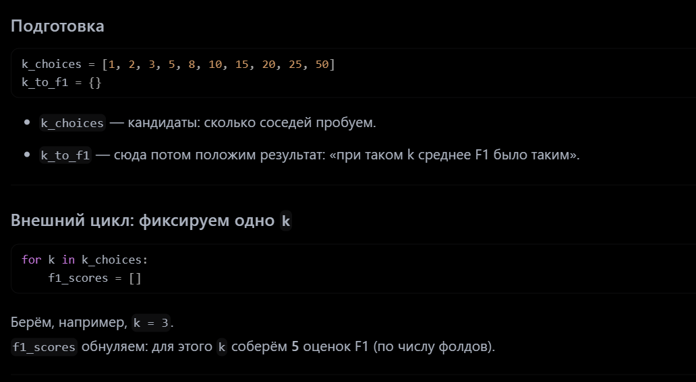
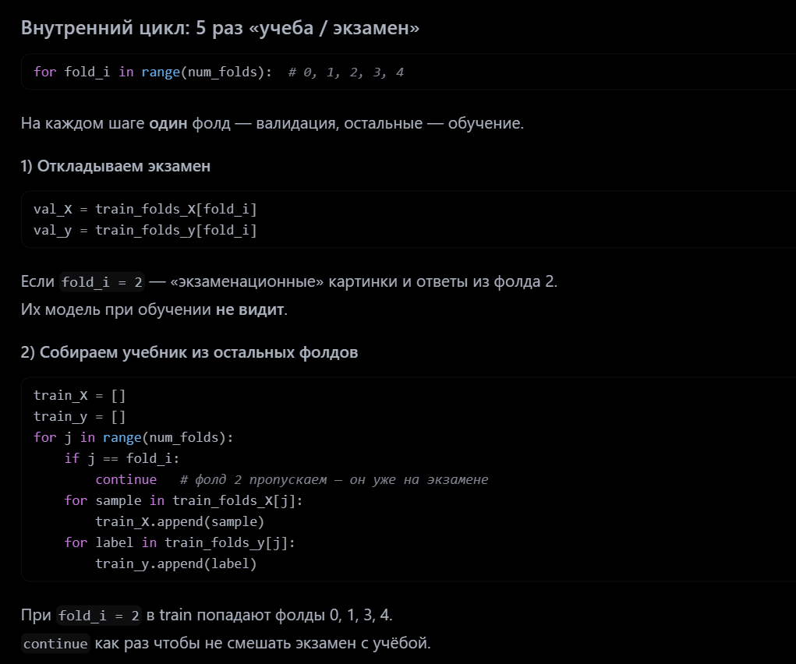
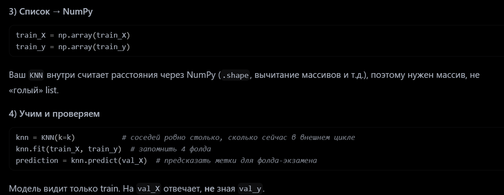
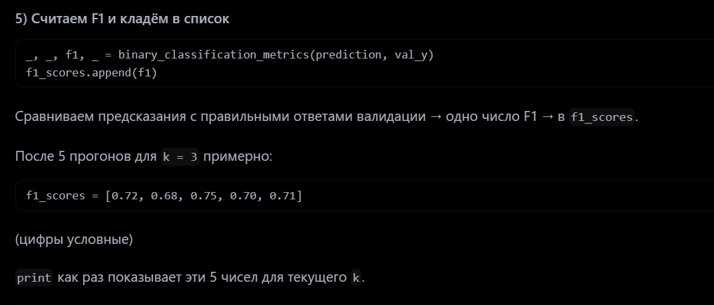
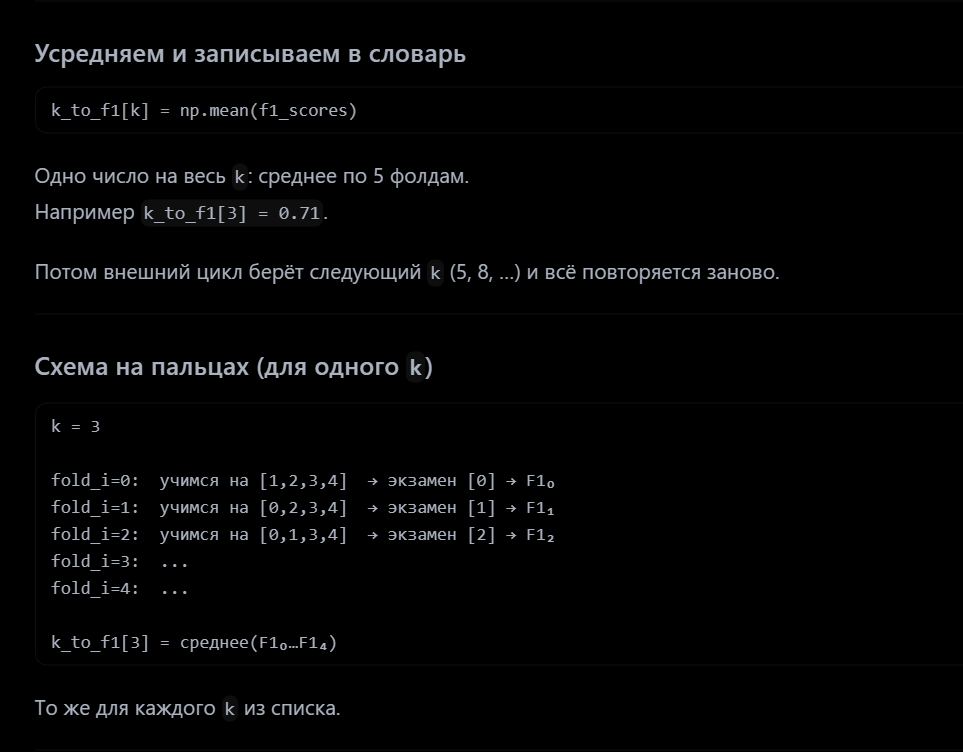

### Находим лучшее значение k с помощью кросс-валидации на основе F1-меры

```python
# Находим лучшее значение k с помощью кросс-валидации на основе F1-меры
num_folds = 5
train_folds_X = []
train_folds_y = []

# ЗАДАНИЕ: разделить обучающие данные на 5 фолдов и сохранить их в train_folds_X/train_folds_y
fold_size = binary_train_X.shape[0] // num_folds
for i in range(num_folds):
    start = i * fold_size
    end = (i + 1) * fold_size
    train_folds_X.append(binary_train_X[start:end])
    train_folds_y.append(binary_train_y[start:end])

k_choices = [1, 2, 3, 5, 8, 10, 15, 20, 25, 50]
k_to_f1 = {}  # словарь: значение k -> среднее F1 (int -> float)


for k in k_choices:
    f1_scores = []  # сюда положите 5 чисел (по одному на фолд)
    

    for fold_i in range(num_folds):
        # текущий фолд — валидация, остальные — обучение
        """ На каждом шаге внутреннего цикла:
        val_X / val_y — «экзамен»: фолд fold_i (например, первый).
        train_X / train_y — учимся на всех остальных фолдах (continue, когда j == fold_i).
        predict(val_X) — сдаём экзамен на этой валидационной пачке.
        Сравниваем с val_y — считаем F1: насколько предсказания совпали с настоящими ответами этого фолда. """
        val_X = train_folds_X[fold_i]
        val_y = train_folds_y[fold_i]
        # собираем train из всех фолдов, кроме текущего (валидационного)
        train_X = []
        train_y = []
        for j in range(num_folds):
            if j == fold_i:
                continue
            for sample in train_folds_X[j]:
                train_X.append(sample)
            for label in train_folds_y[j]:
                train_y.append(label)
        # KNN внутри ждёт numpy-массивы
        train_X = np.array(train_X)
        train_y = np.array(train_y)

        knn = KNN(k=k)
        knn.fit(train_X, train_y)
        prediction = knn.predict(val_X)
        _, _, f1, _ = binary_classification_metrics(prediction, val_y)
        f1_scores.append(f1)

    # среднее арифметическое
    k_to_f1[k] = float(np.mean(f1_scores))

for k in sorted(k_to_f1):
    print("k = %d, f1 = %f" % (k, k_to_f1[k]))
```


первый цикл разбивает на 5 пачек

а потом


 

 

 

 

 

 


