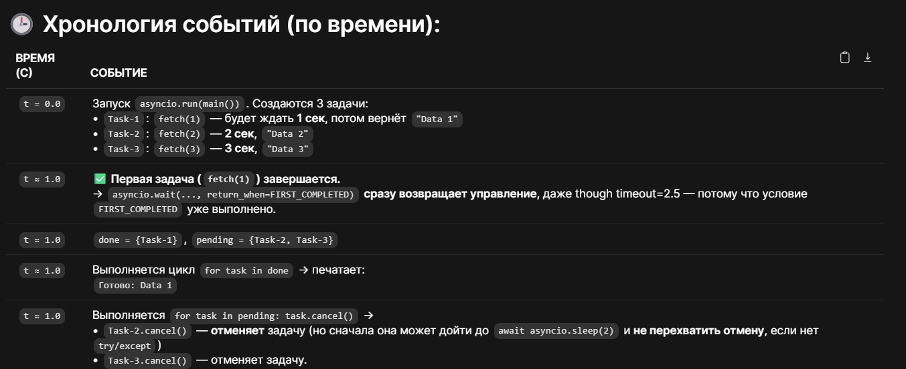
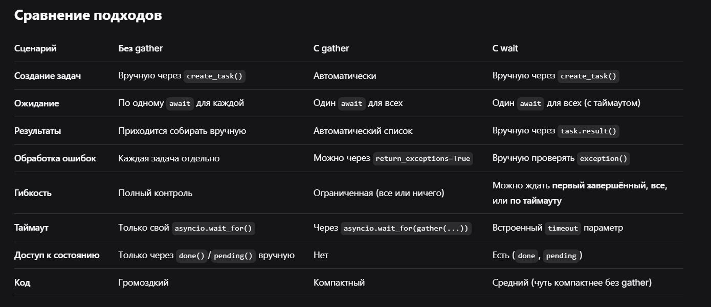

# **Asyncio.gather()**  

 

```javascript
async def main():
    # Создаем задачи вручную
    task1 = asyncio.create_task(fetch_url("url1"))
    task2 = asyncio.create_task(fetch_url("url2"))
    task3 = asyncio.create_task(fetch_url("url3"))
    
    # Ждем каждую вручную
    result1 = await task1
    result2 = await task2
    result3 = await task3
    
    # Работаем с результатами
    print(result1, result2, result3)
```


```javascript
async def main():
    # Все в одной строке!
    results = await asyncio.gather(
        fetch_url("url1"),
        fetch_url("url2"),
        fetch_url("url3")
    )
    
    # results = [результат1, результат2, результат3]
    print(results)
```


 

```javascript
# Это примерно то же самое, что и gather()
async def my_gather(*coroutines):
    tasks = [asyncio.create_task(coro) for coro in coroutines]
    results = []
    for task in tasks:
        results.append(await task)
    return results
```

 

## **💡 Пример с gather и ошибками**

  

### **Стандартное поведение (первая ошибка — все падает)**

```javascript
import asyncio


async def fail():
    raise ValueError("Ошибка!")
    return "не вернется"

async def success():
    await asyncio.sleep(1)
    return "OK"

async def main():
    try:
        results = await asyncio.gather(
            success(),
            fail(),
            success()
        )
    except ValueError as e:
        print(f"Поймали: {e}")
        # Все задачи отменены, success() не завершились!

# выведется
# Поймали: Ошибка!

asyncio.run(main())
```


## return_exceptions=True — продолжаем выполнение

```javascript
async def fail():
    raise ValueError("Ошибка!")
    return "не вернется"

async def success():
    await asyncio.sleep(1)
    return "OK"

async def main():
    results = await asyncio.gather(
        success(),
        fail(),
        success(),
        return_exceptions=True  # <-- Ключевой параметр!
    )
    
    for result in results:
        if isinstance(result, Exception):
            print(f"Задача упала: {result}")
        else:
            print(f"Успех: {result}")

asyncio.run(main())

# Вывод:
# Успех: OK
# Задача упала: Ошибка!
# Успех: OK
```


 

  

## **🎯 Итог одной фразой**

> 
> ```javascript
> asyncio.gather()
> ```
>
>  — это удобный способ сказать: "Запусти все эти корутины параллельно, подожди их все, и дай мне результаты в виде одного списка".

 

# Asyncio.wait() 

  

**Когда использовать:**

- Нужен **таймаут** на выполнение
- Хотите обрабатывать результаты **по мере поступления**
- Нужно **отменить** часть задач
- Хотите дождаться **первой** завершенной

### Формат возврата:

```javascript
done, pending = await asyncio.wait(tasks, timeout=..., return_when=...)

( <множество завершённых задач>, <множество незавершённых задач> )
```

```javascript
import asyncio

async def fetch(id):
    await asyncio.sleep(id)
    return f"Data {id}"

async def main():
    # Сначала создаем задачи
    tasks = [
        asyncio.create_task(fetch(1)),
        asyncio.create_task(fetch(2)),
        asyncio.create_task(fetch(3))
    ]
    
    # Ждем с таймаутом
    done, pending = await asyncio.wait(
        tasks,
        timeout=2.5,
        return_when=asyncio.FIRST_COMPLETED
    )
    
    # Обрабатываем завершенные
    for task in done:
        print(f"Готово: {task.result()}")
    
    # Отменяем остальные
    for task in pending:
        task.cancel()

asyncio.run(main())
```


 


# Сравнение подходов

 

  

## **🎯 Когда что использовать (шпаргалка)**

### **Используйте** 

```javascript
gather
```

**, когда:**

- ✅ Все задачи **должны** завершиться
- ✅ Нужны **все результаты** в правильном порядке
- ✅ Код должен быть **кратким** и читаемым
- ✅ Не нужны таймауты или частичные результаты

### **Используйте** 

```javascript
wait
```

**, когда:**

- ✅ Нужен **таймаут**
- ✅ Хотите **отменить** зависшие задачи
- ✅ Нужно дождаться **первого** ответа
- ✅ Хотите **постепенно** обрабатывать результаты
- ✅ Нужен **гибкий контроль** над выполнением

  