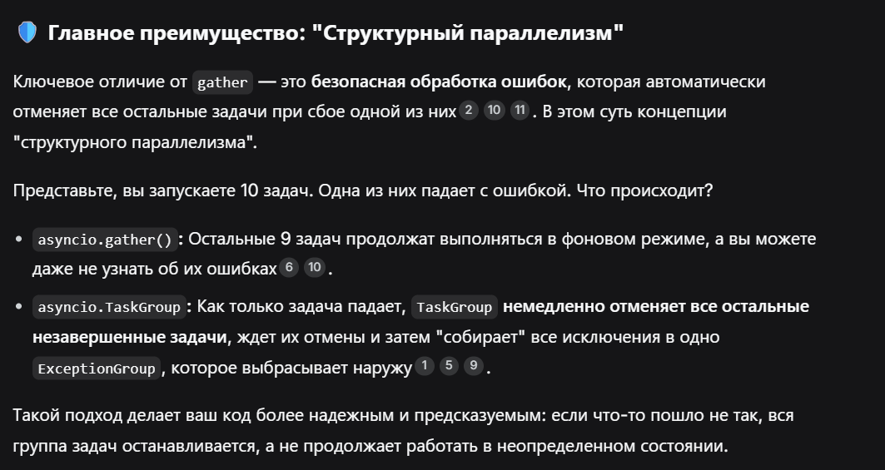
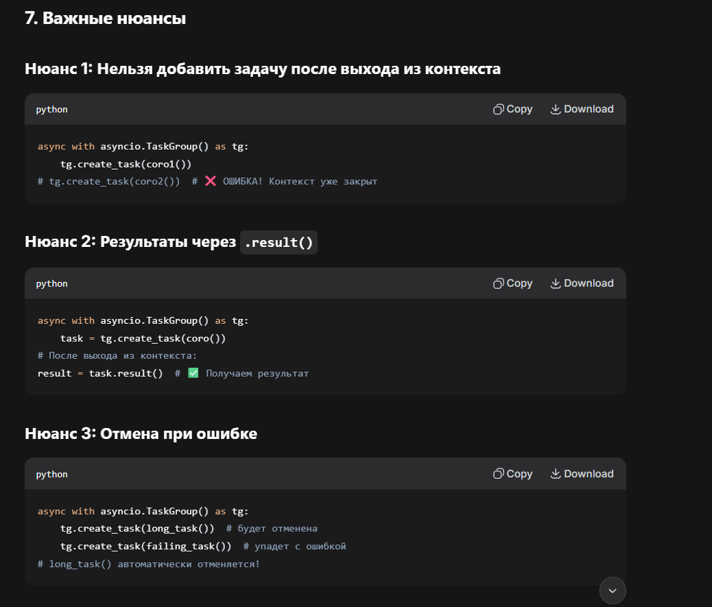
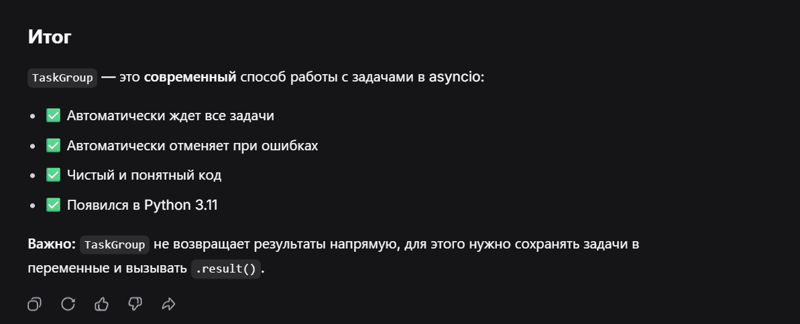

  

В TaskGroup задачи создаются ТОЛЬКО через tg.create_task().

Это единственный способ добавить задачу в группу.

  

**TaskGroup** — это логичное продолжение темы asyncio.gather() и asyncio.wait(). Это более современный и безопасный способ управления группой задач, появившийся в Python 3.11. В вашей структуре заметок он отлично впишется в раздел **"Asyncio"**, дополнив сравнение методов gather() и wait().  

Коротко говоря, asyncio.TaskGroup — это **структурная альтернатива** gather и wait с фокусом на безопасность и предсказуемость.

  

### **📚 Что такое TaskGroup?**


Это **асинхронный контекстный менеджер** для управления группой задач. Вместо того чтобы передавать список корутин в функцию, вы создаете задачи внутри специального блока async with

.

**Пример использования:**

```javascript
import asyncio

async def print1():
    print(1)

async def print2():
    await asyncio.sleep(10)
    print(2)

async def print3():
    print(3)

async def main():
    async with asyncio.TaskGroup() as tg:
        tg.create_task(print1())
        tg.create_task(print2())
        tg.create_task(print3())

asyncio.run(main())

1
3
(ждет 10 секунд)
2
```

  Весь код внутри блока async with выполняется, и как только вы выходите из контекста, **все созданные задачи автоматически ожидаются и завершаются**.


 

```javascript
import asyncio

async def print1():
    print(1)
    return "Результат 1"

async def print2():
    await asyncio.sleep(10)
    print(2)
    return "Результат 2"

async def print3():
    print(3)
    raise ValueError("Ошибка в print3!")  # Искусственная ошибка

async def main():
    try:
        async with asyncio.TaskGroup() as tg:
            task1 = tg.create_task(print1())
            task2 = tg.create_task(print2())
            task3 = tg.create_task(print3())
        
        # Если дошли сюда - все задачи успешно завершились
        print(task1.result())  # "Результат 1"
        print(task2.result())  # "Результат 2"
        print(task3.result()) # вызовет ошибку, но до нее не дойдем
        
    except* ValueError as e:
        print(f"Перехвачена ошибка: {e}")

asyncio.run(main())

1
3
Перехвачена ошибка: unhandled errors in a TaskGroup (1 sub-exception)
```


 

 


