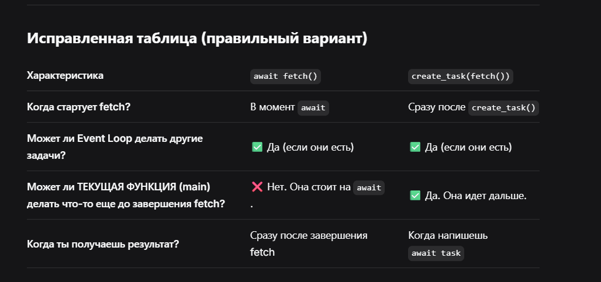

[Общие понятия](https://ivan-valuchev.yonote.ru/doc/obshie-ponyatiya-IkUoiwDzcT)

[Почему только asyncio является асинхронностью](https://ivan-valuchev.yonote.ru/doc/pochemu-tolko-asyncio-yavlyaetsya-asinhronnostyu-jTwC5rD0lT)

[Asyncio](https://ivan-valuchev.yonote.ru/doc/asyncio-6CB7RawXq9)


 

 

  

## **Главное правило (исправленное)**

**Ключевое отличие не в том, "блокируется ли Event Loop" (он НЕ блокируется в обоих случаях), а в том, "может ли ТЕКУЩАЯ ФУНКЦИЯ продолжать выполнение".**

- 
  ```javascript
  await fetch()
  ```

   → Текущая функция **останавливается** до завершения fetch. Другие функции могут работать, но эта — нет.
- 
  ```javascript
  create_task(fetch())
  ```

   → Текущая функция **продолжает выполняться**, пока fetch работает в фоне.

  