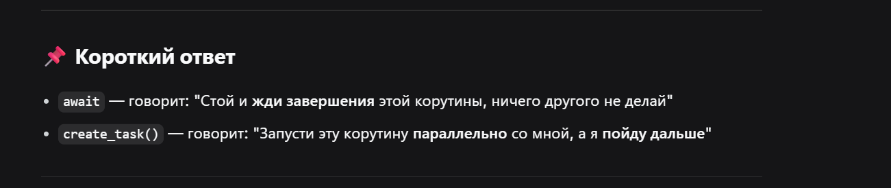
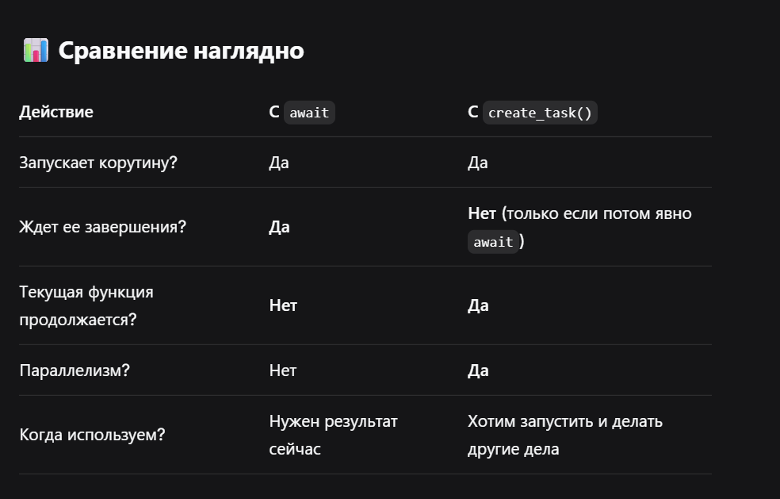

 


Вариант 1: Просто await (последовательное выполнение)

```javascript
import asyncio

async def slow_operation(name, delay):
    print(f"Начинаю {name}")
    await asyncio.sleep(delay)
    print(f"Заканчиваю {name}")
    return f"Результат {name}"

async def main():
    print("Старт")
    
    # Ждем первую
    result1 = await slow_operation("A", 3)
    print("A завершена")
    
    # Ждем вторую
    result2 = await slow_operation("B", 3)
    print("B завершена")
    
    print("Финиш")

asyncio.run(main())

Старт
Начинаю A
Заканчиваю A        # через 3 секунды
A завершена
Начинаю B
Заканчиваю B        # через еще 3 секунды
B завершена
Финиш
```

**Итог:** Общее время = **6 секунд**. Мы ждали А, потом начали B.


Вариант 2: create_task() + await (параллельное выполнение)

```javascript
  import asyncio

async def slow_operation(name, delay):
    print(f"Начинаю {name}")
    await asyncio.sleep(delay)
    print(f"Заканчиваю {name}")
    return f"Результат {name}"

async def main():
    print("Старт")
    
    # СОЗДАЕМ задачи, но НЕ ждем их
    task1 = asyncio.create_task(slow_operation("A", 3))
    task2 = asyncio.create_task(slow_operation("B", 3))
    
    print("Задачи созданы, иду дальше...")
    
    # А теперь ждем их обе
    result1 = await task1
    result2 = await task2
    
    print("Финиш")

asyncio.run(main())

Старт
Начинаю A
Начинаю B          # Сразу!
Задачи созданы, иду дальше...
Заканчиваю A        # через 3 секунды
Заканчиваю B        # через 3 секунды
Финиш
```

**Итог:** Общее время = **3 секунды**. Обе задачи запустились параллельно!
  

### Зачем нужен create_task()?

Основная цель: запустить корутину в фоне

```javascript
async def main():
    # Мы создаем задачу, но НЕ ждем ее сразу
    background_task = asyncio.create_task(long_running())
    
    # Мы продолжаем выполнять код!
    print("Задача запущена в фоне, продолжаю работу")
    
    # Что-то делаем...
    await asyncio.sleep(1)
    print("Пока задача работала, я сделал что-то полезное")
    
    # Когда нужно — ждем результат(так как снова испольщуем просто await) 
    result = await background_task
    print(f"Результат: {result}")
```


 

```javascript
async def main():
    print("Шаг 1")
    await asyncio.sleep(5)  # <-- ТУТ ВСЕ СТОП!
    print("Шаг 2")          # Это случится только через 5 секунд
```


 

```javascript
async def main():
    print("Шаг 1")
    task = asyncio.create_task(asyncio.sleep(5))
    print("Шаг 2")  # Сразу!
    await task      # Ждем, когда понадобится
```


 


```javascript
import asyncio

async def long_running_task():
    print("Задача запущена в фоне, продолжаю работу")
    await asyncio.sleep(3)
    print("Задача завершена")
    return "Результат"


async def main():
    # asyncio.create_task(long_running_task()) создает задачу (объект Task)
    # background_task — это объект Task, а не строка
    # await background_task → ожидает завершения задачи и получает результат


    background_task = asyncio.create_task(long_running_task())
    await asyncio.sleep(1)
    print("Пока задача работала, я сделал что-то полезное")
    result = await background_task
    print(f"Результат: {result}")


# если бы мы не испольщовали create_task, то 

async def long_running():
    print("Задача запущена, пока не выполнится полностью, дальше ничего не делаем")
    await asyncio.sleep(3)
    print("Задача завершена")
    return "Результат"

async def main():
    # await long_running() выполняет функцию long_running() и возвращает ее результат
    # Функция long_running() возвращает строку "Результат"
    # Значит background_task = "Результат" (это строка, а не задача!)
    print("Старт")
    result = await long_running()
    await asyncio.sleep(1)
    print(f"Результат: {result}")

    
asyncio.run(main())
```


