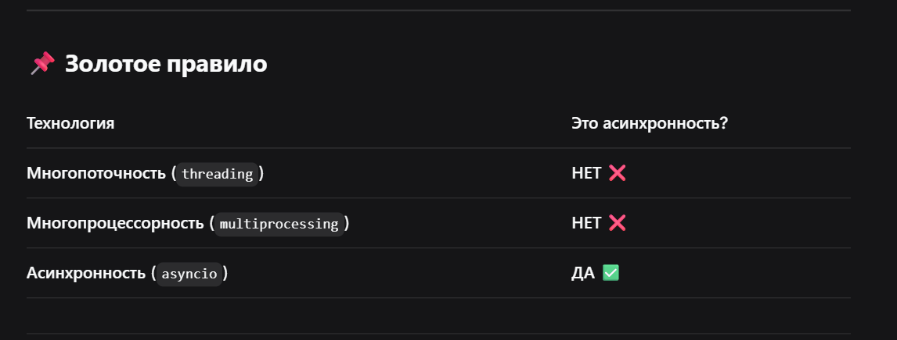
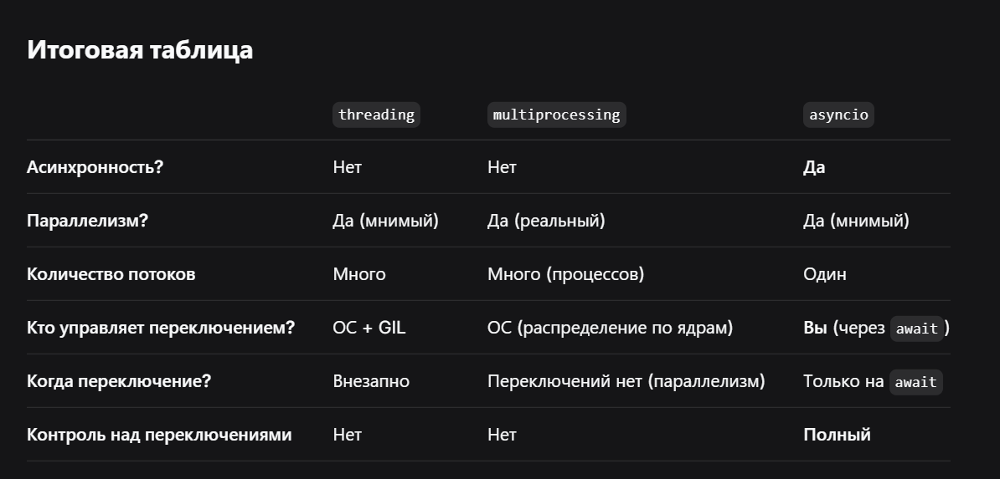

 

  

## **Почему** threading и multiprocessing **— НЕ асинхронность?**

Потому что в них **переключение между задачами происходит автоматически**, без вашего контроля:

### **Многопоточность (**threading**)**

- Переключение происходит **внезапно** (каждые 5 мс или при I/O).
- Управляет **GIL + операционная система**.
- Вы не знаете, когда поток будет прерван.

### **Многопроцессорность (**multiprocessing**)**

- Вообще никакого переключения нет!
- Каждый процесс работает **независимо и параллельно**.
- Процессы не "переключаются" между собой — они выполняются одновременно на разных ядрах.
- Нет никакой "асинхронности" — просто несколько параллельных потоков выполнения.

---

## **Почему** asyncio  **— ЭТО асинхронность?**

Потому что:

1. **Один поток** выполняет все задачи.
2. Переключение происходит **только там, где вы явно написали**  await

   .
3. Вы **полностью контролируете**, когда задача "засыпает" и отдает управление другим.
4. Это **кооперативная многозадачность** — задачи сами договариваются, кто и когда работает.


```javascript
import asyncio

async def task():
    # Здесь выполняется код
    result = await some_io_operation()  # <-- ЯВНОЕ переключение!
    # Код продолжится только когда операция завершится
```


 

  

## **Одной фразой**

> **Многопоточность и многопроцессорность** — это способы выполнять код параллельно или с переключениями от системы.
> **Асинхронность** (asyncio) — это способ выполнять код в **одном потоке**, но с **явным контролем** над тем, когда переключаться между задачами.

  