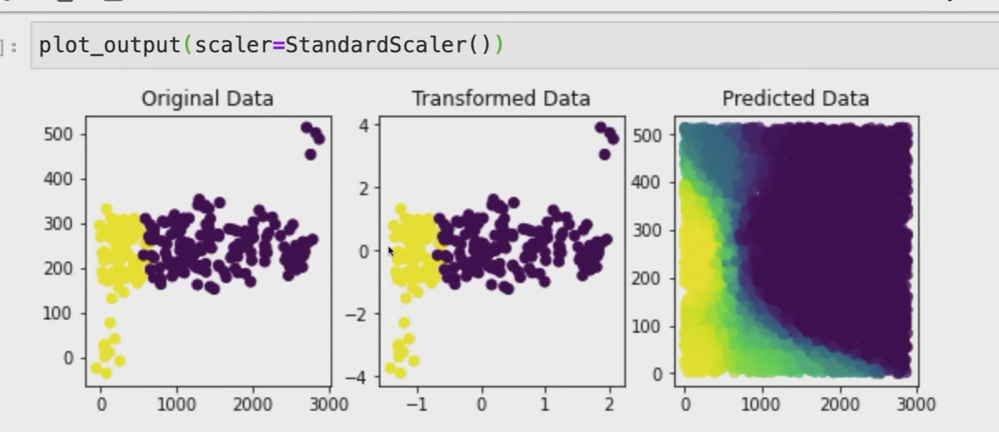
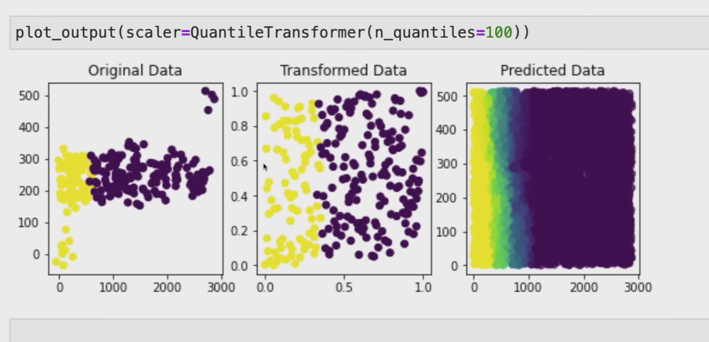

## Что такое Feature Scale (Масштаб признаков)?

**Feature Scale** — это размер чисел, в которых измеряются разные признаки.

**Пример из твоего файла:**

- Расстояние до метро: от $100$ до $5000$ метров (большие числа)
- Количество комнат: от $1$ до $5$ штук (маленькие числа)

---

### В чем проблема? (самое главное!)

KNN считает расстояние по формуле:

$$
d_i = \sqrt{(x_{\text{new},1} - X_{i,1})^2 + (x_{\text{new},2} - X_{i,2})^2 + \ldots}
$$

**Проблема:** Если один признак измеряется в тысячах (расстояние до метро = $5000$ м), а другой — в единицах (количество комнат = $3$), то расстояние до метро будет перевешивать всё остальное!

---

### Наглядный пример (на пальцах)

Представь, что ты ищешь похожие дома. У тебя есть два дома:

**Дом А:**

- Расстояние до метро: $100$ м
- Количество комнат: $3$

**Дом Б:**

- Расстояние до метро: $200$ м
- Количество комнат: $4$

**Новый дом:**

- Расстояние до метро: $150$ м
- Количество комнат: $3$

**Считаем расстояние (БЕЗ нормализации):**

**До Дома А:**

| Признак | Новый дом | Дом А | Разница | Квадрат |
|:---|:---|:---|:---|:---|
| Метро | $150$ | $100$ | $50$ | $2500$ |
| Комнаты | $3$ | $3$ | $0$ | $0$ |
| **Сумма** |    |    |    | $2500$ |
| **Расстояние** |    |    |    | $50$ |

**До Дома Б:**

| Признак | Новый дом | Дом Б | Разница | Квадрат |
|:---|:---|:---|:---|:---|
| Метро | $150$ | $200$ | $-50$ | $2500$ |
| Комнаты | $3$ | $4$ | $-1$ | $1$ |
| **Сумма** |    |    |    | $2501$ |
| **Расстояние** |    |    |    | $\approx 50.01$ |

**Результат:** Расстояние до Дома А = $50$, до Дома Б = $50.01$. Они почти одинаковые! Количество комнат (разница в $1$ комнату) почти не повлияло на расстояние, потому что числа по метро в тысячи раз больше.

---

### Что делать? (Нормализация)

Нужно привести все признаки к одному масштабу, например, от $0$ до $1$.

**Формула нормализации (Min-Max):**

$$
x_{\text{норм}} = \frac{x - x_{\text{min}}}{x_{\text{max}} - x_{\text{min}}}
$$

**Пример:**

| Признак | Минимум | Максимум | Исходное значение | Нормализованное |
|:---|:---|:---|:---|:---|
| Метро | $100$ м | $5000$ м | $150$ м | $(150-100)/(5000-100) \approx 0.010$ |
| Комнаты | $1$ | $5$ | $3$ | $(3-1)/(5-1) = 0.50$ |

Теперь оба признака в одном масштабе (от $0$ до $1$)! Расстояние будет считаться честно.

## Что мы делаем с данными?

Мы **НЕ удаляем** признаки «расстояние до метро» и «количество комнат». Мы просто **пересчитываем** их числа в другой масштаб.

**Было (до нормализации):**

| **Дом** | **Расстояние до метро (м)** | **Количество комнат** |
|----|----|----|
| №1 | 150 | 3 |
| №2 | 3200 | 2 |
| №3 | 500 | 4 |

**Стало (после нормализации):**

| **Дом** | **Расстояние до метро (норм.)** | **Количество комнат (норм.)** |
|----|----|----|
| №1 | ≈ 0.010 | 0.50 |
| №2 | ≈ 0.633 | 0.25 |
| №3 | ≈ 0.082 | 0.75 |

---

### Итоговая таблица (запомни)

| Пункт | Что это значит |
|:---|:---|
| Feature Scale | Размер чисел, в которых измеряются признаки |
| Проблема | Признаки с большими числами «задавливают» признаки с маленькими числами |
| Пример | Расстояние до метро ($5000$ м) vs Количество комнат ($3$ шт.) |
| Решение | Нормализация — привести все признаки к одному масштабу (например, от $0$ до $1$) |
| Когда делать | Обязательно перед использованием KNN |

---

### Главный вывод

Без нормализации KNN будет считать, что расстояние до метро — это единственное, что важно, а количество комнат почти не влияет на предсказание. Это неправильно!

Нормализация исправляет эту ошибку и делает все признаки равноправными. 🎯

---

## 🧰 Виды масштабирования (скейлеры) — кратко

Выше мы разобрали Min-Max. Но «привести к одному масштабу» можно по-разному. Разные скейлеры — это разные ответы на вопрос «*а что именно мы считаем масштабом?*».

| Скейлер | Идея (одной фразой) | Формула | Чувствителен к выбросам? |
|:---|:---|:---|:---|
| `MinMaxScaler` | Растянуть в отрезок $[0, 1]$ | $\dfrac{x - x_{\min}}{x_{\max} - x_{\min}}$ | **Да** (min/max ломаются от одного выброса) |
| `StandardScaler` | Вычесть среднее, поделить на $\sigma$ (**z-score**) | $\dfrac{x - \mu}{\sigma}$ | **Да** (среднее и $\sigma$ «тянутся» выбросом) |
| `RobustScaler` | То же, но центр/размах — по медиане и квартилям | $\dfrac{x - \text{median}}{IQR}$ | **Нет**, устойчив |
| `QuantileTransformer` | Заменить значение его **рангом/квантилем** | см. ниже | **Нет**, наоборот — гасит выбросы |

---

## 📐 StandardScaler (стандартизация, z-score)



**Идея:** привести признак к виду «сколько сигм от среднего» — среднее становится $0$, стандартное отклонение $1$.

$$
z = \frac{x - \mu}{\sigma}
$$

- $\mu$ — среднее по признаку, $\sigma$ — стандартное отклонение.
- «Стандартный скейлер» именно поэтому и называется *стандартным*: значения превращаются в **z-оценки** (сколько $\sigma$ от центра).
- **Плюс:** масштаб не зависит от числа выбросов «в разы», форма распределения сохраняется, хорошо для линейных моделей, SVM, PCA, градиентного спуска.
- **Минус:** если распределение сильно скошено или есть жирные хвосты — один выброс раздувает $\mu$ и $\sigma$, и **все** остальные точки «съёживаются» к нулю.

```python
from sklearn.preprocessing import StandardScaler

scaler = StandardScaler().fit(X_train)   # выучил μ и σ ПО TRAIN
X_train_s = scaler.transform(X_train)
X_val_s   = scaler.transform(X_val)       # только transform, без fit!
```

> ⚠️ `StandardScaler` **запоминает** $\mu$ и $\sigma$ (это *stateful*-преобразователь). Обучать его можно только на train, иначе — утечка (см. `2.Кросс-валидация.md`, §7). В `Pipeline` это делается автоматически.

---

## 🎯 QuantileTransformer — «ранжирующее» масштабирование



**Идея (на пальцах):** мы не смотрим на сами значения, а смотрим, **какое место** значение занимает в отсортированном списке. Каждое число заменяется его **процентилем** (долей объектов, которые меньше него).

**Аналогия:** в классе 20 учеников. Важны не сами баллы (87, 92, 60…), а **ранг** — «ты 3-й сверху» или «ты в топ-15 %». QuantileTransformer делает то же самое с признаком.

**Как это работает (два шага):**

1. По train строим эмпирическую функцию распределения $F(x)$ — она каждому значению ставит в соответствие его процентиль (от $0$ до $1$).
2. Отображаем этот процентиль в **целевое** распределение:
   - `output_distribution='uniform'` (по умолчанию) → оставляем процентиль как есть, признак становится **равномерным** на $[0, 1]$;
   - `output_distribution='normal'` → пропускаем процентиль через обратную функцию нормального распределения $\Phi^{-1}$, признак становится **похожим на гауссов**.

$$
x \;\longrightarrow\; F(x) \;\longrightarrow\; \begin{cases}
F(x), & \text{uniform} \\[4pt]
\Phi^{-1}\big(F(x)\big), & \text{normal}
\end{cases}
$$

**Что это даёт:**

- **Выбросы перестают «давить».** Самый огромный выброс всё равно получит процентиль $\approx 1$ — он просто станет крайней точкой, а не растянет всю шкалу (в отличие от `StandardScaler`/`MinMaxScaler`).
- **Распределение выравнивается** — иногда это заметно улучшает линейные модели и метрики на скошенных данных (доходы, цены, время отклика).
- Признак становится **робастным** и **сравнимым** с другими.

**Код:**

```python
from sklearn.preprocessing import QuantileTransformer

qt = QuantileTransformer(
    n_quantiles=1000,                 # на сколько «ступенек» делим процентиль
    output_distribution='uniform',    # или 'normal'
    random_state=42,
)
qt.fit(X_train)                       # учим F(x) ТОЛЬКО на train
X_train_q = qt.transform(X_train)
X_val_q   = qt.transform(X_val)
```

Про ключевой параметр `n_quantiles`:

- сколько квантилей оценивать (грубо — число «бинов», на которые разбиваем ось значений);
- **больше** → точнее повторяем форму распределения, но выше риск подстроиться под шум и дольше считать;
- **меньше** → глаже и устойчивее, но форма грубее;
- ⚠️ по умолчанию `n_quantiles=1000`; если объектов меньше, sklearn предупредит и уменьшит его до числа объектов.

**Плюсы / минусы:**

| Плюсы | Минусы |
|:---|:---|
| Устойчив к выбросам | **Нелинейный** — меняет расстояния между точками |
| Приводит любой признак к uniform или normal | Порядок сохраняется, но **«шаги»** между значениями уже не те |
| Хорош на сильно скошенных данных | Теряется интерпретируемость: $x=3$ больше не значит «в 3 раза» |
| Робастен и сравним между признаками | Может **исказить** линейные связи, если данные и так «нормальные» |
| — | Осторожно на маленьких выборках (риск переобучения под форму) |

---

## Краткий итог

- **StandardScaler** говорит: «Я сохраню все пропорции, даже если выбросы будут в 100 раз дальше остальных».
- **QuantileTransformer** говорит: «Мне всё равно, какие у вас точные значения. Я расставлю всех по ранжиру от 0 до 1. Даже самый большой выброс будет всего лишь на границе 1.0».

## 🧩 Почему StandardScaler плохо работает с выбросами (разбор)

Дело в том, что `StandardScaler` не просто «сжимает» данные. Он делает это **неравномерно**, и выбросы начинают «командовать парадом». Давайте разберем механику этого процесса.

### 1. Как StandardScaler реагирует на выбросы

Формула StandardScaler:

$$z = \frac{x - \text{mean}}{\text{std}}$$

- **mean** (среднее) и **std** (стандартное отклонение) очень чувствительны к выбросам.
- Когда в данных есть группа выбросов (например, фиолетовые точки в правом верхнем углу на вашем графике), они сильно «тянут» среднее на себя и **раздувают стандартное отклонение**.
- В результате, когда алгоритм делит все значения на это раздутое `std`, **основная масса нормальных данных сжимается в очень маленький комок** около нуля. А выбросы, хоть и уменьшаются, но остаются относительно далеко (на расстоянии 3-4 единиц).

### 2. Почему это ломает предсказания KNN

KNN работает на основе **расстояний**. Он смотрит на *k* ближайших соседей.

- **Эффект «относительного расстояния»:** Представьте, что нормальные точки сжались в комок размером 0.5 единиц. А выбросы находятся на расстоянии 3 единиц от этого комка. Для KNN это означает, что выбросы стали **в 6 раз дальше** от основной массы, чем раньше (в исходных данных это было, например, в 2 раза дальше).
- **Эффект «магнита»:** Когда KNN доходит до области, где нужно провести границу между желтым и фиолетовым, он видит эти далекие фиолетовые выбросы. Чтобы «объяснить» их (то есть чтобы они не были ошибкой), алгоритм вынужден **искривлять границу решения**. Он пытается «дотянуться» до них, создавая ту самую выпуклость, которую вы видите на третьем графике `StandardScaler`.
- **Локальность:** KNN — это локальный алгоритм. Если выбросы далеко, они не должны влиять на предсказания в центре. Но из-за того, что StandardScaler сжал нормальные данные, выбросы стали *относительно* ближе к границе, и KNN начал учитывать их при голосовании.

### 3. Почему QuantileTransformer это исправляет

Квантильное преобразование (нижний график) работает с **рангами**, а не с расстояниями.

- Оно говорит: «Мне неважно, что выброс имеет значение 500. Я просто ставлю его на 100-е место (значение 1.0)».
- Оно **принудительно** загоняет все данные в диапазон $[0, 1]$.
- Теперь расстояние от нормальной точки до выброса — это не 3 единицы, а всего 0.01 (разница между 0.99 и 1.0).
- Выбросы перестают быть «магнитами». Они становятся просто «крайними» точками на границе. KNN видит, что они не так уж и далеко, и проводит **прямую, чистую границу** (как на нижнем графике), не пытаясь выгибаться вокруг них.

### Аналогия

Представьте, что вы учитель и хотите разделить класс на две группы (желтые и фиолетовые).

- **StandardScaler:** Вы сжали весь класс в маленькую комнату, но два ученика-выброса остались стоять в коридоре в 100 метрах от комнаты. Чтобы провести линию, разделяющую группы, вам придется нарисовать странную кривую, которая выходит в коридор, чтобы «захватить» этих двух учеников.
- **QuantileTransformer:** Вы говорите: «Встаньте все в линию от 1 до 100». Ученики-выбросы получают номера 99 и 100. Они стоят в той же комнате, просто с краю. Вы проводите прямую линию, и она отлично разделяет группы.

**Итог:** StandardScaler не убирает выбросы, он делает их *относительно* еще более далекими, чем они были. KNN очень чувствителен к таким «далеким магнитам» и начинает ошибаться. QuantileTransformer лишает выбросы их «сверхспособностей», делая их обычными крайними значениями.

### Минусы QuantileTransformer (почему он не всегда лучше)

1. **Потеря линейных связей:** Квантильное преобразование **нелинейно**. Оно растягивает одни участки и сжимает другие. Если в ваших данных есть важная линейная зависимость (например, «чем больше площадь квартиры, тем дороже»), квантильное преобразование может её исказить. Для линейных моделей (`LinearRegression`, `LogisticRegression`) это часто губительно.
2. **Потеря физического смысла:** После преобразования вы не можете сказать: «Увеличение признака на 1 единицу приводит к такому-то эффекту». Все значения просто превращаются в ранги от 0 до 1.
3. **Риск переобучения на маленьких данных:** `QuantileTransformer` вычисляет процентили. Если данных мало, он может подстроиться под случайный шум. `StandardScaler` в этом плане проще и надежнее.
4. **Скорость работы:** Он работает медленнее, чем `StandardScaler`, так как требует сортировки данных и вычисления квантилей.

### Когда StandardScaler лучше?

- **Данные уже нормальные:** Если распределение похоже на колокол (гауссово), `StandardScaler` идеален. Он сохраняет форму.
- **Линейные модели:** Для линейной регрессии, логистической регрессии или SVM с линейным ядром `StandardScaler` предпочтительнее, так как эти модели «любят» нормально распределенные данные.
- **Нет выбросов:** Если вы уже удалили выбросы на этапе очистки данных, `StandardScaler` справится отлично.
- **Скорость и интерпретируемость:** Он быстрее и понятнее.

### Золотая середина: RobustScaler

Часто лучшим выбором является не `StandardScaler` и не `QuantileTransformer`, а `RobustScaler`.

- Он работает как `StandardScaler`, но вместо среднего и стандартного отклонения использует **медиану** и **межквартильный размах (IQR)**.
- Медиана и IQR не чувствительны к выбросам.
- Он сохраняет линейные свойства данных, но при этом «укрощает» выбросы (не так агрессивно, как квантильное, но достаточно).

### Как выбрать на практике?

Не гадайте. Используйте **Pipeline** и **GridSearchCV**, чтобы проверить разные скейлеры.

```python
from sklearn.preprocessing import StandardScaler, QuantileTransformer, RobustScaler
from sklearn.pipeline import Pipeline
from sklearn.model_selection import GridSearchCV
from sklearn.neighbors import KNeighborsRegressor

# Создаем пайплайн с "заглушкой" для скейлера
pipe = Pipeline([
    ('scaler', 'passthrough'), # сюда будем подставлять разные скейлеры
    ('model', KNeighborsRegressor())
])

# Сетка параметров: перебираем и скейлеры, и гиперпараметры модели
param_grid = [
    {
        'scaler': [StandardScaler(), RobustScaler(), QuantileTransformer(n_quantiles=100)],
        'model__n_neighbors': [3, 5, 7],
        'model__weights': ['uniform', 'distance']
    }
]

grid = GridSearchCV(pipe, param_grid, cv=5, scoring='r2')
grid.fit(X, y)

print("Лучший скейлер и параметры:", grid.best_params_)
```

## 🧭 Когда что брать

| Ситуация | Что выбрать |
|:---|:---|
| Данные нормальные, выбросов нет | `StandardScaler` |
| Нужен строгий отрезок $[0,1]$ (нейросети, изображения) | `MinMaxScaler` |
| Есть выбросы, нужна устойчивость | `RobustScaler` |
| Сильный скос / жирные хвосты, важна форма распределения | `QuantileTransformer` (+ `output_distribution='normal'`) |

> **Правило:** «стандартный скейлер» (`StandardScaler`) — это дефолт по умолчанию. `QuantileTransformer` — более «жёсткий» инструмент: он не просто сдвигает шкалу, а **перестраивает распределение целиком**. Поэтому включай его осознанно — как правило, когда видишь, что признак далёк от нормального и мешает модели.

### Главный вывод

`StandardScaler` и `QuantileTransformer` решают одну задачу — «сделать признаки сравнимыми», но по-разному: первый выравнивает **масштаб** (через $\mu$ и $\sigma$), второй выравнивает **распределение** (через ранги/квантили). Первый чувствителен к выбросам, второй — нет. И любой из них — *stateful*: `fit` **только на train**, внутри `Pipeline`.

| Что запомнить | `StandardScaler` | `QuantileTransformer` |
|:---|:---|:---|
| Что выравнивает | масштаб (z-score) | распределение (ранги) |
| Формула основы | $\frac{x-\mu}{\sigma}$ | $F(x)$ → uniform/normal |
| Выбросы | ломают ($\mu,\sigma$ «тянутся») | гасит |
| Линейность | линейный | **нелинейный** |
| Типичный выбор | дефолт | скошенные данные |

---

## 🔍 Разница «StandardScaler vs QuantileTransformer» на одном примере

Возьмём 8 «доходов» (тыс.): `10, 12, 13, 15, 18, 20, 22` и один выброс — `1000`. Обучим оба скейлера и сравним результат (для этих данных $\mu = 138.75$, $\sigma = 325.54$ — посчитаны уже **с выбросом**):

| Доход | StandardScaler (z) | QuantileTransformer (uniform) | QuantileTransformer (normal) |
|:---:|---:|---:|---:|
| 10 | −0.40 | 0.00 | −5.20 |
| 12 | −0.39 | 0.14 | −1.07 |
| 13 | −0.39 | 0.29 | −0.57 |
| 15 | −0.38 | 0.43 | −0.18 |
| 18 | −0.37 | 0.57 | 0.18 |
| 20 | −0.36 | 0.71 | 0.57 |
| 22 | −0.36 | 0.86 | 1.07 |
| **1000** | **2.65** | **1.00** | **5.20** |

**Что тут видно (это и есть вся разница):**

- **StandardScaler:** все «настоящие» доходы (`10…22`) **слиплись** в узкий диапазон `−0.40 … −0.36`. Модель их почти не различает — весь размах шкалы забрал один выброс (`2.65`). Так происходит потому, что $\mu$ и $\sigma$ **сдвинулись** из-за выброса, а формула линейна и одинакова для всех.
- **QuantileTransformer:** те же `10…22` аккуратно **растянуты** на `0.00 … 0.86` (равномерно), а выброс просто **упёрся в край** (`1.00`) и не раздул шкалу. Причина — метод нелинейный: он смотрит не на значения, а на **ранг**, и каждому достаётся равная «доля» шкалы.

**Итого — суть различия в одной строке:**

|    | StandardScaler | QuantileTransformer |
|:---|:---|:---|
| Преобразование | **линейное** (одна формула для всех) | **нелинейное** (по рангу) |
| Форма распределения | сохраняется как есть | **выравнивается** (uniform/normal) |
| Выбросы | раздувают $\mu,\sigma$ → «сжимают» остальных | гасятся, упираются в край шкалы |
| Порядок и пропорции | сохраняются «честно» | порядок да, пропорции — **нет** |
| Интерпретируемость | высокая | низкая (шкала «резиновая») |
| Когда брать | дефолт, данные \~ нормальные | скос / жирные хвосты / выбросы |

> ⚠️ **Практический вывод:** если в признаке есть выбросы и из-за них «всё разваливается» — попробуй `QuantileTransformer`. Но не ставь его «на автомате»: он **нелинейный** и может испортить линейную связь, которую как раз хотела выучить линейная модель. Решение всегда проверяй кросс-валидацией.
