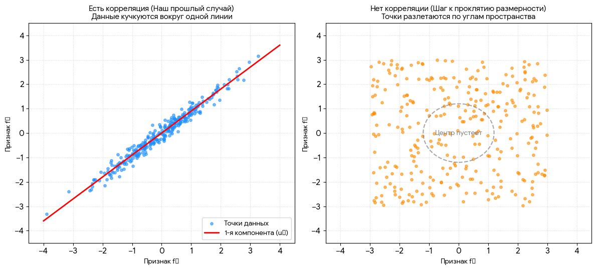

[График слева, взят из конспекта РСА главных компонент](https://ivan-valuchev.yonote.ru/doc/7metod-glavnyh-komponent-pca-aotVS52Ro4) 

 

  

**В чем ключевая разница на графиках:**

- **На левом графике (Есть корреляция):** Точки послушно выстроились вдоль одной **красной линии**. Они находятся близко друг к другу. Здесь пространство эффективно сжимается с помощью PCA, потому что признаки «помогают» друг другу описывать объекты.
- **На правом графике (Нет корреляции):** Красную линию провести невозможно — точки размазаны равномерно, как взрыв на макаронной фабрике.

**Как это превращается в «проклятие» в многомерном пространстве?**

На правом графике в 2D точки еще кажутся относительно близкими. Но представьте, что мы добавляем третий признак \(f_{3}\), четвертый \(f_{4}\) и так далее до 1000, и все они такие же независимые:

1. **Геометрический взрыв:** В 2D у квадрата всего 4 угла. В 3D у куба — 8 углов. В 1000-мерном пространстве у гиперкуба углов становится \(2^{1000}\) (это астрономическое число!).
2. **Пустота:** Все точки под воздействием случайности разлетаются по этим далеким углам. Центр пространства (показан пунктирным кругом) полностью пустеет.
3. **Потеря близости:** Расстояние между *любыми* двумя точками становится одинаково огромным. Концепция «ближайшего соседа» умирает, потому что все соседи оказываются одинаково далеки в этой бесконечной пустоте.

  

## Что такое "Проклятие размерности" (на пальцах)?

Представь, что ты ищешь грибы в лесу.

**Ситуация 1. Лес маленький (2 признака)**

Ты идёшь по лесу, вокруг тебя много грибов. Ты легко находишь 5 ближайших грибов, чтобы понять, съедобные они или нет.

**Ситуация 2. Лес огромный (100 признаков)**

Теперь представь, что лес стал огромным и пустым. Грибы разбросаны далеко друг от друга. Ты идёшь к одному грибу — до него 10 км. К другому — 11 км. К третьему — 9.5 км.

**Проблема:** Все грибы стали одинаково далёкими! Ты не можешь понять, кто из них "ближайший", потому что расстояния почти одинаковые.

---

### Математическая суть (почему так происходит)

- Когда у нас 2 признака:
  - Пространство — это плоскость (как лист бумаги).
  - Объём пространства = длина $\times$ ширина.
- Когда у нас 3 признака:
  - Пространство — это куб.
  - Объём = длина $\times$ ширина $\times$ высота.
- Когда у нас 100 признаков:
  - Пространство — это гиперкуб (100-мерный).
  - Объём = произведение 100 чисел.

**Главная мысль:** С каждым новым признаком объём пространства растёт экспоненциально. А количество объектов в твоей таблице остаётся прежним (например, 150 цветков).

**Результат:** Объекты "разбегаются" по углам гиперкуба, и между ними образуются огромные пустоты.

---

### Как это убивает KNN?

KNN работает на простой идее: "Близкие объекты — похожие ответы".

| Количество признаков | Расстояние до ближайшего соседа | Что происходит с KNN |
|:---|:---|:---|
| 2–3 | Маленькое (объекты близко) | KNN работает отлично |
| 5–10 | Среднее | KNN ещё работает, но уже хуже |
| 50–100 | Огромное (все объекты далеко) | KNN ломается, предсказания становятся случайными |

---

### Наглядный пример (из твоего файла)

В твоём файле есть картинка:

| Количество признаков | Как выглядит пространство |
|:---|:---|
| 2 признака | Точки плотно лежат на плоскости. Есть ближайшие соседи. |
| 3 признака | Точки разлетаются в объёме. Соседей становится меньше. |
| Десятки признаков | Пространство становится пустым. Все точки далеко друг от друга. KNN бесполезен. |

---

### Что делать с проклятием размерности? (4 способа)

#### 1. Уменьшать количество признаков (Feature Selection)

Оставляем только самые важные признаки.

**Пример:** Для предсказания цены дома оставляем только "площадь" и "метро", а "цвет стен" и "количество розеток" удаляем.

#### 2. Объединять признаки (Feature Extraction)

Создаём новые признаки из старых.

**Пример:** Вместо "длина" и "ширина" используем "площадь" (длина $\times$ ширина).

#### 3. Использовать другие алгоритмы

Некоторые алгоритмы (например, линейная регрессия, деревья решений, нейросети) лучше справляются с большим числом признаков.

#### 4. Увеличивать количество данных

Чем больше объектов в таблице, тем меньше пустот.

---

### Итоговая таблица (запомни)

| Пункт | Что это значит |
|:---|:---|
| Проклятие размерности | При большом количестве признаков пространство становится пустым |
| Почему это плохо для KNN | Все объекты становятся одинаково далёкими, KNN не может найти "ближайших" соседей |
| Когда начинается проблема | Обычно при 10–20 признаках |
| Как бороться | Уменьшать количество признаков, использовать другие алгоритмы |

